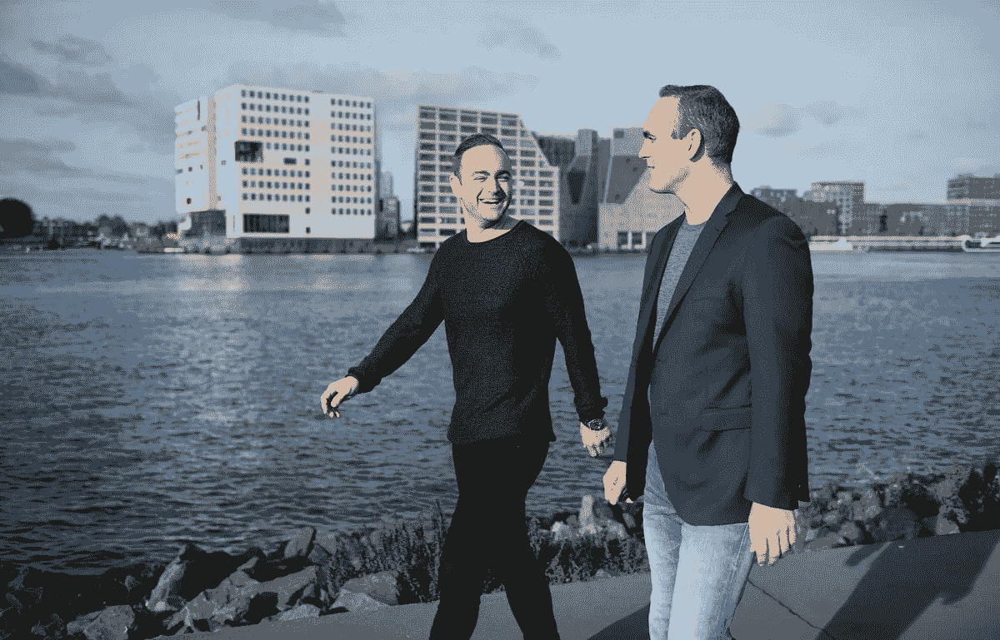
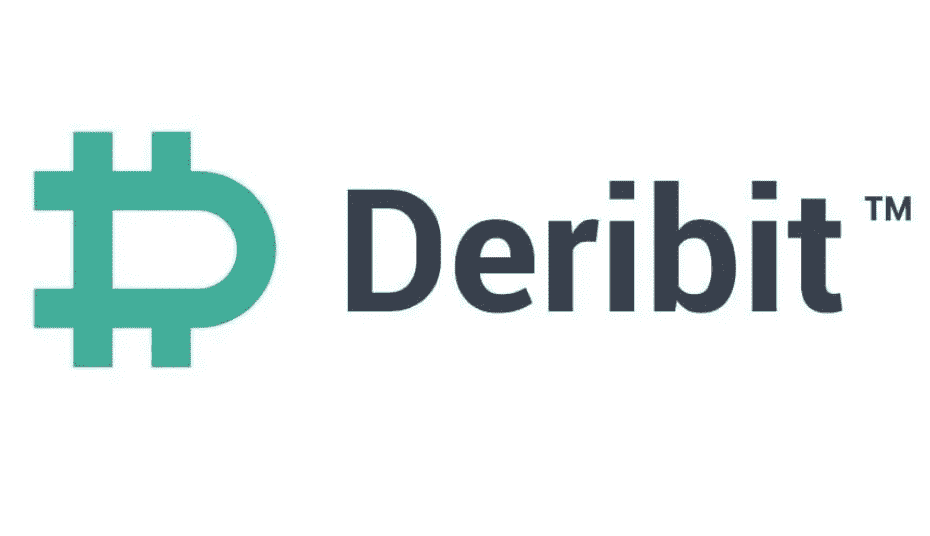

# Deribit 访谈:领先的加密衍生品交易所

> 原文：<https://medium.com/coinmonks/deribit-interview-a-leading-crypto-derivatives-exchange-c823a3937c58?source=collection_archive---------2----------------------->

我正在寻求了解更多关于新的交易所和交易平台的信息。我决定多了解一下**。本次采访的答案由* ***约翰·詹森(John Jansen)提供，德里比特 CEO*** *。**

**

*Marius Jansen (left) & John Jansen (right) — Founders of Deribit. Location: Amsterdam.*

***您能简要描述一下 Deribit 是什么吗？***

*Deribit 是一家领先的加密衍生品交易所。在我们的平台上，客户可以交易与比特币价格相关的多种产品，这意味着交易者可以以一种非常便宜和有效的方式准确地占据他们想要的位置。就交易量而言，Deribit 在期货市场排名第三，在期权市场排名第一，我们正在快速增长。*

*我们认为 Deribit 在其平台的速度和稳定性方面表现突出。我们在 2018 年上半年优化了我们的平台，现在我们已经准备好应对任何量。每种产品每秒可以处理 5000 个订单，单个订单在几毫秒内处理完毕。

**你是怎么想出开始** [**德里比特**](https://www.deribit.com/reg-1622.3518) **的主意的？***

*多年前，我在阿姆斯特丹期权交易所做期权的背景市场。2012 年夏天，我第一次听说了比特币，并立刻对此感到兴奋。我开始在各种交易所购买比特币，2014 年，我有了为加密货币建立专业期货和期权交易平台的想法。*

*你能给我们介绍一下 Deribit 团队吗？*

*我和我哥还有我们的 CTO 一起创立了 [Deribit](https://www.deribit.com/reg-1622.3518) 。现在，我们在波兰有一个 10 人的开发团队，在阿姆斯特丹的总部有大约 8 人，还有几个人分布在不同的时区。我们一直在寻找更多的开发人员和营销专家。*

***你能描述一下**[**deri bit**](https://www.deribit.com/reg-1622.3518)**的愿景吗？***

*我们相信加密市场值得拥有“金融市场级别”的稳定性和交易速度。现在，我们已经完成了使这成为可能的基础设施，我们正在以极快的速度添加新产品和其他加密货币。我们刚刚推出了新的 BTC-美元永久货币。这是一种始终接近比特币现货价格的交易产品。*

***deri bit 的优点是什么？***

*我们的平台需要不断维护和改进，这一点很重要。我们的开发团队在保持 [Deribit](https://www.deribit.com/reg-1622.3518) 平台高速运行和增加新产品方面做了令人难以置信的工作。另一个优势是我们与客户的密切关系，这使我们能够对客户的要求和想法做出快速反应。我们体验到，我们的客户重视他们可以直接与我们电报集团的管理团队合作。*

***deri bit 如何区别于其他交易所？***

*我们的客户重视我们的稳定性和交易速度，平均比竞争对手快 20-50 倍。我们也是唯一一家真正的加密期权交易所，拥有唯一一个比特币看跌期权和看涨期权的流动性市场。这是我们业务中快速增长的一部分，随着更多人的参与，这一部分还将继续增长。*

*你能告诉我们即将到来的重要发展吗？为什么它们很重要？*

*我们将很快推出以太坊和比特币现金期货和永久物，作为进入替代币市场的第一步。我们也有一些非常有趣的选项相关产品正在开发中，但我们将在未来更详细地讨论这些产品。*

**

*感谢您的阅读。[在 Deribit 免费报名](https://www.deribit.com/reg-1622.3518)，自己试试。如果你学习或喜欢这篇文章，请随意与他人分享。在 [Twitter](https://twitter.com/Cryptonoobie) 和 [YouTube](http://youtube.com/catsir) 上关注我。*