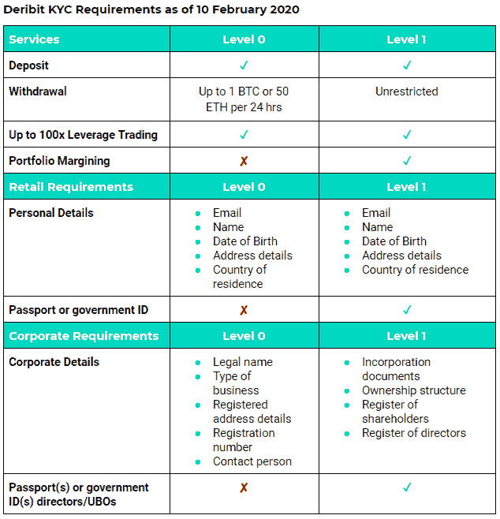
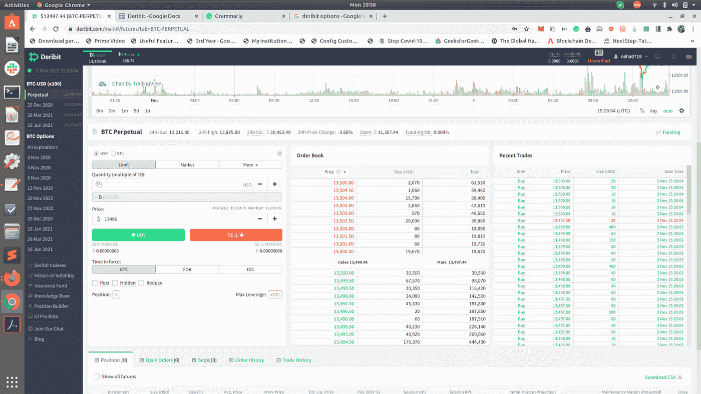
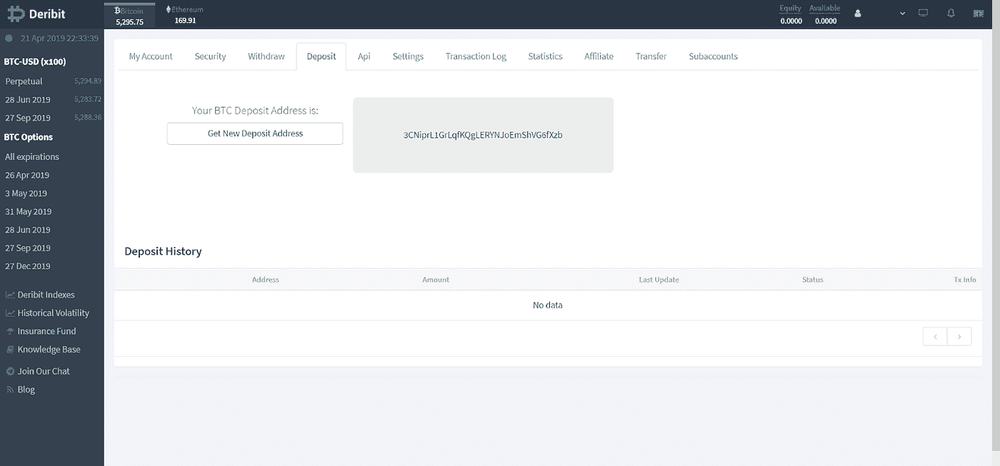
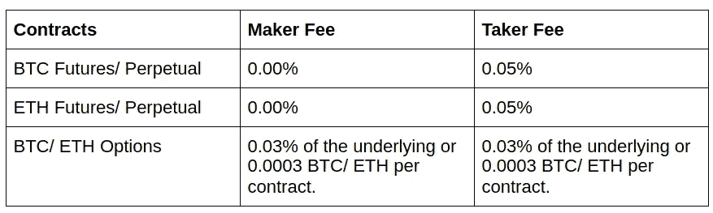
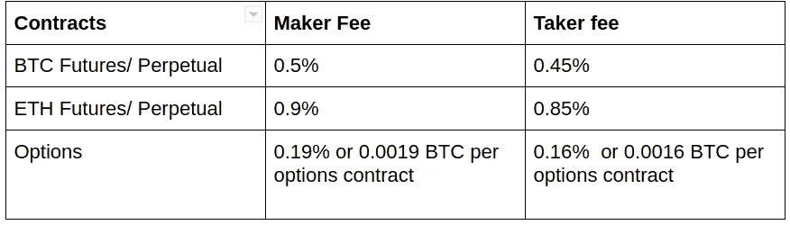

# 德里比特评论 2022 -德里比特是合法和安全的吗？

> 原文：<https://medium.com/coinmonks/deribit-review-options-fees-apis-and-testnet-2ca16c4bbdb2?source=collection_archive---------0----------------------->

## 德里比特交易所综述

在本文中，我们将回顾一下 [**Deribit**](https://blog.coincodecap.com/go/deribit) ，这是一家成立于 2016 年的在线加密货币交易平台。Deribit 总部设在荷兰，专门从事期货和期权市场。它的匹配引擎遵循“先到先得”的原则它可以每秒处理来自单个帐户的数千个订单和数百个订单。它不允许自我交易。它有 24/7 的交易时间。

# **如何在 Deribit 上创建账户？**

您可以在 [**注册**](https://blog.coincodecap.com/go/deribit) 选项卡下创建账户。它将向您发送一封电子邮件验证链接。点击链接后，您的帐户将被创建。

现在你必须完成你的 KYC 验证。详细过程，可以查看下一节。现在你可以开始交易了。

## **德里比特 KYC 过程**

它提供了两种不同级别的 KYC—0 级和 1 级。0 级只需要必要的信息，而 1 级则需要身份证明。

## KYC 要求

如果您提供任何虚假信息，Deribit 可以立即关闭您的账户并清算任何未平仓头寸。它与[chain analysis](https://www.chainalysis.com/)合作监控任何可疑的加密货币交易。您可以在“我的帐户”下的“验证”选项卡下进行 KYC。

# **交易选项**

Deribit 提供了广泛的交易选项，用户可以访问期权和期货交易所。该平台专门提供杠杆交易。它在比特币中提供高达 100 倍的杠杆作用，在以太坊中提供高达 50 倍的杠杆作用。你也可以参与保证金交易，并在 Deribit testnet 上练习他们的交易策略。

## **德里比特期货**

它是一种在指定时间以预定价格买卖比特币或以太坊的协议。一份合同是 10 美元。它还提供永久期货，即没有到期日。所有结算都发生在该月最后一个星期五的世界协调时 8:00。有三个季度期货——三月、六月、九月和十二月的最后一个星期五。所有的利润都是实时添加的。最多允许一百万份合同。

一份期货合约在交易时间内的价格被称为标记价格。是指数价格和 30 秒 EMA(期货市场价格——指数价格)的相加。

> 另外，请阅读我们的 [FTX 密码交易所评论](/coinmonks/ftx-crypto-exchange-review-53664ac1198f)

## **德里比特选项**

它提供欧式期权，只有在到期时才能行使。当您使用 [Deribit](https://blog.coincodecap.com/go/deribit) 时，这将自动发生。所有的**现金结算将会发生，而不是资产转移**。

它也给你其他重要的信息，如 Delta，volatility 等。平台上有很多信息。您可以在平台上查看最近的交易和订单。您还可以查看您的订单历史和交易历史。不同类型的选项是可用的，如限制，市场，停止限制，停止市场。

## 订单类型

限制:它有一个预先定义的价格。只有手动执行或删除后，才能取消。

**行情**:这些订单立即执行。这将是一个卖出的出价和一个买入的出价。

**限价止蚀单:附有**止损的限价订单。只能按市场价执行，你会有止损保护损失。

**止损市场:附有**止损的市场订单。只能按市场价执行，你会有止损保护损失。

您希望订单保持有效的持续时间称为“订单有效期”有三种生活秩序-

1.  **清关前有效(GTC):** 此限价单将永久有效。只有手动取消或订单已经执行，才能关闭。
2.  **填充或删除(FOK):** 这将立即全部执行订单，或者根本不执行。部分订单根本不可能。
3.  **即决处决(IOC):** 类似于 FOK 令，只是只允许部分执行。它将执行订单的一部分，并取消那些不能执行的部分。

如果你想完全控制你的订单，GTC 是一个很好的选择。

Deribit Platform showcasing different types of Orders

# **安全**

[**Deribit**](https://blog.coincodecap.com/go/deribit) 利用冷藏来保障其用户的资金安全。大约 95%的资金以这种方式储存。这使得它免受任何黑客攻击，但降低了客户取款的速度。

它还具有双因素身份认证(2FA)。默认情况下不启用。您可以在登录后进行设置。此外，它还具有 IP 锁定功能；如果 IP 地址在会话期间发生变化，它会终止会话。您可以调整他们的会话超时和默认超时时间。

# **加密货币支持**

[Deribit](https://blog.coincodecap.com/go/deribit) 支持以太坊[比特币](https://blog.coincodecap.com/a-candid-explanation-of-bitcoin)。如果你必须交易比特币期货、永久合约或期权，你必须存入比特币，以太坊也一样。它不支持任何其他加密货币。

# **用户体验**

它有一个直观和用户友好的用户界面。它有一个交易匹配引擎，延迟不到 1 毫秒。Deribit 的网站支持光明和黑暗两种主题。Android 和 iOS 上都有 Deribit 应用程序。Deribit API 与[交易机器人软件](/coinmonks/crypto-trading-bot-c2ffce8acb2a)集成，例如 [HaasOnline](https://blog.coincodecap.com/go/haasonline) ，Actant 等。这样你就可以使用 run Deribit 交易机器人。

Deribit User Interface

# **德里比特审查:存款和取款**

要存款，请从右上角的下拉菜单中选择“存款”。它会生成一个唯一的比特币地址。你可以在那个地址存钱。它每天生成一个新地址。

Depositing Bitcoin

您需要创建一个新的钱包配置文件，并附上您的外部钱包地址以便取款。如果资金存在于热存储中，您的提款将被立即处理，否则将需要时间。如果你的提现被搁置，那是因为比特币网络繁忙。如果你想让你的交易加速，你可以试试[BTC.com](https://btc.com)交易加速器。

# **降低费用和收费**

它遵循一个创造者-接受者模型。订单有两种类型。“制造商”订单增加了订单簿的流动性。它被立即执行。“接受者”订单从订单簿中移除流动性。它不会立即执行。

Deribit Fee

期权费不得超过期权价格的 12.5%。

期权和期货交割也有额外的费用。期货和期权分别为 0.025%和 0.015%。期权的额外费用不得超过期权价格的 12.5%。

清算也有额外的费用。它会自动加入保险基金。

Deribit Liquidation fee

存款不收取任何费用。如果你要提取的金额在冷库里，不扣任何费用。只有一定比例的硬币存在于热仓库中。其余的在冷库里。因此，撤军有可能无法立即完成。如果需要的话，那么一天一次，从冷藏到热都可以添加平衡。所以提现费取决于网络状态。点击此处了解更多关于 [Deribit 费](https://www.deribit.com/pages/information/fees)的信息。

# **语言和支持的国家**

Deribit 在所有国家都受支持，除非您位于或居住在以下国家-

*   加拿大(魁北克)
*   美国
*   巴拿马
*   古巴
*   日本
*   关岛
*   苏丹
*   伊拉克
*   巴拿马
*   维尔京群岛(美国)
*   伊朗
*   萨摩亚群岛
*   韩国
*   阿拉伯叙利亚共和国
*   波多黎各
*   苏丹

它支持英语、中文、韩语、日语、西班牙语、俄语和土耳其语。

# **德里比特介绍奖励**

像许多其他加密交易所一样，Deribit 通过其“Deribit 附属”计划提供推荐激励。所有通过联盟计划加入的新用户在前六个月都可以享受 10%的折扣。推荐的用户在前 6 个月获得 20%的佣金，之后获得 10%的佣金。要参与该计划，您必须同意[条款和条件](https://www.deribit.com/pages/information/affiliate-program-terms#:~:text=Deribit%20allows%20current%20users%20to,for%20the%20first%20six%20months).&text=If%20Deribit%20collects%20fees%20in%20USDT%2C%20Deribit,pay%20out%20fees%20in%20USDT.)。

使用我们的 [**Deribit 转介链接**](https://www.deribit.com/reg-11668.6979) 并支持我们的工作。

# **德里比特评论:保险基金**

Deribit 提供一项保险基金，帮助弥补破产交易员的损失。它确保了盈利的交易者得到全额支付，亏损的交易者没有负债。这有助于保护你的负资产。如果保险资金耗尽，尽管涉及保证金，但金额会从获胜的交易者那里得到平衡。

它不是用来弥补交易者的损失，而是用来弥补破产价格和清算指令执行价格之间的任何差额。他们公布所有实时发生的破产和保险基金的状况。

# **德里比特客户支持**

德里比特一直非常重视它的客户。它有一个实时聊天框。而且你还可以使用 [Deribit 电报通道](https://t.me/deribit)与其用户互动。Zqoon 和 MrJozza 是频道中的社区经理，帮助您解决问题。要联系他们的支持人员，您可以在 deribit.zendesk.com 的[订票。](http://deribit.zendesk.com)

你也可以发电子邮件到 support@deribit.com 的。如需反馈，您可以在[feedback@deribit.com](mailto:feedback@deribit.com)写信给他们

如果你对他们的 API 有任何技术上的疑问或者任何错误报告，你可以写信给他们，地址是[dev@deribit.com](mailto:dev@deribit.com)。

关于商业、媒体和投资者关系，你可以分别在 info@deribit.com[和 ir@deribit.com](mailto:info@deribit.com)和[与他们联系。](mailto:ir@deribit.com)

他们还运营着一个 Youtube 频道，里面有很多解释视频。也可以通过 [Twitter](https://twitter.com/DeribitExchange?s=20) 联系他们。

# **Deribit API**

对于自己开发交易算法和 bot 的交易者是有帮助的。Deribit APIs 对开发者来说有很大的空间。它有一个 Websocket API 和一个 REST API。REST API 既有公共部分也有私有部分。

如果你想利用市场数据开发一些东西，你可以使用公共 API。或者，如果您想使用私有 API，它必须用您的 API 密钥进行签名。

你可以在你的账户下的 API 标签里得到你的 API 密匙。您应该保证 API 密钥的安全。如果 API 密钥丢失，这是恢复它的唯一方法。

# 德里比特测试网

[**Deribit**](https://blog.coincodecap.com/go/deribit) 提供现场测试网。可以在[test.deribit.com](https://test.deribit.com/)上访问。您可以创建另一个帐户或使用同一个帐户，并获得 10 BTC 作为演示资金。

Deribit 模拟账户对想要习惯 Deribit UI 的新手或交易者很有帮助。它还可以用于在 Deribit API 上开发 bot。你可以在使用加密货币算法之前先试用一下。它无法复制实时订单的“下滑”。少数加密货币交易所仅提供此功能。

# 嘲笑正反两面

## **优点**

*   透明团队。
*   提供高杠杆。
*   交易费很有竞争力。
*   德里比特有保险基金保护。
*   是一个安全可信的平台。它从未遭受过任何重大攻击。一旦他们的交易引擎出现故障，他们就向所有受影响的客户付款。

## **缺点**

*   它不适合初学者。
*   它没有法定的支持。

# 结论

综上所述，我们可以总结出 [**Deribit**](https://blog.coincodecap.com/go/deribit) 有很多特点，比如期货和期权，保险资金，Deribit API，Testnet，强大的客户支持，安全的平台进行加密货币交易。Deribit 是一个为专业交易者建立的合法交易平台。

> 加入 coin monks[Telegram group](https://t.me/joinchat/EPmjKpNYwRMsBI4p)学习加密交易和投资

## 另外，阅读

*   [什么是融资融券交易](https://blog.coincodecap.com/margin-trading) | [成本平均法](https://blog.coincodecap.com/dca)
*   最好的[加密交易机器人](/coinmonks/crypto-trading-bot-c2ffce8acb2a) | [网格交易机器人](https://blog.coincodecap.com/grid-trading)
*   [3 商业评论](/coinmonks/3commas-review-an-excellent-crypto-trading-bot-2020-1313a58bec92) | [Pionex 评论](/coinmonks/pionex-review-exchange-with-crypto-trading-bot-1e459d0191ea) | [Coinrule 评论](/coinmonks/coinrule-review-2021-a-beginner-friendly-crypto-trading-bot-daf0504848ba)
*   [AAX 交易所评论](/coinmonks/aax-exchange-review-2021-67c5ea09330c) | [德里比特评论](/coinmonks/deribit-review-options-fees-apis-and-testnet-2ca16c4bbdb2) | [FTX 交易所评论](/coinmonks/ftx-crypto-exchange-review-53664ac1198f)
*   [n rave 零点回顾](/coinmonks/ngrave-zero-review-c465cf8307fc) | [Phemex 回顾](/coinmonks/phemex-review-4cfba0b49e28) | [PrimeXBT 回顾](/coinmonks/primexbt-review-88e0815be858)
*   [Bybit Exchange 审查](/coinmonks/bybit-exchange-review-dbd570019b71) | [Bityard 审查](/coinmonks/bityard-review-7d104239be35) | [CoinSpot 审查](https://blog.coincodecap.com/coinspot-review)
*   [3 commas vs crypto hopper](/coinmonks/3commas-vs-pionex-vs-cryptohopper-best-crypto-bot-6a98d2baa203)|[赚取加密利息](/coinmonks/earn-crypto-interest-b10b810fdda3)
*   最好的比特币[硬件钱包](/coinmonks/the-best-cryptocurrency-hardware-wallets-of-2020-e28b1c124069?source=friends_link&sk=324dd9ff8556ab578d71e7ad7658ad7c) | [BitBox02 回顾](/coinmonks/bitbox02-review-your-swiss-bitcoin-hardware-wallet-c36c88fff29)
*   [莱杰 vs n 格拉夫](/coinmonks/ledger-vs-ngrave-zero-7e40f0c1d694) | [莱杰纳诺 s vs x](/coinmonks/ledger-nano-s-vs-x-battery-hardware-price-storage-59a6663fe3b0) | [币安评论](/coinmonks/binance-review-ee10d3bf3b6e)
*   [加密复制交易平台](/coinmonks/top-10-crypto-copy-trading-platforms-for-beginners-d0c37c7d698c) | [Coinmama 评论](/coinmonks/coinmama-review-ace5641bde6e)
*   [CoinLoan 审核](/coinmonks/coinloan-review-18128b9badc4) | [YouHodler 审核](/coinmonks/youhodler-4-easy-ways-to-make-money-98969b9689f2) | [BlockFi 审核](/coinmonks/blockfi-review-53096053c097)
*   最好的[加密税务软件](/coinmonks/best-crypto-tax-tool-for-my-money-72d4b430816b) | [硬币追踪评论](/coinmonks/cointracking-review-a-reliable-cryptocurrency-tax-software-5114e3eb5737)
*   最佳[加密借贷平台](/coinmonks/top-5-crypto-lending-platforms-in-2020-that-you-need-to-know-a1b675cec3fa) | [杠杆代币](/coinmonks/leveraged-token-3f5257808b22)
*   [BlockFi vs Celsius](/coinmonks/blockfi-vs-celsius-vs-hodlnaut-8a1cc8c26630)|[Hodlnaut 点评](/coinmonks/hodlnaut-review-best-way-to-hodl-is-to-earn-interest-on-your-bitcoin-6658a8c19edf) | [KuCoin 点评](https://blog.coincodecap.com/kucoin-review)
*   [Bitsgap 审查](/coinmonks/bitsgap-review-a-crypto-trading-bot-that-makes-easy-money-a5d88a336df2) | [Quadency 审查](/coinmonks/quadency-review-a-crypto-trading-automation-platform-3068eaa374e1) | [Bitbns 审查](/coinmonks/bitbns-review-38256a07e161)
*   [埃利帕尔泰坦评论](/coinmonks/ellipal-titan-review-85e9071dd029) | [赛克斯斯通评论](/coinmonks/secux-stone-hardware-wallet-review-15-discount-coupon-2020-7577032faa6e)
*   [本地比特币审核](/coinmonks/localbitcoins-review-6cc001c6ed56) | [加密货币储蓄账户](https://blog.coincodecap.com/cryptocurrency-savings-accounts)
*   最佳[区块链分析](https://bitquery.io/blog/best-blockchain-analysis-tools-and-software)工具| [赚比特币](/coinmonks/earn-bitcoin-6e8bd3c592d9)
*   [加密套利](/coinmonks/crypto-arbitrage-guide-how-to-make-money-as-a-beginner-62bfe5c868f6)指南| [如何做空比特币](/coinmonks/how-to-short-bitcoin-568a2d0b4ae5)
*   最佳[加密制图工具](/coinmonks/what-are-the-best-charting-platforms-for-cryptocurrency-trading-85aade584d80) | [最佳加密交易所](/coinmonks/crypto-exchange-dd2f9d6f3769)
*   [如何在印度购买比特币？](/coinmonks/buy-bitcoin-in-india-feb50ddfef94) | [瓦济克斯审查](/coinmonks/wazirx-review-5c811b074f5b)
*   [印度比特币交易所](/coinmonks/bitcoin-exchange-in-india-7f1fe79715c9) | [比特币储蓄账户](/coinmonks/bitcoin-savings-account-e65b13f92451)
*   [CoinDCX 评论](/coinmonks/coindcx-review-8444db3621a2) | [加密保证金交易交易所](https://blog.coincodecap.com/crypto-margin-trading-exchanges)