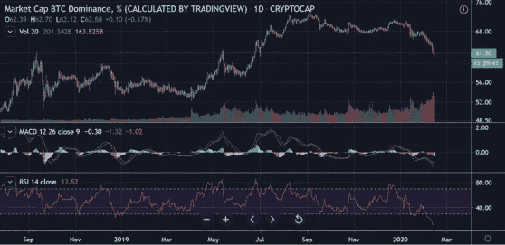
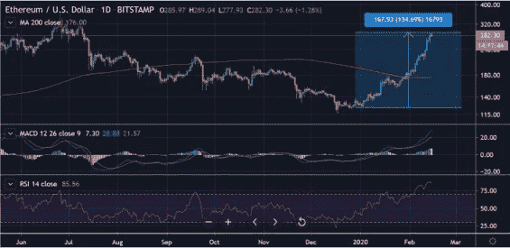
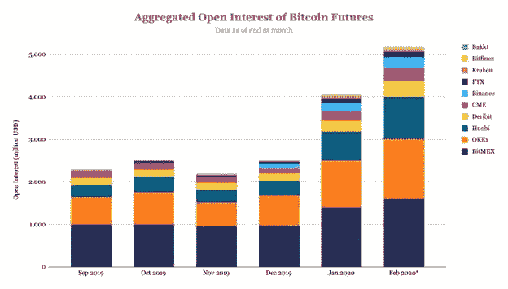
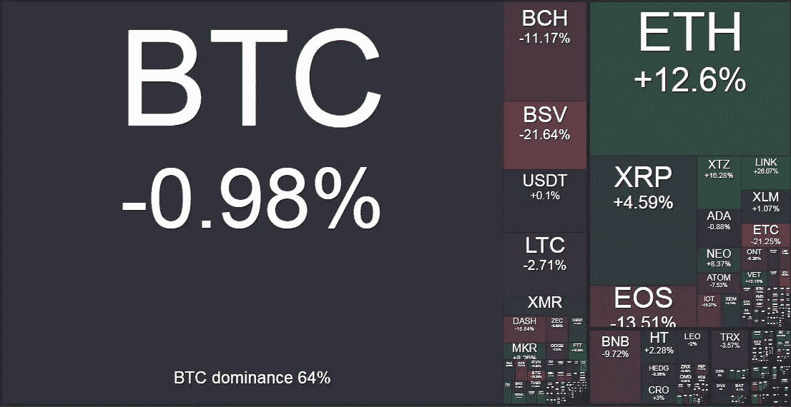

# 衍生品优势

> 原文：<https://medium.com/coinmonks/derivatives-dominance-dac567117345?source=collection_archive---------6----------------------->

## **本周在 Crypto**

随着资本从最大的加密货币(按交易量和市值计算)转移到许多更老牌的替代货币，比特币(BTC)的市场主导地位本周继续消退。Tezos (XTZ)、Ripple (XRP)、ETH(瑞士联邦理工学院)、Cardano(阿达)和 Neo (NEO)的股价都有可观的涨幅，其中 XTZ 的股价自年初以来涨幅高达 180%。

随着整个市场的交易量增加，BTC 的主导地位似乎将下降，并测试前几周强调的 60%的主导水平。我们预计新的资金和从替代硬币获利回吐的最终反向循环将流回 BTC，以提供 60%的支持——但我们不太相信这一点和 50-55%的回撤可能会支持替代硬币的持续上涨。

BTC Market Dominance

上周，我们预计 ETH 将继续突破，事实证明这是正确的。围绕[的谈话 JP 摩根将其 Quoram](https://www.reuters.com/article/us-jp-morgan-blockchain-exclusive/exclusive-jpmorgan-in-talks-to-merge-blockchain-unit-quorum-with-startup-consensys-sources-idUSKBN2051AW?utm_campaign=Structured%20Products%201&utm_source=hs_email&utm_medium=email&_hsenc=p2ANqtz-8o41gXQ-DOqpl_UeSs3RwSbU5UeCcmv-YLaMhuevkGQSwwSCNsBGyAYUPd9e_uXiP7pYEA) 项目与 ConsenSys 合并增加了公共区块链和[以太坊](https://blog.coincodecap.com/tag/ethereum/)的可信度，以太坊的区块链拥有最大的开发者生态系统和网络效应。ETH 在美元和 BTC 方面的表现都非常好，在 ICO 疯狂后经历了如此痛苦和激进的抛售后，我们是否将在 2020 年看到 ETH 利息和积累的稳定回归？

Ethereum 1 Year Chart

**衍生品优势**

加密衍生品市场继续提供看涨信号，表明新的或观望的资金正在流入加密市场。期货市场仍然严重溢价，因为交易员预计市场将进一步上涨，增加了他们的杠杆多头敞口。随着 3 月 27 日(BitMEX) BTC 期货合约交易相对于现货接近 4%的溢价，有大量机会部署[现购自运交易策略](https://www.investopedia.com/terms/c/cashandcarry.asp?utm_campaign=Structured%20Products%201&utm_source=hs_email&utm_medium=email&_hsenc=p2ANqtz-8o41gXQ-DOqpl_UeSs3RwSbU5UeCcmv-YLaMhuevkGQSwwSCNsBGyAYUPd9e_uXiP7pYEA)，这是机构自营交易公司的最爱。无风险套利是传统资本的主要吸引力。

坚持使用 BitMEX，它仍然在比特币衍生产品的市场份额中占据主导地位——他们的旗舰产品 BTC 永久掉期目前持有未平仓多头头寸的隐含美元成本为每年约 58%，这进一步凸显了随着我们越来越接近 5 月份的“Halvening ”,对这一强劲看涨趋势的敞口越来越大。总之，交易者支付的杠杆多头头寸数量如此之多，以至于这样做的成本已经达到极高的水平。

[比特币基地本周加入了衍生品交易的行列](https://blog.coinbase.com/margin-trading-is-now-available-on-coinbase-pro-b22743a0e07b?utm_campaign=Structured%20Products%201&utm_source=hs_email&utm_medium=email&_hsenc=p2ANqtz-8o41gXQ-DOqpl_UeSs3RwSbU5UeCcmv-YLaMhuevkGQSwwSCNsBGyAYUPd9e_uXiP7pYEA)，他们为美国 23 个州的比特币基地专业客户推出了备受期待的保证金交易设施。这家美国最大的交易所现在提供高达 3 倍的杠杆，据说今年将开发新的机构交易产品。然而，如果他们计划在产品供应和市场份额方面赶上一些亚洲交易场所，他们还有相当长的路要走。

据[的](https://www.theblockcrypto.com/linked/56019/open-interest-for-bitcoin-futures-surpasses-5-billion?utm_campaign=Structured%20Products%201&utm_source=hs_email&utm_medium=email&_hsenc=p2ANqtz-8o41gXQ-DOqpl_UeSs3RwSbU5UeCcmv-YLaMhuevkGQSwwSCNsBGyAYUPd9e_uXiP7pYEA)研究团队报道，BTC 所有期货交易场所的未平仓合约总额本周首次达到 50 亿美元。未平仓合约是在交易所中尚未结算的未平仓合约总数…它反映了基础资产中的利益规模，并作为衍生合约流动性的代理。

Source [www.theblockcrypto.com](http://www.theblockcrypto.com/?utm_campaign=Structured%20Products%201&utm_source=hs_email&utm_medium=email&_hsenc=p2ANqtz-8o41gXQ-DOqpl_UeSs3RwSbU5UeCcmv-YLaMhuevkGQSwwSCNsBGyAYUPd9e_uXiP7pYEA)

**取缔隐私？**

正如上周的周刊所讨论的那样，我们开始看到交易所对交易者的一些抵制，这些交易者使用 CoinJoin 方法，旨在在购买、出售、交易和转移比特币时混淆来源和目的地钱包。我们注意到，观察当局如何对待这种隐私技术对于比特币作为一种资产类别如何演变非常重要，特别是考虑到我们已经有 [Taproot/Schnorr 取得进展](https://www.theblockcrypto.com/post/53958/taproot-schnorr-bitcoin-bip-development?utm_campaign=Structured%20Products%201&utm_source=hs_email&utm_medium=email&_hsenc=p2ANqtz-8o41gXQ-DOqpl_UeSs3RwSbU5UeCcmv-YLaMhuevkGQSwwSCNsBGyAYUPd9e_uXiP7pYEA)。

上周， [DropBit](https://dropbit.app/?utm_campaign=Structured%20Products%201&utm_source=hs_email&utm_medium=email&_hsenc=p2ANqtz-8o41gXQ-DOqpl_UeSs3RwSbU5UeCcmv-YLaMhuevkGQSwwSCNsBGyAYUPd9e_uXiP7pYEA) 的现任首席执行官拉里·哈蒙因 1)共谋洗钱工具和 2)经营未经许可的汇款业务而被捕。这些指控与他参与运营 Helix 有关，Helix 是一种比特币混合服务，据称被暗网市场 AlphaBay 使用。

应该强调这一发展的几个关键点:

*   Helix 是一种保管服务，因此用户依赖并信任 Helix 在将硬币发送到用户的目的地址之前进行混合。他们会为此收费。
*   据称，Helix 直接向黑暗网络用户进行营销，并公开宣传这是一种“清洗肮脏比特币”的方式

很明显，CoinJoin 服务受到了监管机构和执法机构的关注，但与社交媒体相反，这一案件似乎与实际技术无关，而是更关注它如何如此明确地用于清洗暗网交易的收益。完整的 DoJ 文章[在这里。](https://www.justice.gov/opa/pr/ohio-resident-charged-operating-darknet-based-bitcoin-mixer-which-laundered-over-300-million?utm_campaign=Structured%20Products%201&utm_source=hs_email&utm_medium=email&_hsenc=p2ANqtz-8o41gXQ-DOqpl_UeSs3RwSbU5UeCcmv-YLaMhuevkGQSwwSCNsBGyAYUPd9e_uXiP7pYEA)

除了相当轻率的营销，Helix 也是一个保管服务，这意味着他们负责执行混合和随后的“干净硬币”的转移。对于一家运营有争议的技术服务的公司来说，这是一个明显的失败点。

如果这项重要技术的存在是为了促进社会所需的自由，并对抗渗透到我们生活中的金融监控，那么以合规的方式定位和营销 CoinJoin 服务肯定是显而易见的第一步。其次，建立非托管服务是至关重要的，它使软件提供商远离这种行为。

仍然存在的问题是，当局将如何处理(或不处理)比特币体验的隐私改善和服务。如果犯罪所得通过它被清洗，为非托管隐私服务编写开源代码的开发者肯定不会被起诉吗？就像一个店主不应该因为从购买食品杂货的毒贩那里拿走现金而被起诉一样。

从这个主题的另一方面来看，上周看到美联储主席杰罗姆·鲍威尔(Jerome Powell)增加对机密加密货币交易的支持令人鼓舞。他是否真的明白自己在说什么是有争议的。

“在美国的环境下，一个知道每个人的支付情况的分类账不是特别有吸引力的东西。”

我们将继续关注隐私领域的发展，这可能是比特币和更广泛的加密货币市场中最重要的主题之一。

Crypto weekly performance: 17th February 2020\. Source [www.bitgur.com](http://www.bitgur.com)

点击 [www.kenetic.capital](http://www.kenetic.capital) 订阅我们的每周简讯

> [在您的收件箱中直接获得最佳软件交易](https://coincodecap.com/?utm_source=coinmonks)

