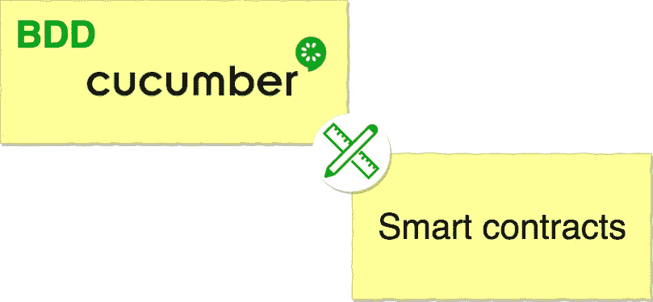
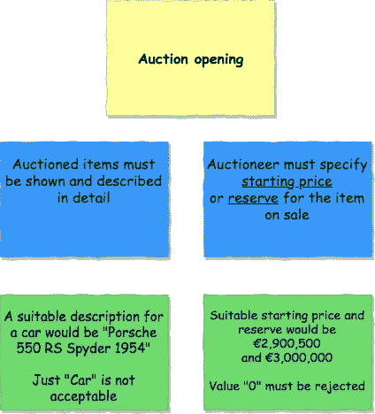
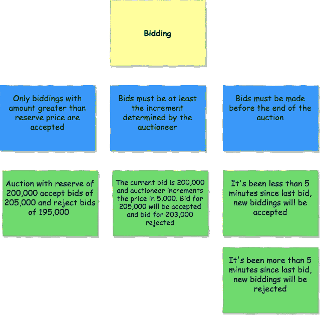

# 使用 BDD 和 Cucumber 设计智能合约

> 原文：<https://medium.com/coinmonks/design-of-smart-contracts-using-bdd-and-cucumber-4533162fc235?source=collection_archive---------0----------------------->

这篇文章展示了如何应用 [BDD](https://en.wikipedia.org/wiki/Behavior-driven_development) 和[cumber](https://cucumber.io/)来设计智能合同。



# 什么是 BDD？

BDD 代表*行为驱动开发*，它是一种开发方法，基于:

*   基于*故事*、*规则*和*示例*的系统行为定义。
*   使用 **TDD** (测试驱动开发)将行为定义中确定的场景作为输入。

# 黄瓜是什么？

Cucumber 是一套应用 BDD 的工具和机制。它为 java 和许多其他语言提供了应用 BDD 的库。

# BBD 为什么要设计智能合约？

*   智能合约的主要目标是定义行为——围绕协议的规则和惩罚——
*   需求和智能契约设计之间的界限非常模糊。
*   利益相关者、域名所有者等。律师、公证人等。—需要理解智能合同的内容，并且 *BDD Cucumber* 提供了一种高级语言— [Gherkin](https://cucumber.io/docs/gherkin/reference/) —允许利益相关者在没有编程语言知识的情况下理解智能合同。
*   BDD Cucumber 提出的文档作为智能合约行为的文档是完美的，它不需要额外的文档。
*   智能合约中的错误可能是灾难性的，因为它们指定了一项协议，而该协议一旦签署就可以更改。

# 示例:拍卖智能合同

在这个例子中，我们将为**拍卖**设计一个*智能合同*，使用 *BDD* 作为方法论，使用[cumber JS](https://github.com/cucumber/cucumber-js)包为 nodejs/javascript 指定特性。


# 示例映射:特征、规则和示例

*示例映射*是一种基于*示例定义*用户故事*行为的技术。*结果是一个仪表板，上面有与 ***用户故事*** ( *黄卡*)***规则*** ( *蓝卡* ) 和*示例* ( *绿卡* ) *。*

下面你会发现*智能合约*必须遵守的*拍卖*流程的主要*功能*的仪表板。

## 用户故事"*拍卖开始"*

拍卖人通过宣布建议的开价、拍卖物品的起拍价或保留价来开始拍卖。



上面的用户故事被翻译成 cucumber-js 的一个特征文件中的[小黄瓜](https://marketplace.visualstudio.com/items?itemName=alexkrechik.cucumberautocomplete)。*规则*(蓝卡)被翻译成**场景**，而*示例*(绿卡)被翻译成**给定-何时-然后**的序列

Cucumber feature for user story Auction opening

## 用户故事“竞价”

拍卖师从对拍卖品感兴趣的买家那里接受越来越高的出价。拍卖人通常决定最低出价增量，通常在出价变高时提高。



Cucumber feature for user story Auction opening

上面的*用户故事*在 cucumber-js 的一个特征文件中被翻译成[小黄瓜](https://marketplace.visualstudio.com/items?itemName=alexkrechik.cucumberautocomplete)。*规则*(蓝色卡片)对应于**场景**模块*示例*(绿色卡片)对应于**给定-何时-然后**的序列

# 智能合同

**拍卖**智能合约或 Dapp 将在[](https://solidity.readthedocs.io)*中为[以太坊](https://www.ethereum.org/)开发，它将打包在一个 nodejs 项目中。*

*nodejs 项目依赖于以下模块:*

*   ***cucumber** 指定在特征中分组的测试。*
*   *ganache-cli 模拟以太坊节点进行测试。*
*   ***web3** 作为以太坊的客户端。*
*   *用于智能合同编译的 solc 。用 truffle 或从终端编译智能合同是可能的。*

```
*$ npm install cucumber ganache-cli web3 solc --save-dev*
```

## *文件夹结构*

*   ***合同。**智能合约的来源*
*   ***功能**。此文件夹包含定义特征的文件，它将是用户故事的特征文件。特色语言[小黄瓜](https://cucumber.io/docs/gherkin/reference/)*
*   ***特征/步骤定义**。该文件夹依赖于*特征*，它包含一个文件，该文件中的测试**适用于该特征。step_definitions 的语言类似于任何 javascript 测试——想想 chain、mocha 等。—***

*例如 **auction_opening.feature** 引用了用户故事“ *Auction opening* ”,而**step _ definitions/Auction _ opening _ steps . js**包含了特性 *auction_opening* 的测试*

## *测试的执行*

1.  *编译智能契约(可以从终端使用 [truffle](https://www.trufflesuite.com/docs/truffle/getting-started/compiling-contracts) 或 [solc](https://solidity.readthedocs.io/en/v0.5.11/using-the-compiler.html) 来编译契约，我使用 [solc-js](https://github.com/ethereum/solc-js) 来避免额外的步骤并专注于 BDD 和 cucumber)*

```
*$ npm run compile*
```

*2.启动测试*

```
*$ npm test*
```

## *推荐堆栈*

*[VS 代码](https://code.visualstudio.com/)用 [Cucumber (Gherkin)完全支持](https://marketplace.visualstudio.com/items?itemName=alexkrechik.cucumberautocomplete)插件作为智能合同的编辑器*

*[draw.io](https://www.draw.io/) 作为数字仪表盘的功能—“模拟”仪表盘更好，但不太环保—*

# *Github 知识库*

*[https://github . com/Joaquin-alfaro/dapp-auction-with-BDD-cumber](https://github.com/joaquin-alfaro/dapp-auction-with-bdd-cucumber)*

# *参考*

*[https://cucumber.io/blog/example-mapping-introduction/](https://cucumber.io/blog/example-mapping-introduction/)*

*[https://en.wikipedia.org/wiki/English_auction](https://en.wikipedia.org/wiki/English_auction)*

*[](https://programtheblockchain.com/posts/2018/03/20/writing-a-token-auction-contract/) [## 撰写象征性拍卖合同

### 这篇文章将展示如何写一份智能合同，将 ERC20 代币拍卖给出价最高的人。的…

programtheblockchain.com](https://programtheblockchain.com/posts/2018/03/20/writing-a-token-auction-contract/) 

> [直接在您的收件箱中获得最佳软件交易](https://coincodecap.com/?utm_source=coinmonks)

[](https://coincodecap.com/?utm_source=coinmonks)*