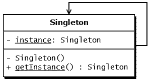
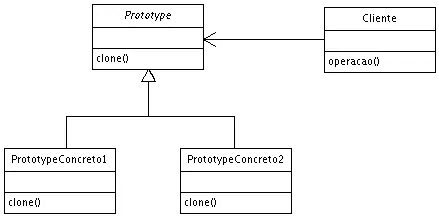

# 让 Typescript 中的设计模式变得简单——第一部分

> 原文：<https://medium.com/coinmonks/design-patterns-in-javascript-made-easy-part-i-10334decb204?source=collection_archive---------2----------------------->


Moroccan pattern (Zellij)

如果你在这里，你很可能是 Javascript 开发人员或最佳实践代码爱好者，无论哪种情况都欢迎。

今天我将讲述设计模式，从最佳实践和架构的角度来看，它被认为是日常编程问题的最佳解决方案。

在这一系列文章中，我将尝试涵盖编程领域，尤其是 Javascript 中最常用的模式。

为什么是 Javascript？首先，根据 [StackOverflow 的年度调查](https://insights.stackoverflow.com/survey/2017#technology-programming-languages)，它成为今年世界上使用最多的编程语言。

其次，学习 Javascript 设计模式的资源很少，这是因为 Javascript 的本质:根据[维基百科的定义](https://en.wikipedia.org/wiki/JavaScript)，它是动态的、弱类型的、基于原型的和多范例的。

在本文中，我将介绍创造性设计模式，它们是处理对象创建机制的模式，试图在给定的情况下以合适的方式创建对象。

# 什么是模式？

模式是一种可重用的解决方案，可以应用于软件设计中常见的问题——在我们的例子中——编写 Javascript web 应用程序。看待模式的另一种方式是作为我们如何解决问题的模板——可以在很多不同的情况下使用的模板。*(Adnan Osmani 所著《学习 JavaScript 设计模式》一书)*

在我们开始之前，我必须配置 Javascript 项目以使用 Typescript 来受益于面向对象编程的强大功能，例如接口和类型:

首先要做的是从 github 获取我的样板文件:

```
$ git clone [https://github.com/AbderrahimSoubaiElidrissi/nodejs-typescript-boilerplate.git](https://github.com/AbderrahimSoubaiElidrissi/nodejs-typescript-boilerplate.git)$ cd nodejs-typescript-boilerplate$ npm install
```

现在我们已经准备好了工作空间，我们可以从第一个设计模式开始

# 1.构造函数模式:

> 在经典的面向对象编程语言中，构造函数是一种特殊的方法，用于在为新创建的对象分配内存后初始化该对象。在 JavaScript 中，几乎所有东西都是对象，所以我们最感兴趣的是*对象*构造函数。

**问题:**

我们的应用程序使用一个对象来构造数据并调用服务的方法，所以我们需要初始化这些对象并填充它们的属性。

**解决方案:**

构造函数是一种“神奇”的方法，用于初始化对象的属性，并在对象初始化时调用方法。

**例如:**

使用以下代码片段获取 src/app.ts 编辑文件:

我们可以在控制台中看到“Hello world”在“npm start”之后，这意味着我们的构造函数已经将参数中传递的值设置为属性 greeting

# 2.单一模式:



下一个模式是最著名的模式之一，因为它是四种设计模式中的一员。

**问题:**

我们的应用程序只需要一个具有全局公共访问的给定类的实例(示例会话实例)。

**解决方案:**

Singleton 模式是一种限制类的实例化的解决方案，它确保类只存在一个实例。Singleton 大多数提供了一个全局访问点来获取类的实例。通常我们使用 singleton 模式来实现日志、缓存、会话等功能

**举例**:

下面的代码将抛出错误，因为我们在属性实例中存储了早期的 Singleton 类实例。另一个不用测试构造函数中的实例就能强制执行单例模式的有趣想法是将单例类的构造函数设为私有，这将阻止人们实例化你的类

```
let mySuperInstance = new Singleton(); // Error
```

要实例化单例，您必须调用静态方法 getInstance()

```
let mySuperInstance = Singleton.getInstance(); // success
```

# 3.原型模式:



我们下一个设计模式是原型设计模式。当要创建的对象类型由原型确定时，使用原型，通常是为了通过降低创建对象的成本来提高体系结构的性能。

**问题:**

我们的应用程序需要对象来实现功能，但是从性能的角度来看，对象的创建(使用 operator new)代价很高，例如，对象实例的创建涉及调用数据库或进行 API 调用。

**解决方案:**

当对象创建是耗时且高成本的操作时，原型模式是必需的，因此我们用现有的对象本身创建一个对象。从现有对象创建对象的最佳可用方法之一是 **clone()方法**。克隆是实现原型模式的最简单的方法。但是，如何根据您的业务模型复制现有对象是您自己的事情。

**示例:**

我创建了接口 ICloneable 来强制原型类实现方法 clone()。clone 方法返回 prototype 类实例的精确克隆结果，我们有一个类的两个实例，只使用了一次“new”操作符，这种做法降低了创建一个重对象(循环、数据库调用……)的成本

要测试设计模式:

```
//the instance
let prototype = new Prototype(1);//the clone
let pClone = prototype.clone();console.log(prototype.list[10] === pClone.list[10] ); //true
console.log(prototype.identity === pClone.identity); //true
```

在下一篇文章中，我将通过实例介绍更多的设计模式，并通过给定问题的真实用例进行解释

参考资料:

[](https://github.com/torokmark/design_patterns_in_typescript) [## to romark/design _ patterns _ in _ typescript

### triangular _ ruler:TypeScript 中的设计模式实现—to romark/Design _ patterns _ in _ TypeScript

github.com](https://github.com/torokmark/design_patterns_in_typescript) [](https://www.oreilly.com/library/view/learning-javascript-design/9781449334840/ch09s01.html) [## 学习 JavaScript 设计模式

### 在经典的面向对象编程语言中，构造函数是一种特殊的方法，用于…

www.oreilly.com](https://www.oreilly.com/library/view/learning-javascript-design/9781449334840/ch09s01.html) [](https://www.tutorialspoint.com/design_pattern/prototype_pattern.htm) [## 设计模式原型模式

### 设计模式原型模式——以简单易行的步骤学习 java 设计模式:初学者教程…

www.tutorialspoint.com](https://www.tutorialspoint.com/design_pattern/prototype_pattern.htm) 

> [在您的收件箱中直接获得最佳软件交易](https://coincodecap.com/?utm_source=coinmonks)

[](https://coincodecap.com/?utm_source=coinmonks)