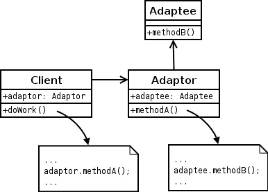
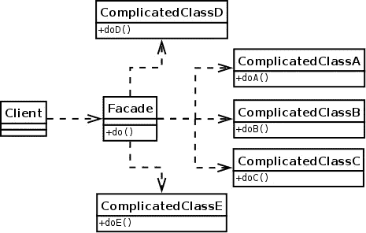
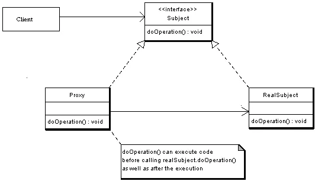

# 让打字稿中的设计模式变得简单——第二部分

> 原文：<https://medium.com/coinmonks/design-patterns-in-javascript-made-easy-part-ii-c32f7b22ef54?source=collection_archive---------4----------------------->


Moroccan pattern (Zellij)

今天我们将讨论结构化设计模式，它被认为是在不同的类之间建立简单/可能的关系的设计模式。

但首先，我必须谈谈一个重要的设计模式，它属于我们上一篇文章的设计模式类别(创建)，工厂设计模式被定义为创建一个类的对象的解决方案，而无需向客户端公开创建逻辑，并使用公共接口引用新创建的对象。

**问题:**

想象一个场景，在客户端类中有多个案例，我们调用多个新的关键字来创建新的对象。

```
 if(value == 'Ferari'){ let car = new Ferari();}
else if(value == 'Bugati'){ let car = new Bugati();}
```

**解决方案:**

工厂方法模式是为创建对象定义一个接口，但是将对象创建委托给子类。

# 1.适配器设计模式



适配器是一种结构设计模式，它允许接口不兼容的对象进行协作，就像 HDMI DVI 适配器一样

**问题:**

假设您有一个处理 XML 格式数据的应用程序，但是在某些时候，您需要使用一个只能处理 JSON 的库。

例如，我们的应用程序使用 soap API (XML 输出)从提供商那里获取该国北部的天气数据，并将其显示在 LCD 显示器上。代码工作正常，但您决定使用另一个 API 来获取该国南部的数据，这里您必须使用 Rest API (JSON 输出)。您有两种解决方案来处理新的情况:1-创建一个新的类来处理 Rest API，或者 2-使用适配器设计模式。

**解决方案:**

我们这里有一个适配器，可以与客户端通信。这个适配器可以理解两种类型的返回(XML 和 JSON)，并为我们的 LCD 显示器(客户端)提供数据

# 2.立面设计模式



Facade 模式隐藏了系统的复杂性，并提供了一个客户端可以访问系统的接口。这种类型的设计模式向现有系统添加了一个接口，以隐藏其复杂性。

**问题:**

例如，我们有一个被客户调用的类来上传图片到亚马逊 S3，但是在上传之前，我们必须检查、转换、重命名文件。这里的每个操作都与一个特定的类相关，我们有一个类来检查文件，另一个类使用特定的命名策略来重命名文件，并使用机器学习预测库来检查文件，以防止色情内容。

正如我们在这里看到的，我们有一个复杂的系统来上传文件，我们将使用一个 Facade 来降低所有这些复杂性，只需一个方法(一个调用)

**解决方案:**

```
// call example**import** Uploader = Facade.Upload;
// checking , renaming , convert and  upload the file let file = new File('./pixel.png');
Uploader.upload(file);
```

这里，facade 方法“upload”为客户端提供了一种简单的方法，只需调用一个静态方法就可以简化整个过程

# 3.代理设计模式



代理是一种结构设计模式，它作为另一个类的接口工作，而不是从一个真正的类调用一个函数，我们通过代理

**问题:**

例如，我们有一个强大的对象来记录数据库中的操作，但要登录数据库，您应该有一个角色(权限)，这个问题有多种解决方案，但最好的方法是使用代理。

在理想的情况下，我们会将这些代码直接放入对象的类中，但这并不总是可能的。例如，类可能驻留在封闭的第三方库中。

**解决方案:**

```
// call example 
let logger = new LoggerProxy(); // here we check for permissions// later we loglogger.log('Delete payment resource ID 123');
```

首先，我们创建一个接口，使类和代理可以互换，我们将原始的类函数调用到代理函数中，在代理实例化之前，我们检查连接用户的权限。

第一部分:[https://medium . com/coin monks/design-patterns-in-JavaScript-made-easy-part-I-10334 decb 204](/coinmonks/design-patterns-in-javascript-made-easy-part-i-10334decb204)

**参考文献:**

[](https://www.tutorialspoint.com/design_pattern/adapter_pattern.htm) [## 设计模式适配器模式

### 设计模式适配器模式——以简单易行的步骤学习 java 设计模式:初学者教程…

www.tutorialspoint.com](https://www.tutorialspoint.com/design_pattern/adapter_pattern.htm) [](https://en.wikipedia.org/wiki/Adapter_pattern) [## 适配器模式-维基百科

### 适配器允许两个不兼容的接口一起工作。这是适配器的真实定义…

en.wikipedia.org](https://en.wikipedia.org/wiki/Adapter_pattern) [](https://refactoring.guru/design-patterns/facade) [## 外表

### 我们正在对整个设计模式部分进行实质性的更新，应该会在年底完成…

重构大师](https://refactoring.guru/design-patterns/facade) [](https://www.tutorialspoint.com/design_pattern/facade_pattern.htm) [## 设计模式门面模式

### 设计模式门面模式——用简单易行的步骤学习 java 设计模式:初学者教程…

www.tutorialspoint.com](https://www.tutorialspoint.com/design_pattern/facade_pattern.htm) [](https://refactoring.guru/design-patterns/proxy/php/example) [## PHP 中的代理

### PHP 中的代理模式。带有详细注释和解释的代码示例。代理是一种结构设计模式…

重构大师](https://refactoring.guru/design-patterns/proxy/php/example) [](https://en.wikipedia.org/wiki/Proxy_pattern#Remote_Proxy) [## 代理模式-维基百科

### 最常见的代理是一个类，作为其他东西的接口。代理可以连接…

en.wikipedia.org](https://en.wikipedia.org/wiki/Proxy_pattern#Remote_Proxy) 

> [直接在您的收件箱中获得最佳软件交易](https://coincodecap.com/?utm_source=coinmonks)

[](https://coincodecap.com/?utm_source=coinmonks)