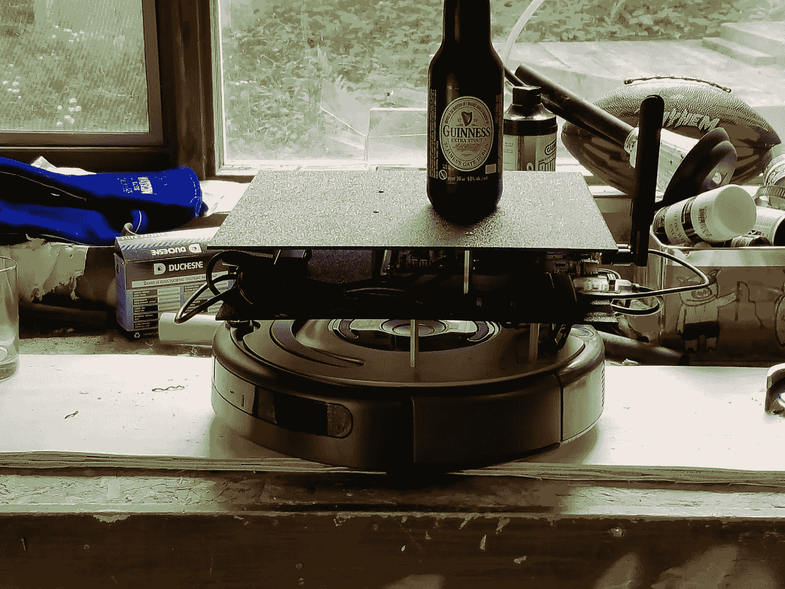
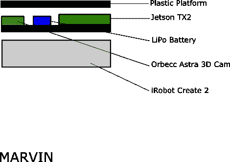

# 设计家庭服务机器人(第一部分)

> 原文：<https://medium.com/coinmonks/designing-a-home-service-robot-pt-1-c7fed0a05c9b?source=collection_archive---------8----------------------->

MARVIN

## 概观

这是一系列文章的开始，在这些文章中，我将介绍我对于制造家用机器人的设计哲学。为了与我在这个博客上提供的其他文章保持一致，我将使用我自己的机器人“马文”作为主要例子。然而，我相信这些设计原则可以扩展并应用到任何你想从事的家庭机器人项目中，所以请不要被我的例子所束缚。

一个好的家庭服务机器人的基本原则(在我看来)如下:

1.  有用性——它应该在身体上或精神上为用户提供有用的服务。
2.  模块化——任何部件都应该易于替换，并且在适当的时候易于替换成等效的组件。
3.  可控性——虽然理想情况下机器人应该能够自主行动，但它应该始终处于用户的控制之下。这意味着它只执行它确定用户已经事先请求或授权的任务，并提供一种机制来停止它当前的动作。
4.  透明性——必须通过设计、行为或两者清楚地表明该设备是一台机器。也就是说，设计者不应该试图让机器人看起来不像机器人。

我并不坚持认为这些是家用机器人平台唯一可以遵循的设计原则，它们仅仅是我自己的原则。这些都源于一个基本的前提，即机器人也应该服务于它们“所属”的人类的需求，并且在这样做的同时尽可能少地造成伤害。因为简单地赋予一个简单的机器人三大法则还不现实，所以需要通过设计来解决这些问题。

本文的其余部分将分为两部分。在接下来的部分中，我将把这里描述的前两个原则——有用性和模块化——应用到家用机器人的设计中(我的例子是马文)。在第二部分，我将通过查看可控性和透明性来完成练习。

计划就是这样，那我们开始吧！

## 有用性

在决定机器人应该具备什么功能之前，先问一下会有所帮助:

> 一个简单的机器人能做什么对人类有帮助的事情？

出于我的目的，我建议两个主要的用例(其他的也存在):

1.  它可以充当智能桌子，根据需要在用户家中运送物品。该应用程序将有助于行动不便的人，或者像在世界各地的一些精选咖啡馆中看到的那样，作为员工选择有限的餐馆中的食品/饮料递送设备。
2.  远程呈现——家用机器人也可以作为远程呈现设备，让主人的朋友和家人以一种有意义的方式进行远距离交流。这在退休之家尤其有用，那里的老人可能住得离他们的朋友和家人很远，但仍然希望与他们互动。机器人提供了比简单的 skype 通话更有活力的互动(在我看来)。

那么我们需要在机器人上安装什么来满足可用性约束呢？

嗯，如果我们正在考虑建造一个“智能桌子”，最简单的解决方案是让机器人拥有一个像桌子一样的表面，主人可以在上面放置物品。这是一个需要解决的简单约束——我们只需要在机器人的顶部有一个平坦的表面。

我们希望机器人能够运送上面的物体，所以我们需要一种定位方法。四处移动需要我们有足够丰富的输入来导航环境，并可能跟随用户。我们将使用 3D 摄像机为此提供输入。

除了能够四处移动，对于可用性服务来说，如果机器人能够在某些方面理解它的环境，这将是有帮助的。这将使人们更容易将机器人引导到家庭或商业环境中的不同位置。为了解决这个问题，我们可以使用一个 slam 包，允许机器人绘制环境地图，然后在执行用户请求时引用该地图。

远程呈现呢？对于这种应用，我们有一些额外的要求。为了让远程呈现发挥作用，操作员需要能够听到和看到机器人看到的东西。前面的需求为我们提供了一个摄像头、一种移动方法和映射功能(这样用户就可以跟踪机器人的位置)。缺少的只是一个麦克风、一个播放图像的屏幕和一些扬声器。我们可以解决所有这些问题，只需让用户将手机放入与机器人相连的支架中，并提供一个网络应用程序，当需要远程呈现时，他们可以打开该应用程序。

如果只使用有用性标准，那么我们的设计已经有了很多不同的要求——我将把所有这些放在一张图中，以 MARVIN 机器人为例:

## 模块性

有用性指导我们的机器人需要什么样的能力和基本组件。模块化帮助我们准确地确定我们应该使用什么硬件和软件来满足这些需求。我们在这里的指导方针应该是选择彼此“松散耦合”的硬件和软件——也就是说，我们想要尽可能少的硬依赖。

> 并非所有机器人应用都是如此，在许多应用中，高速处理、接近 100%的可靠性或高精度是主要因素。我发现这些在慢节奏的家用机器人世界中不太重要，在那里机器最多应该以普通人快走的速度移动。

为此，我感觉 [ROS](http://www.ros.org/) 为家用机器人软件提供了一个很好的框架。它允许将软件组件建模为节点，这些节点仅通过 ROS 主题上的通信了解系统上的其他节点。如果你还没有体验过 ROS，我建议你看看他们的初学者教程，感受一下我在这里的意思。

ROS 将为机器人提供导航和地图功能包，这些包相当容易配置和更换。对于示例机器人马文，我使用了标准导航堆栈来控制机器人的运动，并使用 RTAB 地图包来实现机器人环境的实时地图绘制。

如果我们要使用 ROS，那么我们将需要某种形式的板载计算单元。由于我也希望利用一些深度学习模型来识别用户并跟随他们(在其他可能性中)，我决定使用 [Jetson TX2](https://developer.nvidia.com/embedded/buy/jetson-tx2) 。这里也可以使用其他计算单元——[Raspberry Pi](https://www.raspberrypi.org/)是一个流行的低成本单元，如果你不想做太多计算繁重的工作，你可以使用它。笔记本电脑也可以植入机器人体内。

车载电脑需要电源。从模块化的角度来看，这实际上是一个具有挑战性的问题。每个系统都有自己的电力需求和自己的空间问题，如果不认真重新考虑机器人的需求，这些通常不会“容易”交换。为了简化 MARVIN，我选择用 talent 的现成电池组来解决这个问题。这通过一个桶形插头直接连接到 TX-2，以便提供电源。虽然我可以把它换成另一个大小合适的电源，但这个部件仍然是整个机器人中最不灵活的部分。

> 注意:理论上，我可以尝试从 iRobot Creates 电源获取电力，但是这将需要一个定制的设置，几乎肯定不容易更换新的组件。此外，它将机器人设计与 iRobot 本身紧密结合，这与我试图用模块化原则实现的目标相反。

如前一节所述，我们希望使用 3D 摄像机来让我们的机器人在周围环境中导航。为此，我们也可以选择使用激光雷达扫描仪。使用 3D 摄像机的优势在于，我们既可以将其用作标准摄像机(远程呈现应用需要)，也可以使用 ROS 包将 3D 摄像机的输入转换为激光扫描。这降低了机器人的总成本，以及我们需要的组件数量，我们需要在机载计算机上做更多的计算。

市场上有一些 3D 相机的选择，对它们进行全面的回顾有点超出了本文的范围(我可能会在以后的文章中这样做)。一些著名的例子是 MS Kinnect、Intel RealSense、ZED 和 Orrbec Astra。对于 MARVIN，我选择满足 Orrbec Astra 的这一要求，它具有良好的最大范围(这一点很重要，因为它也用作激光扫描源)、合理的分辨率和合理的价位。另外，它还有一个内置麦克风，可以让机器人听到口头命令，而不必先把手机放在麦克风里。

我们仍然需要硬件来移动机器人。从理论上讲，我们可以为机器人建造自己的驱动系统，如果这符合你的想法，请随意。然而，出于我的目的，使用 iRobot Create 2 作为驱动系统要简单得多。这个方便的低成本小机器人提供了自己的车轮编码器，驱动系统和基本的避障传感器。它还允许一个非常简单的 usb 串行接口，这意味着当需要时，它可以被替换为一个新的和改进的定制驱动系统或同一机器人的更好版本。

这说明了机器人所需的主要部件，但是我们如何将它们连接在一起呢？将所有组件硬连接在一起似乎并不理想，因为这将使我们以后更新设计更加困难。幸运的是，到目前为止选择的所有硬件(除了电池)都可以通过 USB 端口进行通信。因此，模块化原则可以通过简单地使用 USB 集线器将所有组件连接到机载计算机来实现。(Jetson TX2 开发板只有一个标准 USB 端口，您的板载计算机可能没有此限制)。

## 摘要

应用前两个原则，我们就有了一个相当模块化的机器人的开端，它有可能提供有用的服务。它可以感知它的世界，创建地图，并有足够的硬件来响应用户的输入。然而，要想提出一个完整的家庭机器人解决方案，还有一些工作要做，这就是最后两个原则发挥作用的地方。

下周，我将通过应用最后两个原则得出马文机器人的原型规格来完成这个机器人设计练习。在那之前，

分享享受！

这些原则当然是我自己想出来的，当人们阅读这些文章时，我乐于接受建议、反驳或对它们的扩展。