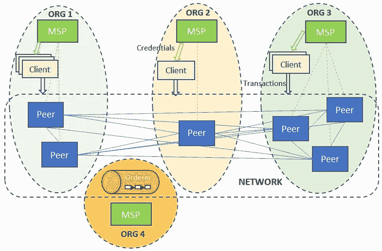
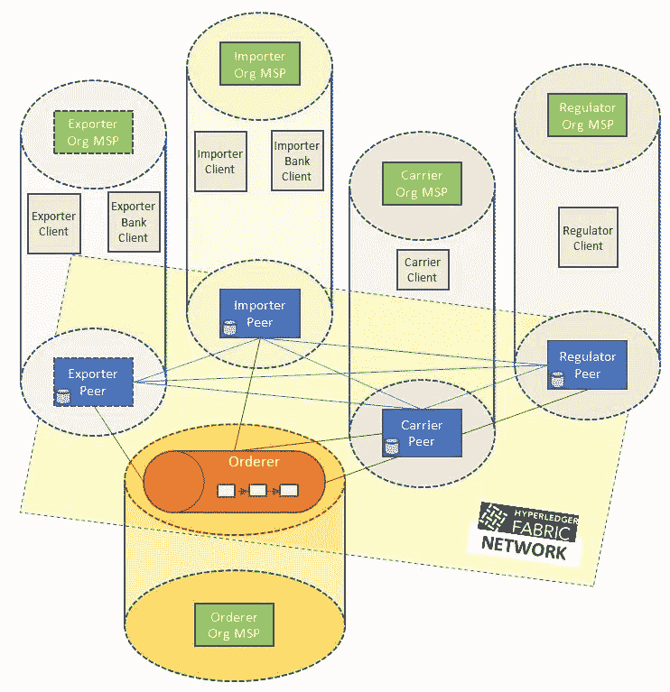

# 设计 Hyperledger 结构网络

> 原文：<https://medium.com/coinmonks/designing-a-hyperledger-fabric-network-7adcd78dabc3?source=collection_archive---------1----------------------->

## *本文介绍了 IBM Research 的研究科学家 Petr Novotny 如何设计 Hyperledger fabric 网络，他在软件系统的工程和研究方面拥有超过 15 年的经验。*

# 设计 Hyperledger 结构网络

为应用程序确定 Hyperledger Fabric 网络结构的第一步是列出参与组织。从逻辑上讲，组织是一个安全域，是一个身份和凭据单元。它管理一个或多个网络对等体，并依赖于一个**成员资格服务提供商** ( **MSP** )为对等体以及智能合约访问特权的客户端颁发身份和证书。订购服务是结构网络的基础，通常被分配给自己的组织。下图说明了典型的对等网络结构，包括客户端、MSP 和逻辑组织分组。

> [发现并回顾最佳区块链软件](https://coincodecap.com)

批准交易(或调用)的标准是背书政策。它是根据参与应用网络的组织而不是对等体本身来构建的:



Blockchain network with peers distributed among organizations, and clients obtaining credentials from organizations to submit queries and invocations to the chaincode

必须预先决定对等体的集合、它们所属的组织以及为每个组织服务的成员资格服务提供者，以便可以在那些机器上安装和运行适当的服务。

我们的示例贸易网络将由四个组织组成，分别代表出口商、进口商、承运商和监管者。后两者分别代表运营商和监管机构。然而，出口商组织代表出口实体及其银行。同样，进口商组织代表进口实体及其银行。从安全性和成本的角度来看，将实体及其信任方分组到一个组织中是有意义的。运行 Fabric peer 是一项繁重且成本高昂的任务，因此对于可能拥有更多资源和大量客户的银行来说，代表自己和客户运行这样的 peer 就足够了。交易实体以客户的身份获得提交交易或从其组织读取分类帐状态的权利。因此，我们的区块链网络需要四个对等体，每个对等体属于不同的组织。除了同行之外，我们的网络由四个组织中每个组织的一个 MSP 和一个以 solo 模式运行的订购服务组成。

订购服务属于它自己的独立组织，有一个 MSP。下图显示了我们交易网络中的组织及其 MSP、同行和客户:



A trade network with peers, an orderer, and clients in their respective organizations

## 安装先决条件

有了网络设计，让我们安装必要的工具:

1.确保您拥有最新版本的:

码头工人使用[https://docs.docker.com/install/](https://docs.docker.com/install/)

Docker-Compose 使用:[https://docs.docker.com/compose/install/](https://docs.docker.com/compose/install/)

2.我们将使用 GitHub 来分享我们教程的源代码。要访问 GitHub，需要安装 Git 客户端并配置 GitHub 的身份验证。欲了解更多信息，请访问 GitHub 的官方网站，地址为[https://help.github.com/articles/set-up-git/](https://help.github.com/articles/set-up-git/)。

3.从[https://hyperledger . github . io/composer/latest/installing/installing-prereqs](https://hyperledger.github.io/composer/latest/installing/installing-prereqs)安装业务网络示例所需的软件。以上说明适用于 Mac 和 Linux。请注意，在使用 Windows 时，我们建议使用类似于 vagger 的解决方案，在虚拟机中运行开发环境。

4.Fabric 是用 Go 语言实现的。

Go 在语法上类似于 C++

我们还将使用 Go 来编写链码

Go 可以从[https://golang.org/](https://golang.org/)安装

5.接下来，我们需要设置我们的环境变量。

`GOPATH`指向`go`源代码的工作区，例如:

```
$ export GOPATH=$HOME/go
```

`PATH`需要包含用于存储库和可执行文件的 Go `bin`目录，正如我们在下面的代码片段中看到的:

```
$ export PATH=$PATH:$GOPATH/bin
```

# 分叉和克隆贸易-金融-物流知识库

现在，我们需要通过派生 GitHub 上的存储库来获得原始源代码的副本。然后，我们可以通过以下步骤将源代码克隆到本地机器目录中:

1.**在 GitHub 中，导航到位于**[https://GitHub . com/hyperledger handson/trade-finance-logistics](https://github.com/HyperledgerHandsOn/trade-finance-logistics)的存储库

2.**派生存储库**:使用页面右上角的 Fork 按钮为您的帐户创建一个源代码副本

3.**获取克隆 URL** :导航到您的贸易-金融-物流存储库的分支。点击`**Clone or download**`按钮，复制网址

4.**克隆存储库**:在 Go 工作区中，如下克隆存储库:

```
$ cd $GOPATH/src$ git clone [https://github.com/YOUR-USERNAME/trade-finance-logistics](https://github.com/YOUR-USERNAME/trade-finance-logistics)
```

我们现在有了所有贸易-金融-物流教程材料的本地副本。

# 创建和运行网络配置

配置和启动我们网络的代码可以在我们存储库的 network 文件夹中找到(这是对[fabric-samples/first-network](https://github.com/hyperledger/fabric-samples/tree/master/first-network)的改编)。在本练习中，我们将在一台物理机或虚拟机上运行整个网络，各种网络元素在适当配置的 Docker 容器中运行。假设读者对使用 Docker 的容器化和使用 Docker-compose 的配置有基本的了解。一旦满足了前一节中列出的先决条件，就足以运行该节中的命令，而不需要读者具备任何额外的知识或配置。

## 准备网络

在生成网络加密材料之前，我们需要执行以下步骤:

1.克隆 Fabric([https://github.com/hyperledger/fabric/](https://github.com/hyperledger/fabric/))源代码库。

2.运行`make docker`为同行和订购者构建 Docker 映像。

3.运行`make configtxgen cryptogen`生成必要的工具来运行本节描述的网络创建命令。

4.克隆 Fabric-CA([https://github.com/hyperledger/fabric-ca](https://github.com/hyperledger/fabric-ca))源代码库。

5.运行`make docker`为 MSP 构建 Docker 映像。

## 生成网络加密材料

网络配置的第一步包括为每个对等方和订购方组织的 MSP 以及基于 TLS 的通信创建证书和签名密钥。我们还需要为每个对等节点和订购节点创建证书和密钥，以便能够相互通信以及与它们各自的 MSP 通信。这种配置必须在我们代码库中的`network`文件夹中的`crypto-config.yaml`文件中指定。

该文件包含组织结构、每个组织中的对等体数量以及组织中必须为其创建证书和密钥的默认用户数量(注意，默认情况下会创建一个`admin`用户)。例如，参见文件中进口商组织的定义，如下所示:

```
PeerOrgs:- Name: ImporterOrgDomain: importerorg.trade.comEnableNodeOUs: trueTemplate:Count: 1Users:Count: 2
```

这个配置表明标记为`ImporterOrg`的组织将包含一个对等体。还将创建两个非管理员用户。还定义了对等方要使用的组织域名。

要为所有组织生成加密材料，运行`cryptogen`命令，如下所示:

```
cryptogen generate — config=./crypto-config.yaml
```

输出被保存到`crypto-config`文件夹。

## 产生信道伪像

为了根据组织的结构创建一个网络，并引导一个渠道，我们将需要生成以下工件:

起源块，包含用于初始化结构区块链的组织特定证书。

通道配置信息。

每个组织的锚定对等配置。锚定对等体充当组织内的支点，用于使用 Fabric gossip 协议的跨组织分类帐同步。

像`crypto-config.yaml`文件一样，信道属性在一个标记为`configtx.yaml`的文件中指定，在我们的源代码中，这个文件可以在`network`文件夹中找到。我们贸易网络的高层组织可以在`Profiles`部分找到，如下所示:

```
Profiles:FourOrgsTradeOrdererGenesis:Capabilities:<<: *ChannelCapabilitiesOrderer:<<: *OrdererDefaultsOrganizations:- *TradeOrdererOrgCapabilities:<<: *OrdererCapabilitiesConsortiums:TradeConsortium:Organizations:- *ExporterOrg- *ImporterOrg- *CarrierOrg- *RegulatorOrgFourOrgsTradeChannel:Consortium: TradeConsortiumApplication:<<: *ApplicationDefaultsOrganizations:- *ExporterOrg- *ImporterOrg- *CarrierOrg- *RegulatorOrgCapabilities:<<: *ApplicationCapabilities
```

正如我们所看到的，我们将要创建的通道被命名为`FourOrgsTradeChannel`，它是在概要文件中定义的。参与该通道的四个组织被标记为`ExporterOrg`、`ImporterOrg`、`CarrierOrg`和`RegulatorOrg`，每一个都引用了在`Organizations`部分中定义的一个子部分。订购者属于自己的名为`TradeOrdererOrg`的组织。每个组织部分包含有关其 MSP 的信息(ID 以及加密材料的位置，如密钥和证书)，以及其锚定对等体的主机名和端口信息。例如，`ExporterOrg`部分包含以下内容:

```
- &ExporterOrgName: ExporterOrgMSPID: ExporterOrgMSPMSPDir: crypto-config/peerOrganizations/exporterorg.trade.com/mspAnchorPeers:- Host: peer0.exporterorg.trade.comPort: 7051
```

如您所见，本规范中的`MSPDir`变量(代表一个文件夹)引用了我们之前使用`cryptogen`工具生成的加密材料。

为了生成通道工件，我们使用`configtxgen`工具。要生成 genesis 块(将在网络引导期间发送给订购方)，从`network`文件夹运行以下命令:

```
configtxgen -profile FourOrgsTradeOrdererGenesis -outputBlock ./channel-artifacts/genesis.block
```

`FourOrgsTradeOrdererGenesis`关键字对应于`Profiles`部分中的配置文件名。genesis 块将保存在`channel-artifacts`文件夹的`genesis.block`文件中。若要生成通道配置，请运行以下代码:

```
configtxgen -profile FourOrgsTradeChannel -outputCreateChannelTx ./channel-artifacts/channel.tx -channelID tradechannel
```

我们将创建的通道命名为`tradechannel`，其配置存储在`channel-artifacts/channel.tx`中。要为导出者组织生成锚点对等配置，请运行:

```
configtxgen -profile FourOrgsTradeChannel -outputAnchorPeersUpdate ./channel-artifacts/ExporterOrgMSPanchors.tx -channelID tradechannel -asOrg ExporterOrgMSP
```

应该对其他三个组织重复相同的过程，同时在前面的命令中更改组织名称。

## 在一个操作中生成配置

为了方便起见，`trade.sh`脚本被配置为使用前面描述的命令和配置文件来生成通道工件以及加密材料。只需在`network`文件夹中运行以下命令:

```
./trade.sh generate -c tradechannel
```

尽管您可以在这里指定任何通道名称，但是请注意，用于开发中间件的配置将依赖于该名称。

## 构建一个样本贸易网络

最后一个命令还具有生成网络配置文件`docker-compose-e2e.yaml`的作用，该文件用于使用 docker-compose 工具启动作为一组 Docker 容器的网络。文件本身依赖于静态配置的文件`base/peer-base.yaml`和`base/docker-compose-base.yaml`。这些文件共同指定服务及其属性，使我们能够在 Docker 容器中一次性运行它们，而不必在一台或多台机器上手动运行这些服务的实例。我们需要运行的服务如下:

一个结构对等体的四个实例，每个组织一个

织物订购者的一个实例

一个结构 CA 的五个实例，对应于每个组织的 MSP

可以从 Docker Hub([https://hub.docker.com/u/hyperledger/](https://hub.docker.com/u/hyperledger/))上的 Hyperledger 项目中获得每一个的 Docker 映像，映像分别是 hyperledger/fabric-peer、Hyperledger/fabric-orderer、Hyperledger/fabric-ca for peer、order 和 MSP。

对等端的基本配置如下(请参见 base/peer-base.yaml):

```
peer-base:image: hyperledger/fabric-peer:$IMAGE_TAGenvironment:- CORE_VM_ENDPOINT=unix:///host/var/run/docker.sock-   CORE_VM_DOCKER_HOSTCONFIG_NETWORKMODE=${COMPOSE_PROJECT_NAME}_trade- CORE_LOGGING_LEVEL=INFO- CORE_PEER_TLS_ENABLED=true- CORE_PEER_GOSSIP_USELEADERELECTION=true- CORE_PEER_GOSSIP_ORGLEADER=false- CORE_PEER_PROFILE_ENABLED=true- CORE_PEER_TLS_CERT_FILE=/etc/hyperledger/fabric/tls/server.crt- CORE_PEER_TLS_KEY_FILE=/etc/hyperledger/fabric/tls/server.key- CORE_PEER_TLS_ROOTCERT_FILE=/etc/hyperledger/fabric/tls/ca.crtworking_dir: /opt/gopath/src/github.com/hyperledger/fabric/peercommand: peer node start
```

可以在这里设置 Fabric 配置参数，但是如果您为`fabric-peer`使用预构建的 Docker 映像，默认值足以启动并运行对等服务。运行对等服务的命令在配置的最后一行被指定为`peer node start`；如果您希望通过下载 Fabric 源代码并在您的本地机器上构建它来运行一个 peer，那么您必须运行这个命令。还要确保使用`CORE_LOGGING_LEVEL`变量适当地配置日志记录级别。在我们的配置中，变量被设置为`INFO`，这意味着只记录信息、警告和错误消息。如果您希望调试一个对等体并需要更广泛的日志记录，您可以将这个变量设置为`DEBUG`。

此外，我们需要为每个对等体配置主机名和端口，并将生成的加密材料(使用`cryptogen`)同步到容器文件系统。出口组织中的对等方在`base/docker-compose-base.yaml`中配置如下:

```
peer0.exporterorg.trade.com:container_name: peer0.exporterorg.trade.comextends:file: peer-base.yamlservice: peer-baseenvironment:- CORE_PEER_ID=peer0.exporterorg.trade.com- CORE_PEER_ADDRESS=peer0.exporterorg.trade.com:7051- CORE_PEER_GOSSIP_BOOTSTRAP=peer0.exporterorg.trade.com:7051- CORE_PEER_GOSSIP_EXTERNALENDPOINT=peer0.exporterorg.trade.com:7051- CORE_PEER_LOCALMSPID=ExporterOrgMSPvolumes:- /var/run/:/host/var/run/- ../crypto-config/peerOrganizations/exporterorg.trade.com/peers/peer0.exporterorg.trade.com/msp:/etc/hyperledger/fabric/msp- ../crypto-config/peerOrganizations/exporterorg.trade.com/peers/peer0.exporterorg.trade.com/tls:/etc/hyperledger/fabric/tls- peer0.exporterorg.trade.com:/var/hyperledger/productionports:- 7051:7051- 7053:7053
```

如`extends`参数所示，这扩展了基本配置。请注意，ID ( `CORE_PEER_ID`)与在`configtx.yaml`中为该对等体指定的 ID 相匹配。这个身份是在导出者组织中运行的对等体的主机名，并将在中间件代码中使用。volumes 部分指示将在`crypto-config`文件夹中生成的加密材料复制到容器的规则。对等服务本身监听端口`7051`，客户端可以用来订阅事件的端口被设置为`7053`。

订购者服务的配置与此类似，如下面来自`base/docker-compose-base.yaml indicates`的片段所示:

```
orderer.trade.com:container_name: orderer.trade.comimage: hyperledger/fabric-orderer:$IMAGE_TAGenvironment:- ORDERER_GENERAL_LOGLEVEL=INFO……command: orderer……
```

如代码所示，启动订购者的命令很简单`orderer`。日志记录级别可以使用`ORDERER_GENERAL_LOGLEVEL`变量进行配置，在我们的配置中设置为`INFO`。

我们将运行的实际网络配置基于一个名为`docker-compose-e2e.yaml`的文件。该文件不存在于存储库中，而是由命令`./trade.sh generate -c tradechannel`创建的，我们之前运行该命令来生成通道和加密材料。这个文件依赖于`base/docker-compose-base.yaml`(并间接依赖于`base/peer-base.yaml`)，通过检查文件内容可以看出这一点。它实际上是从一个名为`docker-compose-e2e-template.yaml`的模板`YAML`文件创建的，你可以在`network`文件夹中找到它。模板文件包含变量，作为使用`cryptogen`生成的关键文件名的替代。当生成`docker-compose-e2e.yaml`时，这些变量名被替换为`crypto-config`文件夹中的实际文件名。

例如，考虑`docker-compose-e2e-template.yaml`中的`exporter-ca`部分:

```
exporter-ca:image: hyperledger/fabric-ca:$IMAGE_TAGenvironment:……- FABRIC_CA_SERVER_TLS_KEYFILE=/etc/hyperledger/fabric-ca-server-config/EXPORTER_CA_PRIVATE_KEY……command: sh -c ‘fabric-ca-server start — ca.certfile /etc/hyperledger/fabric-ca-server-config/ca.exporterorg.trade.com-cert.pem — ca.keyfile /etc/hyperledger/fabric-ca-server-config/EXPORTER_CA_PRIVATE_KEY -b admin:adminpw -d’
```

现在，看看生成的文件`docker-compose-e2e.yaml`中的相同部分:

```
exporter-ca:image: hyperledger/fabric-ca:$IMAGE_TAGenvironment:……- FABRIC_CA_SERVER_TLS_KEYFILE=/etc/hyperledger/fabric-ca-server-config/ cc58284b6af2c33812cfaef9e40b8c911dbbefb83ca2e7564e8fbf5e7039c22e_sk……command: sh -c ‘fabric-ca-server start — ca.certfile /etc/hyperledger/fabric-ca-server-config/ca.exporterorg.trade.com-cert.pem — ca.keyfile /etc/hyperledger/fabric-ca-server-config/cc58284b6af2c33812cfaef9e40b8c911dbbefb83ca2e7564e8fbf5e7039c22e_sk -b admin:adminpw -d’
```

如您所见，在环境变量和命令中，变量`EXPORTER_CA_PRIVATE_KEY`都被替换为`cc58284b6af2c33812cfaef9e40b8c911dbbefb83ca2e7564e8fbf5e7039c22e_sk`。如果您现在检查`crypto-config`文件夹的内容，您会注意到在文件夹`crypto-config/peerOrganizations/exporterorg.trade.com/ca/`中存在一个名为`cc58284b6af2c33812cfaef9e40b8c911dbbefb83ca2e7564e8fbf5e7039c22e_sk`的文件。该文件包含导出组织的 MSP 私有(秘密)签名密钥。

现在让我们更详细地看看 MSP 的配置，以出口组织 MSP 为例，如`docker-compose-e2e.yaml`中所述:

```
exporter-ca:image: hyperledger/fabric-ca:$IMAGE_TAGenvironment:- FABRIC_CA_HOME=/etc/hyperledger/fabric-ca-server- FABRIC_CA_SERVER_CA_NAME=ca-exporterorg- FABRIC_CA_SERVER_TLS_ENABLED=true- FABRIC_CA_SERVER_TLS_CERTFILE=/etc/hyperledger/fabric-ca-server-config/ca.exporterorg.trade.com-cert.pem- FABRIC_CA_SERVER_TLS_KEYFILE=/etc/hyperledger/fabric-ca-server-config/cc58284b6af2c33812cfaef9e40b8c911dbbefb83ca2e7564e8fbf5e7039c22e_skports:- “7054:7054”command: sh -c ‘fabric-ca-server start — ca.certfile /etc/hyperledger/fabric-ca-server-config/ca.exporterorg.trade.com-cert.pem — ca.keyfile /etc/hyperledger/fabric-ca-server-config/cc58284b6af2c33812cfaef9e40b8c911dbbefb83ca2e7564e8fbf5e7039c22e_sk -b admin:adminpw -d’volumes:- ./crypto-config/peerOrganizations/exporterorg.trade.com/ca/:/etc/hyperledger/fabric-ca-server-configcontainer_name: ca_peerExporterOrgnetworks:- trade
```

将在 MSP 中运行的服务是`fabric-ca-server`，它监听端口`7054`，使用使用`cryptogen`创建的证书和密钥进行引导，并使用在`fabric-ca`映像中配置的默认登录和密码(分别为`admin`和`adminpw`)。启动 Fabric CA 服务器实例的命令是`fabric-ca-server start …`，正如您在前面的代码中看到的。

如前面的配置所示，对等体和 ca 被配置用于基于 TLS 的通信。读者必须注意，如果 TLS 在一个中被禁用，那么它在另一个中也必须被禁用。

此外，通过检查`docker-compose-e2e.yaml`可以看出，我们没有为订购者的组织创建一个结构 CA 服务器(和容器)。对于本练习，为订购者静态创建的管理员用户和凭证就足够了；我们不会动态注册新的订购者组织用户，因此不需要结构 CA 服务器。

*如果您觉得这篇文章很有趣，您可以使用 Hyperledger* *亲自探索* [*区块链，利用 Hyperledger Fabric 的强大功能轻松开发基于区块链的分布式账本。*](https://www.amazon.com/Hands-Blockchain-Hyperledger-decentralized-applications/dp/1788994523) [*使用 Hyperledger 的动手区块链*](https://www.packtpub.com/big-data-and-business-intelligence/hands-blockchain-hyperledger) *是一个使用 Hyperledger 技术探索和构建区块链网络的简单参考。*

[](http://bit.ly/2G71Sp7)

> [直接在您的收件箱中获得最佳软件交易](https://coincodecap.com/?utm_source=coinmonks)

[](https://coincodecap.com/?utm_source=coinmonks)