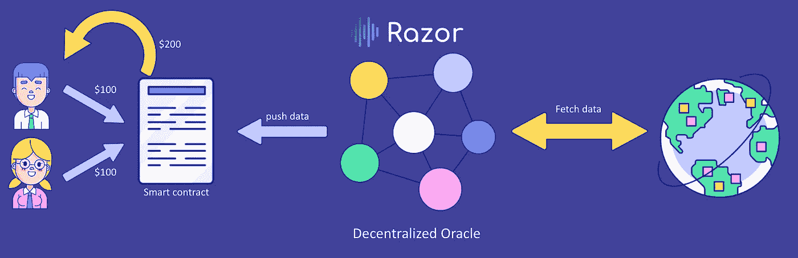
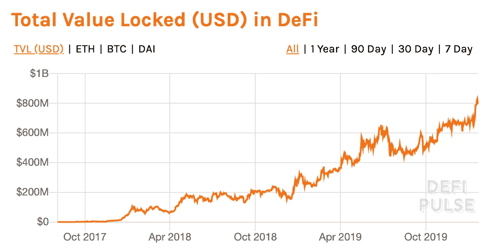
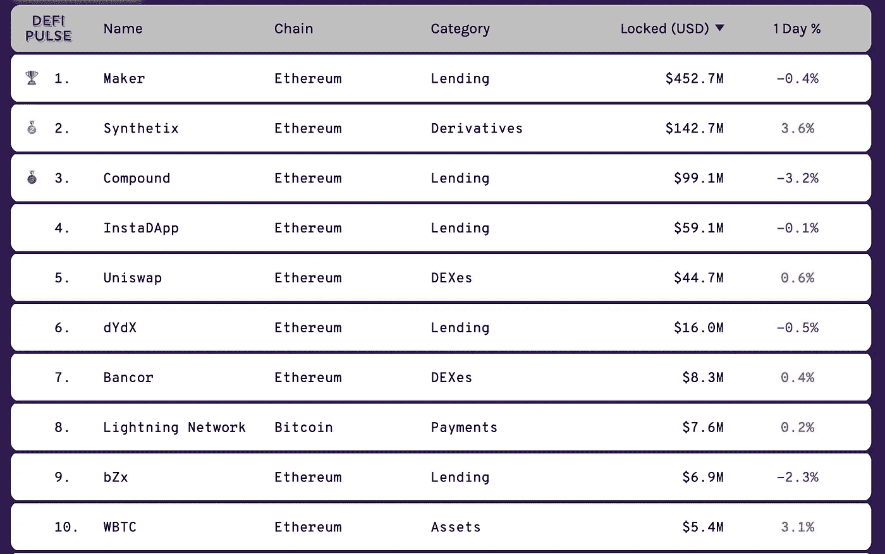
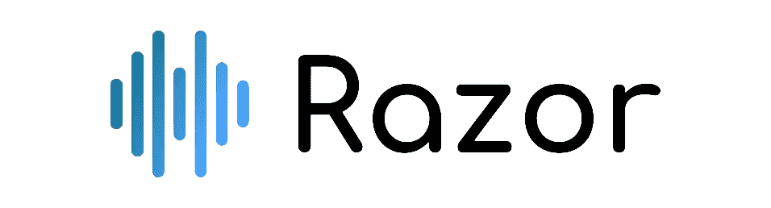

# 为分散式金融设计最安全的 oracle

> 原文：<https://medium.com/coinmonks/designing-the-most-secure-oracle-for-the-decentralized-finance-9853237f0c37?source=collection_archive---------1----------------------->

如果你在区块链空间已经活跃了一段时间，你一定听说过神谕。如果你没有…

# 神谕是什么？

Oracle 向区块链报告外部数据。

区块链是确定性系统。这意味着区块链中的所有数据在任何时候都必须是可验证的。因此，他们不能依赖外部数据，这些数据随时都可能发生变化。

How oracles enable Smart contracts to access external data

这个问题由一个名为“Oracle”的实体解决，它向区块链报告外部数据。但是我们如何做到这一点而不需要相信神谕呢？

这个问题被称为甲骨文问题。Oracle 问题是区块链开发人员和研究人员中众所周知的问题。虽然许多项目都试图解决这个问题，但它们都有实质性的权衡。

# DeFi 去中心化了吗？

分散融资(又名 DeFi)被证明是公共区块链最重要的用例。随着价值超过 8 亿美元的价值锁定和增长，事情看起来令人兴奋。

Total Value Locked in DeFi. Source: [https://defipulse.com](https://defipulse.com)

总价值锁定(TVL)的前十大 DeFi 应用中有七个依赖于某种形式的外部数据。神谕满足了这一需求。由于缺乏安全、快速的分布式 Oracle，这些应用依赖于集中式和半集中式 Oracle。这意味着大多数顶级的“去中心化金融”应用并没有完全去中心化。

Top ‘DeFi’ applications

# 现有 oracle 解决方案

目前可用的 oracle 解决方案可以分为以下几类:

1.  快速但不安全
2.  安全但缓慢

## 快速但不安全

大多数分散式金融要求以低延迟报告数据。因此，今天大多数 DeFi 应用程序依赖于集中式或半集中式的 oracles。

集中式预言机具有交易对手风险，并将整个系统的安全性降低到集中式。由于集中的实体很容易被破坏，这些神谕在游戏理论上是不安全的。

半集中式和快速 oracles 用博弈论的安全性和去中心化来换取速度。

今天可用的大多数去中心化的神谕都属于这一类。这些并非完全“不安全”，但容易受到各种博弈论攻击。

## 安全但缓慢

这一类的神谕在游戏理论上是稳健的。他们使用手动投票和争议轮来防止攻击者的操纵。然而，由于人工投票和长时间的争议，这些可能需要几天到几个星期才能解决。这种较高的延迟使它们不适合许多 DeFi 应用。

## 为什么需要多轮争议

大多数去中心化的神谕使用某种形式的 [SchellingCoin 机制](https://blog.ethereum.org/2014/03/28/schellingcoin-a-minimal-trust-universal-data-feed/)。在 SchellingCoin 游戏中，代理独立报告数据，没有相互协调的可能性。由于缺乏协调，代理人尽力报告“真实”数据，因为他们相信其他代理人也会这样做。

然而，单轮 SchellingCoin 游戏容易受到贿赂、发信号、共谋等各种攻击。如果攻击者攻击游戏，没有机制来报复攻击。对于依赖 oracle 的应用程序来说，一个误报的值就可能带来灾难性的后果。

为了应对这种攻击，我们可以引入争议回合，通过锁定“争议契约”来争议甲骨文的任何结果。如果争议成功，争议者将获得奖励。

但是，攻击者可以攻击争议回合本身，从而需要多个争议回合。

## 剃刀网络:快速安全的 Oracle

Razor Oracle Network provides secure oracle without compromising speed

Razor 提供强大的游戏理论安全性，而不影响速度。

Razor 使用了谢林硬币游戏的修改版本。验证器将它们的令牌锁定为“股份”。他们被激励保持在线并报告“真实”数据。报告不正确的数据会导致他们的股份被削减，而诚实的行为会给他们带来回报。

该机制被证明对各种形式的博弈论攻击是健壮和安全的，如贿赂、共谋、信令、无效源等。

剃刀的第一回合是自动的。在这一轮中，验证器自动报告来自 URL 的数据。由于机械的性质，这一轮很快。网络的激励和争议回合的可能性阻止了验证者的任何操纵。

在受到攻击的情况下，任何人都可以对结果提出异议，从而触发手动争议回合。攻击者也可以攻击争议回合，要求重复争议回合。每一轮的参与赌注都翻倍，经济安全也翻倍。

最终争议回合可以是“分叉”回合。这是最后的市场解决方法。协议和令牌的协议分两个版本，市场决定了“诚实的分叉”。由于这一轮免疫操纵，它阻止攻击者攻击所有先前的回合，因为他们知道他们不太可能成功。

由于这种设计，Razor 对于各种形式的博弈论攻击是健壮的，并且提供最大的去中心化和经济安全性。由于自动化回合，Razor 可以比手动神谕反应更快，但具有相同的游戏理论安全性。

Razor network 目前正在 rli testnet 上运行。

**你愿意来**

*   关注我们的[媒体](https://medium.com/razor-network)
*   加入我们的[电报](https://t.me/razornetwork)
*   在[推特](https://twitter.com/razor_network)上关注我们
*   阅读我们的[讲解者](https://docs.razor.network/explainer/)和[白皮书](https://razor.network/whitepaper)
*   [探索](https://razorscan.io/)网络
*   访问我们的[网站](https://stealth.razor.network)
*   试试我们的合成资产平台 [DeltaOne](https://deltaone.finance/)
*   伸出手来— [hello@razor.network](mailto:hello@razor.network)

> [直接在您的收件箱中获得最佳软件交易](https://coincodecap.com/?utm_source=coinmonks)

v

