# 使用具有暗流的 YOLO 检测图像/视频中的定制对象

> 原文：<https://medium.com/coinmonks/detecting-custom-objects-in-images-video-using-yolo-with-darkflow-1ff119fa002f?source=collection_archive---------0----------------------->

> 这是正在进行的关于使用 **YOLO(你只看一次)**的物体检测系列的另一个故事，第一个是关于算法的介绍和对(一些)不同实现的简要探索:[https://medium . com/@ monocasero/object-detection-with-yolo-implementations-and-how-to-use-them-5d a 928356035](/@monocasero/object-detection-with-yolo-implementations-and-how-to-use-them-5da928356035)

# 介绍

不同的 [YOLO](https://pjreddie.com/darknet/yolo/) 实现( [Darknet](https://pjreddie.com/darknet/) 、 [Darkflow](https://github.com/thtrieu/darkflow) 等)是令人惊叹的工具，可以用来“开箱即用”地开始检测图像或视频中的常见对象，要进行检测，只需下载并安装系统和已经训练好的权重。例如，在官方 [Darknet 网站](https://pjreddie.com/darknet/yolo/)中，我们可以找到获取和使用为 [COCO 数据集](http://cocodataset.org/#home)或 [VOC PASCAL](http://host.robots.ox.ac.uk/pascal/VOC/) 训练的权重的步骤。

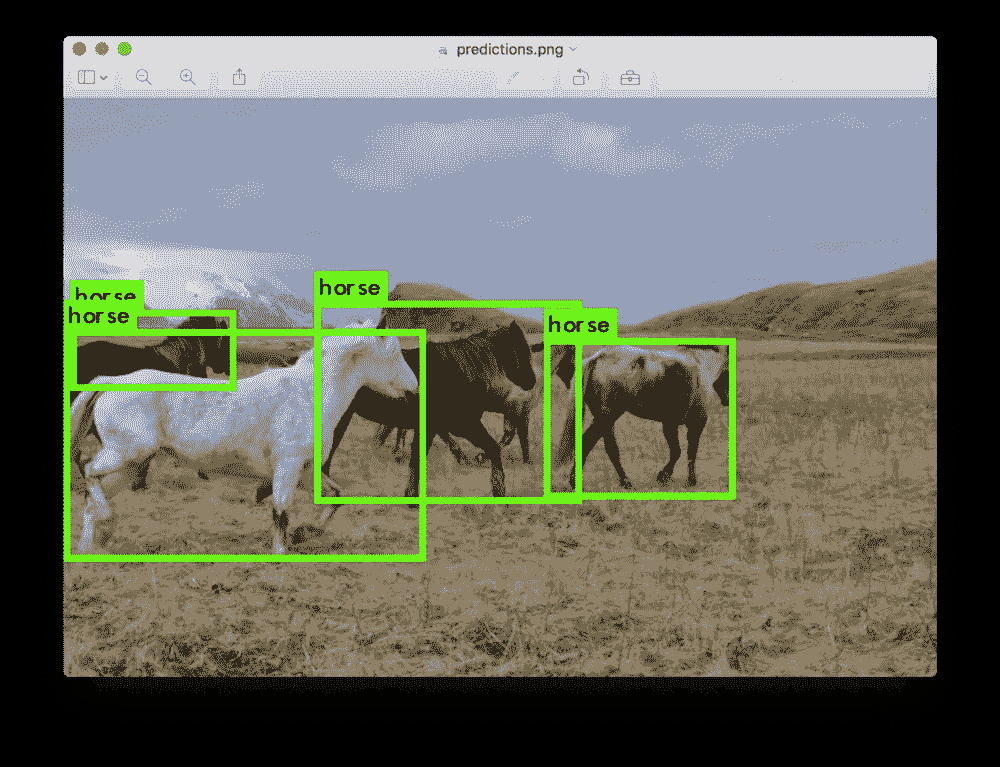

You can download the weights and start detecting horses 🐎

然而，在某些情况下，我们想要检测的对象并不属于这些流行的数据集。在这种情况下，我们需要创建我们的训练集并执行我们自己的训练。

本教程将一步一步地遵循创建数据集和使用 [Darkflow](https://github.com/thtrieu/darkflow) (一个 [Darknet](https://pjreddie.com/darknet/yolo/) 翻译来运行 TensorFlow)运行训练的过程。


Real example of a trained YOLO network to detect text in maps

# 步骤 1:获取图像

在本教程中，我们将训练暗流来检测插图中的文字。

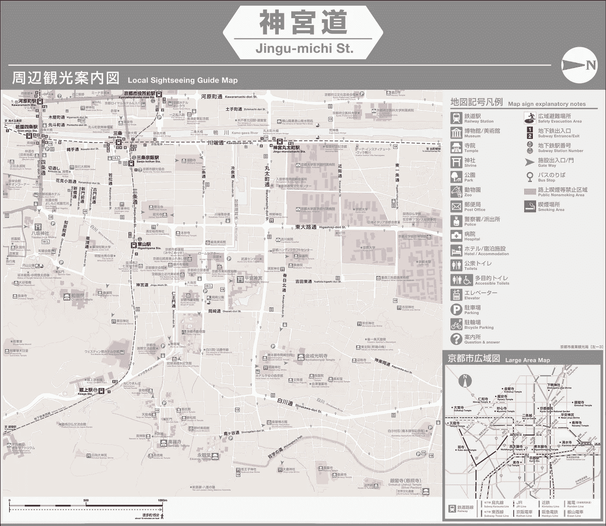

Property of Kyoto City Tourism Office

可以想象，这种图像会产生问题，因为它们通常尺寸很大，并且包含许多我们要检测的类的实例(文本)。这就是为什么我们将使用平铺版本的图像。要创建这些图块，我们可以使用以下工具:

[https://pinetools.com/split-image](https://pinetools.com/split-image)

在我的例子中，我创建了一个 608 像素的正方形网格。到 608 px。

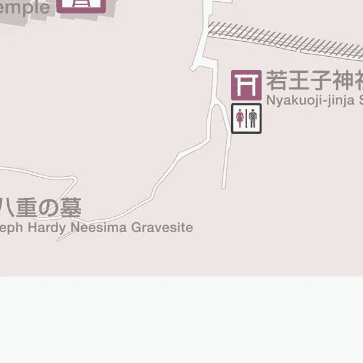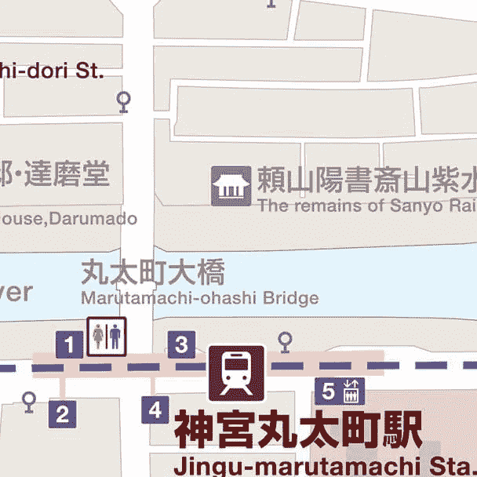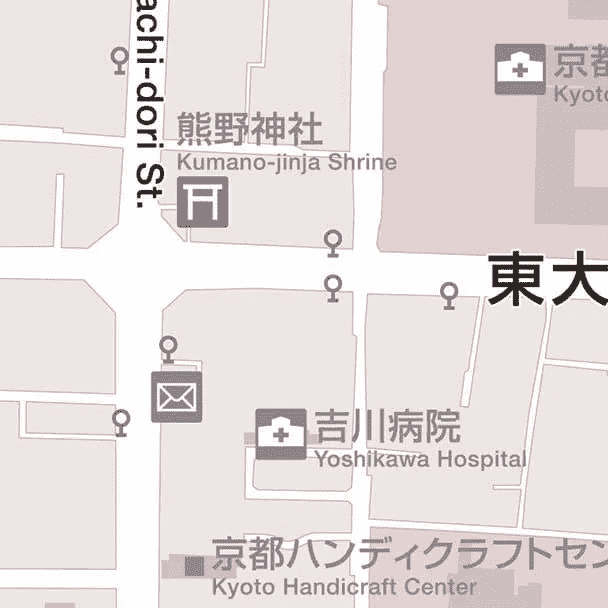

Some instances of the resultant tiles

当然，这一步是可选的，如果你的图片大小一致，并且没有包含很多物体，这一步就没有必要了。

# 步骤 2:注释对象

由于这个特殊的问题(在地图中查找文本)只需要检测一个类，我们将使用我的 BBox-Label-Tool[https://github.com/enriqueav/BBox-Label-Tool](https://github.com/enriqueav/BBox-Label-Tool)来注释图像。与其他替代产品相比，它也更易于安装和使用。

(如果你的问题包括检测每个图像的多个类别，我建议你使用更复杂的东西，比如[https://github.com/tzutalin/labelImg](https://github.com/tzutalin/labelImg)

为了安装 [BBox-Label-Tool](https://github.com/enriqueav/BBox-Label-Tool) ，我们将运行:

```
pip install pillow
git clone [https://github.com/enriqueav/BBox-Label-Tool.git](https://github.com/enriqueav/BBox-Label-Tool.git)
cd BBox-Label-Tool
```

目录结构组织如下

```
BBox-Label-Tool
|
|--main.py *# source code for the tool*
|--Images/ *# directory containing the images to be labeled*
|--Labels/ *# directory for the labeling results*
|--Examples/ *# directory for the example bboxes*
|--AnnotationsXML/ *# directory for the labeling results to be used by Darkflow*
```

在`Images`、`Labels`、`Examples`和`AnnotationsXML`中，该工具期望找到包含图像子集及其相应注释的编号目录。我们将创建数字`002`来存储数据集中的图像

```
mkdir Images/002 Labels/002 Examples/002 AnnotationsXML/002
```

然后，我们需要将上一步中的所有图像(或图块)复制到目录`Images/002`

```
cp /path/to/your/images/*.jpg Images/002
```

然后我们就可以启动工具并开始注释了！

```
python main.py
```

在初始 GUI 的“Image Dir:”下，我们将输入“2”(以加载子集“002”)，然后单击 load:

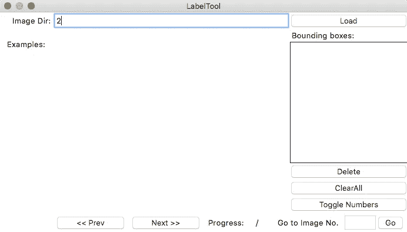

这将加载目录`Images/002`中的所有图像，然后我们可以开始绘制包含文本的边界框。

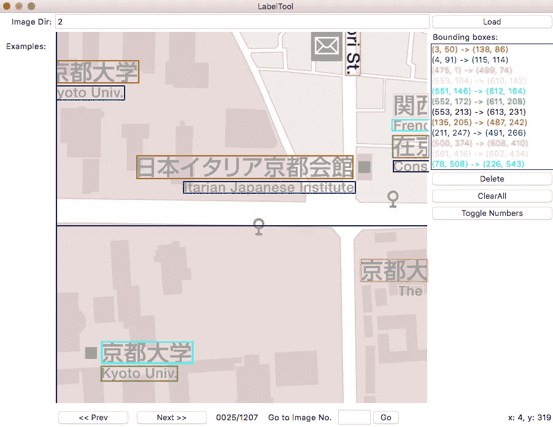

An example of a manually annotated image

完成一幅图像后，我们点击“下一幅> >”进入下一幅图像。也可以使用底部的导航工具栏向后导航，或移动到特定的图像编号。

现在，我们需要为每一张图片做这个过程。这自然会是整个过程中最漫长、最无聊的一步，但是\_(ツ)_/，我们对此无能为力。

一旦我们完成了注释，所有有用的。xml 文件将被存储在`AnnotationsXML/002` **中，这是我们将用于暗流训练的内容！**

# 步骤 3:安装 Darkflow

要下载并安装系统，最简单的方法是运行以下命令(您可能需要事先安装 tensorflow 和 numpy):

```
git clone [https://github.com/thtrieu/darkflow.git](https://github.com/thtrieu/darkflow.git)
cd darkflow
python3 setup.py build_ext --inplace
```

你可以在该项目的 github 页面找到更多信息:[https://github.com/thtrieu/darkflow](https://github.com/thtrieu/darkflow)

# 步骤 4:修改配置文件(配置网络)

有两种可能的网络配置可用于训练， *yolo* 或 *tiny-yolo。*顾名思义 *tiny-yolo* 是一个更小的网络，显然处理速度会更快，但精度会更低。在`cfg/`下有这两个版本的配置文件:

```
$ ls -1 cfg/ | grep yolo.cfg
tiny-yolo.cfg
yolo.cfg
```

在这个例子中，我们将使用完整的 yolo 配置，为此我们需要创建一个文件`yolo.cfg`的副本，我们需要修改它来解决我们的问题

```
cp cfg/yolo.cfg cfg/yolo-new.cfg
# modify cfg/yolo-new.cfg
vi cfg/yolo-new.cfg
```

我们需要修改两行:

1.  在最后的**【卷积】**段，我们需要改变`filters`的个数，公式是`filters=(number of classes + 5)*5`，由于我们只有一个类，所以我们设置`filters=30`。
2.  在**【区域】**部分下有一行指定班级数量(244 行左右)，将其更改为`classes=1`或您拥有的班级数量。

**注意:**有一系列参数，特别是在文件的开头，直接取自 Darknet，但在 Darkflow 中没有区别。例如`batch=32`将被 Darkflow 忽略，我们需要在命令行中指定批量大小(用`--batch <batch_size>`)，否则将采用默认值 16。另一个例子是你需要用`--lr <learning_rate>`指定的学习率。

还有另一个文件是必需的，它是一个包含类名称的文本文件，每行一个，因为我们只有一个类，我们可以直接从命令行创建它

```
echo "map_text" >> one_label.txt
```

# 第五步:开始培训

我们已经走了很长的路，不是吗？好消息是我们已经准备好进行培训了。

提醒一下，在步骤 2 中，我们创建了训练集，由几个图像文件和它们对应的包含注释的 xml 文件组成。它们将被存储在这些位置(你需要用你安装脚本的实际路径替换*<path _ to _ bbox-label-tool>*)。

```
<path_to_bbox-label-tool>/Images/002
<path_to_bbox-label-tool>/AnnotationsXML/002
```

现在，回到暗流，开始我们需要跑步的训练

```
python3 flow --model cfg/yolo-new.cfg \
    --labels one_label.txt  \
    --train --trainer adam \
    --dataset "<path_to_bbox-label-tool>/Images/002" \
    --annotation "<path_to_bbox-label-tool>/AnnotationsXML/002"
```

如果你有 GPU 来训练(而且你应该！)，您可以添加到此命令中

```
--gpu 1.0
```

然后 Darkflow 应该开始启动并加载图像，最终您应该会看到这样的行，打印每个训练步骤的损失:

```
...
step 1 - loss 227.32052612304688 - moving ave loss 227.3205261230469
step 2 - loss 226.1829376220703 - moving ave loss 227.2067672729492
step 3 - loss 225.60186767578125 - moving ave loss 227.046277313232
step 4 - loss 227.2750701904297 - moving ave loss 227.0691566009522
step 5 - loss 227.2261199951172 - moving ave loss 227.0848529403687
...
```

现在你可能已经知道，深度学习通常需要大量的时间来训练。时间显然完全取决于你的硬件，你的训练集的大小等等。可能需要一个小时到几天的时间才能得到有用的结果。

默认情况下，Darkflow 将每 250 步保存一个检查点，因此您可以随时停止训练，休息一下和/或验证当前的重量。**如果你想从最后一个检查点重新开始，你只需要把** `**--load -1**` **添加到你用来开始训练**的同一个命令中。

> 我建议你看看这些终端提示和技巧，轻松监控你训练的当前状态，包括**即时绘制损失值**[https://medium . com/@ monocasero/useful-terminal-tips-and-tricks-for-the-machine-learning-practicer-6 e 96 b 61 b 2 BC 2](/@monocasero/useful-terminal-tips-and-tricks-for-the-machine-learning-practitioner-6e96b61b2bc2)

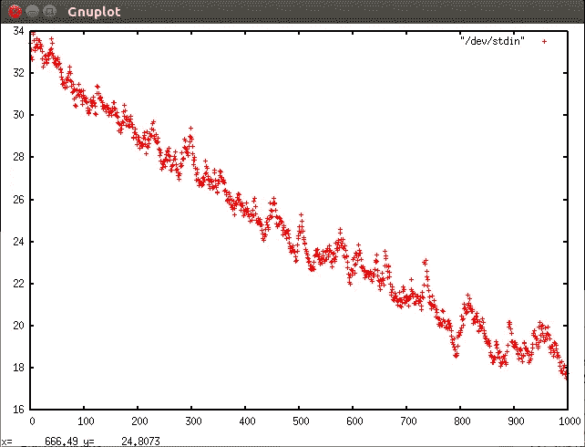

Example of a plot you can launch from the terminal using Gnuplot

# 步骤 6:验证结果

在任何时候，您都可以停止训练，并在一组图像(希望不会被训练看到)中测试检测，假设您在`<path_to_imgs>`中有这些图像:

```
python3 flow --model cfg/yolo-new.cfg \
    --imgdir <path_to_imgs> \
    --load -1 \
    --labels one_label.txt \
    --gpu 1.0
```

默认情况下，它会在`<path_to_imags>`中创建一个名为`out`的目录，其中包含带注释的图片。例如，这些是在我的数据集上训练了大约一天后的一些结果。并不完美，但考虑到训练集的规模(不是很大)和问题的难度，这是相当合理的。

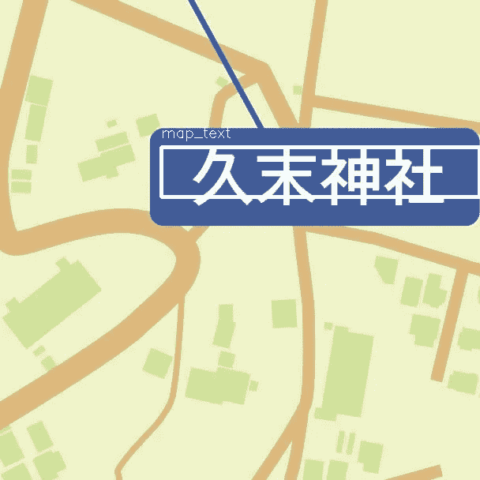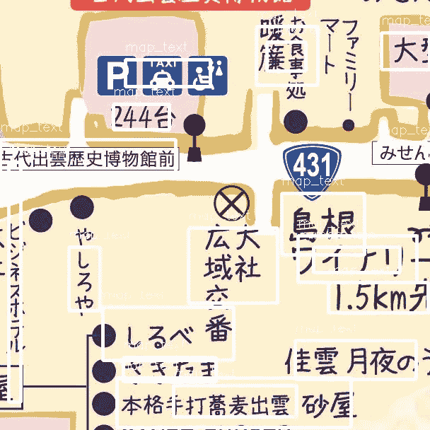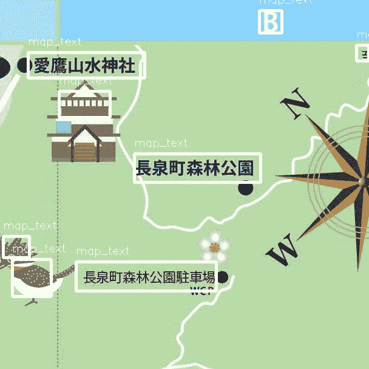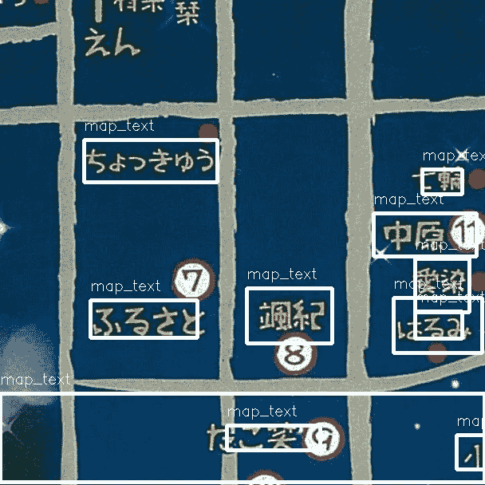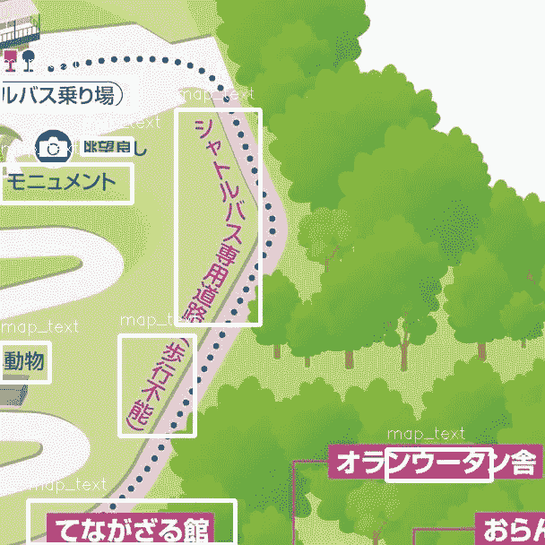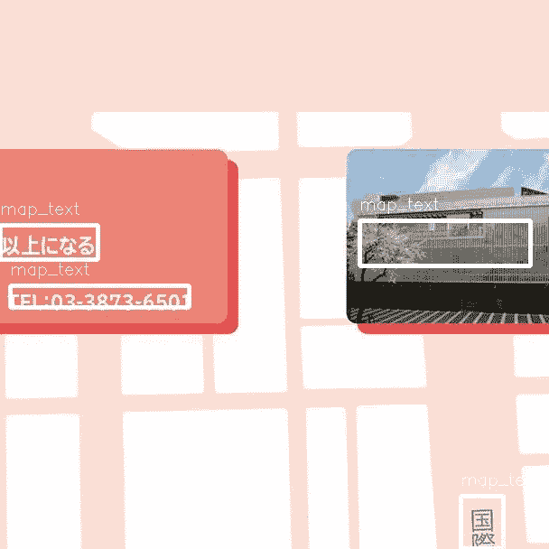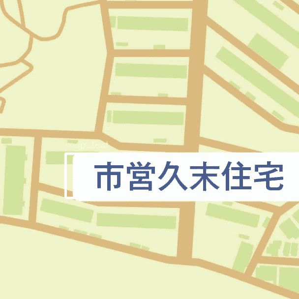

Some examples of the trained YOLO.

# 我在哪里可以找到模型和重量？

## 更新 2018 年 9 月 11 日

模型的体系结构在。我们在**步骤 4** 中修改的 cfg 文件，所以我们必须小心保留它。

Darkflow 会将权重存储在与检查点信息相同的目录中。默认情况下，它将使用`<your_git_directory>/darkflow/ckpt`。每个检查点将创建四个文件，一个名为`checkpoint`的文本文件将被更新。

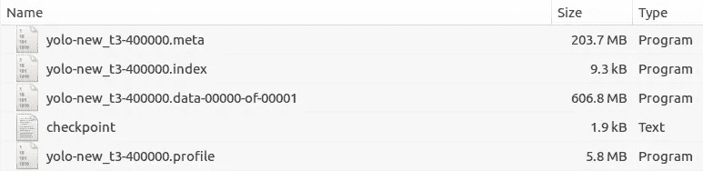

根据此中的[，**。meta** 文件是存储权重的地方。这里的](https://github.com/thtrieu/darkflow/issues/256)[和](https://github.com/thtrieu/darkflow/issues/309)上面说的**。元**，**。索引**和**。数据**是与 TensorFlow 相关的文件。

> 加入 Coinmonks [电报频道](https://t.me/coincodecap)和 [Youtube 频道](https://www.youtube.com/c/coinmonks/videos)获取每日[加密新闻](http://coincodecap.com/)

## 另外，阅读

*   [密码电报信号](http://Top 4 Telegram Channels for Crypto Traders) | [密码交易机器人](/coinmonks/crypto-trading-bot-c2ffce8acb2a)
*   [复制交易](/coinmonks/top-10-crypto-copy-trading-platforms-for-beginners-d0c37c7d698c) | [加密税务软件](/coinmonks/crypto-tax-software-ed4b4810e338)
*   [网格交易](https://coincodecap.com/grid-trading) | [加密硬件钱包](/coinmonks/the-best-cryptocurrency-hardware-wallets-of-2020-e28b1c124069)
*   [加密交换](/coinmonks/crypto-exchange-dd2f9d6f3769) | [印度的加密应用](/coinmonks/buy-bitcoin-in-india-feb50ddfef94)
*   [开发人员的最佳加密 API](/coinmonks/best-crypto-apis-for-developers-5efe3a597a9f)
*   最佳[加密借贷平台](/coinmonks/top-5-crypto-lending-platforms-in-2020-that-you-need-to-know-a1b675cec3fa)
*   杠杆代币的终极指南
*   [八大加密附属计划](https://coincodecap.com/crypto-affiliate-programs) | [eToro vs 比特币基地](https://coincodecap.com/etoro-vs-coinbase)
*   [最佳以太坊钱包](https://coincodecap.com/best-ethereum-wallets) | [电报上的加密货币机器人](https://coincodecap.com/telegram-crypto-bots)
*   [交易杠杆代币的最佳交易所](https://coincodecap.com/leveraged-token-exchanges) | [购买 Floki](https://coincodecap.com/buy-floki-inu-token)
*   [3Commas 对 Pionex 对 Cryptohopper](https://coincodecap.com/3commas-vs-pionex-vs-cryptohopper) | [Bingbon 评论](https://coincodecap.com/bingbon-review)