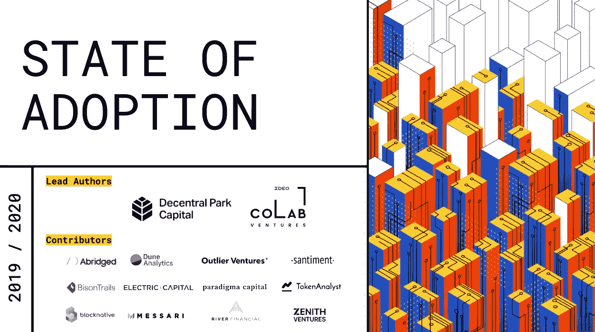
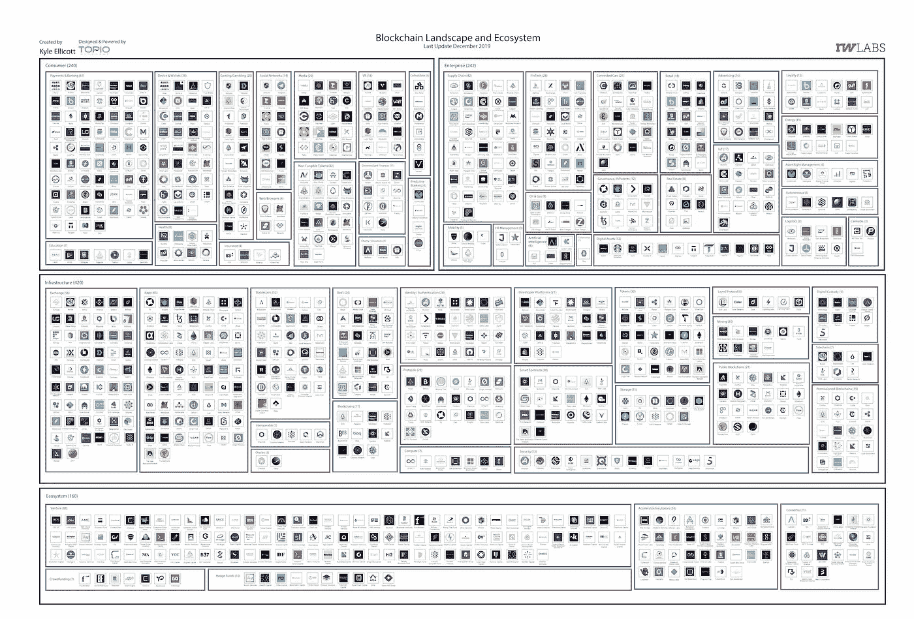

# 德意志银行表示数字货币将成为未来两年的主流/闪电实验室获得 1000 万美元资金/梅赛德斯、优步、Line 和印度在区块链领域的合作

> 原文：<https://medium.com/coinmonks/deutsche-bank-says-digital-currency-mainstream-in-2yrs-lightning-labs-10m-funding-mercedes-d8e7c6a805ff?source=collection_archive---------6----------------------->

Photo by [Austin Chan](https://unsplash.com/@austinchan?utm_source=unsplash&utm_medium=referral&utm_content=creditCopyText) on [Unsplash](https://unsplash.com/s/photos/graffiti?utm_source=unsplash&utm_medium=referral&utm_content=creditCopyText)

*2020 年 2 月 6 日*

*欢迎来到我每周评论的第一期二月版，深入了解区块链、DApps & DLT 风景最近发生的一切。* ***德意志银行*** *认为数字货币将成为主流，因为它们将在未来两年内覆盖全球一半的人口。****Lightning Labs****宣布其 1000 万美元的 A 轮投资，以进一步开发 Lightning 支付技术，扩展开发者生态系统，并发布了*[*Lightning Loop*](https://lightning.engineering/loop/)*的测试版。* ***印度印度国家智能政府研究所(NISG)*** *公布“区块链国家战略”奔驰* *和区块链初创企业* ***正在合作一个项目，旨在追踪钴供应链中的碳排放。* ***线下*** *，总部位于日本的社交媒体网络，已经获准开始交易其加密货币，* ***链接*** *。Ex-* ***微软*** *研究员称他已经解决了区块链的可扩展性问题——如果这还不算的话，我们还有更多的细节、研究和见解。***

*我们甚至在大量的研究中找到了临时抱佛脚的余地(* [*Q4 2019 区块链景观*](https://www.topionetworks.com/markets/blockchain-landscape-5bf43854b9abe4633c1f87da)*&*[*DApps 景观*](https://www.topionetworks.com/markets/dapps-stack-landscape-5de8d07eb9abe453e04203f8) *) &书籍(关于* [*数字资产*](https://www.scribd.com/document/430637579/Current-Market-Overview-of-Digital-Assets)*&*[*企业区块链*](https://www.amazon.com/dp/B07Z3LJCHW/ref=cm_sw_r_tw_dp_U_x_C6iSDbACJJN2Z) *)连同对风险投资(新基金+ M)的见解！)、基础设施、DApps、比特币、经济学、交易所和 Stablecoins。为了了解更多信息，让你跟上时代的步伐，这里有一张本周业内热门新闻的快照。*

## 📈[2020 年企业的强烈兴趣如何进一步推动区块链技术](https://www.forbes.com/sites/biserdimitrov/2020/02/03/how-is-strong-enterprise-interest-in-2020-pushing-blockchain-technology-further/#5944c576139d)

2020 年对于区块链空间企业来说将是激动人心的一年。与前几年相比，主要协议的升级和改进数量是无与伦比的。围绕中央银行数字货币(CBDCs)和大型私人区块链财团(如 B3i、we.trade 和 FoodTrust)的增长势头有力地证明了在企业领域采用分布式账本技术和支持区块链的服务的好处……[阅读更多信息](https://techcrunch.com/2020/01/23/dfinity-launches-an-open-source-platform-aimed-at-the-social-networking-giants/)并查看更多信息，作者为 [Biser Dimitrov](https://medium.com/u/f91a4cb3fbb7?source=post_page-----d8e7c6a805ff--------------------------------)

## 📈[德意志银行称数字货币可能在两年内成为主流](https://www.coindesk.com/deutsche-bank-says-digital-currencies-could-be-mainstream-in-2-years)

德意志银行发布了关于数字货币的最新报告，声称该市场将在未来两年内覆盖全球一半的人口。该研究表明，中国的数字人民币计划和脸书的 Libra 项目预计将于今年启动，这将使超过 15 亿中国公民和 25 亿脸书用户可以使用数字货币……[阅读更多信息](https://www.coindesk.com/deutsche-bank-says-digital-currencies-could-be-mainstream-in-2-years)

## ⚡ [进入闪电十年](/@lightning_labs/entering-the-decade-of-lightning-8c4a4d31167f) ⚡

随着现在完成一项价值 1000 万美元的 a 轮融资，以进一步开发闪电支付技术并扩大开发者生态系统，以及发布第一款付费产品 [Lightning Loop](https://lightning.engineering/loop/) 的测试版，Elizabeth Stark 和她在 [Lightning Labs⚡️](https://medium.com/u/c235aa1f632c?source=post_page-----d8e7c6a805ff--------------------------------) 的团队成为了这一领域的一股力量！不到两年前，他们为比特币 mainnet 发布了第一个 lnd 测试版。自从公司成立以来，到目前为止已经有超过 30 家公司整合了 lnd，还有更多正在进行中，并且已经有超过 4000 名开发人员和测试人员为社区做出了贡献。 … [阅读更多](/@lightning_labs/entering-the-decade-of-lightning-8c4a4d31167f)

## 📖[‘一张网，多条链’——区块链互通案例](https://www.coindesk.com/one-network-many-chains-the-case-for-blockchain-interoperability)

[Andreas M. Antonopoulos](https://medium.com/u/898f59563d67?source=post_page-----d8e7c6a805ff--------------------------------) ,《掌握比特币》的作者在 2019 年 10 月的 Blockstack 峰会上代表了他对区块链国家间交流(IBC)的想法。简而言之，他认为将来会有许多分布式区块链，其中许多会非常有用……[阅读更多](https://www.coindesk.com/one-network-many-chains-the-case-for-blockchain-interoperability)

## 📖[印度公布国家区块链战略，呼吁印度央行发行数字货币](https://news.bitcoin.com/india-rbi-digital-currency/)

印度国家智能政府研究所(NISG)公布了一份“区块链国家战略”草案该草案提供了区块链技术的监管方法，印度政府可以通过检查区块链技术、智能合同应用、区块链采用的挑战、技术的社会影响、政府的角色和国家战略原则……[阅读更多](https://news.bitcoin.com/india-rbi-digital-currency/)

## 📖[奔驰将使用区块链追踪钴供应链的碳排放](https://cointelegraph.com/news/mercedes-will-use-blockchain-to-track-carbon-emissions-in-cobalt-supply-chain)

梅赛德斯-奔驰和区块链初创企业 Circulor 正在合作一个项目，旨在追踪钴供应链中的碳排放。该项目是初创高速公路倡议的一部分，重点是确定下一代汽车。梅赛德斯将利用该项目收集的数据开发新的碳中和乘用车车队……[阅读更多](https://cointelegraph.com/news/mercedes-will-use-blockchain-to-track-carbon-emissions-in-cobalt-supply-chain)

# 本周研究:

[Elias Simos](https://medium.com/u/44e47b1c09e2?source=post_page-----d8e7c6a805ff--------------------------------) 和 [Tara Tan](https://medium.com/u/2309592fe27c?source=post_page-----d8e7c6a805ff--------------------------------) 领导了一项了不起的工作，将大量的研究收集在一起，提供了对 crypto[采用状态](https://www.stateofcrypto.report/)的洞察。这份报告(158 页)深入阐述了生态系统顶级分析师、风投和初创公司对 2019 年最大亮点和 2020 年将会发生什么的信息。点击获取[完整报告。](https://www.stateofcrypto.report/)

[Source](https://www.stateofcrypto.report/)

# 本周的更多内容:

📖[政府和企业对区块链——通往比特币的大门——百思不得其解](https://news.bitcoin.com/governments-and-enterprises-cant-get-enough-of-blockchain/)

📖[分散式拼车颠覆者挑战优步](https://decrypt.co/18155/the-decentralized-ride-sharing-disruptors-taking-on-uber)

📖[第一个 10000 zkDai](/aztec-protocol/the-first-10-000-zkdai-d499a133b8a0)由 [Thomas Walton-Pocock](https://medium.com/u/a2498b4a54af?source=post_page-----d8e7c6a805ff--------------------------------)

📖[你可以拥有自己的个人令牌，还可以进行流式传输](https://thedefiant.substack.com/p/you-can-have-your-own-personal-token)——[目中无人](https://thedefiant.substack.com/)

💰[如何接受加密支付](https://bankless.substack.com/p/how-to-accept-crypto-payments)作者 [Ryan Sean Adams](https://medium.com/u/4a4d94c2ec4c?source=post_page-----d8e7c6a805ff--------------------------------) 作者[无银行](https://bankless.substack.com/)

💰[比特币减半——性价比、过去、现在、&未来](https://bravenewcoin.com/insights/podcasts/the-bitcoin-halving-price-performance-past-present-and-future-with-rekt) w/ [Rekt Capital](https://medium.com/u/3041fff08df2?source=post_page-----d8e7c6a805ff--------------------------------)

💰 [Jill Carlson，Meltem Demirors 为阿尔温非托管和解协议收回 330 万美元](https://www.coindesk.com/jill-carlson-meltem-demirors-back-3-3m-round-for-non-custodial-settlement-protocol-arwen)

💰成功的密码交易者的秘密:绝对质疑一切

# 分散式应用程序手表

## 📖 [Line 获得开始使用数字货币的绿灯](https://decrypt.co/18253/line-gets-the-green-light-to-start-using-digital-currency)

总部位于日本的社交媒体网络 Line 已经获准开始交易其加密货币， [Link](https://link.network/) ，从 2020 年 4 月开始… [阅读更多](https://decrypt.co/18253/line-gets-the-green-light-to-start-using-digital-currency)

## 📖Dapps 帮你打发时间

如果你正在寻找一些有趣的或有广泛创意的小动作来消磨几分钟，这篇文章涵盖了新的小动作，可以让你在等待下一次会议开始或下一班火车到来时保持娱乐和灵感。应用包括 [Give Together](https://www.givetogether.org/) ，EasyGIF，Minesweeper 等……[阅读更多](https://www.dapp.com/article/dapps-to-help-you-while-away-the-minutes)

## 📖[前微软研究员称他已经解决了区块链的可扩展性问题](https://decrypt.co/18083/microsoft-researcher-solved-blockchain-scalability-problem)

前微软首席研究员王家屏为 Asensys 网站揭幕。他提出了他的可扩展区块链的概念，今天在测试中已经显示出比比特币(BTC)和以太坊(ETH)更大的输出和容量… [阅读更多](https://decrypt.co/18083/microsoft-researcher-solved-blockchain-scalability-problem)

📖[我希望在建造以太坊之前知道的事情#DeFi dapps](/iearn/things-i-wish-i-knew-before-building-ethereum-defi-dapps-cd6bf0f07a16) 作者[安德烈·克罗涅](https://medium.com/u/34f4446c6ba1?source=post_page-----d8e7c6a805ff--------------------------------)

📖 [Dapps 应具有创意表面积](https://flynnjamm.substack.com/p/dapps-should-have-creative-surface)由[布莱恩·弗林](https://medium.com/u/c0cacba41b4d?source=post_page-----d8e7c6a805ff--------------------------------)

📖[声音的影响](https://www.eoswriter.io/166918_impact-of-voice.eos)

# 🎧听着

本周必须收听的播客是纳撒尼尔·惠特莫尔关于本周发生的所有风险投资和收购的最新一集。尽情享受吧！

> *👉下载新版* [*区块链用于基础设施景观*](https://www.topionetworks.com/events/5d79268b78e00230faba6f77) *Q4 2019 版&* [*DApps“栈”景观*](https://www.topionetworks.com/markets/dapps-stack-landscape-5de8d07eb9abe453e04203f8)

**Q4 2019 Edition** of the Blockchain for Infrastructure & Ecosystem Landscape

不想等到下周，[现在就订阅](http://click1.m.readwritelabs.com/xsdqkbbrgsdtqkmntpjlstcnkytvpvphsnhsqlvbrhhd_yfqbfcmslnskglmckvqv.html?source=post_page---------------------------)📥有关区块链、DApps 等的实时行业见解！

> [在您的收件箱中直接获得最佳软件交易](https://coincodecap.com/?utm_source=coinmonks)

