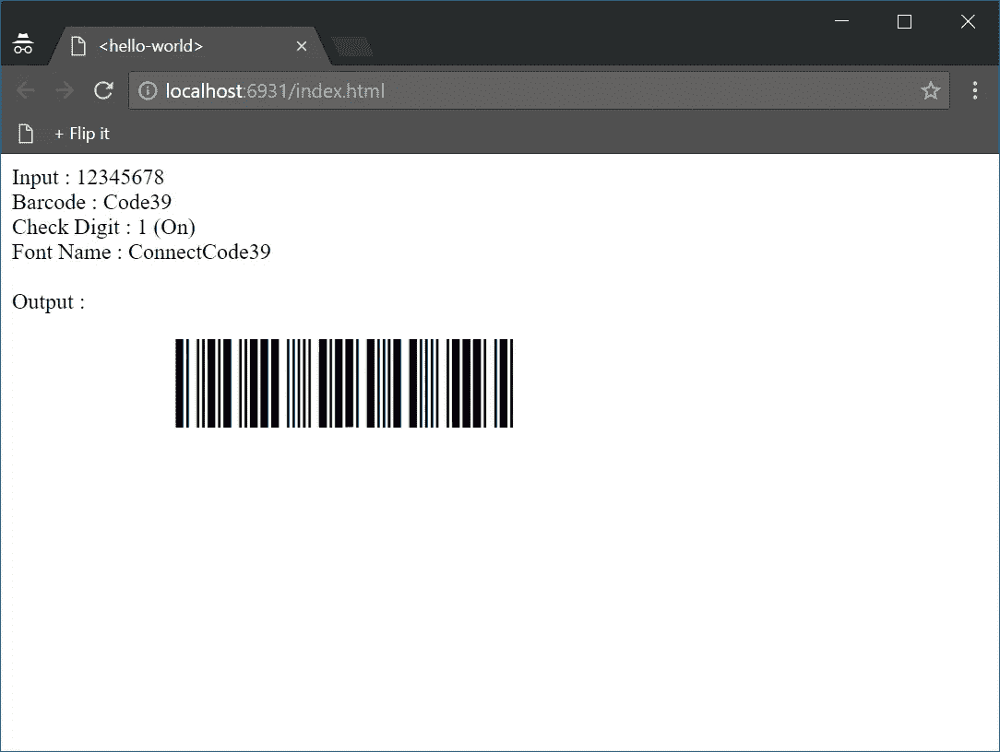

# 用 WebAssembly 开发 W3C Web 组件

> 原文：<https://medium.com/coinmonks/develop-w3c-web-components-with-webassembly-d65938284255?source=collection_archive---------1----------------------->

## WebAssembly 和 Web Components 是两个新兴的标准，它们很有可能对 Web 平台的未来产生重大影响。有趣的问题是，我们能把这两种技术结合起来吗？我们可以使用 WebAssembly 创建 Web 组件吗？在这里找到答案。


WEB COMPONENTS with WEBASSEMBLY

## Web 组件

web 组件是由万维网联盟(W3C)引入的 HTML 和 DOM 规范中的一组功能，用于在 Web 文档和 Web 应用程序中创建可重用的小部件或组件。其目的是将基于组件的软件工程引入万维网。理解 Web 组件最简单的方法是通过一个例子。假设您的同事开发了一个在网页上显示条形码的 Web 组件。要使用该组件，您只需执行以下操作:

```
<html> 
<body> <barcode input="12345678"></barcode> </body> 
</html>
```

您只需要声明一个 HTML 标记，就可以在您的网页或应用程序中使用该组件。不需要编写任何代码来调用组件，也不需要干预来理解组件的内部工作方式。这使您能够通过使用组件来简化 web 开发。

## W3C 的 Web 组件包括以下 4 个特性

*   自定义元素—将新的 HTML 元素添加到 DOM 中
*   影子 DOM——创建由 HTML 标记封装的唯一 DOM
*   HTML 导入—导入 HTML 代码并在其他页面中重用您的组件
*   HTML 模板——编写可重用的代码并声明其外观

上述内容可能仍会发生变化。

另外，Google 提供并维护 Polymer，这是一个开源的 JavaScript 库，用于使用 web 组件构建 Web 应用程序。

## web 程序集

WebAssembly 是一个 web 标准，由 W3C 开发，它定义了一个类似汇编的二进制代码格式(wasm ),用于在网页中执行。执行代码的运行速度几乎与本机代码一样快，旨在显著提高 web 应用程序的性能。由于 WebAssembly 是一个低级二进制字节码，它支持从不同的编程语言编译。

除了作为不同编程语言的编译目标之外，WebAssembly 还提供了用 JavaScript 之外的语言进行 web 开发的替代方案。从 2017 年开始，WebAssembly 已经被包括 Firefox、Chrome、Safari、Edge 在内的所有主流浏览器原生支持。

理解 WebAssembly 最简单的方法也是通过一个例子。下面的源代码显示了一个“hello_world.c”文件的内容。这是一个用 C 语言编写的程序。

```
#include   
int main() 
{ printf("hello, world!\n");      
return 0; }
```

过去，您使用 C/C++编译器将上述内容编译成二进制可执行文件，以便在命令行中运行。接下来，您可以将上面的程序编译成 WebAssembly，并在浏览器中运行该程序。

允许您这样做的工具之一是 Emscripten。这个工具基本上将 C/C++代码编译成 WebAssembly 模块 WASM。然后可以将 WASM 模块加载到网页(HTML)中，以显示“printf”功能的“hello，world”。

## 可以混合 WebAssembly 和 Web 组件吗？

这两个新兴的标准很有可能对网络平台的未来产生重大影响。有趣的问题是我们能结合这两种技术吗？我们可以使用 WebAssembly 创建 Web 组件吗？有人试过这个吗？网上的简单搜索不会返回任何结果。

经过一番研究，我得出结论，答案是肯定的！下一节说明了如何做到这一点。但是，请注意，由于规范的变化和标准的发展，一些代码、脚本或 HTML 可能会发生变化。

## 使用 WebAssembly 创建 Web 组件

为了使这个例子有用和有价值，我们将使用 WebAssembly 创建一个条形码 Web 组件。具体来说，我们将创建一个生成 Code 39 条形码的组件。我们将使用来自 https://www.barcoderesource.com 的免费 Code 39 条形码网络字体来显示我们的条形码。

对于那些不能等待的人，您可以滚动到本页底部下载包含示例代码工作副本的 zip 文件。对于那些想了解更多的人，请继续读下去。

1.从以下网址下载并安装 Emscripten

http://kripken.github.io/emscripten-site/

Emscripten 是一个工具链，用于编译成 asm.js 和 WebAssembly，使用 LLVM 构建，让您可以在没有插件的情况下在 web 上以接近本机的速度运行 C 和 C++。

2.使用记事本创建一个包含以下内容的“code39.cpp”文件。

```
#include <iostream>
#include <cstdlib>
#include <emscripten/bind.h>using namespace emscripten;class Code39 {public:
  Code39()
  {
 inputData="12345678";
 checkDigit=1;
  }Code39(std::string inputData, int checkDigit)
    : checkDigit(checkDigit)
    , inputData(inputData)
  {}std::string encode() 
{std::string filteredData=filterInput(inputData);int filteredlength = filteredData.length();
std::string result;
if (checkDigit==1)
  result="*"+filteredData+generateCheckDigit(filteredData)+"*";
else
  result="*"+filteredData+"*";std::string mappedResult;
for (int x=0;x<result.length();x++)
 {        
         mappedResult=mappedResult+"&#"+
         std::to_string((unsigned char)result[x])+";";  
 }
result=mappedResult;human_readable_text=result;
return result;}int getCheckDigit() const { return checkDigit; }
void setCheckDigit(int checkDigit_) { checkDigit = checkDigit_; }std::string getInputData() const { return inputData; }void setInputData(std::string inputData_) 
{ 
inputData = inputData; 
}std::string getHumanReadableText() const 
{ 
return human_readable_text; 
}private:std::string inputData;
std::string human_readable_text;
int checkDigit;
std::string result;
std::string CODE39MAP[43]={"0","1","2","3","4","5","6","7","8","9","A","B","C","D","E","F","G","H","I","J","K","L","M","N","O","P","Q","R","S","T","U","V","W","X","Y","Z","-","."," ","$","/","+","%"};int getCode39Value(char inputchar) 
{
int RVal=-1;
int i=0;
for (i=0;i<43;i++)
{
  if (inputchar==CODE39MAP[i][0])
  {
   RVal=i;
  }
}
return RVal;
}std::string generateCheckDigit(std::string data)
{
 std::string checkDigit;
 int datalength=data.length();
 int sumValue=0;
 int x=0;
 for (x=0;x<datalength;x++)
 {
  sumValue=sumValue+getCode39Value(data[x]);
 }
 sumValue=sumValue % 43;
 return CODE39MAP[sumValue];
}std::string filterInput(std::string data)
{
 std::string result;
 int x=0;
 int y=0;
 for (x=0; x < data.length() && y < 255; x++)
 {
  if (getCode39Value(data[x]) != -1)
  {
   result=result+data[x];
   y++; 
  }
 }
return result;
}};// Binding code
EMSCRIPTEN_BINDINGS(connectcode_code39) {
  class_<Code39>("Code39")
    .constructor<>()
    .constructor<std::string, int>()
    .function("encode", &Code39::encode)
    .property("checkDigit", 
		&Code39::getCheckDigit, 
		&Code39::setCheckDigit)
    .property("inputData", 
		&Code39::getInputData, 
		&Code39::setInputData)
    .property("humanReadableText", &Code39::getHumanReadableText)
    ;
}
```

上述代码定义了一个 C++类和生成 Code 39 条形码的必要函数，如下所述。

```
.constructor<std::string, int>()
```

上面一行定义了条形码的输入数据(第一个参数)的构造函数，以及是否需要校验位的指示符(第二个参数)。

```
.function("encode", &Code39::encode)
```

上面一行是我们执行来生成 Code 39 条形码的函数。或者更具体地说，它生成一些输出字符，当应用条形码字体时，显示 Code 39 条形码。

```
.property("checkDigit", &Code39::getCheckDigit, &Code39::setCheckDigit)
```

上述属性用于指示在执行“编码”功能之前是否生成校验位。

```
.property("inputData", &Code39::getInputData, &Code39::setInputData)
```

上述属性用于获取或设置输入数据。您可以使用此属性更改输入数据，并执行“编码”功能以生成不同的 Code 39 条形码。

```
.property("humanReadableText", &Code39::getHumanReadableText)
```

上述属性用于获取通常出现在条形码下方的可读文本。人类可读文本与 Code 39 条形码的输入数据不同，可能需要添加开始/停止和检查字符。

3.在 Emscripten 中使用以下命令编译“code39.cpp”。这为我们提供了一个 WASM 模块，稍后我们可以在 Web 组件中使用它。启动命令提示符并执行以下命令。

```
emcc --bind -o code39.js -s WASM=1 -O2 code39.cpp
```

如果在命令提示符下找不到“emcc”命令，可以转到 Emscripten 文件夹并执行“emcmdprompt.bat”脚本文件来设置它。

有了以上内容，我们就有了一个可以在网页中使用的 WebAssembly 模块。但是，请记住，我们的目标是利用这个 WebAssembly 来创建一个符合 W3C 标准的 Web 组件。因此，我们的 WebAssembly 模块将从我们的 Web 组件中执行。

4.接下来，我们将在没有任何框架帮助的情况下，从头开始创建一个 Web 组件。

使用记事本创建一个“code39-barcode.html”文件。

```
<!-- Defines element markup --><template>
    <style TYPE="text/css" media="screen,print">
     [@font](http://twitter.com/font)-face {
       font-family: CCode39_S3_Trial;
       src: url("fonts/ConnectCode39_S3_Trial.woff") format("woff");
     }
     .barcode {font-weight: normal; font-style: normal; line-height:normal; 
 font-family: 'CCode39_S3_Trial', sans-serif; font-size: 32px}
</style><div style="width:5in">
<center>
<div class="barcode">12345678</div>
<div class="barcode_text"></div>
</center>
</div>
<br></template><script type="text/javascript" src="code39.js"></script><script>(function(window, document, undefined) { var thatDoc = document;
        var thisDoc =  (thatDoc._currentScript || 					thatDoc.currentScript).ownerDocument;
        var template = thisDoc.querySelector('template').content;
        var MyElementProto = Object.create(HTMLElement.prototype);
        MyElementProto.barcodeData = '';
        MyElementProto.createdCallback = function() {
        var shadowRoot = this.createShadowRoot();
        var clone = thatDoc.importNode(template, true);
        shadowRoot.appendChild(clone);
        if (this.hasAttribute('inputData')) {
            var data = this.getAttribute('inputData');
            this.setData(data);
        }
        else {
            this.setData(this.data);
        }
    };MyElementProto.attributeChangedCallback = function(attr, oldVal, newVal) {
        if (attr === 'inputData') {
            this.setData(newVal);
        }
    };MyElementProto.setData = function(val) {
        this.barcodeInputData = val;};window.MyElement = thatDoc.registerElement('code39-barcode', {
        prototype: MyElementProto
    });Module['onRuntimeInitialized'] = onRuntimeInitialized;function onRuntimeInitialized() {var thatDoc = document;
    var list = document.getElementsByTagName("code39-barcode")[0];
    var elements=list.shadowRoot.querySelector(".barcode");
    var elementsHR=list.shadowRoot.querySelector(".barcode_text");var instance = new Module.Code39();
    instance.inputData = list.barcodeInputData;
    instance.checkDigit = 1;
    elements.innerHTML=instance.encode();
    elementsHR.innerHTML=instance.humanReadableText;
    instance.delete();};})(window, document);</script>
```

这个 HTML 文件包含三个部分。第一部分包含一个 HTML“模板”，第二部分包含创建和注册 Web 组件的 Javascript 代码，第三部分执行我们的 WebAssembly 模块。

下面的代码使用 HTML“template”创建一个影子 DOM。您可以将影子 DOM 视为元素中可以创建组件的限定了作用域的子树。

```
var MyElementProto = Object.create(HTMLElement.prototype);		
MyElementProto.barcodeData = '';
MyElementProto.createdCallback = function() {
var shadowRoot = this.createShadowRoot();
var clone = thatDoc.importNode(template, true);
shadowRoot.appendChild(clone);
```

下面的代码行在浏览器中注册了我们的定制元素“MYElementProto ”,这样我们就可以使用“code39-barcode”作为标签。

```
window.MyElement = thatDoc.registerElement('code39-barcode', {
        prototype: MyElementProto
    });
```

在执行 WebAssembly 模块之前，我们需要加载 WASM 文件。以下代码行加载由 Emscripten 工具生成的 Javascript。生成这个 Javascript 是为了帮助我们加载 WebAssembly 模块。

对于我们中的一些人来说，我们可能会发现这个计数器很直观，因为我们需要加载一个 Javascript 模块来加载一个 WebAssembly 模块。这是我相信以后会改进的地方。在某种程度上，我们将能够把 WebAssembly 模块视为 HTML 网页中的一等公民。

```
<script type="text/javascript" src="code39.js"></script>
```

“onRuntimeInitialized”函数是在 WASM 模块完全加载后执行的函数。在这个函数中，我们从 Web 组件中获取“barcode”和“barcode _ text”div 元素。我们这样做是为了从 Web 组件标记中获取输入数据，然后将条形码返回给“barcode”div 元素。

```
var thatDoc = document;
var list = document.getElementsByTagName("code39-barcode")[0];
var elements=list.shadowRoot.querySelector(".barcode");
var elementsHR=list.shadowRoot.querySelector(".barcode_text");
```

下面的代码行为我们的 WebAssembly 模块 Code39 类声明了一个实例。

```
var instance = new Module.Code39();
```

接下来，我们使用“实例”根据输入数据生成条形码(条形码字符)。一旦用“encode”函数生成了条形码，我们还可以从“instance”中获得“humanReadableText”。

```
instance.inputData = list.barcodeInputData;
instance.checkDigit = 1;
elements.innerHTML=instance.encode();
elementsHR.innerHTML=instance.humanReadableText;
```

6.我们已经完成了 Web 组件的开发，并在组件中使用 WebAssembly 来生成条形码。我们可以创建一个简单的 HTML 文件来测试我们的 Web 组件。

使用记事本，创建一个包含以下内容的“index.html”文件。

```
<!doctype html>
<html>
<head><meta charset="utf-8">
<title><hello-world></title><style TYPE="text/css" media="screen,print">
     [@font](http://twitter.com/font)-face {
       font-family: CCode39;
       src: url("fonts/CCode39.woff") format("woff");
     }
     .barcode {font-weight: normal; font-style: normal; line-height:normal; font-family: 'CCode39', sans-serif; font-size: 32px}
</style><link rel="import" href="code39-barcode.html"></head>
<body>Input : 12345678
Barcode : Code39
Check Digit : 1 (On)
Font Name : ConnectCode39_S3Output :     <code39-barcode input="12345678"></body>
</html>
```

如下所示的第一行包括 Web 组件，第二行使用我们之前声明的 Web 组件标记。

```
<link rel="import" href="code39-barcode.html"> 
.
.
.	 
<code39-barcode input="12345678">
```

7.保存 HTML 文件，并在命令提示符下运行以下命令，启动 Chrome 浏览器来查看我们的 Web 组件。

```
emrun --browser chrome index.html
```

您应该看到以下内容:



WebAssembly Web Components Barcode

本教程说明了未来将带来的许多可能性。

*   软件供应商可以运输和销售非常优化的(WebAssembly)和标准化的(Web Components)组件，而无需将源代码运输给其他用户。
*   web 开发人员可以很容易地以标准化的方式集成第三方组件。
*   我们可以想象 Java 或者。NET 可以移植到浏览器中作为 WebAssembly 运行。开发人员可以使用他们喜欢的工具和编程语言开发他们的 Web 组件。

下载可运行的 zip 文件:

*   [pwa _ web components _ web assembly . zip](https://barcoderesource.com/pwa_webcomponents_webassembly.zip)

**浏览器测试于**

*   谷歌浏览器 65.0.3325.181(或更高版本)

注意-通过使用来自框架(如 Polymer)的 polyfill，上述教程可以在更多浏览器上工作。

> 加入 Coinmonks [电报频道](https://t.me/coincodecap)和 [Youtube 频道](https://www.youtube.com/c/coinmonks/videos)获取每日[加密新闻](http://coincodecap.com/)

## 另外，阅读

*   [复制交易](/coinmonks/top-10-crypto-copy-trading-platforms-for-beginners-d0c37c7d698c) | [加密税务软件](/coinmonks/crypto-tax-software-ed4b4810e338)
*   [网格交易](https://coincodecap.com/grid-trading) | [加密硬件钱包](/coinmonks/the-best-cryptocurrency-hardware-wallets-of-2020-e28b1c124069)
*   [密码电报信号](http://Top 4 Telegram Channels for Crypto Traders) | [密码交易机器人](/coinmonks/crypto-trading-bot-c2ffce8acb2a)
*   [最佳加密交易所](/coinmonks/crypto-exchange-dd2f9d6f3769) | [印度最佳加密交易所](/coinmonks/bitcoin-exchange-in-india-7f1fe79715c9)
*   [币安 vs 比特邮票](https://coincodecap.com/binance-vs-bitstamp) | [比特熊猫 vs 比特币基地 vs Coinsbit](https://coincodecap.com/bitpanda-coinbase-coinsbit)
*   [如何购买 Ripple (XRP)](https://coincodecap.com/buy-ripple-india) | [非洲最好的加密交易所](https://coincodecap.com/crypto-exchange-africa)
*   [非洲最佳加密交易所](https://coincodecap.com/crypto-exchange-africa) | [胡交易所评论](https://coincodecap.com/hoo-exchange-review)
*   [eToro vs 罗宾汉](https://coincodecap.com/etoro-robinhood)|[MoonXBT vs Bybit vs Bityard](https://coincodecap.com/bybit-bityard-moonxbt)
*   [面向开发人员的最佳加密 API](/coinmonks/best-crypto-apis-for-developers-5efe3a597a9f)
*   最佳[密码借贷平台](/coinmonks/top-5-crypto-lending-platforms-in-2020-that-you-need-to-know-a1b675cec3fa)
*   [免费加密信号](/coinmonks/free-crypto-signals-48b25e61a8da) | [加密交易机器人](/coinmonks/crypto-trading-bot-c2ffce8acb2a)
*   杠杆代币的终极指南