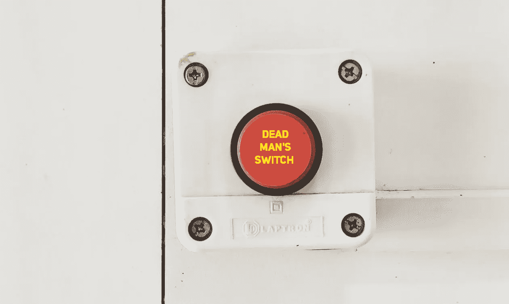

# 开发者设想比特币死亡开关

> 原文：<https://medium.com/coinmonks/developer-envisions-bitcoin-dead-mans-switch-bd7ab5553fde?source=collection_archive---------1----------------------->

荷兰开发者 Joost Jager 认为，可以利用闪电网络为比特币持有者制造一个死人开关。当有人设置[死亡开关](https://github.com/joostjager/deadmensbutton)时，他们需要定期确认自己是否活着。一旦他们无法这样做，该系统将使用比特币闪电网络向那些继承资产的人发送信息。