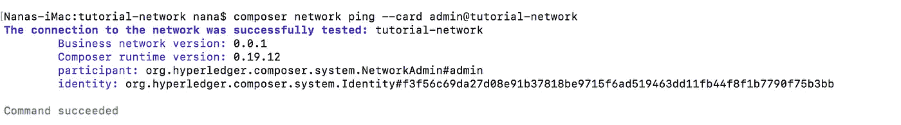
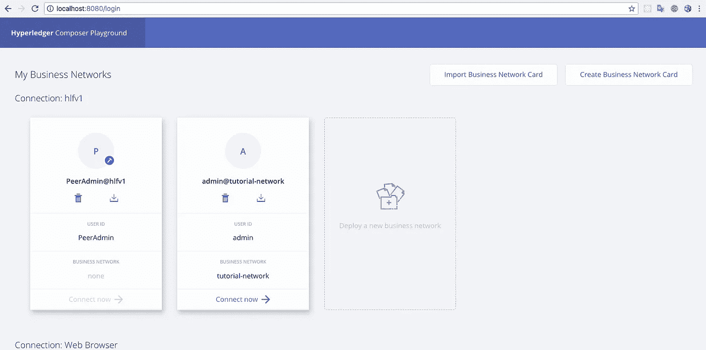
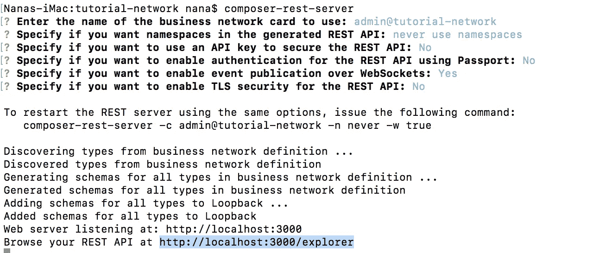
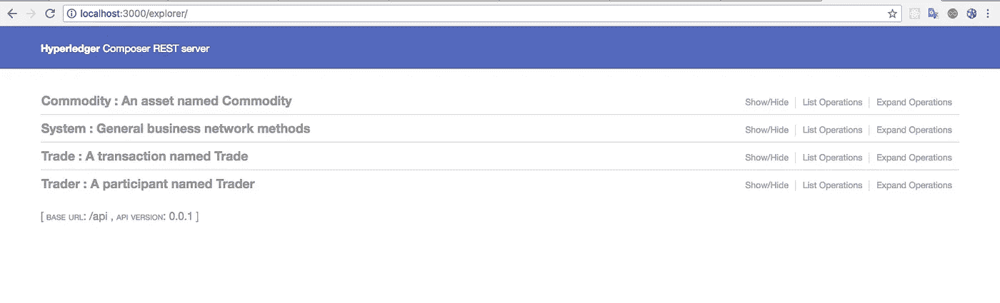
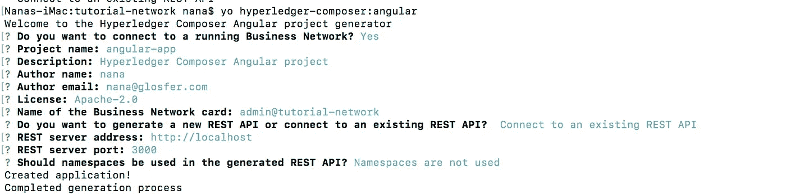
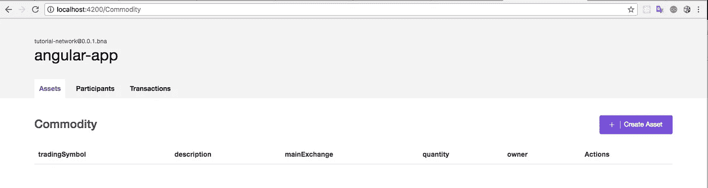

# 创建 Hyperledger Composer 解决方案的开发人员教程(教程 1)

> 原文：<https://medium.com/coinmonks/developer-tutorial-for-creating-a-hyperledger-composer-solution-348f10e4898a?source=collection_archive---------2----------------------->

## 基于 IBM developerWorks

# 开发环境

```
npm version 6.2.0
node version 8.9.1
composer-cli version v0.19.12
composer-rest-server version 0.19.12
generator-hyperledger-composer version 0.19.12
yo version 2.05
```

# 步骤 1:安装 CLI 工具

对于 Composer 开发人员来说，有一些有用的 CLI 工具。最重要的是`composer-cli`，它包含了所有的基本操作，所以我们将首先安装它。接下来，我们还将挑选`generator-hyperledger-composer`、`composer-rest-server`和`Yeoman`以及`generator-hyperledger-composer`。最后 3 个不是开发环境的核心部分，但如果您正在学习教程或开发与您的业务网络交互的应用程序，它们会很有用，所以我们现在就安装它们。

> [发现并回顾最佳区块链软件](https://coincodecap.com)

请注意，您**不应**将`su`或`sudo`用于以下 npm 命令。

基本 CLI 工具:

`npm install -g composer-cli`

在您的机器上运行 REST 服务器以将您的业务网络公开为 RESTful APIs 的实用程序:

`npm install -g composer-rest-server`

生成应用程序资产的有用实用程序:

`npm install -g generator-hyperledger-composer`

Yeoman 是一个生成应用程序的工具，它利用了`generator-hyperledger-composer`:

`npm install -g yo`

# 第二步:安装游乐场

如果你已经尝试过 Composer online，你会看到浏览器应用程序“Playground”。您也可以在您的开发机器上本地运行它，为您提供一个查看和演示您的业务网络的 UI。

用于简单编辑和测试业务网络的浏览器应用程序:

`npm install -g composer-playground`

# 步骤 3:设置您的 IDE

虽然浏览器应用程序*可以*用于处理您的业务网络代码，但大多数用户更喜欢在 IDE 中工作。我们最喜欢的是`VSCode`，因为有一个 Composer 扩展可用。

从这个网址安装 vs code:【https://code.visualstudio.com/download 

打开 VSCode，转到 Extensions，然后从 Marketplace 搜索并安装`Hyperledger Composer`扩展。

# 步骤 4:安装 Hyperledger Fabric

此步骤为您提供了一个本地 Hyperledger 结构运行时来部署您的业务网络。

在您选择的目录中(我们假设为`~/fabric-dev-servers`，获取包含安装 Hyperledger Fabric 的工具的`.tar.gz`文件:

```
mkdir ~/fabric-dev-servers && cd ~/fabric-dev-servers  
curl -O [https://raw.githubusercontent.com/hyperledger/composer-tools/master/packages/fabric-dev-servers/fabric-dev-servers.tar.gz](https://raw.githubusercontent.com/hyperledger/composer-tools/master/packages/fabric-dev-servers/fabric-dev-servers.tar.gz)
tar -xvf fabric-dev-servers.tar.gz
```

如果您愿意，也可以使用`zip`:只需用`fabric-dev-servers.zip`替换`.tar.gz`文件，用`unzip`命令替换`tar -xvf`命令。

使用您刚刚下载和提取的脚本下载本地 Hyperledger Fabric 运行时:

`cd ~/fabric-dev-servers ./downloadFabric.sh`

# 你的网络

# 步骤 1:创建业务网络结构

使用 Yeoman 创建一个基本的商业网络。该命令将需要企业网络名称、描述、作者姓名、作者电子邮件地址、许可证选择和名称空间。

`yo hyperledger-composer:businessnetwork`

输入`tutorial-network`作为网络名称，并输入所需的信息作为描述、作者姓名和作者电子邮件。

选择`Apache-2.0`作为许可证。

选择`org.example.mynetwork`作为名称空间。

当询问是否生成空网络时，选择`No`。

# 步骤 2:定义业务网络

业务网络由资产、参与者、事务、访问控制规则以及可选的事件和查询组成。在前面步骤中创建的框架业务网络中，有一个模型(`.cto`)文件，它将包含业务网络中所有资产、参与者和交易的类定义。主干业务网络还包含具有基本访问控制规则的访问控制(`permissions.acl`)文档、包含交易处理器函数的脚本(`logic.js`)文件以及包含业务网络元数据的`package.json`文件。

## 模拟资产、参与者和交易

要更新的第一个文档是模型(`.cto`)文件。该文件使用 [Hyperledger Composer 建模语言](https://hyperledger.github.io/composer/latest/reference/cto_language.html)编写。模型文件包含每一类资产、交易、参与者和事件的定义。它隐式扩展了建模语言文档中描述的 Hyperledger Composer 系统模型。

打开`org.example.mynetwork.cto`模型文件。

将内容替换为以下内容:

```
/**
 * My commodity trading network
 */
namespace org.example.mynetwork
asset Commodity identified by tradingSymbol {
    o String tradingSymbol
    o String description
    o String mainExchange
    o Double quantity
    --> Trader owner
}
participant Trader identified by tradeId {
    o String tradeId
    o String firstName
    o String lastName
}
transaction Trade {
    --> Commodity commodity
    --> Trader newOwner
}
```

将您的更改保存到`org.example.mynetwork.cto`。

## 添加 JavaScript 事务逻辑

在模型文件中，定义了一个`Trade`事务，指定了与资产和参与者的关系。事务处理器函数文件包含 JavaScript 逻辑，用于执行模型文件中定义的事务。

`Trade`事务旨在简单地接受被交易的`Commodity`资产的标识符，以及被设置为新所有者的`Trader`参与者的标识符。

打开`logic.js`脚本文件。

将内容替换为以下内容:

```
/**
 * Track the trade of a commodity from one trader to another
 * @param {org.example.mynetwork.Trade} trade - the trade to be processed
 * @transaction
 */
async function tradeCommodity(trade) {
    trade.commodity.owner = trade.newOwner;
    let assetRegistry = await getAssetRegistry('org.example.mynetwork.Commodity');
    await assetRegistry.update(trade.commodity);
}
```

将您的更改保存到`logic.js`。

## 添加访问控制

替换文件`permissions.acl`中的以下访问控制规则:

```
/**
 * Access control rules for tutorial-network
 */
rule Default {
    description: "Allow all participants access to all resources"
    participant: "ANY"
    operation: ALL
    resource: "org.example.mynetwork.*"
    action: ALLOW
}

rule SystemACL {
  description:  "System ACL to permit all access"
  participant: "ANY"
  operation: ALL
  resource: "org.hyperledger.composer.system.**"
  action: ALLOW
}
```

将您的更改保存到`permissions.acl`。

# 步骤 3:生成业务网络档案

既然已经定义了业务网络，那么必须将它打包到一个可部署的业务网络档案(`.bna`)文件中。

使用命令行，导航到`tutorial-network`目录。

从`tutorial-network`目录中，运行以下命令:

```
composer archive create -t dir -n .
```

命令运行后，在`tutorial-network`目录中创建了一个名为`tutorial-network@0.0.1.bna`的业务网络归档文件。

# 步骤 4:部署业务网络

创建`.bna`文件后，可以将业务网络部署到 Hyperledger Fabric 实例中。通常，需要来自结构管理员的信息来创建`PeerAdmin`身份，该身份具有将链码安装到对等体以及在`composerchannel`通道上启动链码的特权。

将文件 startFabric.sh、stopFabric.sh、_loader.sh、creatPeerAdminCard.sh、fabric-scripts 文件夹从 fabric-dev-servers 文件夹复制到 tutorial-network 文件夹

在教程-网络中运行以下命令:

```
./startFabric.sh
./createPeerAdminCard.sh
```

## 部署业务网络

将业务网络部署到 Hyperledger Fabric 需要在对等方上安装 Hyperledger Composer 业务网络，然后才能启动业务网络，并且必须创建新的参与者、身份和关联卡作为网络管理员。最后，必须导入 network administrator 商用网卡才能使用，然后可以 pinged 网络以检查它是否有响应。

要安装业务网络，从`tutorial-network`目录运行以下命令:

```
composer network install --card PeerAdmin@hlfv1 --archiveFile tutorial-network@0.0.1.bna
```

`composer network install`命令需要一个 PeerAdmin 业务网卡(在本例中已经预先创建并导入了一个),以及定义业务网络的`.bna`的文件路径。

要启动业务网络，请运行以下命令:

```
composer network start --networkName tutorial-network --networkVersion 0.0.1 --networkAdmin admin --networkAdminEnrollSecret adminpw --card PeerAdmin@hlfv1 --file networkadmin.card
```

`composer network start`命令需要一个业务网卡，以及业务网络的管理员身份名称、业务网络的名称和版本，以及准备作为业务网卡导入的文件的名称。

要将网络管理员身份作为可用的业务网卡导入，请运行以下命令:

```
composer card import --file networkadmin.card
```

`composer card import`命令需要在`composer network start`中指定的文件名来创建卡。

要检查业务网络是否已成功部署，请运行以下命令来 ping 网络:

```
composer network ping --card admin@tutorial-network
```

我得到了这个成功的结果



`composer network ping`命令需要一个业务网卡来识别要 ping 的网络。

要使用 playround 运行和测试，请执行以下命令

```
composer-playground
```



# 步骤 5:生成 REST 服务器

Hyperledger Composer 可以基于业务网络生成定制的 REST API。对于开发 web 应用程序，REST API 提供了一个有用的语言无关的抽象层。

要创建 REST API，导航到`tutorial-network`目录并运行以下命令:

```
composer-rest-server
```

输入`admin@tutorial-network`作为卡名。

当询问是否在生成的 API 中使用名称空间时，选择**永不使用名称空间**。

当询问是否保护生成的 API 时，选择**否**。

当询问是否启用事件发布时，选择**是**。

当询问是否启用 TLS 安全时，选择**否**。

生成的 API 连接到部署的区块链和业务网络。

这是结果



您可以使用 GET(显示信息)和 POST(创建新信息)

# 步骤 6:生成应用程序

Hyperledger Composer 还可以生成针对 REST API 运行的 Angular 4 应用程序。

要创建您的 Angular 4 应用程序，让步骤 5 运行，打开新终端并导航到`tutorial-network`目录并运行以下命令:

```
yo hyperledger-composer:angular
```

当要求连接到正在运行的业务网络时，选择**是**。

输入标准`package.json`问题(项目名称、描述、作者姓名、作者电子邮件、许可证)

输入`admin@tutorial-network`为业务网卡。

选择**连接到现有的 REST API**

输入`http://localhost`作为 REST 服务器地址。

输入`3000`作为服务器端口。

选择**不使用名称空间**

流程如下



NPM 角度生成器将为项目创建脚手架并安装所有依赖项。要运行应用程序，导航到您的 angular 项目目录并运行`npm start`。这将在`http://localhost:4200`启动一个针对 REST API 运行的 Angular 4 应用程序。

