# 使用 Hyperledger Composer 开发区块链(教程 2)

> 原文：<https://medium.com/coinmonks/developing-a-blockchain-with-hyperlefger-composer-fc5d8904371f?source=collection_archive---------5----------------------->

你可以用 composer playground online，也可以用 local。这一步我把它安装在本地

```
npm version 6.2.0
node version 8.9.1
composer-cli version v0.19.12
composer-rest-server version 0.19.12
generator-hyperledger-composer version 0.19.12
yo version 2.05
```

# 安装组件

# 步骤 1:安装 CLI 工具

对于 Composer 开发人员来说，有一些有用的 CLI 工具。最重要的是`composer-cli`，它包含了所有的基本操作，所以我们将首先安装它。接下来，我们还将挑选`generator-hyperledger-composer`、`composer-rest-server`和`Yeoman`以及`generator-hyperledger-composer`。最后 3 个不是开发环境的核心部分，但如果您正在学习教程或开发与您的业务网络交互的应用程序，它们会很有用，所以我们现在就安装它们。

请注意，您**不应**将`su`或`sudo`用于以下 npm 命令。

基本 CLI 工具:

```
npm install -g composer-cli
```

在您的机器上运行 REST 服务器以将您的业务网络公开为 RESTful APIs 的实用程序:

```
npm install -g composer-rest-server
```

生成应用程序资产的有用实用程序:

```
npm install -g generator-hyperledger-composer
```

Yeoman 是一个生成应用程序的工具，它利用了`generator-hyperledger-composer`:

```
npm install -g yo
```

# 第二步:安装游乐场

如果你已经尝试过 Composer online，你会看到浏览器应用程序“Playground”。您也可以在您的开发机器上本地运行它，为您提供一个查看和演示您的业务网络的 UI。

用于简单编辑和测试业务网络的浏览器应用程序:

```
npm install -g composer-playground
```

# 步骤 3:设置您的 IDE

虽然浏览器应用程序*可以*用于处理您的业务网络代码，但大多数用户更喜欢在 IDE 中工作。我们最喜欢的是`VSCode`，因为有一个 Composer 扩展可用。

从这个网址安装 vs code:【https://code.visualstudio.com/download 

打开 VSCode，转到 Extensions，然后从 Marketplace 搜索并安装`Hyperledger Composer`扩展。

# 步骤 4:安装 Hyperledger Fabric

此步骤为您提供了一个本地 Hyperledger 结构运行时来部署您的业务网络。

在您选择的目录中(我们假设为`~/fabric-dev-servers`，获取包含安装 Hyperledger Fabric 的工具的`.tar.gz`文件:

```
mkdir ~/fabric-dev-servers && cd ~/fabric-dev-servers  
curl -O [https://raw.githubusercontent.com/hyperledger/composer-tools/master/packages/fabric-dev-servers/fabric-dev-servers.tar.gz](https://raw.githubusercontent.com/hyperledger/composer-tools/master/packages/fabric-dev-servers/fabric-dev-servers.tar.gz)
tar -xvf fabric-dev-servers.tar.gz
```

如果您愿意，也可以使用`zip`:只需用`fabric-dev-servers.zip`替换`.tar.gz`文件，用`unzip`命令替换`tar -xvf`命令。

使用您刚刚下载和提取的脚本下载本地 Hyperledger Fabric 运行时:

```
cd ~/fabric-dev-servers
./downloadFabric.sh
```

> *祝贺您，您现在已经安装了典型开发人员环境所需的一切。请继续阅读，了解您在这种环境下开发和测试区块链业务网络的一些最常见的事情。*

# 控制您的开发环境

# 启动和停止 Hyperledger Fabric

如果你遵循建议的默认值，你可以在`~/fabric-dev-servers`中找到一组脚本来控制你的运行时间。

第一次启动新的运行时，需要运行启动脚本，然后生成 PeerAdmin 卡:

```
cd ~/fabric-dev-servers
    ./startFabric.sh
    ./createPeerAdminCard.sh
```

您可以使用`~/fabric-dev-servers/stopFabric.sh`启动和停止您的运行时，并使用`~/fabric-dev-servers/startFabric.sh`再次启动它。

在您的发展阶段结束时，您运行`~/fabric-dev-servers/stopFabric.sh`，然后运行`~/fabric-dev-servers/teardownFabric.sh`。注意，如果您已经运行了 teardown 脚本，那么下次启动运行时，您将需要创建一个新的 PeerAdmin 卡，就像您第一次启动时所做的那样。

> 本地运行时需要频繁启动、停止和拆除，以供开发使用。如果您正在寻找一个具有更持久状态的运行时，您将希望在开发环境之外运行一个，并向它部署业务网络。这方面的例子包括通过 Kubernetes 或者在 IBM Cloud 这样的托管平台上运行它。

# 启动 web 应用程序(“游乐场”)

要启动 web 应用程序，请运行:

```
composer-playground
```

它通常会自动打开您的浏览器，地址如下:[http://localhost:8080/log in](http://localhost:8080/login)

您应该会在 web 应用程序的“我的商业网络”屏幕上看到您用`createPeerAdminCard`脚本创建的`PeerAdmin@hlfv1`卡片:如果您没有看到，您可能没有正确启动您的运行时！

前往 https://composer-playground.mybluemix.net[站点](https://composer-playground.mybluemix.net/editor)，部署新的业务网络

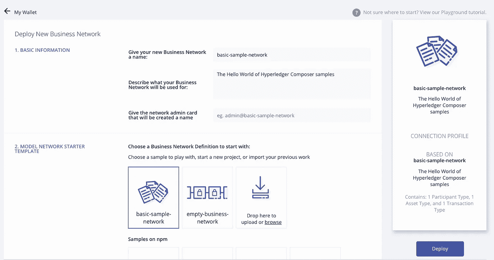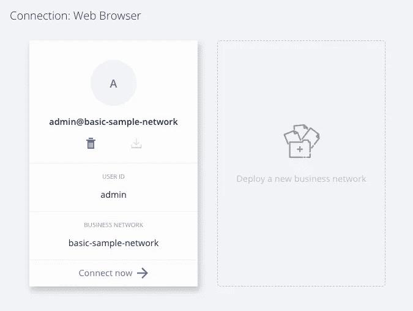

转到
models/sample.cto 并复制此内容

```
/*
 * Licensed under the Apache License, Version 2.0 (the "License");
 * you may not use this file except in compliance with the License.
 * You may obtain a copy of the License at
 *
 * [http://www.apache.org/licenses/LICENSE-2.0](http://www.apache.org/licenses/LICENSE-2.0)
 *
 * Unless required by applicable law or agreed to in writing, software
 * distributed under the License is distributed on an "AS IS" BASIS,
 * WITHOUT WARRANTIES OR CONDITIONS OF ANY KIND, either express or implied.
 * See the License for the specific language governing permissions and
 * limitations under the License.
 *//**
 * Sample business network definition.
 */
namespace org.acme.sampleasset Account identified by accountId {
  o String accountId
  --> Customer owner
  o Double balance
}participant Customer identified by customerId {
  o String customerId
  o String firstName
  o String lastName
}transaction AccountTransfer {
  --> Account from
  --> Account to
  o Double amount
}
```

转到 lib/sample.js 并复制该内容

```
/*
 * Licensed under the Apache License, Version 2.0 (the "License");
 * you may not use this file except in compliance with the License.
 * You may obtain a copy of the License at
 *
 * [http://www.apache.org/licenses/LICENSE-2.0](http://www.apache.org/licenses/LICENSE-2.0)
 *
 * Unless required by applicable law or agreed to in writing, software
 * distributed under the License is distributed on an "AS IS" BASIS,
 * WITHOUT WARRANTIES OR CONDITIONS OF ANY KIND, either express or implied.
 * See the License for the specific language governing permissions and
 * limitations under the License.
 *//* global getAssetRegistry getFactory emit *//**
 * Transfer funds from one account to another.
 * [@param](http://twitter.com/param) {org.acme.sample.AccountTransfer} accountTransfer The account transaction instance.
 * [@transaction](http://twitter.com/transaction)
 */
async function accountTransfer(accountTransfer) {  // eslint-disable-line no-unused-vars
  if (accountTransfer.from.balance < accountTransfer.amount) {
    throw new Error('Insufficient funds!');
  }accountTransfer.from.balance -= accountTransfer.amount;
  accountTransfer.to.balance += accountTransfer.amount;

  return getAssetRegistry('org.acme.sample.Account')
   .then(function (assetRegistry) {
     return assetRegistry.update(accountTransfer.from);
   })
   .then(function () {
     return getAssetRegistry('org.acme.sample.Account');
   })
   .then(function (assetRegistry) {
     return assetRegistry.update(accountTransfer.to);
   })
}
```

转到权限文件并编辑内容

```
/*
 * Licensed under the Apache License, Version 2.0 (the "License");
 * you may not use this file except in compliance with the License.
 * You may obtain a copy of the License at
 *
 * [http://www.apache.org/licenses/LICENSE-2.0](http://www.apache.org/licenses/LICENSE-2.0)
 *
 * Unless required by applicable law or agreed to in writing, software
 * distributed under the License is distributed on an "AS IS" BASIS,
 * WITHOUT WARRANTIES OR CONDITIONS OF ANY KIND, either express or implied.
 * See the License for the specific language governing permissions and
 * limitations under the License.
 *//**
 * Sample access control list.
 */
rule EverybodyCanReadEverything {
    description: "Allow all participants read access to all resources"
    participant: "org.acme.sample.Customer"
    operation: READ
    resource: "org.acme.sample.*"
    action: ALLOW
}rule EverybodyCanSubmitTransactions {
    description: "Allow all participants to submit transactions"
    participant: "org.acme.sample.Customer"
    operation: CREATE
    resource: "org.acme.sample.AccountTransfer"
    action: ALLOW
}rule OwnerHasFullAccessToTheirAssets {
    description: "Allow all participants full access to their assets"
    participant(p): "org.acme.sample.Customer"
    operation: ALL
    resource(r): "org.acme.sample.Account"
    condition: (r.owner.getIdentifier() === p.getIdentifier())
    action: ALLOW
}rule SystemACL {
    description: "System ACL to permit all access"
    participant: "org.hyperledger.composer.system.Participant"
    operation: ALL
    resource: "org.hyperledger.composer.system.**"
    action: ALLOW
}rule NetworkAdminUser {
    description: "Grant business network administrators full access to user resources"
    participant: "org.hyperledger.composer.system.NetworkAdmin"
    operation: ALL
    resource: "**"
    action: ALLOW
}rule NetworkAdminSystem {
    description: "Grant business network administrators full access to system resources"
    participant: "org.hyperledger.composer.system.NetworkAdmin"
    operation: ALL
    resource: "org.hyperledger.composer.system.**"
    action: ALLOW
}
```

如果你有问题，你可以从 github 导入

[](https://github.com/yangnana11/hyperledger-composer-basic-sample-network) [## yang nana 11/hyperledger-composer-基本-示例-网络

### GitHub 是人们构建软件的地方。超过 2800 万人使用 GitHub 来发现、分享和贡献超过…

github.com](https://github.com/yangnana11/hyperledger-composer-basic-sample-network) 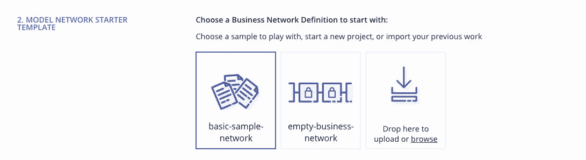

# 测试

转到测试选项卡，客户，创建新参与者

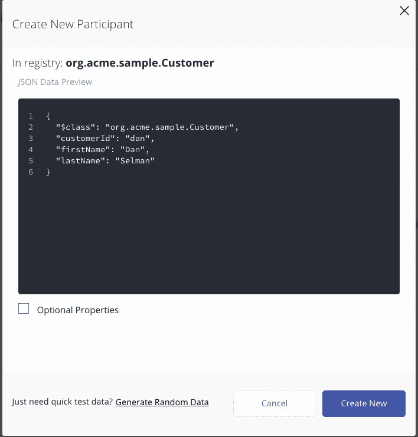

然后再创建一个名为西蒙·斯通的客户

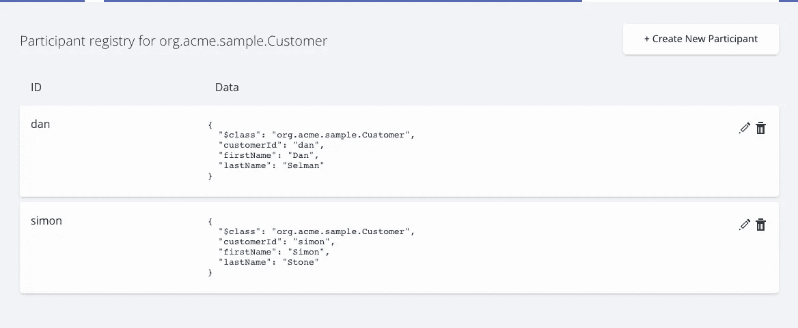

然后创建两个帐户

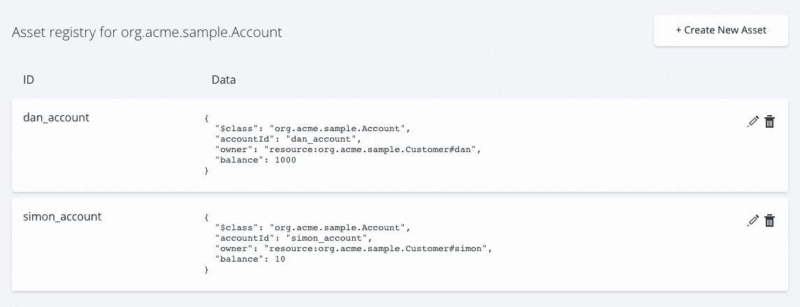

然后提交交易

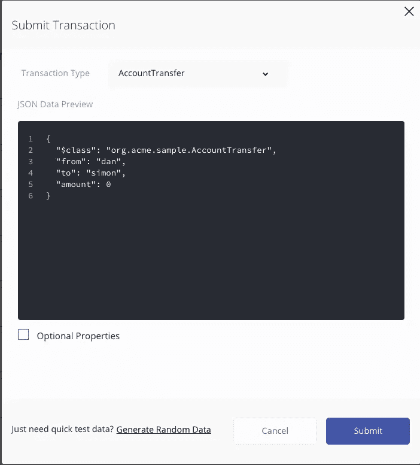

现在我们去结帐并核对余额。钱已经被转移了！干得好，~^^

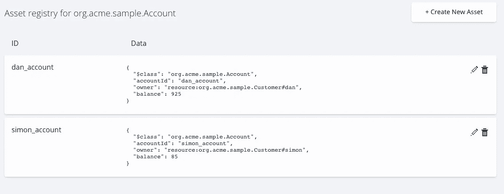

# 使用 REST API 运行

## 第一步:创建网络名片

```
yo hyperledger-composer:businessnetwork
```

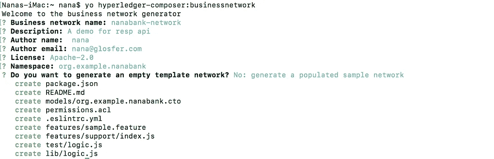

转到 nana bank-网络文件夹

logic.js

```
/** Licensed under the Apache License, Version 2.0 (the "License");* you may not use this file except in compliance with the License.* You may obtain a copy of the License at** http://www.apache.org/licenses/LICENSE-2.0** Unless required by applicable law or agreed to in writing, software* distributed under the License is distributed on an "AS IS" BASIS,* WITHOUT WARRANTIES OR CONDITIONS OF ANY KIND, either express or implied.* See the License for the specific language governing permissions and* limitations under the License.*/'use strict';/*** Write your transction processor functions here*//*** Sample transaction* @param {org.example.nanabank.AccountTransfer} accountTransfer* @transaction*/async function accountTransfer(accountTransfer) {  // eslint-disable-line no-unused-varsif (accountTransfer.from.balance < accountTransfer.amount) {throw new Error('Insufficient funds!');}accountTransfer.from.balance -= accountTransfer.amount;accountTransfer.to.balance += accountTransfer.amount;return getAssetRegistry('org.example.nanabank.Account').then(function (assetRegistry) {return assetRegistry.update(accountTransfer.from);}).then(function () {return getAssetRegistry('org.example.nanabank.Account');}).then(function (assetRegistry) {return assetRegistry.update(accountTransfer.to);})}
```

模型

```
/** Licensed under the Apache License, Version 2.0 (the "License");* you may not use this file except in compliance with the License.* You may obtain a copy of the License at** http://www.apache.org/licenses/LICENSE-2.0** Unless required by applicable law or agreed to in writing, software* distributed under the License is distributed on an "AS IS" BASIS,* WITHOUT WARRANTIES OR CONDITIONS OF ANY KIND, either express or implied.* See the License for the specific language governing permissions and* limitations under the License.*//*** Write your model definitions here*/namespace org.example.nanabankasset Account identified by accountId {o String accountId--> Customer ownero Double balance}participant Customer identified by customerId {o String customerIdo String firstNameo String lastName}transaction AccountTransfer {--> Account from--> Account too Double amount}
```

许可

```
/** Licensed under the Apache License, Version 2.0 (the "License");* you may not use this file except in compliance with the License.* You may obtain a copy of the License at** http://www.apache.org/licenses/LICENSE-2.0** Unless required by applicable law or agreed to in writing, software* distributed under the License is distributed on an "AS IS" BASIS,* WITHOUT WARRANTIES OR CONDITIONS OF ANY KIND, either express or implied.* See the License for the specific language governing permissions and* limitations under the License.*//*** Sample access control list.*/rule EverybodyCanReadEverything {description: "Allow all participants read access to all resources"participant: "org.example.nanabank.Customer"operation: READresource: "org.example.nanabank.*"action: ALLOW}rule EverybodyCanSubmitTransactions {description: "Allow all participants to submit transactions"participant: "org.example.nanabank.Customer"operation: CREATEresource: "org.example.nanabank.AccountTransfer"action: ALLOW}rule OwnerHasFullAccessToTheirAssets {description: "Allow all participants full access to their assets"participant(p): "org.example.nanabank.Customer"operation: ALLresource(r): "org.example.nanabank.Account"condition: (r.owner.getIdentifier() === p.getIdentifier())action: ALLOW}rule SystemACL {description:  "System ACL to permit all access"participant: "org.hyperledger.composer.system.Participant"operation: ALLresource: "org.hyperledger.composer.system.**"action: ALLOW}rule NetworkAdminUser {description: "Grant business network administrators full access to user resources"participant: "org.hyperledger.composer.system.NetworkAdmin"operation: ALLresource: "**"action: ALLOW}rule NetworkAdminSystem {description: "Grant business network administrators full access to system resources"participant: "org.hyperledger.composer.system.NetworkAdmin"operation: ALLresource: "org.hyperledger.composer.system.**"action: ALLOW}
```

> 如果出现问题，您可以通过键入以下命令从头再做一次:

```
rm -rf ~/.composer
```

奔跑

```
composer archive create -t dir -n .
```

安装 PeerAdmin

```
./startFabric.sh
./createPeerAdminCard.sh
```

然后

```
composer network install --card PeerAdmin@hlfv1 --archiveFile nanabank-network@0.0.1.bnacomposer network start --networkName nanabank-network --networkVersion 0.0.1 --networkAdmin admin --networkAdminEnrollSecret adminpw --card PeerAdmin@hlfv1 --file networkadmin.cardcomposer card import --file networkadmin.card
```

测试部署:

```
composer network ping --card admin@nanabank-network
```

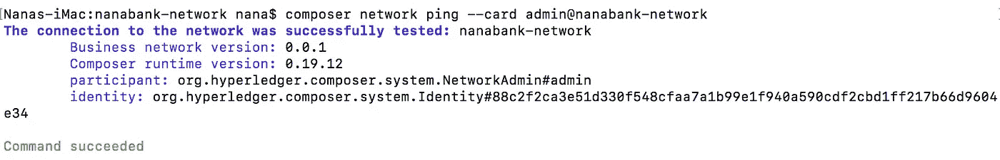

运行 REST 服务器

```
composer-rest-server
```

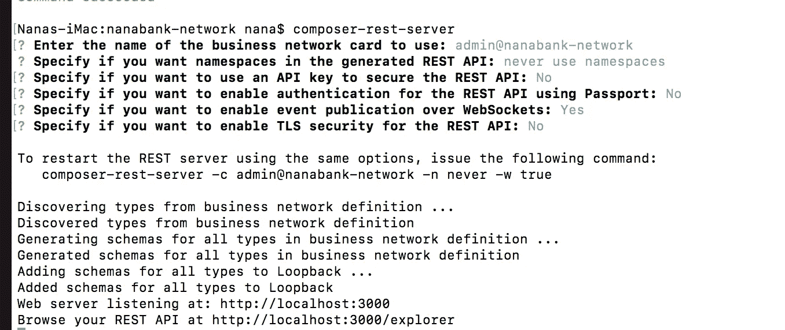

玩耍的时间到了

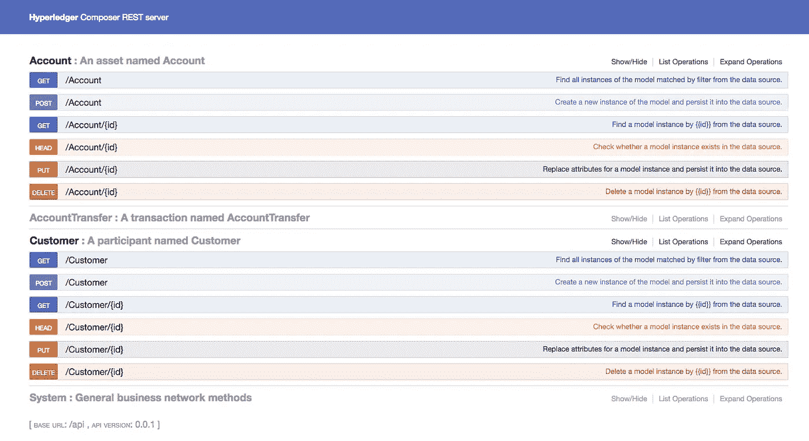

创建两个客户

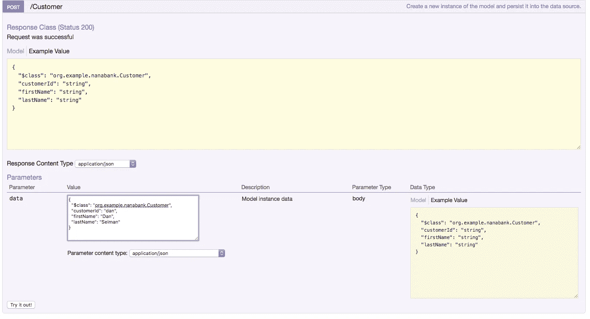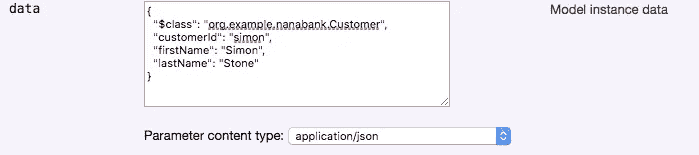

尝试进行测试:

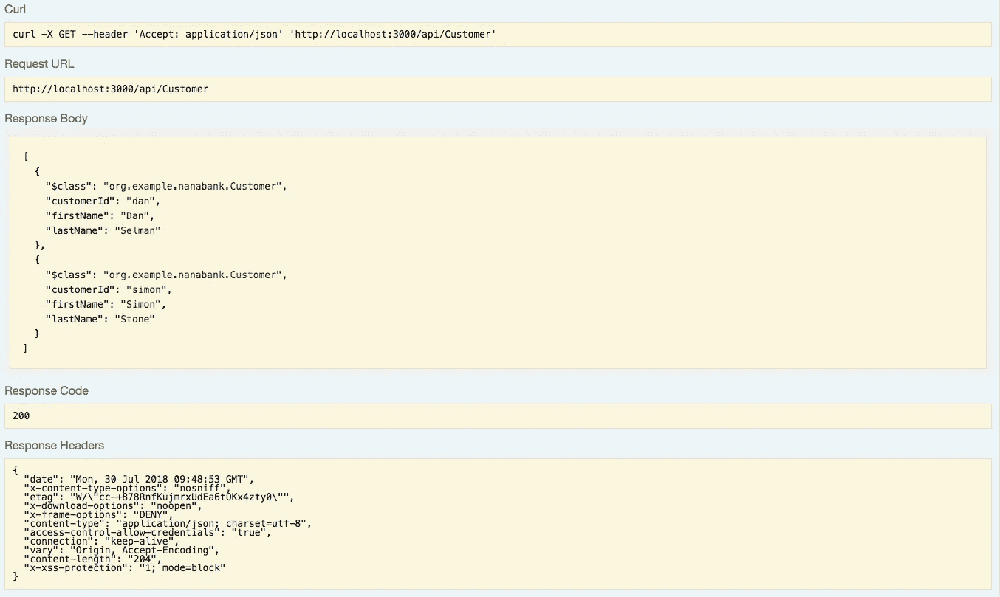

然后创建帐户 dan_account 和 simon_account

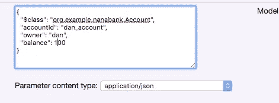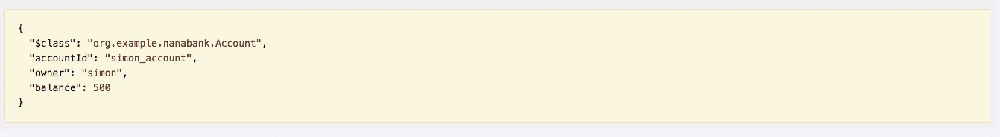

尝试获取列表:

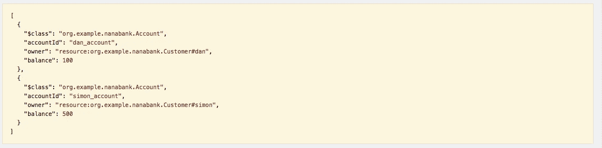

那就转账！

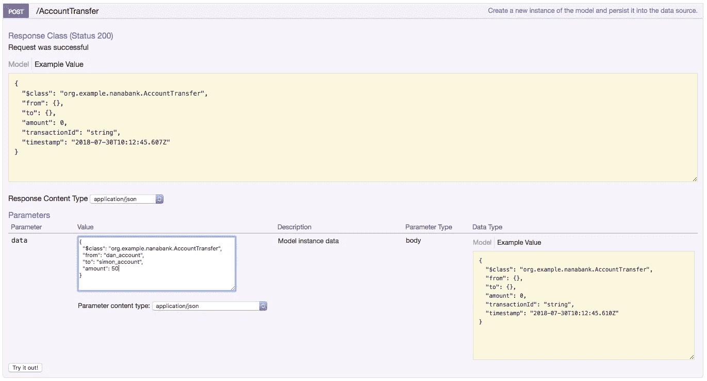

然后，如果你再次得到帐户清单，你可以看到平衡改变

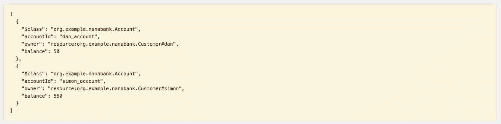

> [在您的收件箱中直接获得最佳软件交易](https://coincodecap.com/?utm_source=coinmonks)

[](https://coincodecap.com/?utm_source=coinmonks)