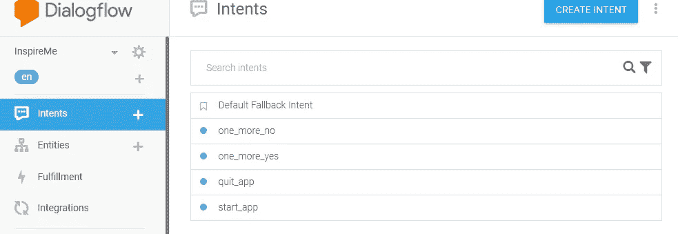

# 开发一个具有 NodeJs、Dialogflow 和 Firebase 功能的谷歌助手应用程序

> 原文：<https://medium.com/coinmonks/developing-a-google-assistant-app-with-nodejs-dialogflow-firebase-functions-c2032a9cda63?source=collection_archive---------0----------------------->

# 什么是谷歌助手？

谷歌助理是谷歌开发的虚拟个人助理，可用于各种设备，如手机、智能家居设备、智能手表、电视甚至网络。它可以进行双向对话，也可以完全用语音工作。

## 它能做什么？

有了这个助手，你可以控制智能家居设备，用你的声音完成手机上的大部分功能，比如打电话、发短信等等，播放内容，还可以和应用程序互动。它也有一些例程，这些例程是可以用一个命令完成的一系列事情。因此，现有内容可以打包到一个助手应用程序中，或者可以使用模板或通过编写自定义应用程序来构建应用程序，而无需编写任何代码。

## 如何为谷歌助手开发定制应用？

为了更加灵活，我们还可以使用 Google 提供的 API 来开发应用程序。我们可以使用的两个 API 是 Actions SDK 和 Dialogflow

使用 actions SDK，您的应用程序可以执行操作。动作定义了应用程序功能的入口点，并将描述动作的意图映射到处理意图的实现。实现以字符串形式获取用户输入，处理输入并提供响应。这种相互作用一直持续到动作完成。

Dialogflow 是一个对话平台，允许您通过包装 Actions SDK 的功能并提供其他功能(如易于使用的 IDE、自然语言理解(NLU)、机器学习等)来设计和构建操作。因此，它位于 actions SDK 之上，并与 actions SDK 一起工作。

# 开发应用程序

这里我将展示如何使用 Dialogflow API 创建一个名为 InspireMe 的应用程序。用户可以与这个应用程序交谈，以获得鼓舞人心的报价和段落。

app 的流程是这样的。


用户向 Google Assistant 指定意向或明确要求使用应用程序→触发应用程序的欢迎意向→触发意向的履行→履行选择一个报价并在响应中返回→在响应中播放该报价->用户可以选择收听另一个报价或结束对话→如果用户选择是->选择并播放另一个报价->当用户说否->应用程序祝用户愉快，流程结束。

## 设计一个对话

这是一个对话的例子。

**默认流量:**

用户:嘿，谷歌告诉我一些鼓舞人心的名言/激励名言/鼓舞人心的名言

或者如果用户已经知道这个应用，他可以通过名字来询问

用户:嘿，谷歌，和 LitInspire 谈谈吧

App:欢迎来到 Lit Inspire。用伟大的名言和鼓舞人心的段落，我会激励你。

这里有一个引语:真正的艺术家之船——这是史蒂夫·乔布斯说的，他要求我们与世界分享我们的作品，不要退缩。

你想听另一段引言吗？

用户:是的，请

App:这里还有一个。<another quote="">。你想再听一首吗？</another>

用户:当然

应用:太好了。这里有另一句话。<another quote="">。你想再听一个吗？</another>

用户:不用了，谢谢。

应用:希望你受到鼓舞，迎接挑战。祝你今天开心！玩的开心！

用户可以随时通过说“取消”来取消。

## 创建项目并定义操作

要创建项目，您应该首先在谷歌控制台的操作中设置一个项目。


然后选择您的应用程序所属的类别。它将显示一个表单，要求您选择默认的调用短语，即用户可以明确要求并保存的应用程序的名称。

接下来点击“操作”菜单，系统将提示您构建第一个操作。当你点击它的时候，你会看到一个有很多内置动作和自定义动作的菜单。内置操作帮助您基于模板构建应用程序，您也可以稍后进行定制。在这里，我们将进行自定义操作。选择“自定义操作”，然后单击“生成”。

您将被重定向到 dialogflow 控制台。



Dialogflow console

这是将用户查询映射到意图并调用特定操作的代理。

如果您看到上面的对话，用户首先会通过询问特定的报价或询问应用程序的名称来启动应用程序。

所以最初的意图可能是 start_app，当被问及谷歌的名字是否与我们的应用程序的调用短语(告诉我一个鼓舞人心的引语)匹配时，就会触发 start _ app。

所以创建一个名为“start_app”的意图并保存

它给出了下面要输入的选项

*语境:*语境是联系会话的一种方式。让我们稍后再来讨论这个问题。

*事件:*事件是无需匹配文本即可进入应用的方式。即通过直呼名字进入应用程序的方式。选择“欢迎”和“谷歌助手欢迎”，这表示当用户要求使用该应用程序时，start_app 意图被触发。

*动作和参数:*指定当指定该意图时应触发的动作。Dialogflow 还可以在完成操作之前，通过提问来获得所需的所有参数。因此，在此屏幕中，您可以指定操作以及以后使用的参数名称。例如，如果您想听某一特定类别的报价，您可以将其作为一个参数。目前，该应用程序只显示任何类别的报价，因此该应用程序中没有参数。所以只需指定一个操作名称。

*训练短语:*训练短语是用户可以说出的短语，以匹配该意图，而无需询问应用程序的名称。例如，告诉我一个激励人心的报价，告诉我一个鼓舞人心的报价，给我一些灵感，告诉我一个报价等。输入不同种类的训练短语，所有不同的方式，用户可以要求报价等。

*回复:*本部分可用于提供硬编码回复。您可以在此处输入一些报价，如果我们的服务失败，将会用到这些报价。如果您想在这里结束对话，您可以选择“结束对话”滑块。在这个例子中，我们不需要硬编码的响应，所以不要选择这个。

*Fulfillment:* 如果我们想要创建一个可以提供用户响应而不是硬编码的履行服务，就使用这个选项。在本例中，我们希望使用履行服务。因此选择“为此目的启用 webhook 调用”。稍后，当我们准备好履行服务时，我们可以在“履行”部分输入履行 url。

此操作将播放介绍，并返回一个报价。之后，它要求用户要么听另一个报价或退出。所以我们还需要两个意图，一个在用户说“是”时处理，一个在用户说“否”时处理。

***语境:*** 虽然这里只有一个问题用户可能会回答“是”，但用户可能会在对话中对不同的问题说“是”，但我们的应用程序应该知道用户在哪个语境中说“是”。因此，当用户说“是”时，因为应用程序知道用户所处的上下文，所以它只会匹配该上下文的操作，而不是所有将“是”作为触发短语的意图。

所以，创造新的意向，一个是一个是，一个是一个不是。

在 one_more_yes 中，只有当他在 one_more 上下文中说 yes 时，也就是说，在他已经听了第一个引语并想听更多之后，我们才想听。因此，在 contexts 部分，将输入上下文设置为 one_more 并保存。将训练短语设置为肯定回答的变体，如肯定、绝对、肯定、请等。同时启用 webhook 调用以实现。将操作设置为与目的名称相同。

对一个多一个没有的意图做同样的事情。将输入上下文设置为 one_more，将训练短语设置为 no 的变体，并启用 webhook 调用以实现。将操作设置为与目的名称相同。

*回退意图:*接下来，用户可能会说一些与应用程序完全无关的话，我们应该有一种处理方式。谷歌已经提供了“默认后备意图”。打开它，设置一个动作名，如 input.unknown，并启用 fulfillment，以便我们可以在服务中处理它。

这应该涵盖我们的应用程序所必需的所有意图。接下来让我们构建履行服务。

## 建立履行

履行服务应该接受来自 Dialogflow 的 POST 请求，其中包含匹配的意向详细信息。您的服务应该按照 Dialogflow V2 规范处理请求并返回响应。

[](https://dialogflow.com/docs/fulfillment) [## 履行|对话流

### 如果您在代码编辑器之外修改您的函数，您将无法再使用 Dialogflow 编辑器来修改您的云…

dialogflow.com](https://dialogflow.com/docs/fulfillment) 

我们可以使用任何语言来创建服务，但 Dialogflow 提供了一个基于 NodeJS 的 fulfillment SDK，这将使我们的工作变得非常容易。所以我们将使用 NodeJS SDK。


我们的履行服务将是一个 firebase 的谷歌云功能。Firebase 的云功能允许您自动运行后端代码，以响应由 Firebase 特性和 HTTPS 请求触发的事件。你的代码存储在谷歌的云中，在一个托管的环境中运行。没有必要管理和扩展您自己的服务器。

[](https://firebase.google.com/docs/functions/) [## Firebase | Firebase 的云函数

### 在许多情况下，开发人员更喜欢控制服务器上的应用程序逻辑，以避免在客户端篡改…

firebase.google.com](https://firebase.google.com/docs/functions/) 

云功能运行 Node 6 . 14 . 0，所以安装 node v6.14 或更高版本。

[https://nodejs.org/en/download/](https://nodejs.org/en/download/)

一旦安装了 nodejs，按照这里的说明设置 firebase cli

[](https://firebase.google.com/docs/functions/get-started) [## 开始:编写和部署您的第一个函数| Firebase

### 要开始使用云函数，请尝试完成本教程，它从必需的设置任务和…

firebase.google.com](https://firebase.google.com/docs/functions/get-started) 

这些步骤是

1.  安装 firebase-cli。在许多情况下，只有最新版本的 Firebase CLI 和`**firebase-functions**` SDK 才提供新功能和错误修复。所以首先安装最新版本的 firebase-functions 和 firebase-admin

```
npm install firebase-functions@latest firebase-admin@latest --save
npm install -g firebase-tools
```

2.安装完依赖项后，执行以下操作来初始化项目

a.运行`firebase login`通过浏览器登录并验证 firebase 工具。

b.转到您的 Firebase 项目目录。

c.跑`firebase init`。该工具为您提供了安装 npm 依赖项的选项。我们将为函数选择函数，并托管任何公共文件。init 工具将引导通过各种选项来选择语言，以及函数和宿主的初始化选项

```
myproject
 +- .firebaserc    # Hidden file that helps you quickly switch between
 |                 # projects with `firebase use`
 |
 +- firebase.json  # Describes properties for your project
 |
 +- functions/     # Directory containing all your functions code
      |
      +- .eslintrc.json  # Optional file containing rules for JavaScript linting.
      |
      +- package.json  # npm package file describing your Cloud Functions code
      |
      +- index.js      # main source file for your Cloud Functions code
      |
      +- node_modules/ # directory where your dependencies (declared in
                       # package.json) are installed
```

一旦项目初始化，我们就可以开发我们的功能。

这是我们所拥有的依赖项的 package.json。我们正在使用 google 上的 actions、firebase-admin、firebase-functions 和 google cloud datastore。我们在林挺用的是 es-lint。代码[林挺](https://en.wikipedia.org/wiki/Lint_(software))是一种静态分析，经常被用来发现有问题的模式或不符合特定风格指南的代码。

```
{
  "name": "functions",
  "description": "Cloud Functions for Firebase",
  "scripts": {
    "lint": "eslint --fix \"**/*.js\"",
    "start": "firebase serve",
    "deploy": "firebase deploy",
    "test": "npm run lint"
  },
  "dependencies": {
    "[@google](http://twitter.com/google)-cloud/datastore": "1.1.0",
    "actions-on-google": "^2.0.0",
    "ajv": "^5.0.0",
    "firebase-admin": "^5.11.0",
    "firebase-functions": "^1.0.0"
  },
  "devDependencies": {
    "eslint": "^4.19.1",
    "eslint-config-google": "^0.9.1"
  },
  "private": true,
  "version": "0.0.1"
}
```

接下来让我们看看函数。当用户通过名称调用应用程序，或者 google 将请求与我们的任何意图匹配时，它会向我们的应用程序发送一个带有意图和其他参数的请求。在我们的函数中，我们将为每个意图实现回调函数。

```
 'use strict';
//Initialize librariesconst {dialogflow} = require('actions-on-google');
const functions = require('firebase-functions');
const Datastore = require('[@google](http://twitter.com/google)-cloud/datastore');
const {
  SimpleResponse,
  BasicCard,
  Image,
  Suggestions,
  Button
} = require('actions-on-google');// Instantiate a datastore client
const datastore = Datastore(); const app = dialogflow({debug: true});app.middleware((conv) => {

  });//Setup contextsconst Contexts = {
    ONE_MORE: 'one_more'
  };app.intent('quit_app', (conv) => {
    conv.close("Have a good day! come back again. Bye!");
  });app.intent('start_app', (conv) => {
    conv.contexts.set(Contexts.ONE_MORE,5);
    const initMessage = ` Welcome to LitInspire. With great quotes and inspiring passages, I will inspire you.`;return  getQuote().then((entity)=>{
         return getMessageFromQuote(entity,initMessage,conv);
    });

  });app.intent('one_more_yes', (conv) => {
    conv.contexts.set(Contexts.ONE_MORE,3);
      const initMessage = `Great! Here is another one.`;

    return  getQuote().then((entity)=>{
      return getMessageFromQuote(entity,initMessage,conv);
  });

  });app.intent('one_more_no', (conv) => {
    conv.close("Hope you're inspired and ready to take on your challenges. Have a good day and come back for more.");
});app.intent('Default Fallback Intent', (conv) => {
    console.log(conv.data.fallbackCount);
    if (typeof conv.data.fallbackCount !== 'number') {
      conv.data.fallbackCount = 0;
    }
    conv.data.fallbackCount++;
    // Provide two prompts before ending game
    if (conv.data.fallbackCount === 1) {
      conv.contexts.set(Contexts.ONE_MORE,2);
      return conv.ask(new Suggestions('Yes Please', 'No thanks'), new SimpleResponse("Would you like to hear a quote?"));
    }else if(conv.data.fallbackCount === 2){
      return conv.ask(new Suggestions('Yes Please', 'No thanks'), new SimpleResponse("Welcome to LitInspire. With great quotes and inspiring passages, I will inspire you.Would you like to hear a quote?"));
    }
   return conv.close("This isn't working.Have a good day. Bye! ");
});function getRandomNumber(){return  Math.floor((Math.random()*num_quotes)+1);
}function buildReadableQuoteFromEntity(entity){
  let readableQuote =  entity.quote + 
     `<break time="1s"/> This was said by ` + entity.author + ` `  ;
     if(entity.comments){
       readableQuote +=  entity.comments + ` `;
     }
     return readableQuote;
}function getViewableQuote(entity){
  let viewableQuote =  entity.quote + 
     `.This was said by ` + entity.author + ` `  ;
     if(entity.comments){
      viewableQuote +=  entity.comments + ` `;
     }
     return viewableQuote;
}function getEndingMessage(){
return `  <audio src="[https://actions.google.com/sounds/v1/water/waves_crashing_on_rock_beach.ogg](https://actions.google.com/sounds/v1/water/waves_crashing_on_rock_beach.ogg)" clipBegin="10s" clipEnd="13s">Consider the quote!</audio>
     Do you want to listen to another quote?`;
}function getEndingMessageText(){
  return `.Do you want to listen to another quote?`;
  }function getMessageFromQuote(entity,initMessage,conv){
  return conv.ask(new Suggestions('Yes Please', 'No thanks'), new SimpleResponse(initMessage),
  new SimpleResponse( {text: getViewableQuote(entity) + getEndingMessageText(),
speech: `<speak> ` +  buildReadableQuoteFromEntity(entity)   + getEndingMessage() + ` </speak>  ` }));
 }function getQuote(){
  return new Promise(((resolve,reject) => {
    let randomQuoteNum = getRandomNumber();
  console.log("the id of the quote is: quote_"+randomQuoteNum);
  const key = datastore.key(['quote', 'quote_'+randomQuoteNum]);
  console.log("Querying datastore for the quote..."+key);
  let readableQuote = '';
  datastore.get(key,(err,entity) => {
    if(!err){
      console.log('entity:'+entity.quote);
    resolve(entity);
    }else{
     reject(console.log('Error occured'));
    }
  });
  }));
}// HTTP Cloud Function for Firebase handler
exports.InspireMe = functions.https.onRequest(app);
```

让我们看看 start_app 的意图处理程序。首先，因为我们在应用程序中，我们希望用户能够要求多个报价。因为是在 one_more 上下文中，所以我们将上下文设置为 one_more。接下来，我们需要得到一个报价并返回它。我们将报价存储在谷歌云数据库中。因此，我们调用数据存储来返回一个随机报价。

```
app.intent('start_app', (conv) => {
    conv.contexts.set(Contexts.ONE_MORE,5);
    const initMessage = ` Welcome to LitInspire. With great quotes and inspiring passages, I will inspire you.`;return  getQuote().then((entity)=>{
         return getMessageFromQuote(entity,initMessage,conv);
    });

  });
```

getQuote()函数返回带有报价的承诺。在意图处理程序中，我们使用。promise 的 then()函数从 quote 构建消息并返回它。在 getMessageFromQuote()方法中，我们可以看到将多个响应连接在一起并返回它。这里我们使用 **ask 方法**，它告诉用户我们的报价并等待用户的响应。在这个方法中，我们可以传递建议，最多两个简单的响应。简单的响应将文本转换成语音。我们使用 [SSML](https://developers.google.com/actions/reference/ssml) (语音合成标记语言)来指定如何生成语音。使用 SSML，我们可以指定在哪里暂停，并在文本中添加音乐。还有其他类型的响应，如基本的卡片、图像、按钮和列表(转盘)响应。

```
function getMessageFromQuote(entity,initMessage,conv){
  return conv.ask(new Suggestions('Yes Please', 'No thanks'), new SimpleResponse(initMessage),
  new SimpleResponse( {text: getViewableQuote(entity) + getEndingMessageText(),
speech: `<speak> ` +  buildReadableQuoteFromEntity(entity)   + getEndingMessage() + ` </speak>  ` }));
 }
```

另外两件事是如何结束对话和如何处理未知输入。在下面的函数中，您可以看到当用户说不时，我们使用 conv.close()函数以一条消息结束对话。

```
app.intent('one_more_no', (conv) => {
    conv.close("Hope you're inspired and ready to take on your challenges. Have a good day and come back for more.");
});
```

当用户提供未知输入时，google 调用默认的回退功能。让我们看看。我们给了用户两次选择，是否听一个报价。如果用户两次都没有给出有效的回应，我们就结束对话。

```
app.intent('Default Fallback Intent', (conv) => {
    console.log(conv.data.fallbackCount);
    if (typeof conv.data.fallbackCount !== 'number') {
      conv.data.fallbackCount = 0;
    }
    conv.data.fallbackCount++;
    // Provide two prompts before ending game
    if (conv.data.fallbackCount === 1) {
      conv.contexts.set(Contexts.ONE_MORE,2);
      return conv.ask(new Suggestions('Yes Please', 'No thanks'), new SimpleResponse("Would you like to hear a quote?"));
    }else if(conv.data.fallbackCount === 2){
      return conv.ask(new Suggestions('Yes Please', 'No thanks'), new SimpleResponse("Welcome to LitInspire. With great quotes and inspiring passages, I will inspire you.Would you like to hear a quote?"));
    }
   return conv.close("This isn't working.Have a good day. Bye! ");
});
```

现在就是这样。我们已经为所有可能的意图编写了意图处理程序，还编写了后备处理程序。现在可以测试了。

使用 firebase deploy 命令将函数部署到 firebase 函数。

```
firebase deploy
```

一旦部署，你会得到一个功能的网址。转到 dialogflow 控制台，转到履行菜单项，并提供功能 url 作为履行 url。


Enter fulfilment

## 测试应用程序

输入完成 url 后，您可以在控制台右侧的 dialogflow 控制台或 google assistant 中进行测试。

要在 google assistant 中进行测试，请在 dialogflow 控制台中点击“集成”，然后选择“Google Assistant”。在下一个屏幕上，选择“测试”。

它会打开一个这样的测试窗口。


我们可以在这里测试你们每个人的意图。我们还可以看到请求和响应以及可能遇到的任何错误。

例如，在这个应用程序中，当我要求“与 LitInspire 交谈”时，它将检索一个报价并显示在模拟器上。它还会按照 SSML 中的规定，以适当的停顿来阅读报价。它还会显示建议的回复。我们可以点击建议的回复来测试对话的下一部分。

我们还可以通过模拟器上的链接来查看日志。我们还可以看到请求和响应以及异常堆栈跟踪。在 google 云平台日志控制台中，您可以选择正确的应用程序(google app 上的操作或云功能)来查看相应级别的日志。

一旦我们验证了快乐路径、备用路径和对话，并且对结果感到满意，我们就可以提交应用程序进行审批。

**提交应用程序进行审批**

为了准备批准的应用程序，我们必须提供更多的细节，以便应用程序可以在目录中可见。我们可以提供一个简短的描述，更多的细节和调用短语与应用程序交谈。

我们还必须提供两种不同尺寸的图像。我用 canva 应用程序创建了这些图像。我们必须提供一个横幅图像和一个标志


接下来，我们必须创建一个隐私策略。

谷歌提供了一个样本文件，我们可以复制和编辑，以创建我们自己的隐私政策。你可以在这里查看我的隐私政策。

Lit Inpsire Privacy Policy.

接下来，我们可以选择应用程序所属的类别以及其他有助于查看的详细信息。我们还可以选择该应用程序可用的国家，以及可以使用该应用程序的设备。然后我们就可以提交 app 审核了。

该应用程序将被审查，如果没有问题，该应用程序将被部署到生产。我们将收到一封电子邮件通知我们同样的情况。这就完成了构建和部署的过程。

**总结**

总之，我们已经了解了如何在 google app 上设计、构建和部署动作。总结这些步骤，它们是

设计一个对话

创建项目并定义操作

构建履行服务

测试动作

准备部署并提交。

谢谢你陪着我。希望这对你有帮助。如果您有任何问题，请随时联系我们。你可以在这里发表评论或者通过 twitter @thisisananth 联系我

> 加入 Coinmonks [电报频道](https://t.me/coincodecap)和 [Youtube 频道](https://www.youtube.com/c/coinmonks/videos)获取每日[加密新闻](http://coincodecap.com/)

## 另外，阅读

*   [复制交易](/coinmonks/top-10-crypto-copy-trading-platforms-for-beginners-d0c37c7d698c) | [加密税务软件](/coinmonks/crypto-tax-software-ed4b4810e338)
*   [网格交易](https://coincodecap.com/grid-trading) | [加密硬件钱包](/coinmonks/the-best-cryptocurrency-hardware-wallets-of-2020-e28b1c124069)
*   [密码电报信号](http://Top 4 Telegram Channels for Crypto Traders) | [密码交易机器人](/coinmonks/crypto-trading-bot-c2ffce8acb2a)
*   [最佳加密交易所](/coinmonks/crypto-exchange-dd2f9d6f3769) | [印度最佳加密交易所](/coinmonks/bitcoin-exchange-in-india-7f1fe79715c9)
*   [面向开发人员的最佳加密 API](/coinmonks/best-crypto-apis-for-developers-5efe3a597a9f)
*   最佳[密码借贷平台](/coinmonks/top-5-crypto-lending-platforms-in-2020-that-you-need-to-know-a1b675cec3fa)
*   杠杆代币的终极指南
*   [AscendEx Staking](https://coincodecap.com/ascendex-staking)|[Bot Ocean Review](https://coincodecap.com/bot-ocean-review)|[最佳比特币钱包](https://coincodecap.com/bitcoin-wallets-india)
*   [Bitget 评论](https://coincodecap.com/bitget-review) | [双子星 vs BlockFi](https://coincodecap.com/gemini-vs-blockfi) | [OKEx 期货交易](https://coincodecap.com/okex-futures-trading)
*   [美国最佳加密交易机器人](https://coincodecap.com/crypto-trading-bots-in-the-us) | [经常性回顾](https://coincodecap.com/changelly-review)
*   [在印度利用加密套利赚取被动收入](https://coincodecap.com/crypto-arbitrage-in-india)
*   [霍比审核](https://coincodecap.com/huobi-review) | [OKEx 保证金交易](https://coincodecap.com/okex-margin-trading) | [期货交易](https://coincodecap.com/futures-trading)
*   [麻雀交换评论](https://coincodecap.com/sparrow-exchange-review) | [纳什交换评论](https://coincodecap.com/nash-exchange-review)