# 开发代币支付的市场合同

> 原文：<https://medium.com/coinmonks/developing-a-marketplace-contract-with-token-payment-d865323ea88c?source=collection_archive---------0----------------------->

# 介绍

在我之前的文章( [link](/@kctheservant/use-dapp-tools-for-ethereum-contract-development-2775d8b2ba0) )中，我已经展示了 dapps.tools 在 Ethereum 契约开发中的使用，并了解了如何使用 dapp 和 seth 通过测试集执行契约代码的单元测试，并在本地测试网中部署我的契约代码。

在本文中，我首先创建了另一个模拟市场的合同。和部署，我将添加一个令牌作为市场中项目的付款。我使用的令牌来自 ds-token 包，这是一个可铸造的 ERC20 令牌。最后，我们将演示契约函数的执行，并看看我的契约如何与令牌契约交互。

# 应用程序概述

该应用程序是一个模拟市场运作的智能合约。它将某人(卖家)列出的物品按价格标签保存，另一个人(买家)可以通过向卖家支付该价格来购买该物品。它还带有一些检查功能，以查看该商品是否存在或已经售出。同时，买方可以从市场移除该物品，只要该物品还没有被出售给任何人。

在第一阶段，我们将完成这些功能。在第 2 阶段，我们将实施 ERC20 令牌作为该市场中的(唯一)支付方式。

这个应用程序本身绝不是一个完整的生产应用程序，在它成为一个完整的功能之前，还有许多工作要做。然而，这满足了我的目的，即展示如何使用 dapp.tools 构建有趣的东西，并使用 ds-token 包添加令牌。

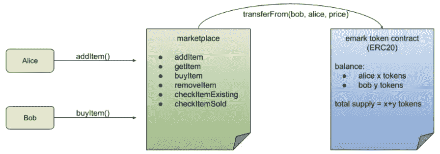

A marketplace application with token payment

# 阶段 1:没有代币支付的市场

为此合同创建工作区。我们将工作区命名为 emarket(目录名)。使用 dapp.tools，我们将拥有一个预定义的合同名称 **Emarket.sol** 和相关的测试合同 **Emarket.t.sol** 。

我们会调查这两份合同文件。然后开始在 testnet 上测试和部署契约。最后，我们将在这个已部署的契约上模拟一些活动。

## 合同:Emarket.sol

这是我在这个演示中使用的契约代码。

数据结构*条目*保存了 emarket 中发布的每个条目的详细信息。它包含一个描述、卖家和买家、价格和一个该商品是否售出的布尔值。注意，价格在这个阶段只是一个数字，稍后在我们实现第二阶段的令牌后，它将是一个令牌的数量。

*项*是从索引到数据结构项的映射。我们简单地维护一个计数器 *itemCount* 来计算索引。

本合同不需要施工方。本合同中定义了六项功能。

*addItem(description，price)* 在卖家在 emarket 中列出一个商品时被调用。我们需要的只是那个项目的描述和价格。这将被记录为索引为 itemCount+1 的新项目。

当任何人希望显示一个项目的细节时，就会调用 getItem(index) 。我们将取回描述和价格。

当任何人希望知道一个项目是否存在时，就会调用 checkedItemExisting(index) 。

*checkedItemSold(index)* 当任何人想知道一件商品是否已经售出时，就会调用这个函数。

*removedItem(index)* 只能由之前列出物品的卖家调用。

*buyItem(index)* 被买家调用。买家只能购买尚未售出的物品。目前，该逻辑只是更新买方地址并标记已售标志。

## 测试合同:Emarket.t.sol

我们已经为我的 emarket 合同定义了四个测试用例。它们是不言自明的，所以这里我们不提供细节。

## 设置工作空间

我们将设置我们的工作区 emarket，如前一篇文章所示。

```
mkdir emarket
cd emarketdapp init
```

在我们粘贴我们的合同 **Emarket.sol** 和测试合同 **Emarket.t.sol** 之后，我们可以使用`dapp test`来执行单元测试。

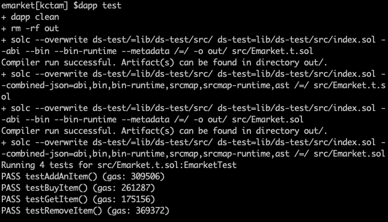

从结果中我们知道所有的测试用例都通过了。

## 运行 Testnet 并部署契约

和以前一样，我们使用`dapp testnet`打开另一个终端来运行 testnet。为了得到更多的两个地址进行演示，我们可以指定`option -- account`。

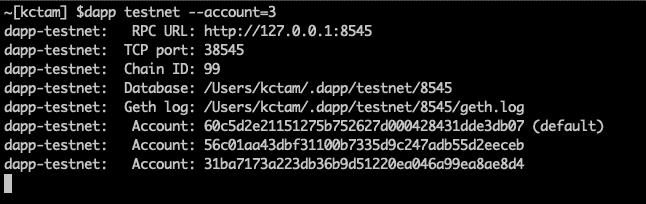

出于演示目的，我们将创建环境变量。我们使用 ETH_FROM 的第一个帐户是 coinbase 帐户。如果我们没有指定任何东西，这是默认帐户。

```
export ETH_KEYSTORE=~/.dapp/testnet/8545/keystore
export ETH_GAS=2000000
export ETH_FROM=0x60c5d2e21151275b752627d000428431dde3db07
export ALICE=0x56c01aa43dbf31100b7335d9c247adb55d2eeceb
export BOB=0x31ba7173a223db36b9d51220ea046a99ea8ae8d4
```

我们使用`dapp create`部署合同。

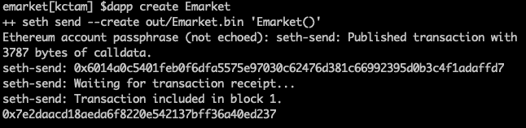

现在我们有了合约地址 0x7e2d…d237。作为一个好的实践，我们使用一个环境变量来保存这个地址。

```
export EMARKET=0x7e2daacd18aeda6f8220e542137bff36a40ed237
```

## 与合同互动

在这个演示中，我们模拟了一个真实的例子。这包括以下步骤。

1.  检查目前市场上还没有任何项目。
2.  Alice 列出了一个项目“一支笔”,并将价格标为 100。检查商品是否在市场中。
3.  鲍勃买了这件物品。检查该商品是否售出，Bob 的地址是否记录正确。
4.  Alice 试图移除此物品，但是失败了，因为此物品已经售出。

第一步:首先让我们看看当前的*项目计数*。

```
seth call $EMARKET “itemCount()”
```

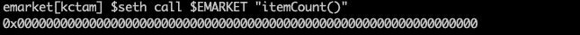

第二步:爱丽丝列出一个项目。

```
seth send $EMARKET “addItem(string memory, uint)” $(seth —-from-ascii “a pen”) $(seth —-to-uint256 100) --from=$ALICE
```

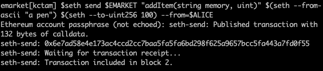

然后查看物品计数和物品#1 的详细信息。

```
seth call $EMARKET “itemCount()”
seth call $EMARKET “items(uint)(string memory,address,address,uint,bool)” $(seth —-to-uint256 1)
```

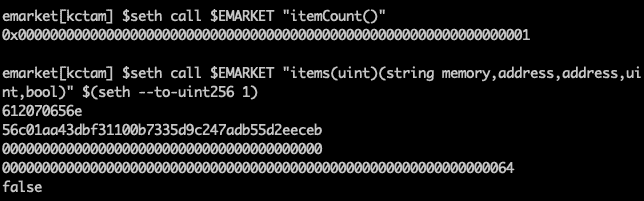

我们可以看到有一个项目，我们看到的描述(“一支笔”在 ascii)，卖方爱丽丝，这个项目还没有出售。

第三步:现在鲍勃买了这件物品(物品#1)。

```
seth send $EMARKET “buyItem(uint)” $(seth —-to-uint256 1) — from=$BOB
```

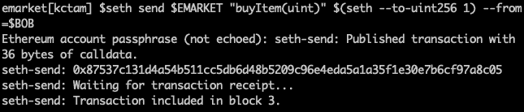

然后我们再次检查第一项。

```
seth call $EMARKET “items(uint)(string memory,address,address,uint,bool)” $(seth —-to-uint256 1)
```

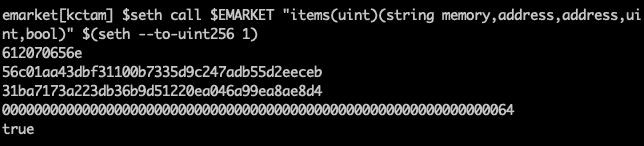

现在我们看到买家地址(Bob 的)被记录，这件物品被标记为真(已售出)。

第四步:爱丽丝试图删除这个项目。她不能，因为这件物品已经售出。

```
seth send $EMARKET “removeItem(uint)” $(seth —-to-uint256 1) —-from=$ALICE
```

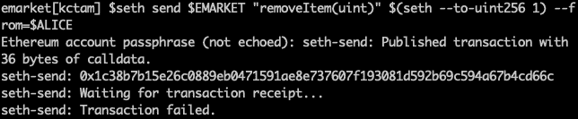

# 阶段 2:以代币作为支付方式的市场

## 创建新的工作区

随着 marketplace 的基本功能就绪，我们现在将包括一个 ERC20 令牌作为该 marketplace 的定价和支付方法。

为了保持整洁，我们在这里创建了另一个工作区，即 emarketwithcoin

```
mkdir emarketwithcoin
cd emarketwithcoindapp init
```

我们正在使用`dapp.tools`中提供的`ds-token`包。`ds-token`是一个标准 ERC20 实现包，加上一些额外的功能，如 *mint()* 和 *burn()* 。有一些先进的功能与其他软件包一起工作，但基本的 ERC20 和 mint/burn 对我们的演示来说已经足够好了。

我们将首先安装软件包。

```
dapp install ds-token
```

安装了所有必需的软件包。该软件包安装在 lib/ds-token 下。

如果我们检查 lib/ds-token/src/base.sol 和 lib/ds-token/src/token.sol 中的令牌契约，我们可能会看到一个 ERC20 令牌的实现，以及一些附加的函数。同时，每一个都带有一个单元测试契约，当契约被部署时，测试正在运行。

## 修改我们的合同代码

为了简单起见，我们只关注契约代码，将测试契约代码放在一边(我们在早期的会议中看到它是如何工作的)。这不是最佳实践，因为我们应该总是使用测试合同进行单元测试。然而，我们假设我们代码适合于演示。

这是 Emarketwithcoin 的合同代码。

在这里，我只强调了上一个例子的附加部分。

1.从`ds-token`包中导入合同。这里我们导入 token.sol。

```
import “ds-token/token.sol”;
```

如果我们看一下代码，token.sol 进一步导入 base.sol，token.sol 提供了我们将在后面使用的类 DSToken。注意缺省的数据存储没有固定的供应量，十进制精度为 18。出于演示目的，我们将保持这一点，不考虑实际精度。

2.指定令牌协定的位置。

```
ERC20 public emark;constructor (address _emark) public {
    emark = ERC20(_emark);
}
```

这里我们定义了一个对象 emark，它保存了部署的令牌契约。因此，在我们的部署中，我们首先部署一个令牌契约，所部署契约的契约 ID 通过构造函数传递给该契约。稍后我们将看到它是如何工作的。

3.购买物品时转让代币。

```
function buyItem(uint _index) public {
    Item storage i = items[_index];
    require(i.seller != address(0), “no such item”); // not exists
    require(!i.sold, “item sold already”);
    require(i.price <= emark.balanceOf(msg.sender), “not enough tokens”);
    i.buyer = msg.sender;
    i.sold = true;
    emark.transferFrom(msg.sender, i.seller, i.price);
}
```

这里我们补充两个逻辑。首先，我们将检查买家购买列表项目时的余额。如果余额不足，交易失败。我们还将使用 *transferFrom* 将代币从购买此物品的人转移到此物品的卖家。由于是 Emarketwithcoin 合同执行从的*转移，买方需要批准用于转移的 Emarketwithcoin 合同。稍后我们将看到它是如何工作的。*

4.更新测试契约(在 Emarketwithcoin.t.sol 内部)。

```
function setUp() public {
    emarketwithcoin = new Emarketwithcoin(address(0x123));
}
```

因为我们已经包含了构造函数并且需要一个地址，所以我们需要用一个伪地址来修改 Emarketwithcoin.t.sol，以便通过测试。同样，我们没有定义任何测试用例，因此测试地址在这种情况下没有意义。

## 在 Testnet 中部署合同

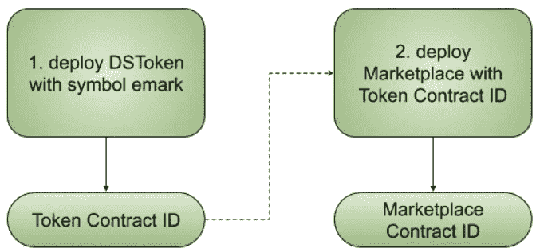

Token contract is deployed first as Marketplace requires the Token Contract ID

和以前一样，我们使用`dapp testnet`打开另一个终端来运行 testnet。我们还需要两个地址来演示。

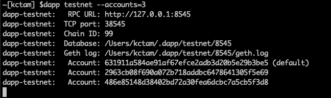

出于演示目的，我们将创建环境变量。我们使用 ETH_FROM 的第一个帐户是 coinbase 帐户。如果我们没有指定任何东西，这是默认帐户。

```
export ETH_KEYSTORE=~/.dapp/testnet/8545/keystore
export ETH_GAS=3000000
export ETH_FROM=0x631911a584ae91af67efce2adb3d20b5e29b3be5
export ALICE=0x2963cb08f690a072b718addbc6478641305f5e69
export BOB=0x486e85148d38402bd72a30fea6dcbc7a5cb5f3d8
```

现在，我们首先部署令牌契约。我们传递给新契约的符号是 emark。

```
dapp create DSToken $(seth —-to-bytes32 $(seth —-from-ascii emark))
```

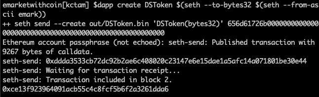

现在我们有了令牌合同 ID(或合同地址)。我们将使用环境变量 EMK 来保存这个地址。

```
export EMK=0xce13f923964091acb55c4c8fcf5b6f2a3261dda6
```

这样，我们就可以部署 Emarketwithcoin 契约了。我们按照构造函数中的要求指定令牌协定 ID。

```
dapp create eMarketwithcoin $EMK
```

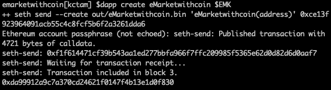

现在我们有了另一个合同 ID。我们将在环境多变的市场中把握这一点。

```
export MARKET=0xda99912a9c7a370cd24621f0147f4b13e1d0f830
```

现在我们已经部署了两个合同。

## 与合同互动

我们对这些已部署契约的演示流程很简单。

1.  检查 Alice 和 Bob 的电子马克余额，发现开始时没有余额。
2.  薄荷鲍勃 100 马克。它将用于购买 Alice 列出的商品。
3.  Alice 列出了一个价格设置为 80 马克的商品。
4.  鲍勃买了这件物品。
5.  检查 Alice 和 Bob 的电子邮件余额，我们看到有 80 封电子邮件转给了 Alice。

永远记住我们有两个合同:EMK 的令牌，市场的市场。它们是两个独立的契约，唯一的联系是当有人购买物品时，市场契约会调用 EMK。

步骤 1:我们从象征性契约开始。检查总 EMK 供应的余额，以及爱丽丝和鲍勃的余额。

```
seth call $EMK “totalSupply()”
seth call $EMK “balanceOf(address)” $ALICE
seth call $EMK “balanceOf(address)” $BOB
```

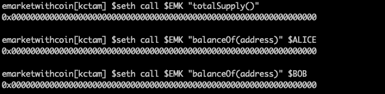

最初都是零。还没有电子标记。

第二步:我们给鲍勃制造了 100 封电子邮件。

```
seth send $EMK “mint(address,uint)” $BOB $(seth —-to-uint256 100)
```

并检查余额。Bob 有 100 个电子标记(0x64 ),总的电子标记供应量也是 100。

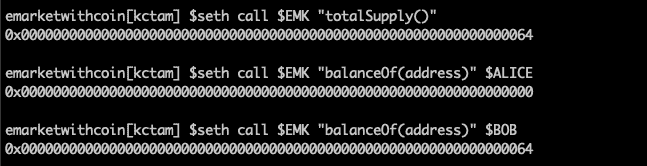

在营销人员可以从 Bob 帐户转移代币之前，Bob 需要批准营销该金额。假设鲍勃同意 80 封电子邮件。

```
seth send $EMK “approve(address,uint)” $MARKET $(seth —-to-uint256 80) —-from=$BOB
```

第三步:我们走向市场。爱丽丝列出了一个项目“一支笔”，价格是 80 马克。

```
seth send $MARKET “addItem(string memory, uint)” $(seth —-from-ascii “a pen”) $(seth —-to-uint256 80) —-from=$ALICE
```

我们将看到记录的第一项。

```
seth call $MARKET “items(uint)(string memory,address,address,uint,bool)” $(seth —-to-uint256 1)
```

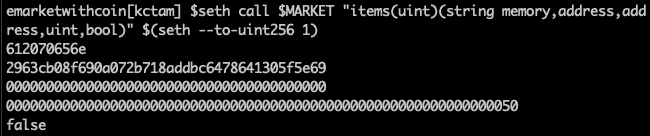

物品由爱丽丝列出，现在已经售出。

第四步:鲍勃正在购买这件物品。

```
seth send $MARKET “buyItem(uint)” $(seth —-to-uint256 1) —-from=$BOB
```

我们再次检查第一项。

```
seth call $MARKET “items(uint)(string memory,address,address,uint,bool)” $(seth —-to-uint256 1)
```

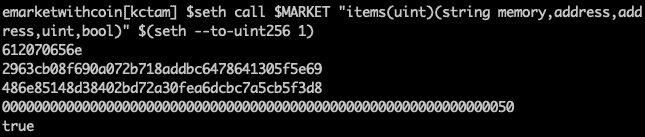

物品卖给了鲍勃。

步骤 5:最后，我们再次检查爱丽丝和鲍勃的 EMK 总供应量和余额。

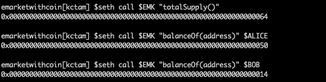

我们看到 80 封电子邮件从 Bob 转给了 Alice，因为 Bob 用 80 封电子邮件购买了 Alice 的物品。总供应量仍然是 100 马克。

# 关闭

我们展示了一个样本市场契约(同样，不是优化的，也不是用于生产的)。我们看到了如何使用测试契约来实现一些功能上的单元测试。在 testnet 上部署之后，我们演示了如何执行市场中定义的功能。然后，我们使用相同的市场合同，并添加令牌作为定价和支付方法。使用 ds-token 包并稍加修改，市场契约可以在进行购买时执行令牌传输。

希望你能看到 dapp.tools 的使用，以及在以太坊平台上开发 contract 时的便利。dapp.tools 还有一些其他的包，你会从中找到更多的乐趣。

> [在您的收件箱中直接获得最佳软件交易](https://coincodecap.com/?utm_source=coinmonks)

[](https://coincodecap.com/?utm_source=coinmonks)