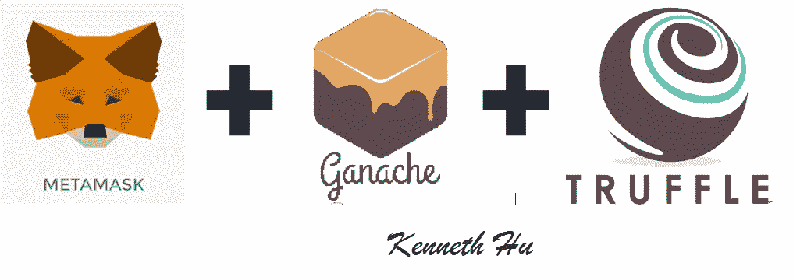
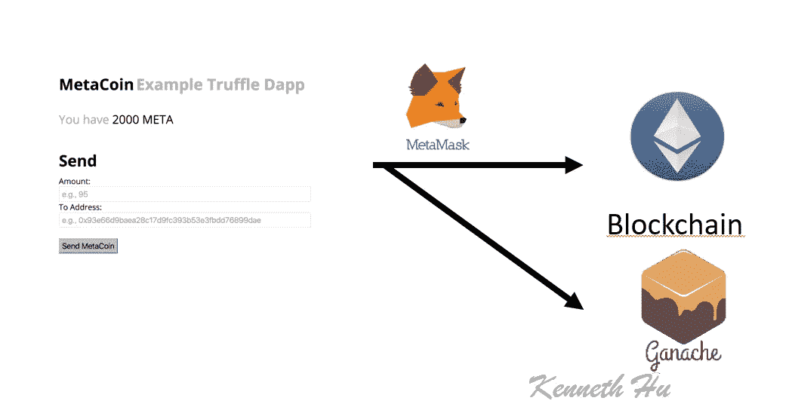
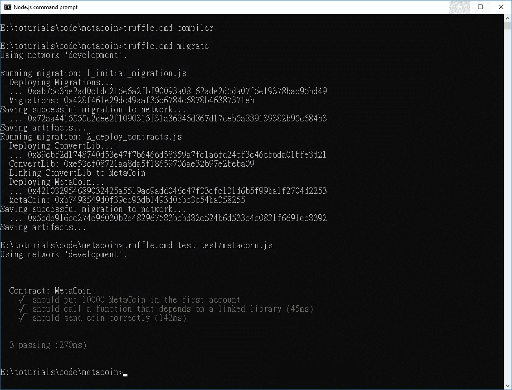

# 用松露、Ganache 和 MetaMask 开发以太坊 Dapps

> 原文：<https://medium.com/coinmonks/developing-ethereum-dapps-with-truffle-ganache-and-metamask-31bc5023ce91?source=collection_archive---------0----------------------->



*   插件:元遮罩
*   框架:松露
*   服务器环境:节点 JS
*   智能合同语言:Solidty
*   库:Web3.js
*   以太坊区块链模拟器:Ganach-cli

> 交易新手？尝试[加密交易机器人](/coinmonks/crypto-trading-bot-c2ffce8acb2a)或[复制交易](/coinmonks/top-10-crypto-copy-trading-platforms-for-beginners-d0c37c7d698c)

## 源代码

*   [网站](https://github.com/kennethhutw/MetaCoinWebSite)
*   完整代码(即将发布)

# Dapps 架构



如果你对用以太坊区块链构建网络应用感兴趣，你可能会发现松露网络框架非常适合你的需求。

对于许多类型的 dapp(分布式应用程序)，Truffle 可以做你想做的一切:它编译你的区块链契约，将它们注入你的 web 应用程序，甚至可以针对它们运行一个测试套件！

有了 Metamask，你的用户所需要做的就是[安装我们的 Chrome 插件](https://chrome.google.com/webstore/detail/metamask/nkbihfbeogaeaoehlefnkodbefgpgknn?authuser=2)，他们就可以在浏览器中方便地拥有自己的安全区块链账户。


# 安装 Truffle 依赖项

你需要安装 [node.js](https://nodejs.org/) 。

从那里，你需要安装松露(`npm install -g truffle`)。


此外，您将需要运行一个本地区块链 RPC 服务器来进行测试和开发。我推荐用 [Ganache](https://github.com/trufflesuite/ganache-cli) ，你运行`npm install -g ganache-cli`安装。


工作中心(190 clemen ceau Ave # 06–01，Singapore 239924)接下来让我们确保我们的`ganache`在后台运行。打开您的终端并运行命令`ganache-cli`。仅此而已！默认情况下，它运行在`8545`端口上，就像大多数以太坊 RPC 一样，松露也是如此。

还要注意的是，当`ganache`第一次启动时，它会打印出一个用 ether 预注资的账户列表，以及一个 12 个字的种子短语，用于重新生成这些账户。您可以使用这个种子短语用相同的帐户初始化您的元掩码客户端，当您开始时，您将有很多以太网！(以太用于支付以太坊网络的网络使用费或燃气费)


如果你想用你已经在 MetaMask 中的账户启动`ganache`，你可以告诉`ganache`使用什么种子短语和`-m`标志。例如:

```
$ ganache-cli -m "concert load couple harbor equip island argue ramp clarify fence smart topic"
```

# 建立一个简单的松露 Dapp

接下来，让我们生成一个基本的松露 dapp。`truffle init`的默认结果是一个简单的示例货币。

要启动并运行它，请运行以下命令:

```
mkdir metacoin# Create a folder for your new dappcd metacoin# Move into that foldertruffle init # Initialize a default truffle project in that foldertruffle compilertruffle migrate # Build, compile, & deploy the dapptruffle test test/metacoin.js
```



# 设置元掩码

如果你访问它，你会看到默认情况下这个新的 Dapp 模板用你的`ganache-cli`账户列表上的第一个账户登录你，这个账户恰好是预先填充了 10k 闪亮的新元硬币的账户！那是因为你跑`truffle migrate`的时候，松露用你的第一个账号作为合约发布者，合约上说用 10k 币资助创作者的账号。

您现在可以将这些硬币发送到任何您想要的帐户，例如，您的`ganache-cli`列表中的第二个帐户！如果你输入一个地址和一个值，然后点击发送，你会看到你的余额下降！

如果这看起来有点太简单，我同意你的观点！这就是为什么 Metamask 给用户一个机会来批准 Dapp 尝试的每一个交易，这样更安全！

让我们尝试通过 Metamask 连接到同一个帐户，看看有多简单！

# 设置元掩码

现在你需要从 Chrome 商店安装 [Metamask。](https://chrome.google.com/webstore/detail/metamask/nkbihfbeogaeaoehlefnkodbefgpgknn?authuser=2)

请参见如何[安装元掩码](/singapore-blockchain-dapps/metamask-metamask-installation-a62865a69d35)

1.  打开元蒙版
2.  单击右上角的当前网络名称。
3.  选择`Custom RPC`
4.  设置当前 RPC `Localhost:8545`地址[。](http://localhost:9545.)


5.填写第二个帐户(0x 035 b 9094158 fc 6 af 051242 b 6 c 04444 c 017 b 7 e 17 c)和金额 3


6.你会看到交易的结果。


这是一个简单的例子，但有望展示松露和元掩模是如何协同工作的。他们几乎可以开箱即用！那是因为 Truffle 帮助你编写符合 web3 的 dapps。Web3 是核心以太坊团队声明的 Javascript API，Metamask 直接注入到 Dapp 的上下文中！

> 加入 Coinmonks [电报频道](https://t.me/coincodecap)和 [Youtube 频道](https://www.youtube.com/c/coinmonks/videos)获取每日[加密新闻](http://coincodecap.com/)

## 另外，阅读

*   [复制交易](/coinmonks/top-10-crypto-copy-trading-platforms-for-beginners-d0c37c7d698c) | [加密税务软件](/coinmonks/crypto-tax-software-ed4b4810e338)
*   [网格交易](https://coincodecap.com/grid-trading) | [加密硬件钱包](/coinmonks/the-best-cryptocurrency-hardware-wallets-of-2020-e28b1c124069)
*   [密码电报信号](http://Top 4 Telegram Channels for Crypto Traders) | [密码交易机器人](/coinmonks/crypto-trading-bot-c2ffce8acb2a)
*   [最佳加密交易所](/coinmonks/crypto-exchange-dd2f9d6f3769) | [印度最佳加密交易所](/coinmonks/bitcoin-exchange-in-india-7f1fe79715c9)
*   开发人员的最佳加密 API
*   [Blockfi vs 比特币基地](https://coincodecap.com/blockfi-vs-coinbase) | [BitKan 评论](https://coincodecap.com/bitkan-review) | [Bexplus 评论](https://coincodecap.com/bexplus-review)
*   [南非的加密交易所](https://coincodecap.com/crypto-exchanges-in-south-africa) | [BitMEX 加密信号](https://coincodecap.com/bitmex-crypto-signals)
*   [MoonXBT 副本交易](https://coincodecap.com/moonxbt-copy-trading) | [阿联酋的加密钱包](https://coincodecap.com/crypto-wallets-in-uae)
*   [加密交易机器人](/coinmonks/crypto-trading-bot-c2ffce8acb2a) | [Bexplus 审查](https://coincodecap.com/bexplus-review)
*   [雷米塔诺评论](https://coincodecap.com/remitano-review)|[1 英寸协议指南](https://coincodecap.com/1inch)
*   最佳[密码借贷平台](/coinmonks/top-5-crypto-lending-platforms-in-2020-that-you-need-to-know-a1b675cec3fa)
*   [免费加密信号](/coinmonks/free-crypto-signals-48b25e61a8da) | [加密交易机器人](/coinmonks/crypto-trading-bot-c2ffce8acb2a)
*   杠杆代币的终极指南