# 开发以太坊智能合约

> 原文：<https://medium.com/coinmonks/developing-ethereum-smart-contracts-ef36ee4574c0?source=collection_archive---------4----------------------->

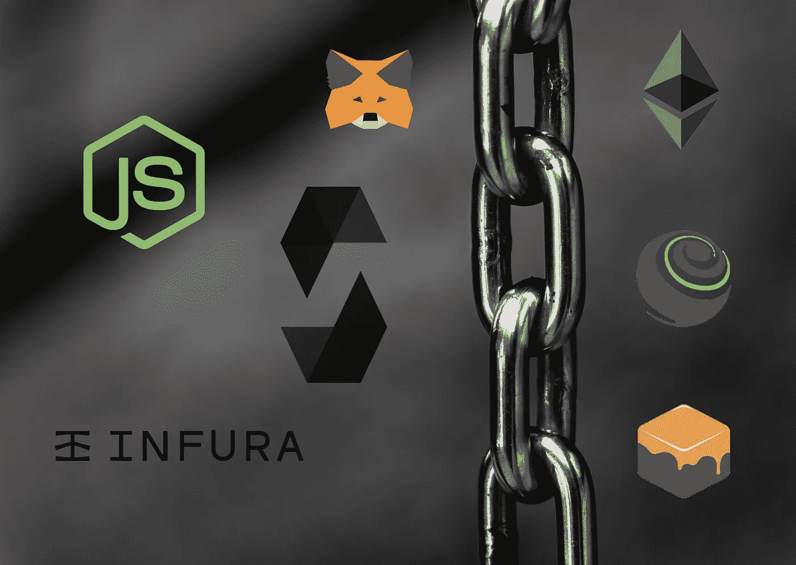

## **文章目的和范围**

本教程不会涵盖区块链、*以太坊*和实现*智能合约的基础知识。*如果你真的对开始和构建你的第一个*智能契约*感兴趣，我建议你去看看 [*Cryptozombies*](https://cryptozombies.io/) 课程，它涵盖了从 *Solidity* 基础知识、ERC-721 令牌到使用 *Web3js* 从前端应用程序使用你的*智能契约*的所有内容。

现在，假设你知道*可靠性*和开发*智能契约*的基本知识——如何使用映射、结构、修饰符等等——我们将专注于获得一个可以用于测试和开发的本地工作环境。

本文中所有的源代码都可以在这个 [Github 仓库](https://github.com/damoresa/ethereum-development)中找到。

## **起点**

与我交谈过的大多数以太坊开发者似乎可以创建连接到任何测试网的本地区块链节点( *Ropsten* 或 *Rinkeby* )或者只是使用像 [*Remix*](https://remix.ethereum.org/) 这样的在线 IDE。这种方法也迫使你使用带有 *Web3js* 的部署脚本。

就我个人而言，我更喜欢能够使用本地离线设置进行开发，我可以使用它来构建和测试我的合同，然后通过 *Infura* 轻松地部署它。这将*智能契约*开发者从网络中抽象出来，减轻了他的工作和设置时间。

在本教程中，我们将介绍不同的工具，这些工具将简化您的*智能合同*开发体验，使构建、测试和部署合同变得简单易行。这些是我们将要介绍的工具:

*   [*松露套件*](https://truffleframework.com/) :旨在简化*智能合约*开发的工具集。
*   [*Metamask*](https://metamask.io/) :允许为从测试网络到生产网络的不同*以太坊*网络处理用户账户和资金的浏览器插件。
*   [*Infura*](https://infura.io) :将*以太坊*节点公开为服务的服务，这样我们就不需要启动自己的本地网络来部署或访问网络。

## 设置元掩码和 *Infura*

首先我们将配置*元掩码*和 *Infura* 。你需要在这些服务上创建账户，但是不用担心，它们是免费的！

首先进入 *Metamask* [站点](https://metamask.io/)，为你最喜欢的浏览器下载插件。值得注意的是，我在使用 Firefox 插件时发现了一些问题，而 Chrome 插件运行得很好。

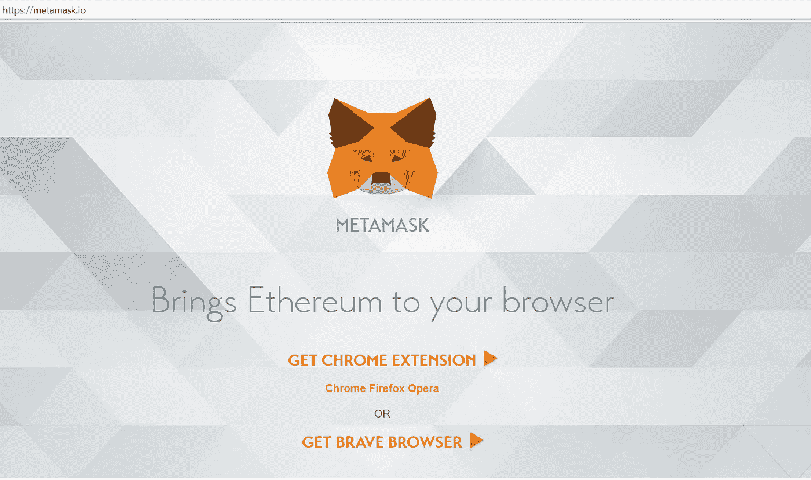

Metamask’s site

在开始创建帐户之前，您必须接受常用的*使用条款*和*隐私声明*:

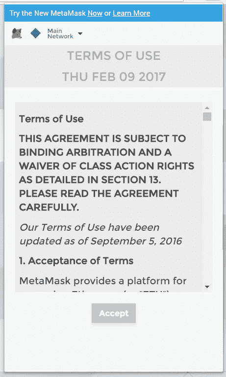

TOS as of October 2018

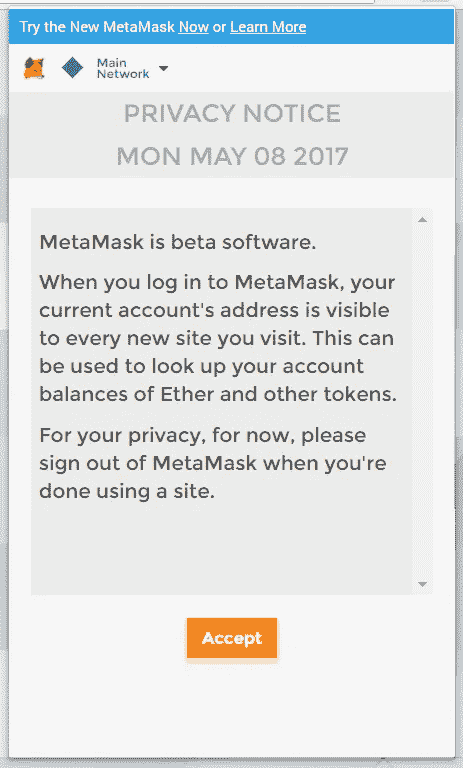

Privacy notice as of October 2018

一旦你下载、安装了插件并接受了不同的 *TOS* 和*通知*，你就可以创建一个新账户了。

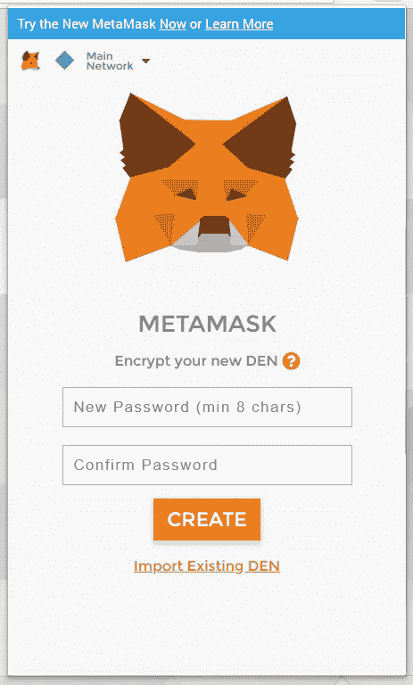

Account creation screen

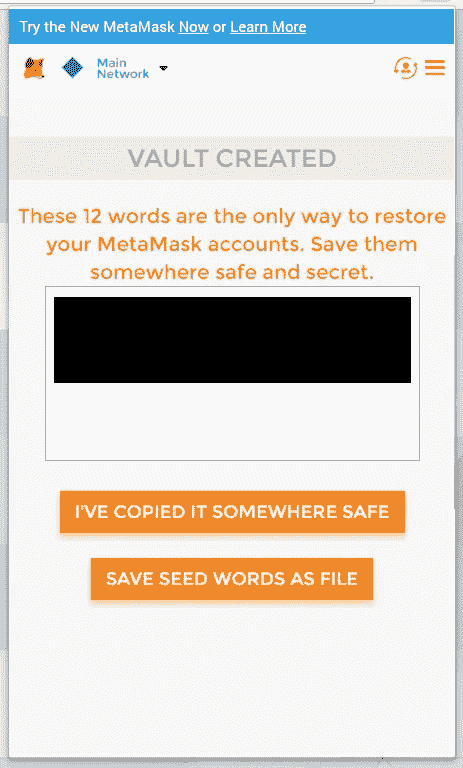

Metamask’s mnemonic display

正如你在截图上看到的，你不会选择你的账户名称，但是你会得到一个 12 个单词的助记符来识别你的账户。安全地保存助记符是非常重要的，因为这将是你账户的恢复密钥，一旦有人窃取助记符，它就会被泄露。

最后，在这些步骤之后，您的元掩码帐户就准备好了:

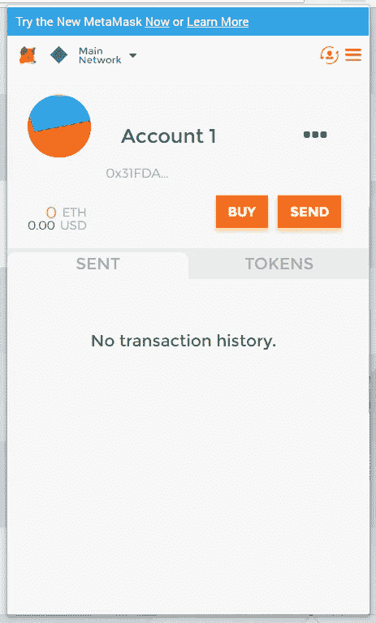

Main network account with no balance

在本教程的后面，我们将使用这个帐户从 Ropsten 水龙头请求一些以太 T21，以便将我们的智能合同部署到测试网。但那是未来的事，让我们继续前进。

我们将使用 *Infura* 来部署我们的*智能契约*，而无需创建我们自己的本地 testnet 节点。为了开始，请访问它的[网站](https://infura.io/)并注册一个新帐户。

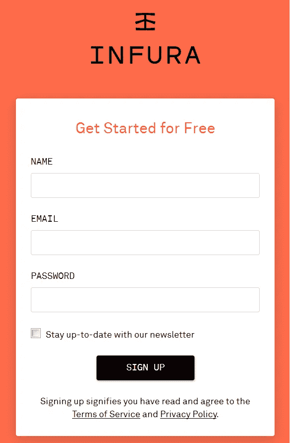

Registering a new Infura account.

登录后，您将能够创建新项目。创建一个新项目将会生成 *API 密匙*——你应该**对其保密**——你将会使用它们来连接 *Infura* 的节点。您还可以在*端点*选择器上的项目细节下生成到不同网络的连接*URL*。

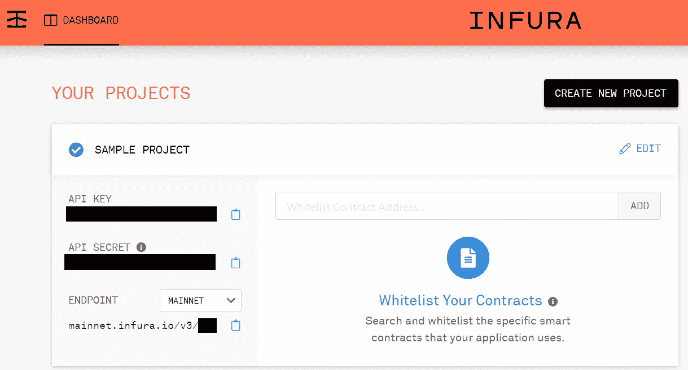

Example of an Infura project.

## **进入*松露*套件 **

我曾经用 *geth* 创建本地*以太坊*实例，这样我就可以在那里开发和测试我的*智能契约*，直到我找到*松露套件*。该套件包含以下工具:

*   一方面， [*松露*](https://github.com/trufflesuite/truffle) 将帮助我们编码、构建、测试并最终部署我们的*智能合约*。
*   另一方面， [*Ganache*](https://github.com/trufflesuite/ganache) 将帮助我们运行一个本地*以太坊*区块链节点我们将用于本地单元测试、部署等等。
*   最后， [*毛毛雨*](https://github.com/trufflesuite/drizzle) 是一个前端开发库，它通过使用 *Redux store* 以反应的方式公开*智能合约*数据。就我个人而言，我还没有深入研究这个问题。

因此，为了开始，我们必须为我们的操作系统安装一些全局依赖项和 *Ganache* 二进制文件(这里可以找到 *Ganache* 版本[)。](https://github.com/trufflesuite/ganache/releases)

既然我们已经设置了本地开发环境，我们将使用 *Truffle* 创建我们的第一个项目。框架为开发者提供了名为*盒子*的应用模板；您可以找到所有可用的*盒子*或在这里提交您自己的[，花时间挑选最适合您应用需求的*盒子*。对于我们的例子，我们将用命令 *truffle init* 生成一个基本模板。](https://truffleframework.com/boxes)

**注意**:我无法通过公司代理制作*松露*下载模板，如果你也没有，考虑从[这里](https://github.com/trufflesuite/truffle-init-default/)下载基础*松露*项目模板。

快速浏览一下生成的项目，我们会发现以下文件夹:

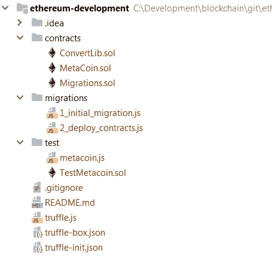

Initial Truffle project structure

在其他文件中，我们将找到以下内容:

*   **合同**:我们所有的*智能合同*都会存储在这个文件夹里。
*   **迁移**:部署脚本将存储在这个文件夹中。
*   **测试**:测试脚本将存储在这个文件夹中。
*   **truffle.js** :这是 *Truffle* 的配置文件。我们将能够在这里配置网络进行交互。

基础项目的特色是一个带有测试和部署脚本的示例*元连接*契约。当我开始玩*松露*时，我发现这些很有用，所以你可以随意保留它们，否则你可以删除它们。不过，**一定要保留 Migrations.sol 和 1_initial_migration.js** 。这个契约和它的部署被 *Truffle* 用来跟踪你在本地执行的变更。

最后，我们将通过运行为我们的平台下载的二进制文件来启动本地 *Ganache* 实例。我们会看到 *Ganache* 的可视化界面提示，看起来是这样的:

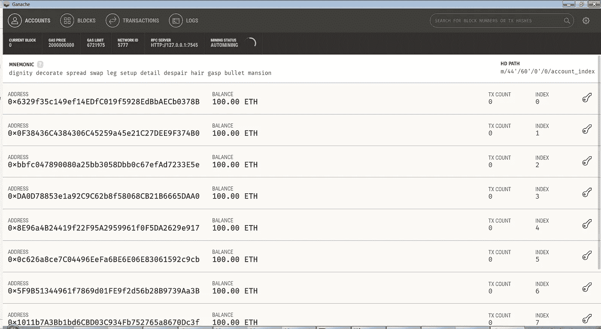

Ganache GUI

*Ganache* 提供了一套带有 *100 乙醚*的账户，这样你就可以使用其中任何一个账户在区块链上进行交易。还有每个账户的交易计数以及网络信息，如 *RPC 服务器 URI* 、*天然气价格*或*天然气限制*。

您还可以在其他三个选项卡上查看更详细的信息:

*   **块**:提交给区块链的块的信息。
*   **交易**:区块链上正在运行的交易信息。
*   **日志**:区块链上生成的日志。

如您所见， *Ganache* 提供了监控和运行您自己的*以太坊*开发节点所需的所有工具。

## 开发智能合同

现在我们已经设置了所有需要的工具，我们可以开始开发我们的*智能契约*和它的单元测试。对于本例，我们将构建一个存储聊天信息的契约，因此我们需要跟踪房间及其消息。

出于隐私原因，我们将把用户数据保存在区块链之外，用户数据可以存储在任何链外解决方案上，如 [IPFS](https://ipfs.io/) 或 MongoDB 存储在区块链上的用户信息将是由离线解决方案生成的唯一散列，因此用户不会暴露给公众，但如果需要的话仍然可以被跟踪。

这是我们的*智能合约*源代码:

如你所见，我们将存储房间和消息。对于**房间**我们将只存储它们的名称，而对于**消息**我们将存储它们的内容、创建消息的用户散列、语言和创建日期。

然后，我们将把消息与房间的关系存储为一个*映射*，以便跟踪一条消息属于哪个房间，以及一个映射来跟踪一个房间有多少条消息。

至于**用户**，我们将跟踪一个用户加入了哪些房间，以及哪些用户在两个不同的*映射*上加入了一个房间。这将帮助我们验证用户是否可以加入或离开房间。

该协定还公开了几个事件，当某些交互发生时会发出这些事件:

*   添加新消息时，*消息创建*。
*   添加新房间时创建的房间。
*   用户加入房间时。
*   *用户离开房间*用户离开房间。

稍后，这些事件将帮助我们在通过 *Web3js* 发起交易后与区块链进行交互。

还有几个*修饰符*将帮助验证*函数*参数，其余函数通过添加、删除或获取信息与数据存储交互。一旦你掌握了*坚固性*的基本概念，这些应该是非常直观的。

最后但同样重要的是，我们的合同可以通过使用*块菌编译*来编译。这将生成一个*构建*文件夹，其中包含合同的 *ABI* 规范。

既然我们已经实现了我们的*智能契约*，我们将实现单元测试来保证一切按计划运行。

这些测试可以通过在命令行上执行*块菌测试*来运行。 *Truffle 套件*允许进行*可靠性*和 *Javascript* 测试。因为我更习惯于 Javascript，所以我通常最终会使用它，但是初始模板提供了 *Solidity* 单元测试样本，您可以将其作为指南。

Tests execution logs

正如你在代码*要点*上看到的，契约是通过使用*工件*对象并通过其名称要求契约来分配的。然后由*契约*对象初始化测试，该对象代表给定契约的测试。最后，通过使用 *it* 对象来定义测试用例。如果你使用 *Javascript* 和 *NodeJS* version 8+你可以使用 *promises* 和 *async/await* 。

测试实现通常遵循一种模式:

1.  首先，我们通过使用导入的契约工件并调用部署的*和*来分配契约实例。这将在您机器上的本地 *Ganache* 区块链上部署契约，或者在区块链上检索现有契约的实例。
2.  然后我们可以使用契约实例来调用它的方法。调用契约方法有两种方式*调用*和*发送事务*。第一个将执行方法**，但不会将结果**持久化到区块链中。第二个将执行方法**并将结果**保存到区块链中。这也适用于 *Web3js* 连接，我们将在本教程的后面看到。
3.  最后，我们可以使用 *assert* 对象来验证收到的结果。注意，数字通常作为 *BigNumber* 对象返回，断言需要将它们转换成数字才能正常工作。

## **部署智能合约**

此时，我们已经成功实现并测试了我们的*智能合约*，因此我们已经准备好上线。您可能仍然希望在真实的区块链上测试您的合同，或者您的应用程序只是一个概念验证，您希望保持免费，所以我们将在测试网上部署我们的应用程序。

我选了 *Ropsten* ，但是 *Rinkeby* 或者其他的也可以。欢迎在评论中给我留言，告诉我你对 testnets 的体验。

我们的第一步是在我们的 *Metamask* 账户上获得一些 *ether* ，这样我们就可以部署和调用我们的合同。为了避免被恶意用户攻击或淹没，testnets 的资金会根据请求发送到帐户，通常在一天几次请求后就会封顶。你可以从任何一个*水龙头*请求*乙醚*，但是我已经亲自测试了以下:

*   [*罗普斯滕以太坊龙头*](https://faucet.ropsten.be/)
*   [*测试乙醚龙头*](https://faucet.metamask.io/)
*   [*bitfwd Ropsten 水龙头*](http://faucet.bitfwd.xyz/)

*水龙头*基本上会根据要求把*乙醚*送到你的账户上，达到一个限额。限额和转移金额通常取决于*龙头*。

下一步是在 *Truffle* 上添加一个新的网络，这样我们就可以使用 *Truffle* 命令轻松访问它。为了添加 *Ropsten* 网络，只需修改基础 *truffle.js* 文件，并在那里添加新网络。请记住，我们将附加一个 *HDWalletProvider* ，以便从我们的 *Metamask* 帐户和作为目标的 *Infura* API 中分配资金，从而避免部署本地 testnet 节点来部署我们的合同。

**注意**:有一个已知的 bug 导致*元掩码*只能使用账户下的第一个钱包。请记住这一点，以防您用一个帐户处理多个钱包。

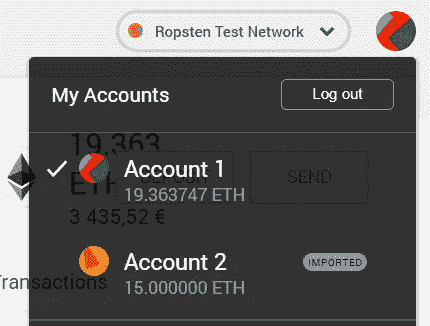

Multiple wallets under the same *Metamask account*

既然我们已经将网络添加到了 *Truffle* 中，我们可以通过运行*Truffle migrate——network rops ten*来部署我们的合同。

正如您在上面的日志中所看到的，您将获得一个合同哈希，这将是您在区块链中的合同身份——您可以在行*Chat:0 xff 36 b 43 c 46 e 8726 db EFA 03102259 ec7d 90552*中看到它。不要忘记这个散列，因为您将需要它来使用您的合同。另一方面， *Truffle* 也会在本地构建你的契约，生成接口的 *ABI* JSON 文件——不要丢失这个文件，因为你将需要它来通过 *Web3js* 调用契约。

你也可以看到我们使用 [*Ropsten* 的块浏览器](https://ropsten.etherscan.io/)部署的契约，以及我们的契约散列[这里](https://ropsten.etherscan.io/address/0xff36b43cc46e8726dbefa3a03102259ec7d90552)。

在接下来的部分中，我们将通过 *Truffle* 查询使用部署的契约，并且我们将实现一个非常简单的 *Web3js* 客户端。

## 从*松露*处查询合同

既然我们已经成功地在 *Ropsten* testnet 上部署了我们的*智能契约*，我们可能想要验证一切都正常工作，或者我们可能只是想要检查我们的契约上存储的数据或者执行一些事务。

同样，我们将使用 *Truffle* 来创建请求并将它们提交给 testnet。让我们看看这个例子:

在这个例子中，我们导出一个带有执行请求的函数。我们已经实现了一个房间创建功能、一个查找房间功能和一个查找房间细节功能，我们将调用这些功能来验证一切是否按预期工作。

作为一个重要的注意事项，请注意传入我们函数的*回调*函数；我们必须调用这个函数来让*松露*知道我们已经完成了*节点*进程将会被卡住。

最后，我们将使用 *Truffle exec* 运行我们指向 *Ropsten* 网络的查询文件:

```
truffle exec queries\queries.js --network ropsten
```

Query execution logs

## **为合同实现 NodeJS 客户端**

最后但同样重要的是，我们将使用 [*Web3js*](https://github.com/ethereum/web3.js/) 来实现一个基于 *NodeJS* 的*以太坊*客户端。

我们将从创建一个*智能契约* utils 函数开始，该函数将创建一个 *Web3js* 连接器实例，我们可以在我们的应用程序中共享。所说的连接器看起来是这样的:

与前面的例子一样，我们需要合同哈希，但是我们还需要合同的 *ABI* 界面来调用它——提醒一下，在合同编译期间会生成 *ABI* JSON 文件。记住不要松开它！

查看*智能合同*实际实现的一个非常重要的方法是*发送签名交易*。这种方法将取代我们测试中使用的*发送*方法，因为调用一个真正的*以太网*网络将会让我们签署我们的交易。由于我们使用 *Infura* 来避免创建本地网络节点作为网络入口，我们必须手动签署我们的交易。

为了签署我们的交易，我们将从[*Eth Gas Station*](https://ethgasstation.info/)分配*燃气价格*，我们将生成一个*随机数*，该随机数将被用作给定钱包的唯一交易号。两者赋值后，生成交易参数，包含*燃气限额*、*燃气价格*、目标*网络标识* ( *chainId* )、目的合同、 *eth* 已转移价值(若有，可用于支付*应付*功能或简单的在账户间转移 *eth* )和交易数据。最后，我们将使用我们账户的*私钥*签署交易，并使用 *Web3js* 发送交易。

我们可以在插件上找到我们的*元掩码*账户*私钥*，点击*详细信息*，然后点击*导出私钥*。

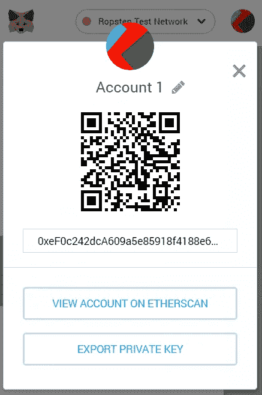

Metamask private key export feature

一旦我们设置了*智能合同*连接器，我们将开始实施我们的服务。我们希望能够将智能合同提供的每个用例暴露给任何 *NodeJS* 过程——这可能包括某种维护 *CLI* 工具，也可能包括由从 *Express* 到 *Koa* 的任何东西驱动的 REST API。

就像在测试过程中一样，我们可以使用*调用*或者*发送签名交易*来调用*智能合同*；也和以前一样,*调用*将不会在区块链上持续变化——我们将不必为所述交易付费——而*发送签名交易*将持续变化——我们将必须为这些支付费用，所以选择明智！

在返回对象上也有区别，因为*调用*将返回在*智能合约*上指定的数据，而*发送*将返回带有提交的交易数据的*交易收据*。客户机上有一些解析方法，可以将数据转换成我们期望的数据模型，我们可以将这些数据模型作为 API 响应保存或返回。

同样值得注意的是，当我们使用 *call、*时，我们必须提供一个*调用者*——这基本上就是我们的帐户，而 *sendSignedTransaction* 方法将处理生成*调用者*、*气价*和*气限*值，如我们之前所见。

## **结论**

*以太坊*契约使用 *Solidity* 进行编码，这与 *JavaScript* 非常相似，并且非常容易学习——虽然在存储数据时需要考虑一些细节，例如使用*映射*来处理关系，但是在互联网上到处都有众所周知的变通方法和提示。

虽然有像 *Remix IDE* 这样的在线编码解决方案，但我个人更喜欢使用 *Truffle Suite* 进行离线开发，它基本上提供了开发、测试和部署您的合同所需的一切。请记住，该套件还提供工具来测试您部署的合同，以保证一切按预期运行。不要忘记 *Infura* 将帮助我们在没有本地*以太坊*节点的情况下连接到网络，简化部署合同的过程。

为了向任何种类的 *NodeJS* 流程公开*智能合约*特性，您可以使用 *Web3js* 创建一个客户端。因为我们使用 *Infura* 来连接到网络，记住交易必须离线手动签名，因为你不能依赖你的本地网络节点。你甚至可以将你的客户端打包成一个 npm 模块，并与全世界分享——不过，你可不想为网络上的每个人的交易买单！

了解测试网也很重要——如 *Rinkeby* 或*Ropsten*——以及它们如何在我们将合同推向真实网络之前帮助我们测试合同。请记住，每个测试网都有*水龙头*，它将为您提供免费测试*以太网*来部署和运行您的合同。但是不要贪婪，退还所有未使用的乙醚，这样其他用户也可以享受测试网！

请记住，您可以在这个 [Github 资源库](https://github.com/damoresa/ethereum-development)上查看所有源代码，并在下面随意评论或提出任何问题！

> [在您的收件箱中直接获得最佳软件交易](https://coincodecap.com/?utm_source=coinmonks)

[](https://coincodecap.com/?utm_source=coinmonks)