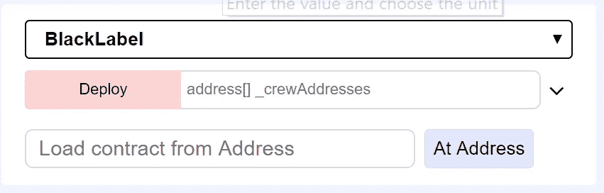

# 开发盗版“黑标”投票系统。关于稳固性的区块链智能合约。15 分钟分步指导。第三部分

> 原文：<https://medium.com/coinmonks/developing-pirates-black-label-voting-system-6618378aae03?source=collection_archive---------2----------------------->

我们继续我们的教育课程——15 分钟的工作原型——逐步指导。第三个实际教训是致力于巩固必要技能——开发，测试和使用简单智能合同。


实际上，在互联网上有很多投票系统的例子，但是大多数很难在一堂课上理解和测试。

```
Lessons One and Two from the session:1\. [Developing of CryptoChurch. 15 minutes step by step instruction (Russian)](/@andrii.ryzhenko/создаем-работающую-криптоцерковь-с-нуля-за-15-минут-пошаговая-инструкция-9c27798d2913)2\. [Develop blockchain “Trusted Diploma” verification system in 15 minutes. Step by step instruction](/@andrii.ryzhenko/develop-blockchain-trusted-diploma-verification-system-in-15-minutes-step-by-step-instruction-fdcf37a244ab)
```

# 项目要求

首先，我们得从对产品需求的理解开始:

*   任何来自海盗船组的人都可以创建新的选举，并建议自己成为船长。但是，如果选举失败，剧组会杀掉候选人。
*   每个船员只能投一次票，每个人都有同等的权力
*   船员地址列表是公开的
*   只有机组成员可以查看投票结果
*   智能合同必须是公开的，以确保投票
*   多数投票制是指超过 50%的投票者投票给有争议的人或问题(非多数投票)

# 数据结构

第二步是开发数据结构。我们从变量开始:

和功能符合要求

# 制定智能合同

打开浏览器(Chrome 或 Firefox)去 remix.ethereum.org
点击新建 Solidity 文件，输入新名字，比如“Election.sol”还不错。
从 BlackLabel 智能合同中复制过去的文本或手动输入。我们将在下一阶段深入研究

部署前检查重新混合配置:

环境— JavaScriptVM

Address[] _crewAddresses —从帐户中输入您的实际地址(取 3–4 进行快速测试)。

或者，使用我的示例进行第一次测试，但是添加您部署合同的实际地址:

[" 0x ca 35 b 7d 915458 ef 540 ade 6068 dfe 2 f 44 e 8 fa 733 c "，" 0x 14723 a 09 acff 6 D2 a 60 CDF 7 aa 4a af 308 fddc 160 c "，" 0x4b 0897 b 0513 FDC 7 c 541 b 6d 9 e 929 C4 e 5364d 2 db "，" 0x 2 addf 375156d 0 c 9553 FD 5 e 62 cf 62 f 4288859 bb 7

按下部署按钮

如果没问题，去控制台看看这样


而不是去“部署的合同”,检查功能和审查合同。


下一步—了解其工作原理:)

# 审查代码

```
pragma solidity 0.4.24;
```

我们可以选择编译器的版本。开发人员通常不喜欢锁定 pragma。现在，这并不重要，你可以使用这两个选项

```
pragma solidity ^0.4.24;contract BlackLabel {
```

下一个字符串是创建智能合同的基本语法。

下一步，我们已经定义了变量

```
address public nextCapitan; mapping(address => bool) private crew; uint private voteCount; address[] private crewList;
```

最有趣的是映射——我们将在文章的最后讨论
构造函数()正在做的事情:

*   设置合同的所有者；
*   存储带有机组地址的输入数组；
*   将机组成员的值映射为 true 以访问投票；
*   候选人必须为自己投票

```
constructor( address[] _crewAddresses) payable public {
        nextCapitan = msg.sender;
        crewList = _crewAddresses;
        voteCount = 1;
        for (uint i = 0; i < crewList.length; i++) {
            crew[crewList[i]] = true;
        }    
}
```

下一个函数是 **vote():**

*   团队中的任何人只能为创建智能合同的候选人投票一次。
*   候选人不能投票，因为合同创建时会自动投票。

```
function vote() public {
    require(crew[msg.sender]); 
    require(msg.sender != nextCapitan ); 
    crew[msg.sender] = false; 
    voteCount++; }
```

接下来的两个函数 **getVoteCount(** )和 **getCrewAddresses** 需要使投票过程更加公开。

函数 winOrDie()比较有意思。当工作人员决定时间到了，工作人员中的任何人都可以启动验证程序来检查投票结果:

```
function winOrDie() public view returns (string text) {
    require(msg.sender != nextCapitan);
    if (voteCount > crewList.length/2 ) 
         return “Glory to new Captain!!!”; 
    else 
         return “Vote was failed.Kill candidate!”; }}
```

现在我们必须在真实网络上进行测试。

# 是时候安装元掩码了。如果您以前使用过，请跳过

进入 [*www.metamask.io*](http://www.metamask.io) 网站，按照基本说明进行安装。保存助记词，以便在出现问题时恢复访问。

接下来，去 https://faucet.rinkeby.io/

完成一个简单的任务。将你的账户地址从 MetaMask 复制到 Google+ post。

输入链接到水龙头形式，并选择 18.75 乙醚延迟 3 天。

等待帐户余额更新:


# 运行以太坊交易

前往以太坊 MetaMask 钱包。选择 **Rinkeby 测试网络**。此外，您可以使用公共以太网或运行自己的私有以太网(MS Azure 或 Google Cloud)。


或者测试新的酷网版本:


返回混音工作室:

 [## 混合可靠性集成开发环境

### 编辑描述

remix.ethereum.org](http://remix.ethereum.org) 

**验证解决方案的最后一个清单:**

*   确认你的合同没有任何错误
*   验证您是否在 Rinkeby 测试网络中
*   检查环境—选择“注入的 Web”选项
*   检查帐户余额是否非零
*   检查您的帐户地址是否在船员地址列表中

点击**部署合同附近的回收站，清除实例列表并重置记录器。**

复制您的地址并在字段中输入

[" 0x ca 35 b 7d 915458 ef 540 ade 6068 dfe 2 f 44 e 8 fa 733 c "，" 0x 14723 a 09 acff 6 D2 a 60 CDF 7 aa 4a af 308 fddc 160 c "，" 0x4b 0897 b 0513 FDC 7 c 541 b 6d 9 e 929 C4 e 5364d 2 db "，" 0x 2 addf 375156d 0 c 9553 FD 5 e 62 cf 62 f 4288859 bb 7

**点击部署按钮**


按下提交按钮，在元掩码处确认交易

等待交易确认，您可以通过点击最后一笔交易打开链接进行检查

我的例子

 [## Rinkeby 交易 0x 24112 F2 a 6a 9 aa 661045d 10 cabd 591620454 f 8465 a 3613 f 9198 f 41 ad 72e 086790

### rinke by(ETH)0x 24112 F2 a 6a 9 aa 661045d 10 cabd 591620454 f 8465 a 3613 f 9198 f 41 ad 72e 086790 详细交易信息

rinkeby.etherscan.io](https://rinkeby.etherscan.io/tx/0x24112f2a6a9aa661045d10cabd591620454f8465a3613f9198f41ad72e086790) 

单击合同并验证它。我的例子:

 [## Rinkeby 帐户、地址和合同

### 以太坊区块链浏览器、API 和分析平台

rinkeby.etherscan.io](https://rinkeby.etherscan.io/address/0xef76b473bae3d312d7f557a6510b4fa1d335d05f) 

恭喜—投票已创建！

# 智能合同的测试

下一步是测试它是如何工作的

打开混音工作室，创建一个新的。sol 文件并在其上复制智能合同文本。

将已部署的合同地址复制并粘贴到已存档的“从地址加载合同”中:



点击地址按钮

好的，您的本地合同已部署:


选择不同的帐户和测试功能:


*   尝试多次运行投票
*   跟踪 getVoteCount 输出的更改
*   运行 winOrDie 作为船长和船员

在你对结果完全满意并理解其运作方式之前，重新运行你的合同。

转到以太网扫描并输入合同部分代码。

点击 [**验证并发布**](https://rinkeby.etherscan.io/verifyContract?a=0xef76b473bae3d312d7f557a6510b4fa1d335d05f) 今天就新增您的合同源代码！


如果你第一次没有成功，不要担心

检查重新混合和合同时的设置:


# 接下来的发展阶段

接下来呢？您可以提高自己的技能并添加解决方案:

*   委托职能；
*   完善候选人名单；
*   “是”和“否”的投票结果，添加权力参数；
*   尝试这样的投票者结构:

```
struct Voter { 
      bytes32 name; // short name 
      uint powerPoits; // amount of vote points
      bool voteStatus; // check if voted
      bool delegationStatus // check delegated or not 
      uint memberIndex; // crew member indexmapping(address => Voter) public crew;
```

重要！既然我们可以使用数组，为什么还要使用映射呢？

[https://ether eum . stack exchange . com/questions/2592/store-data-in-mapping-vs-array](https://ethereum.stackexchange.com/questions/2592/store-data-in-mapping-vs-array)

```
mapping is generally recommended. The main advantage of an array is for iteration. But the iteration needs to be limited, not only for speed, but potentially for security. As an extreme example, a permanent Denial-of-Service could be inflicted on a contract if its service involves iterating over an array that an attacker can fill up, such that the cost of iteration and operation permanently exceeds the block gas limit.Note, for clarity, one should not try to replace all arrays with mappings: [mappings can only be used for data in storage](http://solidity.readthedocs.org/en/latest/types.html#mappings).
```

*   基于 React 框架创建一个按钮应用程序

此外，我还创建了投票系统的简单版本，尝试进一步简化:

## 非常感谢！请喜欢或分享文章。祝你好运！

下一个阅读

# [15 分钟开发区块链“可信文凭”。分步指令](/@andrii.ryzhenko/develop-blockchain-trusted-diploma-verification-system-in-15-minutes-step-by-step-instruction-fdcf37a244ab)

[https://medium.com/@andrii.ryzhenko](/@andrii.ryzhenko)

[](https://www.linkedin.com/in/andrii/) [## NCube 有限公司业务发展总监--软件开发外包…

### 业务开发和技术总监。有兴趣与科技公司合作构建跨堆栈解决方案…

www.linkedin.com](https://www.linkedin.com/in/andrii/) 

> [直接在您的收件箱中获得最佳软件交易](https://coincodecap.com/?utm_source=coinmonks)

[](https://coincodecap.com/?utm_source=coinmonks)