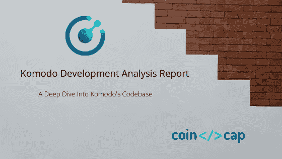

# 发展，发展，发展…

> 原文：<https://medium.com/coinmonks/development-development-development-8c73a434b0c8?source=collection_archive---------2----------------------->

## ⚠️ 🚨下一次衰退敲门，买比特币。🚨 ⚠️

嘿伙计们，

这份时事通讯将会是关于 [CoinCodeCap](https://coincodecap.com) 的，因为我们有很多激动人心的更新。

在开始更新之前，我有一个问题要问大家。

*   交易所要不要上市币，完全不开源他们开发的？ [***投票和转发。***](https://twitter.com/coincodecap/status/1189031606331117568)

## [科莫多发展分析报告](https://blog.coincodecap.com/development-analysis-of-komodo-project/)

本周，我们深入研究了[科莫多的](https://komodoplatform.com/)代码库，并创建了一份深度开发分析报告，请看这个 [***Twitter 帖子***](https://twitter.com/coincodecap/status/1188899524493770752)

## 摘要

我们发现科莫多项目的整体发展状况良好。以下是主要发现:

*   Komodo 团队继续以相当快的速度添加代码/文档。今年，Komodo 团队平均每月在 18 个存储库(不包括 forked 和其他存储库)上提交 570 次。
*   该团队还围绕其不同的软件项目编写文档。
*   Komodo 团队平均花费 1.55 天来合并一个拉取请求，这显示了一个优秀的开发项目。
*   科莫多的主要客户可以使用更多的贡献者。
*   我们分析的几乎所有存储库都丢失了许可证和变更日志。

[**全文报道**](https://blog.coincodecap.com/development-analysis-of-komodo-project/)

你可以在这里阅读完整的发展分析报告*，我们还制作了一个 PPT，里面有我们的主要发现。 [***下载 PPT。*T32**](http://blog.coincodecap.com/wp-content/uploads/2019/10/Development-Analysis-of-Komodo-by-CoinCodeCap.pptx)*

## *[比特币 SV 开发活动](https://twitter.com/coincodecap/status/1184885333101428736)*

*最近，我们研究了比特币 SV 的发展，根据公开的数据，我们发现它的发展活动非常低。*

*[***查看本推特帖子***](https://twitter.com/coincodecap/status/1184885333101428736)*

## *[加密交换根本不在乎](https://twitter.com/coincodecap/status/1184956896962179072)*

*我们还发现了一个项目 Rimbit，其域名已在 Yobit 上出售，市值为 62K 美元。*

*[***查看这条推特帖子。***](https://twitter.com/coincodecap/status/1184956896962179072) 😃😃*

**

> *[直接在您的收件箱中获得最佳软件交易](https://coincodecap.com/?utm_source=coinmonks)*

**

# *在 Coinmonks 上发布*

*如果你喜欢在 crypto/区块链空间上写教育文章，并且想在 Coinmonks 出版物上发表。只需在**发邮件给我或者 DM 我**[***推特***](https://twitter.com/coinmonks)***

> ***“我们是一份非宣传性、非营利性的教育刊物，如果你喜欢读*[*【coin monks】*](https://medium.com/coinmonks)*[*你也可以把我们*](/coinmonks/monks-need-your-help-7440418d67ec) *捐出来。****

******暂时就这样，送我❤️，下次再说。******