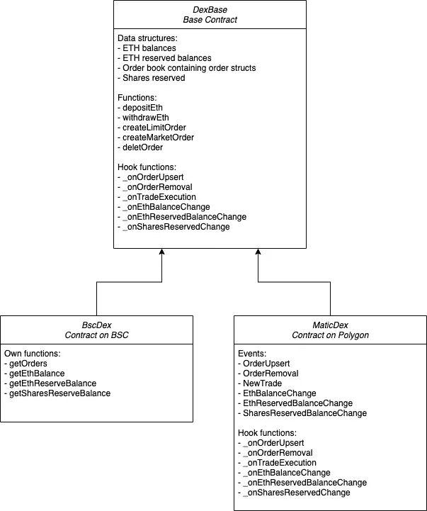

# Dex 合同

> 原文：<https://medium.com/coinmonks/dex-contracts-20e11ed52ef7?source=collection_archive---------9----------------------->

NFT 分数分散式交易所不实施 AMM(自动做市商)模式。它使用旧的订单簿模型，这意味着它登记交易者的订单，并将它们相互匹配。与 AMM 模型相比，这显然是低效的，但实现起来更简单。交易所可以处理限价单和市价单。限价单被设置为以给定的价格执行，而市价单独立于实际价格立即与最佳价格匹配。你可以在这里阅读更长的解释[。](https://www.investopedia.com/ask/answers/100314/whats-difference-between-market-order-and-limit-order.asp)

让我们看看 Dex 合同组:



基础契约跟踪必要的数据结构:

*   交易员的 ETH 余额
*   交易商的 ETH 保留余额，保存每个交易商订单中当前保留的总 ETH 金额
*   包含代表单个订单的订单结构的订单簿。订单分为两类:购买订单和销售订单。
*   保留股份，保留每个 NFT 和所有者的订单中保留的股份数量

注:ETH 在基础合约中被称为对销货币。这是因为契约被部署到 EVM 兼容链(BSC 和 Polygon)中，所以 ETH 被作为 BSC 和 Matic 的抽象来处理。

基础合同的功能:

*   存取款:办理柜台交易货币的存取款
*   创建限价单:顾名思义，它在订单簿中创建限价单。它按照以下方式组织订单簿:
    -购买订单按照价格降序排列。
    -同时，卖单按价格升序排列。
    这就像我们在传统交易所看到的订单一样。它有助于市场订单匹配机制。
*   创建市价单:它创建市价单并自动匹配最佳限价单。实际上，市价单甚至没有登记在订单簿中，它只是根据限价单进行匹配和执行。

与真实交换相比，有两个简化:

*   限价单不相互匹配，只有市价单与限价单匹配。
*   在将市价订单与限价订单进行匹配后，市价订单中剩余的未履行部分将会丢失。这意味着它没有在订单簿中登记，因为订单簿当前仅包含限价订单。

这两个限制阻止了该模型在任何实际应用中的使用，但是为了学习体验，使得该模型更容易实现。

合约中最复杂的部分是市价单的创建和限价单的匹配。让我们把它分解成几个要点:

1.匹配算法在有订单要匹配且市场订单有剩余部分要匹配时执行:

```
while (i < orders.length && remaining > 0)
```

2.基于限价单的可用部分和市价单的剩余部分，可以计算匹配金额:

```
uint256 available = orders[i].amount — orders[i].filled;
uint256 matched = (remaining > available) ? available : remaining;
remaining = remaining — matched;
```

3.在保持平衡和转移柜台交易货币方面，买卖订单是有区别的。通过销售订单执行的例子可以理解一般的想法:

```
nftFractionsRepository.transferFrom(
 msg.sender,
 orders[i].trader,
 tokenId,
 matched,
 “”
 );
ethBalance[msg.sender] += orders[i].price * matched;
ethBalance[orders[i].trader] -= orders[i].price * matched;
ethReservedBalance[orders[i].trader] -= orders[i].price * matched;
```

4.当匹配算法结束时，有一个维护任务。订单簿必须从完全执行的订单中清除。由于数组的元素只能在 Solidity 中弹出(只能删除最后一个元素)，我们必须重新排列顺序簿，以在末尾包含完全执行的元素并弹出它们:

```
while (i < orders.length && orders[i].filled == orders[i].amount) {
 _onOrderRemoval(orders[i].id);
 for (uint256 j = i; j < orders.length — 1; j++) {
 orders[j] = orders[j + 1];
 }
 orders.pop();
 i++;
}
```

基础契约还定义了挂钩函数，以在执行的适当点挂钩逻辑:
-订单上插(插入/更新)
-订单移除
-交易执行
-ETH 余额变化
-ETH 预留余额变化
-股份预留余额变化

这些钩子只在 Dex 契约的 Polygon 版本中实现:MaticDex
它发出相应的事件来被图形捕获:
-OrderUpsert
-order removal
-new trade
-EthBalanceChange
-EthReservedBalanceChange
-shares reservedbalancechange

相比之下，Dex 契约的 BSC 版本公开了内部数据结构的 getter 函数:
-获取订单
-获取 ETH 余额
-获取 ETH 预留余额
-获取股份预留余额
它们服务于订单显示和执行 UI 的数据需求。

在下一节中，我们将详细介绍[桥](/@szmizorsz/the-bridge-82608dfcf5a2)。

如果你想阅读本系列的其他文章，你可以在[主要文章](/@szmizorsz/nft-fractions-decentralised-exchange-introduction-3e696f27c065)中找到链接。

或者如果你想看我的其他项目和贡献:

[https://www.szabolcsszentes.com/](https://www.szabolcsszentes.com/)

> 加入 Coinmonks [电报频道](https://t.me/coincodecap)和 [Youtube 频道](https://www.youtube.com/c/coinmonks/videos)了解加密交易和投资

## 也阅读

[](/coinmonks/leveraged-token-3f5257808b22) [## 杠杆代币[多头代币]终极指南

### 杠杆化令牌是具有杠杆化风险敞口的 ERC20 令牌，不考虑保证金、要求、管理…

medium.com](/coinmonks/leveraged-token-3f5257808b22) [](https://blog.coincodecap.com/crypto-exchange) [## 最佳加密交易所| 2021 年十大加密货币交易所

### 加密货币交易所的加密交易需要了解市场，这可以帮助你获得利润。之前…

blog.coincodecap.com](https://blog.coincodecap.com/crypto-exchange) [](https://blog.coincodecap.com/best-swap-platforms) [## 2021 年最佳加密交换平台| CoinCodeCap

### 如果我们看看今天的场景，许多加密货币交换平台提供了广泛的功能和深度…

blog.coincodecap.com](https://blog.coincodecap.com/best-swap-platforms) [](/coinmonks/top-5-crypto-lending-platforms-in-2020-that-you-need-to-know-a1b675cec3fa) [## 2021 年最佳加密借贷平台| 6 大比特币借贷平台

### 获得比特币和其他加密货币的最佳贷款利率

medium.com](/coinmonks/top-5-crypto-lending-platforms-in-2020-that-you-need-to-know-a1b675cec3fa) [](/coinmonks/crypto-trading-bot-c2ffce8acb2a) [## 2021 年最佳免费加密交易机器人

### 2021 年币安、比特币基地、库币和其他密码交易所的最佳密码交易机器人。四进制，位间隙…

medium.com](/coinmonks/crypto-trading-bot-c2ffce8acb2a) [](/coinmonks/best-crypto-signals-telegram-5785cdbc4b2b) [## 最佳 4 个加密交易信号电报通道

### 这是乏味的找到正确的加密交易信号提供商。因此，在本文中，我们将讨论最好的…

medium.com](/coinmonks/best-crypto-signals-telegram-5785cdbc4b2b) [](https://blog.coincodecap.com/bitsgap-review) [## 获取信号、交易机器人和套利

### 在本文中，我们将回顾 Bitsgap，这是一个满足您所有交易需求的一站式加密交易平台。它…

blog.coincodecap.com](https://blog.coincodecap.com/bitsgap-review) [](https://blog.coincodecap.com/best-social-trading-platforms) [## 5 个最佳社交交易平台[2021] | CoinCodeCap

### 困惑于社交交易和副本交易哪个平台最好？本文将带您了解各种…

blog.coincodecap.com](https://blog.coincodecap.com/best-social-trading-platforms) [](https://blog.coincodecap.com/blockfi-review) [## BlockFi 评论 2021:利弊和利率| CoinCodeCap

### 今天，我们提出了一个全面的 BlockFi 评论，这是一个成立于 2017 年的加密贷款平台，拥有其…

blog.coincodecap.com](https://blog.coincodecap.com/blockfi-review) [](/coinmonks/buy-bitcoin-in-india-feb50ddfef94) [## 如何在印度购买比特币？2021 年购买比特币的 7 款最佳应用[手机版]

### 如何使用移动应用程序购买比特币印度

medium.com](/coinmonks/buy-bitcoin-in-india-feb50ddfef94) [](/coinmonks/best-crypto-tax-tool-for-my-money-72d4b430816b) [## 加密税务软件——五大最佳比特币税务计算器[2021]

### 不管你是刚接触加密还是已经在这个领域呆了一段时间，你都需要交税。

medium.com](/coinmonks/best-crypto-tax-tool-for-my-money-72d4b430816b) [](https://blog.coincodecap.com/best-hardware-wallet-bitcoin) [## 存储比特币的最佳加密硬件钱包[2021] | CoinCodeCap

### 保管您的数字资产很容易，但找到正确的存储方式却是一项繁琐的任务。在线钱包有一个风险…

blog.coincodecap.com](https://blog.coincodecap.com/best-hardware-wallet-bitcoin) [](/coinmonks/pionex-review-exchange-with-crypto-trading-bot-1e459d0191ea) [## Pionex 评论 2021 |免费加密交易机器人和交换

### Pionex 是为交易自动化提供工具的后起之秀。Pionex 上提供了 9 个加密交易机器人…

medium.com](/coinmonks/pionex-review-exchange-with-crypto-trading-bot-1e459d0191ea)