# Google Sheets 中 Uniswap、Pancakeswap、Sushiswap、1Inch 的 DEX 价格

> 原文：<https://medium.com/coinmonks/dex-prices-from-uniswap-pancakeswap-sushiswap-1inch-in-google-sheets-b18c7f7c5a53?source=collection_archive---------1----------------------->

**5 月 17 日更新:现在你可以调用 tickers 阵列而不是单个单元格**[4 月 26 日更新:此处列出所有可用的硬币](https://github.com/Eloise1988/CRYPTOBALANCE/blob/master/COINS/DEXPRICE_COINS.md)

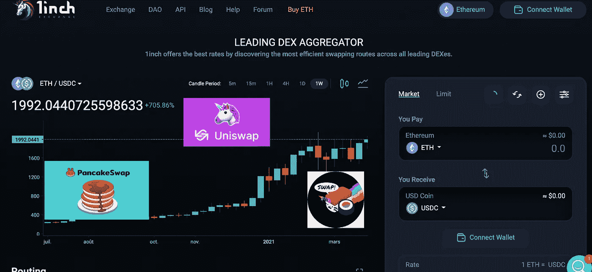

对于任何希望从 [**分散交易所**](https://en.wikipedia.org/wiki/Decentralized_exchange) 自动提取加密货币价格的人来说。

没有编码技能是必需的，为非开发人员。

第一步是访问下面的模板表，看看如何在 Google Sheets 中检索数据。

> [在此测试谷歌表单示例](https://docs.google.com/spreadsheets/d/1QODede4loYFnd9ig_f4vRiO4J4uptxn8zIx3qRsLDeA/edit?usp=sharing)

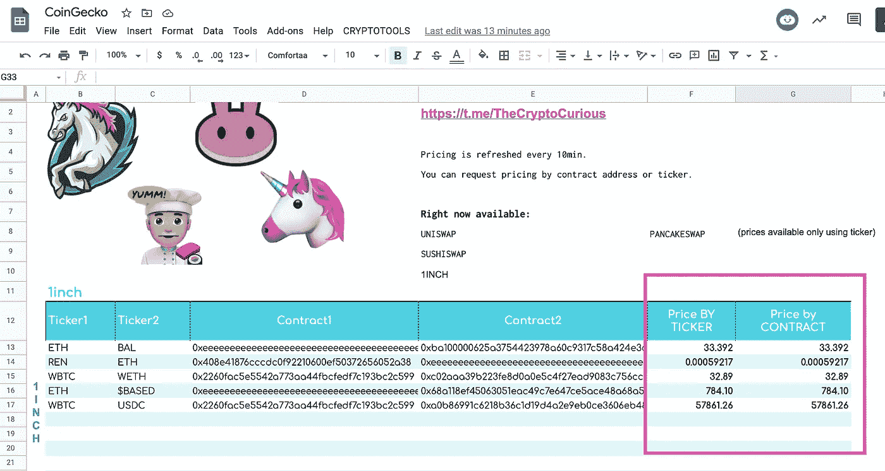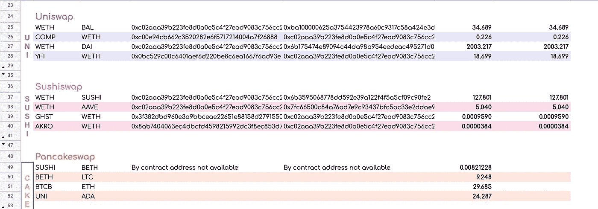

[https://docs.google.com/spreadsheets/d/1QODede4loYFnd9ig_f4vRiO4J4uptxn8zIx3qRsLDeA/edit?usp=sharing](https://docs.google.com/spreadsheets/d/1QODede4loYFnd9ig_f4vRiO4J4uptxn8zIx3qRsLDeA/edit?usp=sharing)

第二步，我将在 [Google Sheet](https://www.google.com/sheets/about/) 中描述 hot to get prices。

# 加密货币指数价格公式

如果您希望在 **Uniswap、Sushiswap、Pancakeswap 甚至 1INCH** 上检索任何加密货币的最新价格，您将需要使用**cryptodexpress()公式**。

语法:**cryptodexpress(token 1，Token2，Exchange** ，**【可选刷新属性】)**

***第一参数:*** *第一报价机或其合约地址示例 MKR 或*0x 9 F8 f 72 aa 9304 c8 b 593d 555 f 12 ef 6589 cc 3a 579 a 2****第二参数:*** *第二报价机或其合约地址* ***第三参数:*** *您所在的 dex 交易所的报价机**

*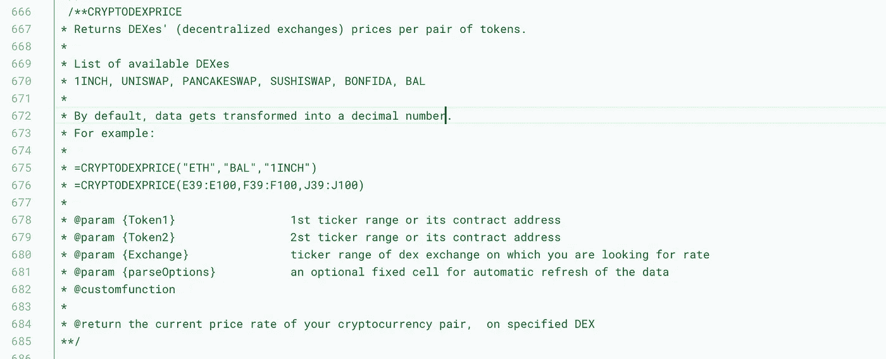*

*[https://raw.githubusercontent.com/Eloise1988/CRYPTOBALANCE/master/CRYPTOTOOLS_V2.gs](https://raw.githubusercontent.com/Eloise1988/CRYPTOBALANCE/master/CRYPTOTOOLS_V2.gs)*

*该公式将把加密货币价格导入谷歌电子表格。默认情况下，数据被转换成一系列数字，因此看起来更像是普通的价格数据导入。*

# *薄饼交换*

*[PancakeSwap 是由匿名开发者推出的**基于币安智能链的 DEX**](https://academy.binance.com/en/articles/a-guide-to-pancakeswap) ，在社区治理和农场流动性提供商令牌的能力方面，它类似于以太坊的 [SushiSwap](https://academy.binance.com/en/articles/your-guide-to-sushiswap) 。*

*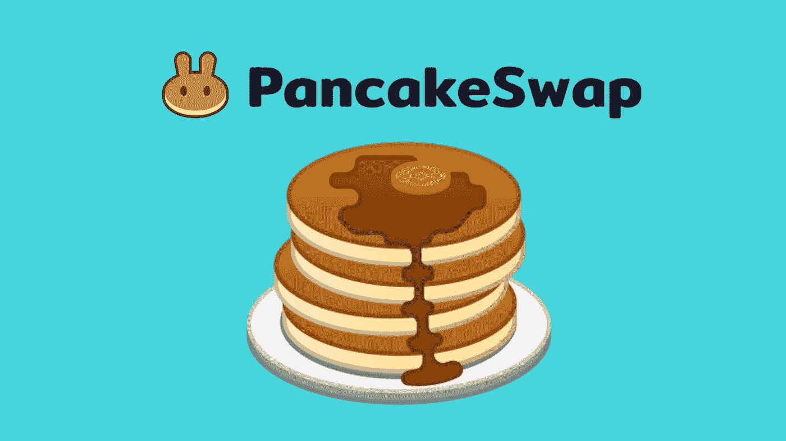*

*[https://pancakeswap.finance/](https://pancakeswap.finance/)*

*PancakeSwap 采用了一种**[**【AMM】**](https://academy.binance.com/en/articles/what-is-an-automated-market-maker-amm)**的自动做市商模式。这意味着，虽然你可以在平台上交易数字资产，但没有一个订单簿可以让你与其他人匹配。相反，你交易的是流动性池。*****

*****下面是如何从 Pancakeswap 中检索 WBNB-LTC 对价格:*****

*****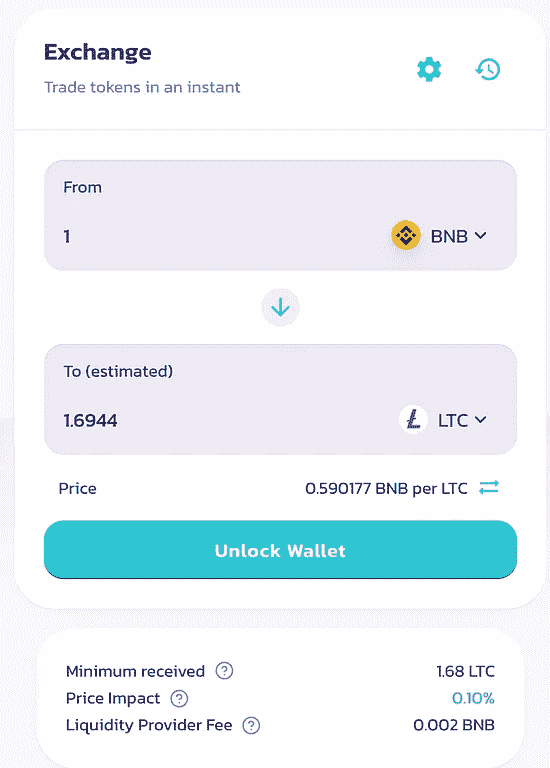**********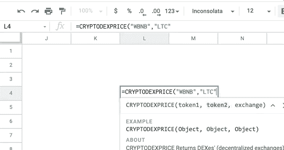

=CRYPTODEXPRICE(“WBNB”,”LTC”,”CAKE”)***** *****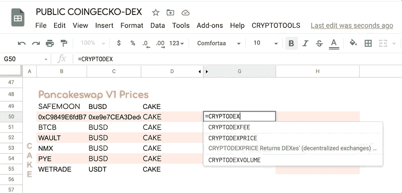*****

*****Calling an array of DEX prices on Pancakeswap V1*****

*****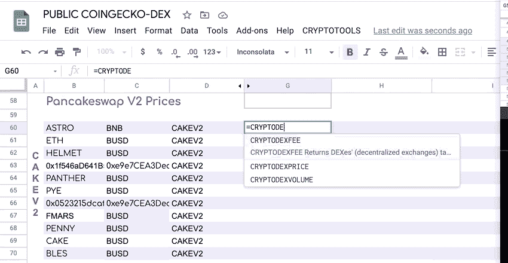*****

*****Calling an array of DEX prices on Pancakeswap V2*****

# *****UNISWAP*****

*****[**Uniswap** 是一个去中心化的金融协议](https://en.wikipedia.org/wiki/Uniswap)，用于交换加密货币。uni WAP 也是最初建立 uni WAP 协议的公司的名称。该协议通过使用智能合约，促进了[以太坊](https://en.wikipedia.org/wiki/Ethereum) [区块链](https://en.wikipedia.org/wiki/Blockchain)上加密货币代币之间的[自动化](https://en.wikipedia.org/wiki/Automation)交易。*****

*****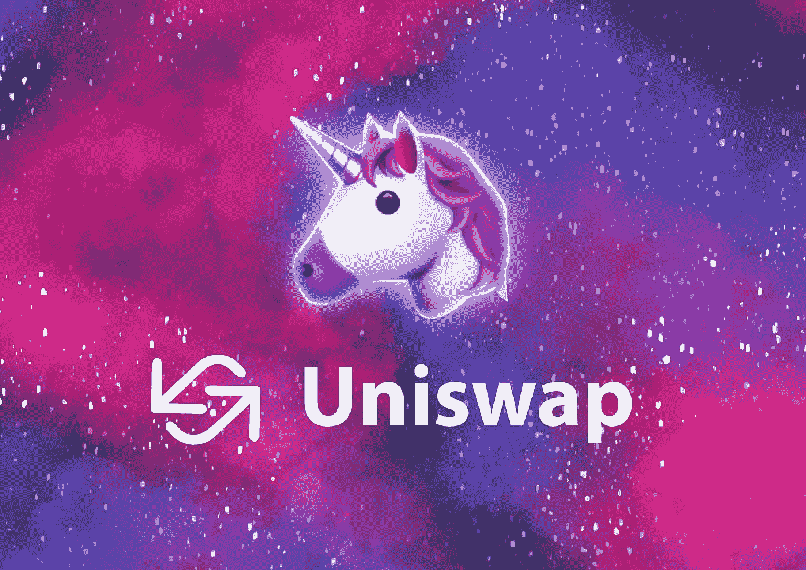*****

*****[https://uniswap.org/](https://uniswap.org/)*****

*****截至 2020 年 10 月，Uniswap 估计是最大的分散式交易所，按日交易量计算是第四大加密货币交易所。2021 年 3 月，Uniswap 每天为[流动性提供商](https://en.wikipedia.org/wiki/Liquidity_provider)产生约 200 万至 300 万美元的费用，这些流动性提供商促进加密货币交易的流动性市场。*****

*****下面是如何从 UniswapV2 检索 WETH-UNI 对价格:*****

*****= cryptodexpress(" WETH "，" UNI "，" UNI ")*****

*****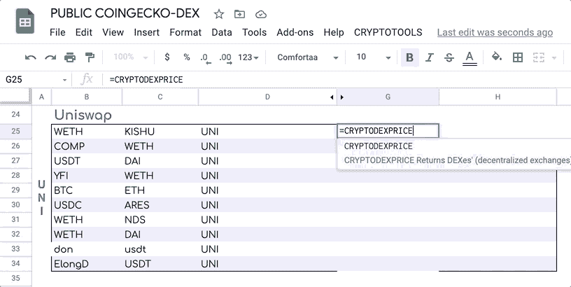*****

*****Calling an array of DEX prices on Uniswap*****

# *****1 英寸指数价格*****

*******价格反馈来自以太网上 1inch 的交易**。*****

*****= CRYPTODEXPRICE("尤尼"，" USDT "，" 1 英寸")*****

*****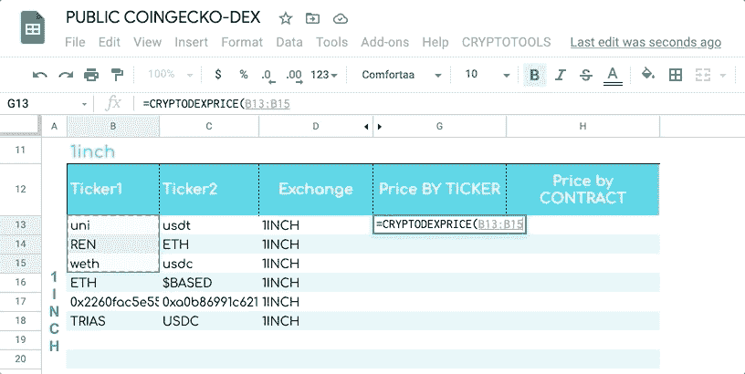*****

*****Calling an array of DEX prices on 1INCH*****

# *****自动/多边形索引价格*****

*****你可以得到自动代用币的价格。**价格馈送来自 Sushiswap 在 polygon/matic 网络上的交换**。*****

*****= cryptodexpress(" WMATIC "，" WETH "，" MATIC ")*****

*****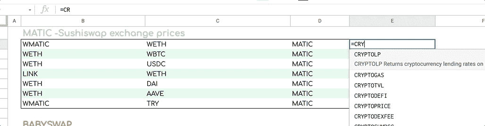*****

# *****FANTOM DEX 价格*****

*****你可以得到 fantom 智能链代币的价格。**价格反馈来自 Sushiswap 在 **Fantom 网络上的交易**。*******

***= cryptodexpress(" WFTM "，" USDC "，" FTM ")***

***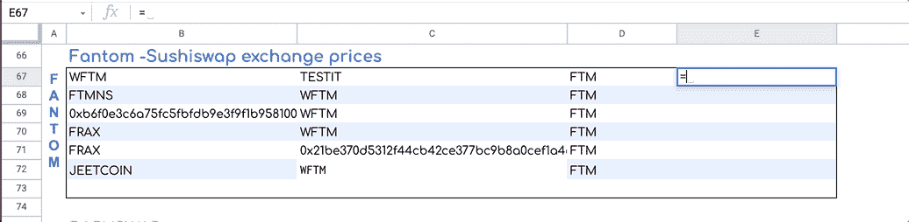***

# ***雪崩指数价格***

***你可以得到雪崩代币的价格。价格饲料来自**穿山甲在**雪崩网**上的 dex** 。***

***= cryptodexpress(" ETH "，" WAVAX "，" PNG ")***

***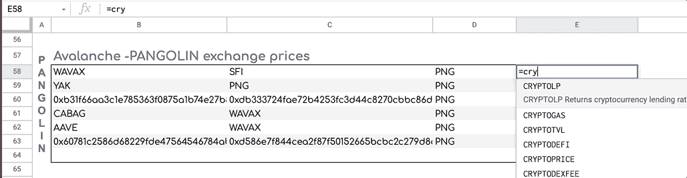***

# ***SUSHISWAP 指数价格***

*****价格反馈来自 sushiswap 在**以太网**上的交易**。***

***= cryptodexpress(" YFI "，" WETH "，"寿司")***

***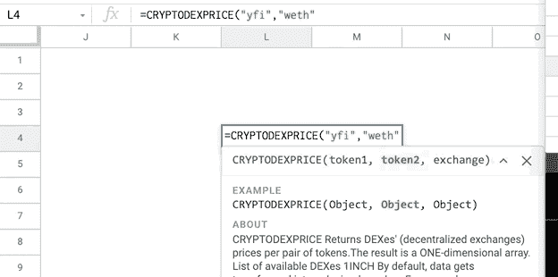***

***=CRYPTODEXPRICE(“YFI,”WETH”,”SUSHI”)***

# ***QUICKSWAP 指数价格***

*****价格来源于 quickswap 在**Matic/Polygon****network**上的交换**。***

***= cryptodexpress(" WMATIC "，" USDC "，"快速")***

***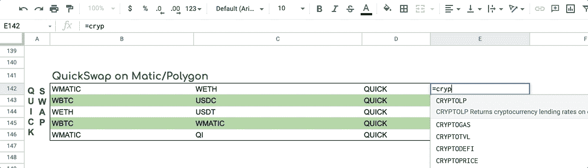***

***=CRYPTODEXPRICE(“WMATIC”,”USDC”,”QUICK”)***

# ***SPOOKYSWAP 指数价格***

*****价格馈送来自于**Fantom**网络**上的 spookyswap 的交换。***

***= cryptodexpress(" WFTM "，" ETH "，" BOO ")***

***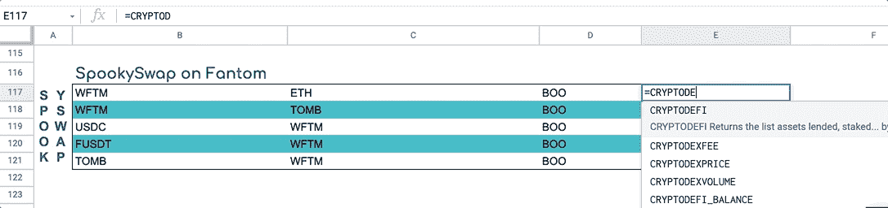***

***=CRYPTODEXPRICE(“WFTM”,”ETH”,”BOO”)***

# ***CELO SUSHISWAP 指数价格***

*****价格反馈来自 sushiswap 在 **Celo** **网**上的交流**。***

***= cryptodexpress(“BTC”、“CUSD”、“CELO”)***

***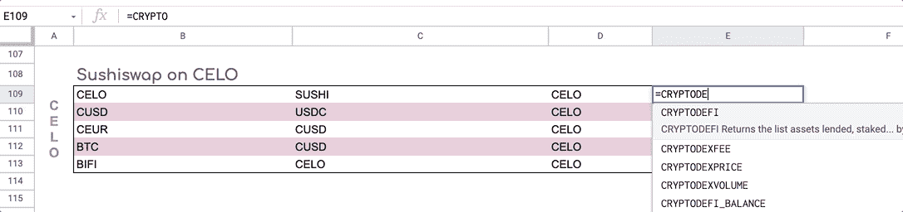***

***=CRYPTODEXPRICE(“BTC”,”CUSD”,”CELO”)***

# ***按合同地址***

***您还可以通过合同地址请求定价***

***按合同地址获取价格***

***= CRYPTODEXPRICE(合同地址 1，合同地址 2，交易所代码)***

***下面是如何使用合同地址从 Uniswap 检索竞争对手对价格:***

***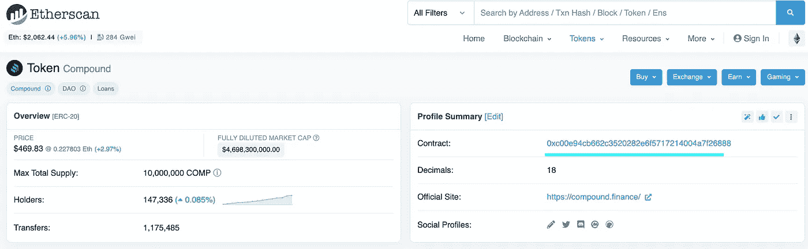***

***[COMPOUND (COMP) CONTRACT ADRESS](https://etherscan.io/token/0xc00e94cb662c3520282e6f5717214004a7f26888)***

***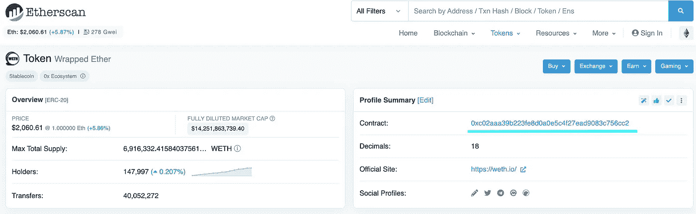***

***[WRAPPED ETH (WETH) CONTRACT ADRESS](https://etherscan.io/token/0xc02aaa39b223fe8d0a0e5c4f27ead9083c756cc2)***

***[复合(COMP)合同地址](https://etherscan.io/token/0xc00e94cb662c3520282e6f5717214004a7f26888):0x c 00 e 94 CB 662 c 3520282 e6f 5717214004 a7f 26888***

***[包装 ETH (WETH)合同地址](https://etherscan.io/token/0xc02aaa39b223fe8d0a0e5c4f27ead9083c756cc2)
0x c 02 AAA 39 b 223 Fe 8d 0 a 0 e 5 C4 f 27 EAD 9083 c 756 cc 2***

***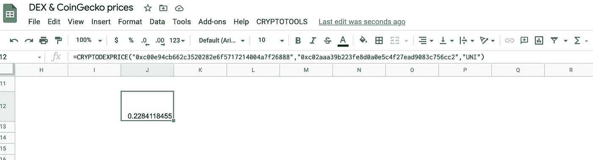***

***=CRYPTODEXPRICE(“0xc00e94cb662c3520282e6f5717214004a7f26888”,”0xc02aaa39b223fe8d0a0e5c4f27ead9083c756cc2",”UNI”)***

# ***硬币价格***

***对于那些对获得 fiat-crypto 对感兴趣的人来说，我写了相同类型的介质来说明如何在 Google Sheets 中从 Coingecko 获得价格***

*** [## Google Sheets 和 Excel 中的 CoinGecko 价格、交易量和市值

### 对于任何希望从 CoinGecko 中自动提取数据的人。

medium.com](/the-cryptocurious/coingecko-prices-volumes-market-caps-in-google-sheets-and-excel-a1a3ee201cb8) 

# 代码设置:

您有两种选择来访问代码:

1-很简单，您复制一份模板表。当你这样做时，它会自动保存一个新的模板和代码。

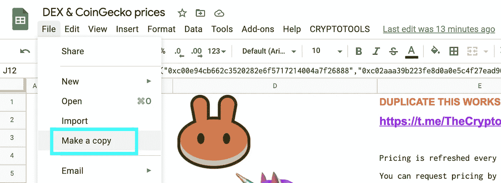

[https://docs.google.com/spreadsheets/d/1QODede4loYFnd9ig_f4vRiO4J4uptxn8zIx3qRsLDeA/edit?usp=sharing](https://docs.google.com/spreadsheets/d/1QODede4loYFnd9ig_f4vRiO4J4uptxn8zIx3qRsLDeA/edit?usp=sharing)

2 —涉及一些复制/粘贴。您需要将以下代码复制/粘贴到您希望使用的 Google Sheet 的应用程序脚本中。

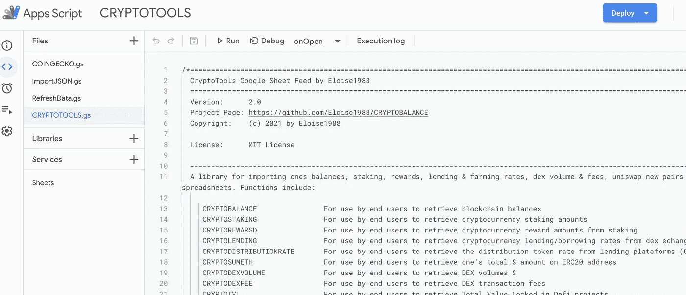

Tools -Script Editor

## [此处代码可用](https://raw.githubusercontent.com/Eloise1988/CRYPTOBALANCE/master/CRYPTOTOOLS_V2.gs)

更多细节可在以下介质中找到

 [## Google Sheet 开源加密工具设置

### 目标:向用户展示如何在 Google Sheet 中轻松访问定制的内置 CryptoTools 公式:

medium.com](/the-cryptocurious/google-sheet-open-source-cryptotools-set-up-9420e3940a8a) 

# 结论:

这个媒介向您展示了如何使用任何**加密货币对**的报价器或合同地址在 **Google Sheet** 中检索**价格**。公式看起来像:
=**cryptodexpress(token 1，Token2，Exchange)**

=**cryptodexpress(" COMP "，" WETH "，" SUSHI")**

> [此处为谷歌表单示例](https://docs.google.com/spreadsheets/d/1QODede4loYFnd9ig_f4vRiO4J4uptxn8zIx3qRsLDeA/edit?usp=sharing)

## 目前可用的交易所:

UNI (Uniswap)、蛋糕(Pancakeswap V1 价格)、CAKEV2 (Pancakeswap V2 价格)、寿司(Sushiswap)、1 英寸(1 英寸)

## 提神的

值被缓存 10 分钟。我的服务器每两分钟更新一次价格，但是为了优化 Google Sheets 上的 API 调用，数据以 10 分钟的时间表刷新。这就是为什么你会注意到价格上的小滞后。它可以直接在代码中修改。

*这是正在进行的工作。如果你发现错误，请不要犹豫让我知道。非常欢迎反馈。一个* [*电报聊天*](https://t.me/TheCryptoCurious) *也可供支持。如果这个项目增加了什么价值，CryptoTools 就在* [*patreon。*](https://www.patreon.com/cryptotools)

非常感谢您花时间阅读本文。

在这个充满挑战的时代，照顾好你自己和你的家人！

> 加入 coin monks[Telegram group](https://t.me/joinchat/EPmjKpNYwRMsBI4p)学习加密交易和投资

## 另外，阅读

*   最好的[密码交易机器人](/coinmonks/crypto-trading-bot-c2ffce8acb2a) | [网格交易](https://blog.coincodecap.com/grid-trading)
*   [加密复制交易平台](/coinmonks/top-10-crypto-copy-trading-platforms-for-beginners-d0c37c7d698c) | [如何在 WazirX 上购买比特币](/coinmonks/buy-bitcoin-on-wazirx-2d12b7989af1)
*   [CoinLoan 点评](/coinmonks/coinloan-review-18128b9badc4)|[Crypto.com 点评](/coinmonks/crypto-com-review-f143dca1f74c) | [火币保证金交易](/coinmonks/huobi-margin-trading-b3b06cdc1519)
*   [尤霍德勒 vs 科恩洛 vs 霍德诺特](/coinmonks/youhodler-vs-coinloan-vs-hodlnaut-b1050acde55a) | [Cryptohopper vs 哈斯博特](https://blog.coincodecap.com/cryptohopper-vs-haasbot)
*   [杠杆代币](/coinmonks/leveraged-token-3f5257808b22) | [最佳密码交易所](/coinmonks/crypto-exchange-dd2f9d6f3769) | [Paxful 点评](/coinmonks/paxful-review-4daf2354ab70)
*   [加密套利](/coinmonks/crypto-arbitrage-guide-how-to-make-money-as-a-beginner-62bfe5c868f6)指南| [如何做空比特币](/coinmonks/how-to-short-bitcoin-568a2d0b4ae5)
*   [如何在印度购买比特币？](/coinmonks/buy-bitcoin-in-india-feb50ddfef94) | [WazirX 审核](/coinmonks/wazirx-review-5c811b074f5b)
*   [印度比特币交易所](/coinmonks/bitcoin-exchange-in-india-7f1fe79715c9) | [比特币储蓄账户](/coinmonks/bitcoin-savings-account-e65b13f92451)
*   [币安收费](/coinmonks/binance-fees-8588ec17965) | [僵尸加密审查](/coinmonks/botcrypto-review-2021-build-your-own-trading-bot-coincodecap-6b8332d736c7) | [热点审查](/coinmonks/hotbit-review-cd5bec41dafb)
*   [我的密码副本交易经历](/coinmonks/my-experience-with-crypto-copy-trading-d6feb2ce3ac5) | [购买硬币评论](https://blog.coincodecap.com/buycoins-review)
*   [Bybit 融资融券交易](/coinmonks/bybit-margin-trading-e5071676244e) | [币安融资融券交易](/coinmonks/binance-margin-trading-c9eb5e9d2116) | [Overbit 审核](/coinmonks/overbit-review-9446ed4f2188)
*   [加密货币储蓄账户](/coinmonks/cryptocurrency-savings-accounts-be3bc0feffbf) | [YoBit 审核](/coinmonks/yobit-review-175464162c62) | [Bitbns 审核](/coinmonks/bitbns-review-38256a07e161)
*   [Botsfolio vs nap bots vs Mudrex](/coinmonks/botsfolio-vs-napbots-vs-mudrex-c81344970c02)|[gate . io 交流回顾](/coinmonks/gate-io-exchange-review-61bf87b7078f)
*   [最佳比特币保证金交易](/coinmonks/bitcoin-margin-trading-exchange-bcbfcbf7b8e3) | [萝莉点评](/coinmonks/lolli-review-e6ddc7895ad8) | [比特币保证金交易](https://blog.coincodecap.com/bityard-margin-trading)
*   [创造并出售你的第一个 NFT](https://blog.coincodecap.com/create-nft) | [本地比特币评论](/coinmonks/localbitcoins-review-6cc001c6ed56)
*   [加密保证金交易交易所](/coinmonks/crypto-margin-trading-exchanges-428b1f7ad108) | [赚取比特币](/coinmonks/earn-bitcoin-6e8bd3c592d9) | [Mudrex 投资](https://blog.coincodecap.com/mudrex-invest-review-the-best-way-to-invest-in-crypto)
*   [如何在印度购买以太坊？](https://blog.coincodecap.com/buy-ethereum-in-india) | [如何在币安购买比特币](https://blog.coincodecap.com/buy-bitcoin-binance)
*   [顶级付费加密货币和区块链课程](https://blog.coincodecap.com/blockchain-courses) | [Pionex vs 币安](https://blog.coincodecap.com/pionex-vs-binance)

> [直接在您的收件箱中获得最佳软件交易](/coinmonks/newsletters/coinmonks)

***