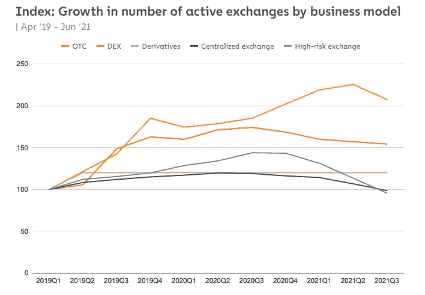
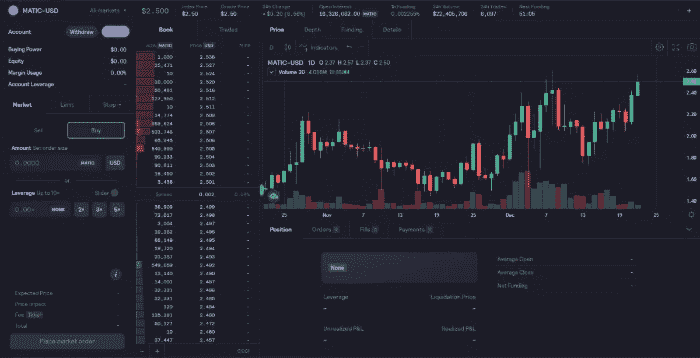
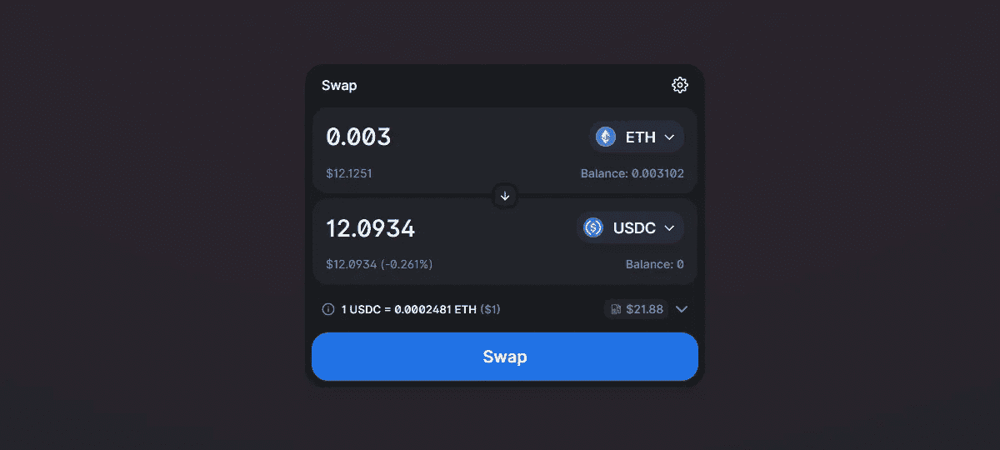
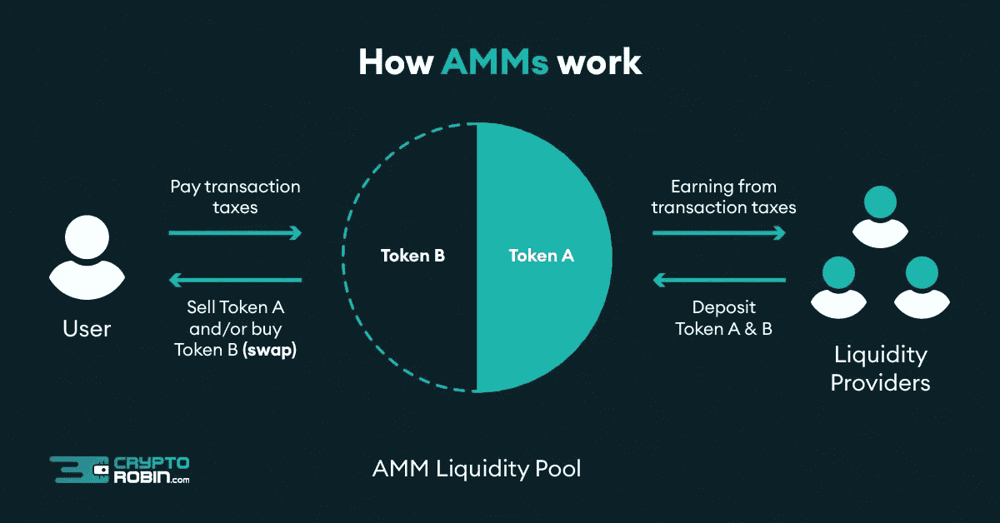
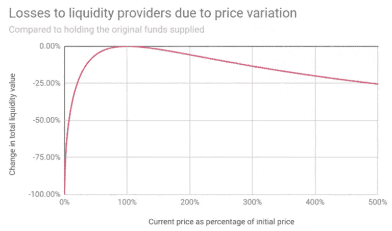
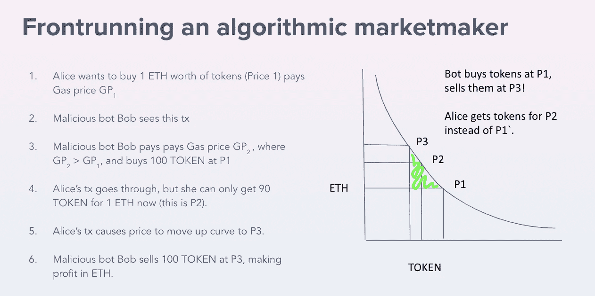

# 什么是 dex 和 AMMs？

> 原文：<https://medium.com/coinmonks/dexs-and-amms-c79bce065703?source=collection_archive---------0----------------------->

## 分散交易和自动做市商介绍

Photo by [fabio](https://unsplash.com/@fabioha) from Unsplash.

大多数加密用户使用集中交易所( [CEX](https://coinmarketcap.com/alexandria/glossary/centralized-exchange-cex) s)买卖加密资产。他们提供更多的[流动性](https://www.investopedia.com/terms/l/liquidity.asp)，有更大的[交易量](https://www.investopedia.com/terms/v/volume.asp)，有更快的交易速度。这些因素导致了他们的弱点。

集中式交易所有一个单一的失败点:它们可能被黑客攻击和利用。看看最新的大 [CEX](https://coinmarketcap.com/alexandria/glossary/centralized-exchange-cex) 黑客: [BitMart 损失 1.96 亿美元](https://rekt.news/bitmart-rekt/)， [Ascendex 损失 7700 万美元](https://rekt.news/ascendex-rekt/)， [Kucoin 损失 4500 万美元](https://rekt.news/epic-hack-homie/)。他们可以停止交易，阻止用户提取资金。集权可能被滥用。

分散式交易所的发展速度比任何其他加密交易所都要快。随着技术和用户体验的进步，我认为他们最终会取代 CEX 成为最受欢迎的交易所是不可避免的。

DEX Growth by Chainalysis

# DEX 到底是什么？

一个 [DEX](https://www.coinbase.com/learn/crypto-basics/what-is-a-dex) (又名分散交易所)是一个无需中介(如集中交易所)即可交易代币的平台。你不需要去 KYC 验证你自己，也不需要处理 CEX 和 T21 的限制，比如取款限额。DEX 主要有两种类型:基于订单簿的 DEX 和基于流动性池的 DEX。

## 基于订单簿的索引

基于 [DEX](https://www.coinbase.com/learn/crypto-basics/what-is-a-dex) 的订单簿与 [CEX](https://coinmarketcap.com/alexandria/glossary/centralized-exchange-cexúű) 的操作类似，用户可以按照自己选择的价格买卖订单。主要区别在于，在 T4 指数中，资产存在用户的钱包里，而不是交易所的钱包里。

订单簿 [DEX](https://www.coinbase.com/learn/crypto-basics/what-is-a-dex) s 可以在链上，也可以在链外。[链外订单簿](https://www.argent.xyz/learn/what-are-off-chain-order-book-dexs/)效率更高，交易保持在链外(例如在服务器上)，直到它们在链上被匹配和执行。 [dYdX](https://dydx.exchange/) 、 [DeversiFi](https://deversifi.com/) 、[血清](https://www.projectserum.com/)是这种类型中最受欢迎的 [DEX](https://www.coinbase.com/learn/crypto-basics/what-is-a-dex) 。

dYdX is an order book based DEX

## 基于流动性池的指数

为了理解基于 [LP](https://www.gemini.com/cryptopedia/what-is-a-liquidity-pool-crypto-market-liquidity) 的 [DEX](https://www.coinbase.com/learn/crypto-basics/what-is-a-dex) s，首先我们需要理解什么是[流动性池](https://www.gemini.com/cryptopedia/what-is-a-liquidity-pool-crypto-market-liquidity)。[流动性池](https://www.gemini.com/cryptopedia/what-is-a-liquidity-pool-crypto-market-liquidity)是一个[智能合约](https://www.investopedia.com/terms/s/smart-contracts.asp)中的代币池，随时可以兑换成它们的配对代币。

通常一个 [LP](https://www.gemini.com/cryptopedia/what-is-a-liquidity-pool-crypto-market-liquidity) 持有 2 个代币，每个池都有一个该对代币的市场。严重简化:当你想在 [Uniswap](https://app.uniswap.org/#/swap) 上把 [ETH](https://ethereum.org/en/eth/) 换成 [USDC](https://coinmarketcap.com/hu/currencies/usd-coin/) 的时候，你拿出 [USDC](https://coinmarketcap.com/hu/currencies/usd-coin/) 把 [ETH](https://ethereum.org/en/eth/) 给 ETH/USDC 池。如果你想更深入地了解流动性池，我建议你观看这个视频:

How do LIquidity Pools work? — A video by [Finematics](https://www.youtube.com/channel/UCh1ob28ceGdqohUnR7vBACA) on Youtube

大多数基于流动性池的 DEX 使用自动做市商( [AMM](/balancer-protocol/what-is-an-automated-market-maker-amm-588954fc5ff7) )通过算法预先确定资产价格。AMM 是 DeFi 最具创新性的发明之一，因为它实现了高效率。大多数 [DEX](https://www.coinbase.com/learn/crypto-basics/what-is-a-dex) 都是基于 [AMM](/balancer-protocol/what-is-an-automated-market-maker-amm-588954fc5ff7) 的，比如 [Uniswap](https://app.uniswap.org/#/swap) 、 [Curve](https://curve.fi/) 、 [Balancer](https://app.balancer.fi/#/) 、 [Bancor](https://www.bancor.network/) 、 [TerraSwap](https://app.terraswap.io/) 和 [Raydium](https://raydium.io/) 。

[The Uniswap Interface](https://app.uniswap.org/#/swap)

# 自动做市商(AMM)

[AMM](/balancer-protocol/what-is-an-automated-market-maker-amm-588954fc5ff7) s 使得交易者可以无缝执行他们的订单，而不需要一个集中的做市商在 [CEX](https://coinmarketcap.com/alexandria/glossary/centralized-exchange-cex) 上提供[流动性](https://www.investopedia.com/terms/l/liquidity.asp)。订单通过智能合约[自动执行，智能合约](https://www.investopedia.com/terms/s/smart-contracts.asp)将计算交易价格。

[AMM](/balancer-protocol/what-is-an-automated-market-maker-amm-588954fc5ff7) 是基于[流动性池](https://www.gemini.com/cryptopedia/what-is-a-liquidity-pool-crypto-market-liquidity)通过算法为资产定价的数学函数。有几个 [AMM](/balancer-protocol/what-is-an-automated-market-maker-amm-588954fc5ff7) 公式，但我们将重点关注恒定产品做市商，因为它是应用最广泛的。

Image from [Crypto Robin](https://cryptorobin.com/)

## 恒定产品做市商

`**x * y = k**`

由 [Uniswap](https://app.uniswap.org/#/swap) 推广，x 和 y 代表[流动性池](https://www.gemini.com/cryptopedia/what-is-a-liquidity-pool-crypto-market-liquidity)中两个代币的数量，k 代表乘积。该公式有助于根据可用数量为这两种代币创建一个价格范围。要保持 k 不变，当 x 的供给增加时，y 的供给必须减少。让我们看看它是如何工作的:

截至 2021 年 12 月 19 日，Uniswap 的 WETH/USDT 流动性池中有 22，538 [WETH](https://weth.io/) 和 88，378，445 [USDT](https://coinmarketcap.com/hu/currencies/tether/) 。该比率意味着 ETH 的价格为 88378445/22538 = 3921 USDT。

让我们假设 ETH T1 的价格在 SushiSwap 这样的另一个协议上会降到 3821 T2 USDT T3。[套利者](https://www.investopedia.com/terms/a/arbitrageur.asp)将通过在类似 [SushiSwap](https://app.sushi.com/swap) 的交易所购买便宜的 [ETH](https://ethereum.org/en/eth/) 并在 [Uniswap](https://pools.fyi/#/returns/0x0d4a11d5eeaac28ec3f61d100daf4d40471f1852) 卖出获利来利用差价。套利者重复这一过程，直到两个交易所的价格相等。这使得 [DeFi](https://www.coindesk.com/learn/what-is-defi/) 协议的价格保持稳定。

# 流行的自动做市商

Uniswap brand from [uniswap.org](https://uniswap.org/)

## Uniswap

粉色独角兽的旅程始于 2018 年 11 月 [Uniswap 版本 1](https://docs.uniswap.org/protocol/V1/introduction) 在以太坊上部署。从推出到今天，他们仍然是推广恒定产品做市商公式(x * y = k)的顶级 [AMM](/balancer-protocol/what-is-an-automated-market-maker-amm-588954fc5ff7) s. [Uniswap](https://pools.fyi/#/returns/0x0d4a11d5eeaac28ec3f61d100daf4d40471f1852) 之一。2021 年 5 月 5 日，他们推出了他们的最新版本， [Uniswap 第 3 版](https://www.youtube.com/watch?v=Ehm-OYBmlPM)，其中引入了新功能，如[集中流动性](https://docs.uniswap.org/protocol/concepts/V3-overview/concentrated-liquidity)和[多重费用层级](https://help.uniswap.org/en/articles/5391541-provide-liquidity-on-uniswap-v3)。 [Uniswap](https://pools.fyi/#/returns/0x0d4a11d5eeaac28ec3f61d100daf4d40471f1852) 是总价值锁定 [TVL](https://coinmarketcap.com/alexandria/glossary/total-value-locked-tvl) 的第二大 [DEX](https://cointelegraph.com/defi-101/what-are-decentralized-exchanges-and-how-do-dexs-work) ，结果被 [Curve Finance](https://curve.fi/) 挤掉。

## 曲线金融

[曲线](https://curve.fi/)是一种[指数](https://www.coinbase.com/learn/crypto-basics/what-is-a-dex)，为类似资产之间的高效交易而设计。这对生态系统很有用，因为有大量的[包装的](https://academy.binance.com/en/articles/what-are-wrapped-tokens)或[合成代币](https://docs.umaproject.org/synthetic-tokens/what-are-synthetic-assets)需要它们的价格与它们模仿的资产相同。Curve 使用了 [Stableswap 不变量](https://curve.readthedocs.io/exchange-overview.html) [AMM](/balancer-protocol/what-is-an-automated-market-maker-amm-588954fc5ff7) 公式，并率先引入了[基础池和元池](https://resources.curve.fi/faq/base-and-metapools)。目前[曲线金融](https://curve.fi/)拥有所有[指标](https://www.coinbase.com/learn/crypto-basics/what-is-a-dex)中最大的 [TVL](https://coinmarketcap.com/alexandria/glossary/total-value-locked-tvl)

Curve brand from [curve.fi](https://curve.fi/)

# 使用 AMMs 时需要注意的风险

## 非永久性损失

非永久性损失是相对于持有代币和提供[流动性](https://www.investopedia.com/terms/l/liquidity.asp)而言的利润损失。当你将代币从池中移除时，你的损失成为永久损失。如果你想更深入地了解短暂的损失，请观看这段内容丰富的视频:

What is Impermanent Loss? — A video by [Finematics](https://www.youtube.com/channel/UCh1ob28ceGdqohUnR7vBACA) on Youtube

Impernament loss % — Curve whitepaper

## 价格滑动和超前运行

[价格滑移](https://www.angelone.in/knowledge-center/online-share-trading/slippage-trading)是交易执行时预期价格和价格之间的差异。当池中的[流动性](https://www.investopedia.com/terms/l/liquidity.asp)很少，并且执行一个大订单时，滑点最高。低[流动性](https://www.investopedia.com/terms/l/liquidity.asp) +大订单=坏消息又名高[价格滑移](https://www.angelone.in/knowledge-center/online-share-trading/slippage-trading)。您可以在大多数 [DEX](https://www.coinbase.com/learn/crypto-basics/what-is-a-dex) s 中设置您的滑动公差，越低(< 1%)越好。

在 [AMM](/balancer-protocol/what-is-an-automated-market-maker-amm-588954fc5ff7) 上下的订单会向区块链广播给所有人。[领跑者机器人](https://www.paradigm.xyz/2020/08/ethereum-is-a-dark-forest)通过挑选订单获利，而[领跑者](https://www.youtube.com/watch?v=UZ-NNd6yjFM)通过设置更高的交易费让他们的订单比你的订单挖掘得更快，提高你为资产支付的价格，然后在你以更高价格买入后出售。这被称为[三明治攻击](https://coinmarketcap.com/alexandria/article/what-are-sandwich-attacks-in-defi-and-how-can-you-avoid-them)。现在有一些 DEX 提供了对这种攻击的保护，比如 cow swap T21。

Front running from [blog.enigma.co](https://blog.enigma.co/preventing-dex-front-running-with-enigma-df3f0b5b9e78)

# 结论

每天都有成千上万的新人进入分散式金融领域。DEX 是生态系统的重要组成部分，因为它们决定了加密资产的相对价值。DEX 只会越来越大，它们取代我们这个时代的集中式交易所只是时间问题。

> 加入 Coinmonks [电报频道](https://t.me/coincodecap)和 [Youtube 频道](https://www.youtube.com/c/coinmonks/videos)了解加密交易和投资

## 另外，阅读

*   [Exness 点评](https://blog.coincodecap.com/exness-review)|[moon xbt Vs bit get Vs Bingbon](https://blog.coincodecap.com/bingbon-vs-bitget-vs-moonxbt)
*   [如何开始通过加密贷款赚取被动收入](https://blog.coincodecap.com/passive-income-crypto-lending)
*   [加密货币储蓄账户](/coinmonks/cryptocurrency-savings-accounts-be3bc0feffbf) | [加密交易机器人](https://blog.coincodecap.com/best-crypto-trading-bots)
*   [BigONE 交易所评论](/coinmonks/bigone-exchange-review-64705d85a1d4) | [CEX。IO 审查](https://blog.coincodecap.com/cex-io-review) | [交换区审查](/coinmonks/swapzone-review-crypto-exchange-data-aggregator-e0ad78e55ed7)
*   [最佳比特币保证金交易](/coinmonks/bitcoin-margin-trading-exchange-bcbfcbf7b8e3) | [比特币保证金交易](https://blog.coincodecap.com/bityard-margin-trading)
*   [加密保证金交易交易所](/coinmonks/crypto-margin-trading-exchanges-428b1f7ad108) | [赚取比特币](/coinmonks/earn-bitcoin-6e8bd3c592d9)
*   [WazirX vs CoinDCX vs bit bns](/coinmonks/wazirx-vs-coindcx-vs-bitbns-149f4f19a2f1)|[block fi vs coin loan vs Nexo](/coinmonks/blockfi-vs-coinloan-vs-nexo-cb624635230d)
*   [BlockFi 信用卡](https://blog.coincodecap.com/blockfi-credit-card) | [如何在币安购买比特币](https://blog.coincodecap.com/buy-bitcoin-binance)
*   [火币交易机器人](https://blog.coincodecap.com/huobi-trading-bot) | [如何购买 ADA](https://blog.coincodecap.com/buy-ada-cardano) | [Geco。一次审查](https://blog.coincodecap.com/geco-one-review)
*   [加密复制交易平台](/coinmonks/top-10-crypto-copy-trading-platforms-for-beginners-d0c37c7d698c) | [五大 BlockFi 替代品](https://blog.coincodecap.com/blockfi-alternatives)
*   【Crypto.com 评论】|[|](/coinmonks/crypto-com-review-f143dca1f74c)|[信用交易](/coinmonks/huobi-margin-trading-b3b06cdc1519)
*   [Bybit vs 币安](https://blog.coincodecap.com/bybit-binance-moonxbt)|[stealth x 回顾](/coinmonks/stealthex-review-396c67309988) | [Probit 回顾](https://blog.coincodecap.com/probit-review)
*   [顶级付费加密货币和区块链课程](https://blog.coincodecap.com/blockchain-courses)
*   [在美国如何使用 BitMEX？](https://blog.coincodecap.com/use-bitmex-in-usa) | [BitMEX 评论](https://blog.coincodecap.com/bitmex-review)