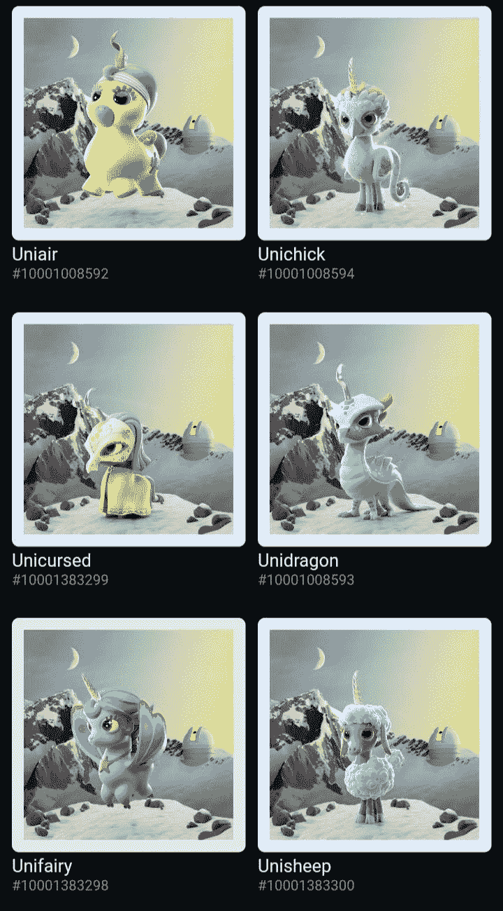

# 泥土中的钻石或化石

> 原文：<https://medium.com/coinmonks/diamond-or-fossils-in-the-dirt-f29933dc4d20?source=collection_archive---------14----------------------->

## 龙真的存在——在区块链上

多链怪物以前被称为波尔卡蒙怪物，现在被制作成精美的动画**交叉链怪物**，数量不等，等待在数字增强包中被发现。这些 NFT 将在即将到来的离线和在线游戏中发挥重要作用。此外，多链怪兽还提供了 ERC-20 & BEP-20 PMON 以及 NFT 赌注等 DeFi 功能。

NFTs 和即玩即赚游戏已经席卷了 cryptoverse(或者更好的说法是元宇宙)。您可能听说过或见过 CryptoPunks 和 Axie Infinity，因为它们是 NFTs 领域家喻户晓的名字。NFT 的项目不止两个，也许是两千个，每两个小时就有一个新项目在不同的链或网络上推出。以太坊众所周知是 NFT 的发电站，但随着 NFT 在其他网络上的蓬勃发展，它开始发生变化，可能是因为以太坊上的[高交易费](http://gasnow.org)。即便如此，以太坊仍然保持着 NFT 最高销售额的记录。

这应该是多链怪物的一个优势，因为它们可以在多个链上使用(在撰写本文时，以太坊和币安智能链)。Polychain Monsters 在两家连锁店都有很大的销售额，在撰写本文时创下了 29 eth(*99298*美元)的记录，在 OpenSea 和 SCV 金融网站上创下了 250 bnb(*108825*美元)的记录。

尽管他们的游戏仍处于开发阶段，他们正在提供 DeFi 功能，你已经可以下注你的怪物 NFT 来赚取$PMON 代币，你的怪物越稀有，你的收集分数就越高。这意味着你的怪物越稀有，你赚取的代币就越多。

他们还提供一个联合营销项目，在上市前阶段推广其他项目，称为助推孵化。**特殊怪物**是为这些代表项目的 IDO 或其他特殊优惠中白名单中的一张门票或一个空间的项目而设计的。

你知道之后会发生什么吗？

更多的助推器被打开，希望找到这些特殊的怪物。三个怪物在每个助推器包，每个助推器包花费 1 $PMON。找到特殊怪物的概率可以低至 0.01%。

每当一个助推器包被打开，50%的每个$PMON 将被烧毁，25%的每个$PMON 将被转移到收藏家赌注池，15%的每个$PMON 将被转移到赌注池，10%的每个$PMON 将被转移到收费钱包和再投资。大家双赢！

谈到胜利，多链怪物已经宣布了两个游戏赚取。 [PolyChain Islands](/polychainmonsters/play-to-earn-discover-the-polychain-islands-8111e50392aa) 和 [Polymon World](/polychainmonsters/welcome-to-polymon-world-the-3d-multiplayer-play-to-earn-rpg-753aaf4a941d) ，还有后者的预告片(*)这能成为衡量任何人有多早的标准吗？不是财务建议 tho* )，两款游戏都有惊人的功能。

综上所述，你更喜欢拥有生活在区块链的龙的化石还是宠物龙？

> 加入 Coinmonks [电报频道](https://t.me/coincodecap)和 [Youtube 频道](https://www.youtube.com/c/coinmonks/videos)了解加密交易和投资

## 另外，阅读

*   [网格交易机器人](https://blog.coincodecap.com/grid-trading) | [Cryptohopper 审查](/coinmonks/cryptohopper-review-a388ff5bae88) | [Bexplus 审查](https://blog.coincodecap.com/bexplus-review)
*   [7 个最佳零费用加密交易平台](https://blog.coincodecap.com/zero-fee-crypto-exchanges)
*   [分散交易所](https://blog.coincodecap.com/what-are-decentralized-exchanges) | [比特恩斯 FIP](https://blog.coincodecap.com/bitbns-fip) | [皮奥克斯评论](https://blog.coincodecap.com/pionex-review-exchange-with-crypto-trading-bot)
*   [用信用卡购买密码的 10 个最佳地点](https://blog.coincodecap.com/buy-crypto-with-credit-card)
*   [新加坡十大最佳加密交易所](https://blog.coincodecap.com/crypto-exchange-in-singapore) | [购买 AXS](https://blog.coincodecap.com/buy-axs-token)
*   [投资印度的最佳加密软件](https://blog.coincodecap.com/best-crypto-to-invest-in-india-in-2021) | [WazirX P2P](https://blog.coincodecap.com/wazirx-p2p)
*   [加拿大最好的加密交易机器人](https://blog.coincodecap.com/5-best-crypto-trading-bots-in-canada) | [库币评论](https://blog.coincodecap.com/kucoin-review)
*   [用于 Huobi 的加密交易信号](https://blog.coincodecap.com/huobi-crypto-trading-signals) | [HitBTC 审核](/coinmonks/hitbtc-review-c5143c5d53c2)
*   [如何在 FTX 交易所交易期货](https://blog.coincodecap.com/ftx-futures-trading) | [OKEx vs 币安](https://blog.coincodecap.com/okex-vs-binance)
*   [OKEx vs KuCoin](https://blog.coincodecap.com/okex-kucoin) | [摄氏替代品](https://blog.coincodecap.com/celsius-alternatives) | [如何购买 VeChain](https://blog.coincodecap.com/buy-vechain)
*   [币安期货交易](https://blog.coincodecap.com/binance-futures-trading)|[3 comas vs Mudrex vs eToro](https://blog.coincodecap.com/mudrex-3commas-etoro)
*   [如何购买 Monero](https://blog.coincodecap.com/buy-monero) | [IDEX 评论](https://blog.coincodecap.com/idex-review) | [BitKan 交易机器人](https://blog.coincodecap.com/bitkan-trading-bot)
*   [尤霍德勒 vs 科恩洛 vs 霍德诺特](/coinmonks/youhodler-vs-coinloan-vs-hodlnaut-b1050acde55a) | [Cryptohopper vs 哈斯博特](https://blog.coincodecap.com/cryptohopper-vs-haasbot)
*   [顶级付费加密货币和区块链课程](https://blog.coincodecap.com/blockchain-courses) | [币安评论](/coinmonks/binance-review-ee10d3bf3b6e)
*   [WazirX vs CoinDCX vs bit bns](/coinmonks/wazirx-vs-coindcx-vs-bitbns-149f4f19a2f1)|[block fi vs coin loan vs Nexo](/coinmonks/blockfi-vs-coinloan-vs-nexo-cb624635230d)
*   [杠杆代币](/coinmonks/leveraged-token-3f5257808b22) | [最佳密码交易所](/coinmonks/crypto-exchange-dd2f9d6f3769) | [Paxful 点评](/coinmonks/paxful-review-4daf2354ab70)
*   [加密套利](/coinmonks/crypto-arbitrage-guide-how-to-make-money-as-a-beginner-62bfe5c868f6)指南| [如何做空比特币](/coinmonks/how-to-short-bitcoin-568a2d0b4ae5) | [1xBit 回顾](https://blog.coincodecap.com/1xbit-review)
*   [如何在印度购买以太坊？](https://blog.coincodecap.com/buy-ethereum-in-india) | [如何在币安购买比特币](https://blog.coincodecap.com/buy-bitcoin-binance)
*   [在美国如何使用 BitMEX？](https://blog.coincodecap.com/use-bitmex-in-usa) | [BitMEX 评论](https://blog.coincodecap.com/bitmex-review) | [买入索拉纳](https://blog.coincodecap.com/buy-solana)