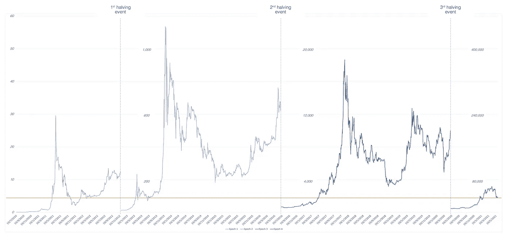
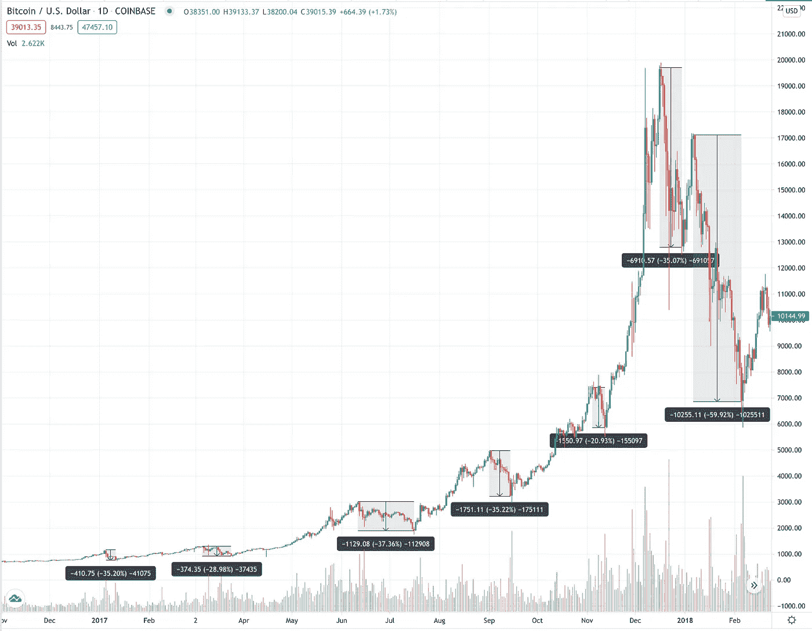
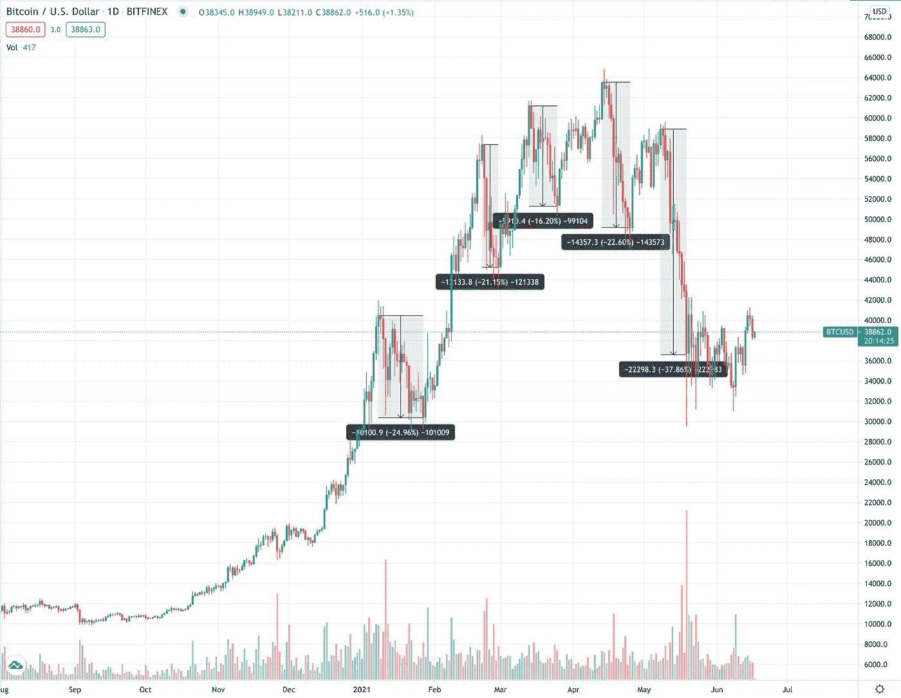
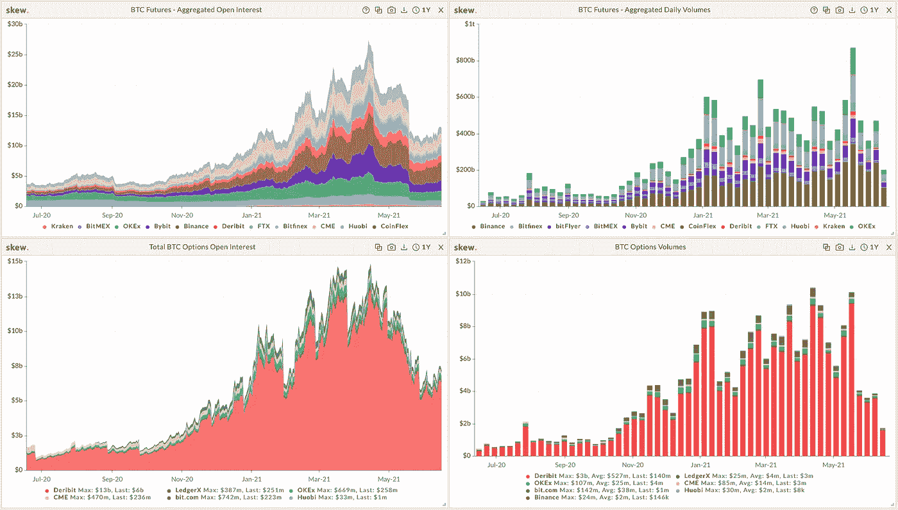
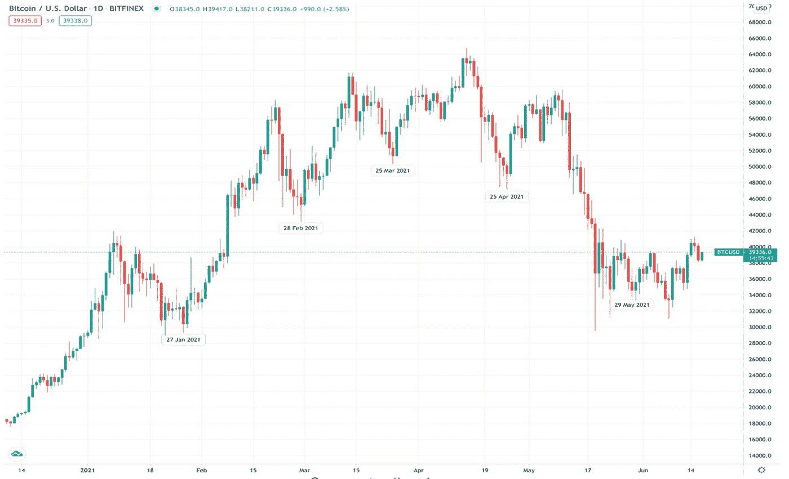
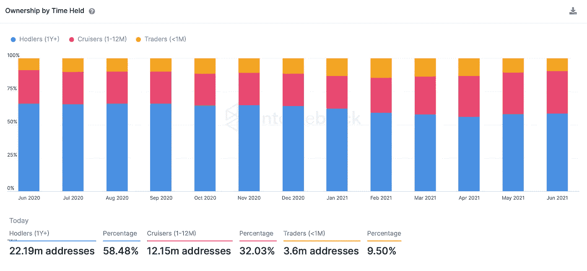
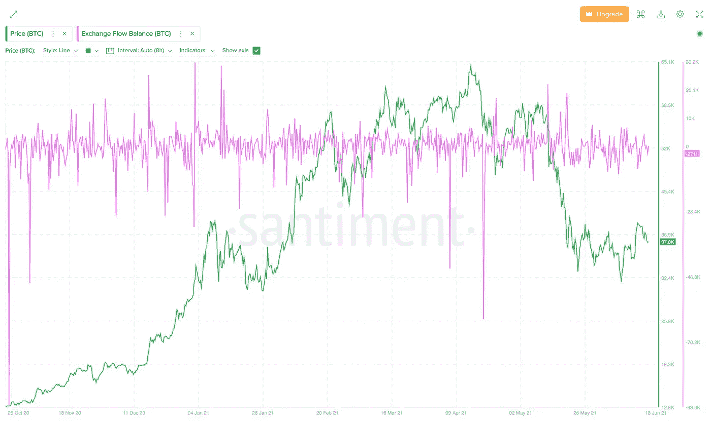

# 全球变暖达到了秘密冬天吗？

> 原文：<https://medium.com/coinmonks/did-global-warming-reach-crypto-winters-58d34fe9358?source=collection_archive---------3----------------------->

Photo by [Chris Liverani](https://unsplash.com/@chrisliverani?utm_source=medium&utm_medium=referral) on [Unsplash](https://unsplash.com?utm_source=medium&utm_medium=referral)

## 文章作者 [Lesia M.](https://twitter.com/LesiaMrch)

## 关键要点

*   在前两个减半周期中，比特币价格遵循了类似的模式:急剧飙升之后是一个被称为“加密冬天”的大范围熊市；
*   在比特币牛市期间，超过 20%的修正很常见；
*   由于先进的市场基础设施、采用和支持，当前周期不同于以前的周期；
*   对加密衍生品的高需求影响了 BTC 的基本表现；
*   随着最近的价格下跌，比特币出现了强劲的购买和积累活动；
*   新的 DeFi 贷款解决方案通过提供有吸引力的收益率来减轻抛售压力。

在我们之前的研究论文中，我们研究了比特币减半周期以及它们如何影响加密货币的市场表现。在之前的两个减半周期中，比特币价格遵循了类似的模式，在减半事件后的头一年至一年半时间里，比特币价格出现了强劲的牛市，随后是暴跌和漫长的加密冬天。

**图一。**减半事件后的比特币时代

*Source: JKL Research*

上面是 4 个比特币减半的时代，每个时代都比前一个时代扩大了 1:20。橙色线是最近暴跌的基础，为每个时期的第一轮牛市之后的反转提供了比较。例如，在 Epoch 2 的第一轮牛市中，BTC 价格在 230 美元左右见顶，随后下跌 65%，跌至 80 美元以下。在第三时代，BTC 在一系列重大调整中损失了近 40%的价值。在第四个纪元中，我们最近见证了自之前的历史高点 64.2K 美元(币安)以来 52%的价格回调。事实上，这种修正尽管影响巨大，但对比特币的牛市来说并不新鲜。

**图二。**第三阶段牛市——超过-20%的重大修正

**图三。**第四阶段牛市——超过-20%的重大修正

*Source: tradingview.com*

将最近的 BTC 价格行为与前三个时期进行比较，我们在时期 3 中观察到一个非常相似的模式。市场似乎不稳定，多次修正打破了整体上升趋势。鉴于这种相似性，我们将对第三和第四个纪元的牛市进行详细的比较。

这两个图表都表明，在 BTC 牛市中，超过 20%的强劲修正发生得相当频繁，并不是看跌情绪转变的指标。在第三纪元，这些重大的修正持续了将近一年的时间，每次修正间隔 2-3 个月。相比之下，在 2021 年，几乎每个月都会出现重大的价格调整。

在前一个时期，BTC 价格在见顶之前经历了 5 次大的调整。最近发生在 2021 年 5 月的调整已经是当前时代的第五次重大调整。然而，这并不意味着峰值就在眼前。如前所述，最近的 BTC 价格行为不同于以前的划时代行为，证明了“过去的表现并不能保证未来的结果”的免责声明。从上述比较中可以得出的唯一明确的结论是，超过 20%的修正对 BTC 牛市来说并不新鲜，也不意味着即将到来的崩盘。

事实上，有许多原因导致当前的周期与我们以前见过的任何周期完全不同。随着加密货币市场的发展，其基础设施、采用和支持也在发展。我们首先将比特币不断增长的基础设施视为当前周期的主要差异因素。

# BTC 市场和基础设施

基于对加密货币交易日益增长的兴趣和对更多管理比特币风险的工具日益增长的需求，CME 集团于 2017 年 12 月 18 日推出了比特币期货，随后于 2020 年 1 月 13 日增加了比特币期货的期权。最近的进展是 CME 准备在 2021 年 5 月 3 日推出微型比特币期货。这些期货合约的大小是一个比特币的十分之一。它们的出现既反映了比特币价格的上涨，也反映了广大市场参与者不断增长的需求。

许多金融机构对其投资分配有与合规性相关的限制。对他们来说，投资加密衍生品可能比直接投资基础加密货币更容易接近。对于那些寻求对冲 BTC 头寸的投资者来说，衍生产品也很有趣，尤其是与高度波动的加密货币市场相关的产品。

页（page 的缩写）T. Jones 将当前的比特币市场与 1970 年的黄金市场进行了比较。这是黄金首次作为期货工具被产品化，并进入牛市，价格自年以来翻了两番。[1]保罗·都铎·琼斯在这个类比中确实是正确的，因为比特币在 2017 年 12 月推出期货到 2021 年 4 月达到历史最高点之间的价格上涨了 5 倍以上。

随着合约数量和未平仓合约数量的持续增长，不断发展的基础设施已经改变了比特币市场。图 4 中的图表显示了一年内比特币期权和期货合约的交易量和未平仓合约的变化。

高盛(Goldman Sachs)数字资产全球主管马修·麦克德莫特(Mathew McDermott)解释说，比特币相关金融产品的流动性在过去一年里大幅增加。“2020 年 4 月至 2021 年 4 月期间，比特币美元现货日交易量从约 3 亿美元增至约 15 亿美元，芝加哥商业交易所比特币期货日交易量从约 2 亿美元增至近 20 亿美元。这非常清楚地表明，机构需求正在流入这个市场，而这才刚刚开始”。[2]

**图 4。** BTC 期权&期货—未平仓合约和交易量

*Source: skew*

我们可以得出结论，对比特币金融产品的需求在 2020 年 9 月底左右开始增长，在 2021 年 1 月左右进一步加速。大约在这个时候，一种温和的模式开始出现，BTC 将在每个日历月的月底下降。比特币社区一直在猜测，这些月度波动与衍生品合约月底到期有关。尽管这似乎是合理的，但合同到期日仍有一些差异，即每月的最后一个星期五:

1 月 27 日 BTC 跳水，这是**合同到期的前两天；**

2 月 28 日，**过期后 2 天；**

3 月 25 日，到期前 1 天**出现下跌；**

4 月 25 日，BTC 跌至最低点，比合约到期整整提前了 5 天；

5 月份的最低收盘日期是 29 日，合约到期后的第一天。

尽管 BTC 价格下跌和衍生品到期之间的相关性似乎相当明显，但没有足够的历史数据来证明其合理性。另一点要注意的是，这些模式发生在高杠杆市场(见 BTC 期权和期货未平仓利率图表，图 4)。因此，在过度杠杆化的环境下，衍生品合约的到期对基础资产的价格行为产生重大影响就不足为奇了。

**图 5。**2021 年 BTC 房价月度下跌

*Source: tradingview.com*

在这一点上，加密衍生品日益增长的影响是非常明显的。这伴随着一定程度的风险，因为衍生品市场以推动基础资产价格而闻名。在 2002 年的一封投资者信中，沃伦巴菲特将衍生品称为“大规模杀伤性武器”，加密衍生品将不得不从传统资本市场过去的错误中吸取教训。CFTC 目前监管在芝加哥商业交易所上市的比特币期货和期权合约的交易，但监管机构需要进一步的管理工具，以建立一个有弹性的加密衍生品市场，并帮助减轻对基础资产的影响，这是我们在最近几个月目睹的。在应对加密冬天时，这一点尤为重要，因为金融产品的负担过重可能会在熊市逆转时进一步加剧市场的下行压力。

# 采用和支持

许多投资者认识到比特币的长期价值，无论市场如何波动，他们都更愿意持有这种资产。事实上，约 60%的比特币投资者更愿意持有该资产超过 1 年；大约 30%的投资者持有期为 1 至 12 个月，其余的投资者更喜欢短期交易比特币，最长持有期为 30 天。

这种投资者行为限制了自由流通的比特币数量，从而限制了流动性供应量。在牛市中，有限的供应将价格推得更高，而在熊市中，它提供了一个坚实的支撑。

**图 6。**按持有时间划分的 BTC 所有权

*Source: intotheblock.com*

另一个要考虑的指标是 BTC 的总汇兑流量平衡，它显示了进出汇兑钱包的 BTC 数量的差异。价值上升表明比特币正在被转移到交易所进行交易/出售，而价值下降表明 BTC 主要从交易所流入冷库，可能是为了霍德林。在 BTC 股市从 6 万英镑暴跌至 4 万英镑期间，流入资金大幅增加，但最近的净流量似乎为负值。这可以解释为投资者买入并持有。

**图七。** BTC 交易所流量平衡 vs BTC 价格

*Source: Santiment*

数字进步也改变了当前周期的基调。我们已经进入了一个时代，DeFi 变得更多的是金融，更少的是迷因。DeFi 借贷平台在比特币投资者中越来越受欢迎，以不信任的方式提供具有吸引力收益的加密借贷，这消除了对中介的需求。如今，任何持有比特币的人都可以将其转移到借贷平台，并获得 5%至 15%的年收益率。这在熊市中解除了去杠杆化后的抛售压力，提高了资产支撑位。

# 结论

自 2009 年成立以来，BTC 价格在每 4 年一次的减半事件后遵循类似的模式。在之前的每个周期中，比特币都会在第一年/一年半内经历一轮强劲的牛市，达到顶峰，然后进入一个陡峭的下行斜坡，进入测试各种支撑水平的广泛时期。后一个时期通常被称为“隐秘的冬天”，可持续两到三年。

虽然许多加密分析师使用 4 周期来构建即将到来的市场事件的概念，但重要的是要注意当前周期的一些区分因素，如加密衍生品市场的发展、比特币的采用和不断增长的支持水平。所有这些方面都有可能改变现代平分时代市场运动的进程和强度。

随着对这些金融工具的需求持续增长，在加密市场中引入衍生工具是不可避免的。有了适当的监管工具，它们可以有助于减少数字资产的波动性和提高市场效率。同时，当在安全参数可疑的不安全基础设施上提供时，它们会带来风险，不幸的是，这在不受监管的 DeFi 交易平台中是常见的情况。此外，比特币市场的过度杠杆会放大暴跌的力度，增加数字资产的内在风险。

另一方面，当前比特币的 4 年周期以硬币长期持有者(如霍德勒)的强大支持以及最近收益率解决方案的可用性而著称。这些因素提高了比特币在困难时期的支持水平，提供了一个体面的保护水平，这在以前的时代并不明显。

gray Investments(高盛)的首席执行官 Michael Sonnenshein 认为，数字资产类别只有 10-12 年的历史，仍然处于非常早期的阶段。“但我们现在正处于一个点上，加密市场是一个双边市场，有能力从事衍生品，借贷，并提供许多与传统资产类别相同的产品，这是前所未有的稳健”[2]。

[1] P. T .琼斯和 l .乔治亚尼(2020 年)。货币大膨胀。

[2] A .内森，G. L .加尔布雷斯，j .格林伯格(2021)。*高盛全球宏观研究:第一要务。*

**免责声明**

机密

仅限收件人

*本材料严格保密，仅供专业投资者使用(根据开曼群岛金融管理局不时的定义)。未经 JKL Digital Capital Limited(“JKL”)的书面同意，不得出于任何目的复制、重新分发、传递给任何其他人或出版其全部或部分内容，并且必须在 JKL 要求时返还。虽然本材料中包含的信息是从据信可靠的来源汇编的，但 JKL 不代表或保证本材料中包含的信息的准确性、完整性或可靠性。*

*本材料的内容未经任何监管机构审核。建议您对本材料的内容保持谨慎。如果您对本材料的任何内容有任何疑问，您应该获得独立的专业意见。JKL 或其任何关联公司，或其任何或其各自的董事、高级职员、员工和代表都不会对因使用或依赖本材料中包含的任何信息而导致的任何直接、间接或后果性损失承担任何责任或义务。本材料不构成认购或购买任何金融产品的要约或邀请。其目的不是提供任何信贷或其他评估的基础，也不应被视为购买任何金融产品的建议。*

*JKL、其关联公司和/或任何或其各自的高级职员、董事、员工和代表可能不时在本材料中描述的产品或与产品相关的任何投资中，为他们的专有账户和/或他们管理的账户，和/或为客户拥有重大利益，这可能对产品的价值产生积极或消极的影响。*

> 加入 [Coinmonks 电报频道](https://t.me/coincodecap)，了解加密交易和投资

## 另外，阅读

*   [网格交易机器人](https://blog.coincodecap.com/grid-trading) | [加密交易机器人](/coinmonks/cryptohopper-review-a388ff5bae88) | [加密交易机器人](https://blog.coincodecap.com/best-crypto-trading-bots)
*   [加密复制交易平台](/coinmonks/top-10-crypto-copy-trading-platforms-for-beginners-d0c37c7d698c) | [如何在 WazirX 上购买比特币](/coinmonks/buy-bitcoin-on-wazirx-2d12b7989af1)
*   [CoinLoan 点评](/coinmonks/coinloan-review-18128b9badc4)|【Crypto.com】点评 | [火币保证金交易](/coinmonks/huobi-margin-trading-b3b06cdc1519)
*   [尤霍德勒 vs 科恩洛 vs 霍德诺特](/coinmonks/youhodler-vs-coinloan-vs-hodlnaut-b1050acde55a) | [Cryptohopper vs 哈斯博特](https://blog.coincodecap.com/cryptohopper-vs-haasbot)
*   [顶级付费加密货币和区块链课程](https://blog.coincodecap.com/blockchain-courses) | [币安评论](/coinmonks/binance-review-ee10d3bf3b6e)
*   [MXC 交易所评论](/coinmonks/mxc-exchange-review-3af0ec1cba8c) | [Pionex vs 币安](https://blog.coincodecap.com/pionex-vs-binance) | [Pionex 套利机器人](https://blog.coincodecap.com/pionex-arbitrage-bot)
*   [如何在印度购买比特币？](/coinmonks/buy-bitcoin-in-india-feb50ddfef94) | [WazirX 评论](/coinmonks/wazirx-review-5c811b074f5b) | [BitMEX 评论](https://blog.coincodecap.com/bitmex-review)
*   [印度比特币交易所](/coinmonks/bitcoin-exchange-in-india-7f1fe79715c9) | [比特币储蓄账户](/coinmonks/bitcoin-savings-account-e65b13f92451) | [HitBTC 审核](/coinmonks/hitbtc-review-c5143c5d53c2)
*   [币安收费](/coinmonks/binance-fees-8588ec17965) | [Botcrypto 审查](/coinmonks/botcrypto-review-2021-build-your-own-trading-bot-coincodecap-6b8332d736c7) | [Hotbit 审查](/coinmonks/hotbit-review-cd5bec41dafb) | [KuCoin 审查](https://blog.coincodecap.com/kucoin-review)
*   [我的加密副本交易经历](/coinmonks/my-experience-with-crypto-copy-trading-d6feb2ce3ac5) | [AAX 交易所评论](/coinmonks/aax-exchange-review-2021-67c5ea09330c)
*   [Bybit 融资融券交易](/coinmonks/bybit-margin-trading-e5071676244e) | [币安融资融券交易](/coinmonks/binance-margin-trading-c9eb5e9d2116) | [Overbit 审核](/coinmonks/overbit-review-9446ed4f2188)
*   [加密货币储蓄账户](/coinmonks/cryptocurrency-savings-accounts-be3bc0feffbf) | [YoBit 审核](/coinmonks/yobit-review-175464162c62) | [Bitbns 审核](/coinmonks/bitbns-review-38256a07e161)
*   [Botsfolio vs nap bots vs Mudrex](/coinmonks/botsfolio-vs-napbots-vs-mudrex-c81344970c02)|[gate . io 交流回顾](/coinmonks/gate-io-exchange-review-61bf87b7078f)
*   [Godex.io 审核](/coinmonks/godex-io-review-7366086519fb) | [邀请审核](/coinmonks/invity-review-70f3030c0502) | [BitForex 审核](/coinmonks/bitforex-review-c4bb28d9e271)
*   [最佳比特币保证金交易](/coinmonks/bitcoin-margin-trading-exchange-bcbfcbf7b8e3) | [萝莉点评](/coinmonks/lolli-review-e6ddc7895ad8) | [比特币保证金交易](https://blog.coincodecap.com/bityard-margin-trading)
*   [创造并出售你的第一个 NFT](https://blog.coincodecap.com/create-nft) | [本地比特币评论](/coinmonks/localbitcoins-review-6cc001c6ed56) | [Prokey 评论](/coinmonks/prokey-review-26611173c13c)
*   [加密保证金交易交易所](/coinmonks/crypto-margin-trading-exchanges-428b1f7ad108) | [赚取比特币](/coinmonks/earn-bitcoin-6e8bd3c592d9) | [Mudrex 投资](https://blog.coincodecap.com/mudrex-invest-review-the-best-way-to-invest-in-crypto)
*   [WazirX vs CoinDCX vs bit bns](/coinmonks/wazirx-vs-coindcx-vs-bitbns-149f4f19a2f1)|[block fi vs coin loan vs Nexo](/coinmonks/blockfi-vs-coinloan-vs-nexo-cb624635230d)