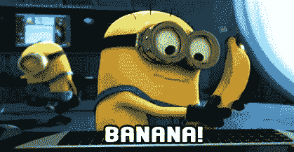

# 你是说香蕉吗？

> 原文：<https://medium.com/coinmonks/did-you-say-bananas-2e301918e3b4?source=collection_archive---------1----------------------->

假设你想种香蕉，但不是在你家里，你想要一个大农场。1000 公顷的土地，虽然你没有任何经验，但你说你会为此雇人。

***那么你怎么拿到钱，你有什么选择？让我们看看。***

## 问你爸？

> 只有你来自特朗普家族，这个选项才会起作用。

## 从银行贷款？

> 呃！！我真的需要在这里说些什么吗？

## 让投资者资助你的梦想？

> 如何，什么，为什么……..带着你的香蕉离开这里。

## 做一个 ICO？

> 香蕉币！哇！我想要那个。它看起来真的像香蕉吗？

而你对香蕉梦的追寻，用 ICO 成功实现了。简而言之，香蕉币就是这样。

Banana

***我们邀请了*** [***香蕉币***](http://bananacoin.io) ***团队(*** *来自俄国* ***)对我们 slack 社区进行采访，他们最近完成了他们的 ICO，将在老挝(*** *一个国家种植香蕉，我就知道你不知道* ***)并出口到中国(【T28)*T33)。**

好吧，我知道从上面可以观察到很多东西。涉及的国家太多了。

> 所以当我问他们， ***你们是如何保护你们投资者的投资的？*** ，他们说 ***卖你的香蕉币总能得到香蕉。***
> 
> 所以我问如果我在印度(顺便说一句，我来自印度，你不回去)，我得到一些香蕉硬币，我将如何得到香蕉？
> 
> 他们说“在老挝，在种植园。万一你需要真正的香蕉。现在，我们没有空运，但这仅仅是因为我们没有开发它。”

> 嗯！！所以不管怎样，你都会得到香蕉。你拿到了吗？

也许有一天他们会有一架无人机，把香蕉送到世界各地，怎么样？他们还说，他们正在柬埔寨寻找一个 ***芒果种植园，所以这里你去芒果币。***

当我听到这些，看到印度的农民。我感觉如果他们能为他们的农场获得众筹会怎么样。他们有经验，有市场，更不用说要养活很多人，他们甚至不需要跨越国界去卖他们的蔬菜。击球手出局了吗

Crowd Madness

在这个世界上有如此多的疯狂，人们投资任何名字中有区块链的东西。

示例—(您没有阅读以上内容，需要告诉您更多信息吗？).

人们使用假身份，甚至没有身份，身份盗窃，假顾问，假承诺，你能想到的，一切都发生在 ICO 空间。

我正在考虑改变我的姓氏，用区块链来代替，我不知道投资者，也许任何女孩都觉得值得投资(感兴趣的女孩，请在下面评论)。

***我对项目有自己的担忧和批评。但是谁知道未来呢，所以与其吹毛求疵，我会在喜剧中找到快乐。***

# ❤️喜欢，分享，留下你的评论

如果你喜欢这篇文章，不要忘记喜欢，与你的朋友和同事分享，并在下面留下你对这篇文章的评论。
跟着我是因为…

Follow me