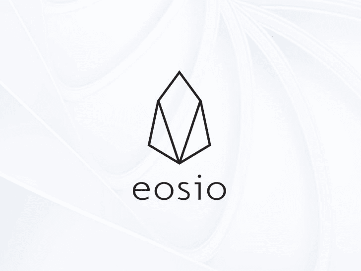
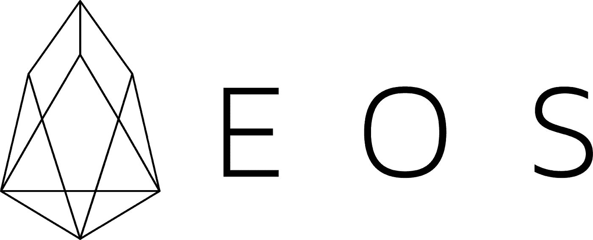

# EOSIO 软件和 EOS 区块链的区别

> 原文：<https://medium.com/coinmonks/difference-between-eosio-software-and-eos-blockchain-13bcc57d1d9d?source=collection_archive---------0----------------------->

我写这篇文章是因为关于 EOSIO 和 [EOS](https://medium.com/coinmonks/eos/home) 之间的区别似乎有很多困惑。不幸的是， [EOS](https://medium.com/coinmonks/eos/home) 也有问题，最大的问题是人们把它和 EOSIO 联系在一起，这不是问题的根源。

**EOSIO 软件**

> *一款免费、开源的* ***软件*** *，可以部署高度可定制的区块链，开发者和企业家可以在其上运行高性能的区块链应用。*

软件由[模块一](https://block.one/) (B1)创建和维护。

**EOS 区块链**

> 由 EOSIO 软件支持的已部署区块链。

区块链由 EOS 区块链社区部署和管理。

EOS 区块链的问题来自其特定的[区块链](https://blog.coincodecap.com/tag/blockchain/)定制，而不是驱动它的底层 EOSIO 软件。我目前不鼓励项目使用 EOS 区块链，除非他们需要与 EOS 区块链的特定部分进行交互。**我通常建议部署新的定制 EOSIO 链或使用现有链**(目前有超过 12 个公共部署链，甚至更多私有链可供选择)。

*从 2015 年起，我作为一名开发人员和教育者，一直在技术上参与区块链和加密货币领域。我与以太坊和 EOSIO 合作最密切，并继续研究和开发一系列区块链技术，如 Hyperledge、Corda、Tezos 等。*

据我目前所知，当进行诸如“更灵活”的比较时，是指区块链的其他技术。

# EOSIO 软件

## 链一致性特征

由 EOSIO 软件驱动的每个[区块链](https://blog.coincodecap.com/tag/blockchain/)具有以下技术特征和功能:

1.  可扩展的 [aBFT 共识](https://developers.eos.io/welcome/latest/protocol/consensus_protocol) —使每个链 UX 友好和行业就绪
    -0.5 秒阻塞时间
    -每秒大约 10，000–20，000 个事务的容量取决于使用类型*
    -共识治理不可知(参见下面的)
    -多达 125 个块生产者(BP)
    -*请注意，EOSIO 不* ***而*** *使用委托*
2.  客观和标准化的[协议升级机制](https://developers.eos.io/manuals/eos/latest/nodeos/upgrade-guides/index) —使协议升级更易于管理，更加透明。
3.  人类可读的[帐户名](https://developers.eos.io/welcome/latest/protocol/accounts_and_permissions/#gatsby-focus-wrapper)(例如“jack”)——让区块链更容易使用，减少人为错误。
4.  用 C++ 编写的可扩展的智能合同——以一种最强大、最灵活和最有效的语言，使现有的广大开发者能够访问它。
5.  链上合同[应用二进制接口](https://developers.eos.io/welcome/latest/getting-started/smart-contract-development/understanding-ABI-files/#gatsby-focus-wrapper)(ABI)——使合同更加透明，更易于客户端软件使用。
6.  内置对[合同可升级性](https://developers.eos.io/welcome/latest/overview/technical_features/#upgradability)的支持，使合同管理更加简单和透明。
7.  [灵活的资源会计](https://developers.eos.io/welcome/latest/overview/technical_features/#staking-mechanism) —允许自由**交易，并允许由智能合约而不是其用户为资源付费。
8.  灵活且分层的基于角色的[权限](https://developers.eos.io/welcome/latest/protocol/accounts_and_permissions/#gatsby-focus-wrapper)和密钥管理——使密钥管理和数据权限更容易，错误更少，透明度更高。
9.  [WebAuthn](https://webauthn.io/) 和生物硬件安全密钥支持——提高与现有 web 基础设施的兼容性和安全性。
10.  [灵活和模块化的节点定制](https://developers.eos.io/manuals/eos/latest/nodeos/plugins/index) —使节点管理更加灵活和简单，能够轻松创建公共/私有网络和网络访问权限。
11.  [对客户端的 Http 支持](https://developers.eos.io/manuals/eos/latest/nodeos/plugins/http_plugin/index) —使客户端应用程序开发更容易。

*此近似值对标准令牌传输有效。更复杂的智能合同需要更多的时间来执行，因此处理同样多合同的能力也就更少。其他因素会影响链条的容量。

**交易不会在每次交易时从用户的帐户中扣款。

## **以上是 EOSIO 区块链应用的影响:**

*   更容易、更便宜、更安全、更快速地开发和操作。
*   更容易、更安全并且更容易被人们使用。
*   拥有更灵活、更透明、更易于管理的集中运行或完全分散的治理。
*   能够以多种方式管理数据隐私和权限(等我的下一篇文章)。

# 通过系统契约的链可定制性

每个 EOSIO 区块链的交战规则在称为系统合同的智能合同中定义。

> 这些规则，以及那些维护和执行它们的规则(也在系统契约中定义)被称为链的“治理”。

这与大多数其他区块链(例如以太坊和 Corda)不同，其他将这些规则内置于协议本身，如果这些规则不正确，就很难定制或更改。一些区块链确实采取了类似的方法(例如 Hyperledger Fabric 和 Tezos)，但是 EOSIO 协议仍然是可区分的，因为可通过智能合同定制的规则的范围非常广泛。

每个 EOSIO 链都能够通过智能合约定义以下定制:

*   **区块共识** —谁可以运行区块链(制作区块)，例如，可以使用授权证明、股权证明或民主区块生产者治理(参见下面的[模板](#b76d))。默认是权威的证明。
*   **特权行为** —谁可以执行和升级系统合同。默认是权威的证明。
*   **账户分配** —规定谁可以创建账户以及如何创建账户。默认情况下，任何人都可以创建无限数量的帐户。
*   **帐户名**——谁得到什么名字。默认情况下，任何人都可以获得最多 12 个字符的任何帐户名，例如“jack”。
*   **账户权限和密钥结构**——谁以及账户如何创建和更新[区块链](https://blog.coincodecap.com/tag/blockchain/)的密钥和授权。默认情况下，该帐户可以创建任何权限和密钥结构。
*   **资源分配** —允许账户使用哪些资源。
*   **合同部署/升级** —关于谁可以部署和升级合同以及何时部署和升级合同的规则。默认情况下，每个人都可以随时部署和升级他们的合同。

可以向系统合同授予附加功能:

*   **系统货币**(代币合约)——资源核算和支付货币的规则。
*   **异步授权** —账户异步协调交易授权的能力(否则这必须通过供应链管理，可能会很困难)。
*   **交易授权绕过** —系统管理员绕过交易授权检查的能力，允许他们管理意外或恶意的区块链使用。
*   **阻止生产者奖励、资金分配、治理论坛**和其他支持性治理工具。

对这些约定规则的改变是链上的，因此同时在整个网络上同步。这使得连锁升级变得更加容易和可行。此外，这意味着每个定制的 EOSIO 链彼此之间保持完全的协议兼容性(不需要对节点软件进行任何更改)，从而使 block explorers 和 wallets 等多链软件以及区块链之间的通信变得更加容易。例如，这允许 [block.io](https://bloks.io/) 和[eosauthority.com](https://eosauthority.com/)block explorer 通信并读取所有不同的公共 EOSIO 链，尽管它们具有不同的参与规则。

> EOSIO 允许一个多链生态系统，既高度兼容，又可定制。

为了测试和展示 EOSIO 系统契约的灵活性，下面的存储库包含了一些用于不同定制的模板。它们没有经过实战检验，但是这个想法已经存在并且听起来足够好。重要的是，花了 **1 天时间达成 4 项共识**实施:

*   民主:一人一票，10 个基点
*   委托股权证明:1 个象征性的 1 票，66 个基点
*   纯粹的利害关系证明:最富有的 100 个基点
*   授权证明:当前 BPs 可以在 66%多数同意的情况下添加/删除 BPs。

[https://github . com/the block talk/EOS io-contracts/tree/master/governance](https://github.com/theblockstalk/eosio-contracts/tree/master/governance)

# EOS 区块链

EOS 区块链是在 EOSIO 软件第一版发布后由社区部署的。

使用系统合同对区块链进行了高度定制，使其具有以下概要特征:

1.  委托股权证明区块共识，每个令牌可以投票 30 个区块生产，前 21 名投票计数然后被授权经营区块链。
2.  前 21 家区块生产商可以升级系统合同。
3.  系统中的任何帐户都可以创建不限数量的帐户。
4.  系统中的任何帐户都可以部署和升级合同。
5.  所有帐户都有一个名为“活动”的权限，可以授权大多数交易，包括发送令牌和更新合同，还有一个名为“所有者”的权限，可以用于在安全性受到威胁时重置“活动”权限。用户不能删除这些权限，但可以创建他们想要的任何其他权限。
6.  账户可以选择任何可用的 12 个字符的账户名称，或者在竞价系统中购买短于 12 个字符的名称。
7.  一个先进的系统的赌注，委托和租用 CPU 和网络资源。
8.  RAM 资源可以在单边市场上购买，在单边市场中，价格由 RAM 的供求关系控制。
9.  一种系统货币“令牌”,用于资源核算和支付，任何人都可以向任何人发送令牌。这种代币每年自动增加 1%的货币供应量，用于支付大宗商品生产商。这在 top 21 block produces 和其他准备生产 block 的客户之间进行了区分，以防 top 21 产生变化。
10.  一种异步事务授权机制。
11.  交易授权的一个旁路，可由 top 21 what produces 在共识中*使用。*

> 上面的功能**定义了 EOS，并展示了使用 EOSIO** 的一种方式，但是**不是 EOSIO** 的定义吗，因为我看到太多人这样想。

EOS 是一个非常大的实验，系统中的账户持有大量资金。如果感兴趣，请阅读[EOS 区块链的 8 个最糟糕的问题和最好的功能](/@theblockstalk/the-8-worst-issues-and-best-features-of-the-eos-blockchain-4b4f3157eb7f)，以获得我对 EOS 区块链的健康状况的过时但仍然是当前的看法。

B1，EOSIO 软件的创建者和维护者，不拥有也不控制 EOS 区块链，这是由 EOS 区块链的社区完成的。B1 很少参与 EOS 区块链的管理。B1 控制着 EOS 区块链公司的[“B1”](https://bloks.io/account/b1)账户，其中有价值近 2 亿美元的 EOS 代币，因此将继续对这一特定的 EOSIO 区块链公司感兴趣。B1 已经[宣布将于 2019 年 11 月](https://block.one/news/blockone-to-begin-voting-for-eos-public-blockchain-upgrades/)参与 EOS 的治理，但尚未对区块生产商进行任何投票。

B1 支持并鼓励在不同的应用中广泛使用 EOSIO 区块链，并将推出自己的 EOSIO 区块链来支持他们正在开发的社交媒体平台。

# 其他部署的区块链

EOSIO 生态系统由许多不同的公共和私有区块链组成，每个都有不同的治理，每个都针对不同的使用案例和市场。

你可以在 [ineos.io](https://ineos.io/) 上看到许多区块链的完整描述，但这里有一个快速列表(按字母顺序排列):

*   [BOSCore](https://boscore.io/) —一款面向商业和企业的高速低终结性区块链，支持并行计算和 IBC。
*   [Eosfinex](https://www.eosfinex.com/) —一个区块链，为加密公开和可审计的 Eosfinex [加密货币](https://blog.coincodecap.com/tag/cryptocurrency/)交易所提供动力。
*   [Europchain](https://europechain.io/) —一个公共许可的区块链，使用正常的 IT 渠道，旨在支持符合包括 GDPR 在内的欧洲法规。
*   一个民主的区块链将为自由共和国的公民提供权力。
*   [Lynxx chain](https://www.lynxwallet.io/) —一种区块链，通过消除用户了解资源和赌注的需求来简化用户体验。
*   [Telos](https://www.telos.net/) —一个高性能的免许可区块链平台，用于具有高级数据存储和链治理功能的分散式应用。
*   超级 T21——一个瞄准博彩业的区块链。
*   [声音](https://voice.com/)——(待定发布)一款区块链，为 B1 构建的分散式社交网络提供动力。
*   [WAX](https://wax.io/) —一种专门构建的区块链和协议令牌，旨在使电子商务交易更快、更容易、更安全。
*   [Worbli](https://worbli.io/) —专为金融行业监管合规性而设计的区块链，包括 KYC 验证账户。

没有可用的私有 EOSIO 链列表，因为它们是私有的。

> 如果您正在构建一个区块链应用程序，您可以**选择这些现有链中的一个，或者部署您自己的**定制的公共/私有集中式/分散式 EOSIO 区块链来运行。

# 更多信息

如果您有兴趣了解有关 EOSIO 生态系统的更多信息，我建议您查看以下资源:

*   [eos.io](https://eos.io/)
*   [学习 EOSIO 开发(Telos、EOS 等区块链)](/@theblockstalk/learning-eosio-development-telos-eos-and-other-blockchains-94d384a8b09f)
*   [EOSIO 区块链开发者研讨会 2020 年 3 月](https://www.youtube.com/playlist?list=PLbq67nzUl6Prlg2Su8Rkmh8exeAL5O5l7)
*   [连锁定制与治理](https://www.youtube.com/watch?v=ITDFQESxglc&list=PLbq67nzUl6Prlg2Su8Rkmh8exeAL5O5l7&index=9)

> [阅读更多关于 Coinmonks 的 EOS 相关文章](https://medium.com/coinmonks/eos/home)

> [直接在您的收件箱中获得最佳软件交易](https://coincodecap.com/?utm_source=coinmonks)

