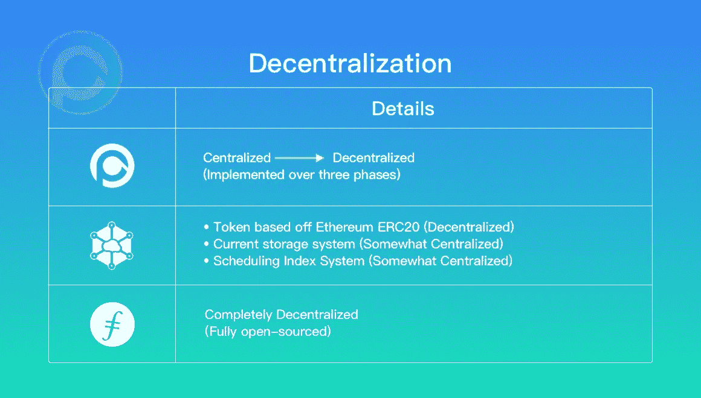

# 理解 PPIO、Filecoin 和 Storj 之间差异的终极指南

> 原文：<https://medium.com/coinmonks/differences-between-ppio-filecoin-storj-20cdf7b3b02e?source=collection_archive---------0----------------------->

## 从技术角度看推动分散存储的三家公司

首先，我写这篇文章不是为了争论哪个项目比另一个好，哪个决策在技术方面是对的还是错的，也不是每个项目的优点或缺点。我写这篇文章是为了指出这三种分散式存储网络背后的设计差异。基于区块链的去中心化存储是一个长期的商业路径，不同的团队在同一个领域内探索不同的方向是有好处的。一个团体的胜利只会使整个领域受益。

请允许我首先介绍我们的三个存储平台。

[**Filecoin**](https://filecoin.io)**—Filecoin 是一个开源、公开的加密货币和数字支付系统，旨在成为一种基于区块链的数字存储和数据检索方法。在 [FileCoin 官网](https://filecoin.io)了解更多。**

**[**Storj**](https://stroj.io) —一种价格合理、易于使用、私密且安全的分散式云对象存储。您可以查看【Storj 官方网站了解更多信息。**

**[**PPIO**](https://pp.io)**—一个面向重视经济性、速度和隐私的开发人员的分散式数据存储和交付平台。在 [PPIO 官方网站](https://pp.io)上可以找到演示应用的文档和访问。****

****我将从几个不同的方面来比较这三种去中心化的存储网络。****

> ****交易新手？尝试[加密交易机器人](/coinmonks/crypto-trading-bot-c2ffce8acb2a)或[复制交易](/coinmonks/top-10-crypto-copy-trading-platforms-for-beginners-d0c37c7d698c)****

# ****价值主张****

****区块链项目最大的问题是应用场景。大多数 DApps 都没有用户。除了一些赌博相关的游戏，目前还没有流行的产品。数据存储及其相关服务是可能创建非凡的区块链应用程序的场景之一。****

****但是分散存储不同于传统的数字货币项目。比如比特币和以太坊都是以计算为中心的数字货币，合约是他们的主菜。网络只需要一个块生成器，它是执行合同或打包事务的节点。比特币和以太坊的共识是选择这个块节点。但是分散存储就完全不同了。共享经济需要服务用户和服务提供商来运行。用户向提供商付费，分享提供商的部分资源，就像优步和 Airbnb 的运营方式一样。****

****从价值角度看，数据存储和数据分发是分散存储的两个维度。存储允许将数据保存到互联网上，以后需要时可以检索。数据存储可用于备份、多设备同步、小组文件共享和云存储。数据分发允许数据快速到达需要的人。它可以用于大规模共享文件，文件下载，视频点播，直播，视频会议，虚拟专用网络等。分散式数据存储共享硬盘，分散式数据分发共享带宽。****

******Filecoin** 设计存储挖掘器和索引挖掘器，并使用它们进行相应的数据存储和数据分发。然而，该项目更侧重于存储而不是分发。****

******Storj** 专为存储场景设计。****

******PPIO** 的设计兼顾存储和配送，但更注重配送场景。PPIO 将很快提高其应用层的流输出能力，以支持主流的视频点播和直播流解决方案。****

********

****Quick Summary: What You Need To Know Data Storage and Distribution****

# ****技术结构****

****Storj 和 PPIO 的定位比较接近。它们旨在直接服务于一线开发人员。Storj 和 PPIO 都支持基于对象的存储接口，并与 AWS S3 接口兼容。PPIO 还兼容 OSS 接口，为用户体验提供了更好的 POSS 接口。使用 AWS S3 界面对开发者来说很方便。PPIO 和 Storj 的目标是通过为开发者提供一个有用而简单的工具来开发产品，从而将这项技术产品化。****

****Filecoin 是一个基础设施。它只实现存储和带宽层功能。Filecoin 提供了一个数据存储市场，你可以在那里购买原始存储。如果一线开发人员需要从 AWS S3 服务迁移到 Filecoin，他们需要调整迁移的原始架构。我认为 Filecoin 有可能成为 AWS S3 的底层基础设施。例如，AWS S3 从 Filecoin 存储市场购买存储空间来替换自己的数据中心，然后在分散的存储节点上实施 AWS S3 服务。****

****总而言之，PPIO 和斯特罗伊想自己制造产品。他们正在为全栈实现设计 toB 产品。开发人员可以使用他们的 SDK 在 PPIO 和 Storj 上快速轻松地开发产品。这种方法更像是创建一个存储版本的 Android。另一方面，Filecoin 是一个设计存储基础设施的生态系统。其他各方可以通过稍后实现开源项目来改进生态系统，以实现完整的堆栈。Filecoin 更像是 Linux 原生操作系统的存储版本。Android 包含了 Linux 的内核。这就是完整堆栈和基础架构之间的区别。****

# ****服务质量****

****因为去中心化存储，本质上是共享经济的一部分，服务提供商必须为用户提供服务。服务质量(QoS)在服务中起着重要的作用。例如，如果优步不能为用户提供足够的汽车，或者如果优步的司机总是在最后一刻取消请求，还会有人使用优步吗？分散存储服务也是如此。如果分散式存储服务提供商无法提供比集中式云存储更好的用户体验，它就不会为最终用户提供任何价值。为了使分散存储成为真正的颠覆性技术，它必须提供比当前现有云存储服务更好的用户体验，从某些利基市场开始。****

****QoS 不是指大多数区块链用来衡量性能的 TPS 指标。而是指可用性、可靠性、耐用性、返回测试、下载速度等传统云存储服务的 QoS。具体对于流媒体来说，QoS 是指与节目源的延迟时间、开始播放的时间、播放过程中的堵塞次数、堵塞时间等。****

****PPIO 把服务质量看得比什么都重要。PPIO 是从底层设计的，旨在实现高 QoS。PPIO 还拥有完整的 QoS 系统，可以不断调整和改进网络，以提供稳定可靠的服务。****

****Storj 在其白皮书和博客文章中讨论了一些核心存储指标，如耐用性。所以我认为 QoS 是 Storj 团队关心的问题之一。****

****Filecoin 在其白皮书或代码中没有提到任何与 QoS 相关的内容。Filecoin 团队现在正专注于构建基础设施。但是他们将来可能会考虑 QoS。****

# ****分散****

****比较这三种分散式存储网络，Filecoin 从一开始就选择了分散式，该项目现在完全开源。PPIO 已经决定 [*遵循一个三阶段计划走向去中心化*](/@ppio/pp-io-simply-explained-in-1-2-3-strong-center-weak-center-and-decenter-564959b7dc86) 并逐渐开源。最后，Storj 目前的存储和调度索引系统更加集中。但是需要注意的是，它的令牌是基于以太坊 ERC20 的，是去中心化的。我不确定 Storj 在不久的将来是否会变得更加分散。****

****PPIO 选择逐步实现分权的原因如下:****

1.  ****区块链非常复杂的证明机制需要长期搁置才能达到安全高效的要求****
2.  ****服务质量(QoS)需要逐步优化，算法需要以更灵活的方式进行调整****
3.  ****经济模型需要测试和运行，也需要更新。****

********

****Three Approaches To Decentralization****

# ****经济激励设计****

******1。索引市场(带宽市场)******

****PPIO、Storj 和 Filecoin 都支持下载服务提供商(存储节点/矿工)和下载服务用户(用户)之间的交易。矿工向用户提供数据下载服务，用户向矿工支付下载费用。****

******2。匹配市场******

****Storj 采用做市商模式，服务需求方(客户/用户)直接向 Storj 平台付费，然后获得服务。服务提供商(存储节点/矿工)从 Storj 平台获得代币和奖励。这种交易模式是一种集中的交易模式，特点是效率高，但不够分散和透明。****

****Filecoin 采用匹配模式，所有服务需求者(客户端/用户)和服务提供者(存储节点/矿工)在 Filecoin 市场(包括存储市场和索引市场)自由配对。完全去中心化了。****

****PPIO 平台是灵活的。用户和矿工可以自由选择下线匹配，也可以委托第三方调度平台进行协调匹配。PPIO 自己也开发了一个调度平台来分配资源和节点。****

********

****How Matching Market Models Are Approached****

******3。硬币池节点******

****传统互联网产品通过套餐提供存储和带宽服务。用户通常为使用该服务支付一次性费用(fiat ),该服务在一定时期内具有最大存储限制。比如 5T 存储空间 5 美元/月，500G 流量 4 美元/月。因此，您可能会支付比您将使用的更多的费用。但在区块链世界，所有服务都是根据实际使用情况收费的。在区块链算法上，服务提供证明，而证明是收费的基础。这两种模式有很大的不同。****

****PPIO 创新性地引入了一个叫做支付网关(payment gateway)的角色，它可以利用经济精算的手段，将区块链中不确定性较小的存储服务转化为用户的确定性存储服务。与包模式相同。这种方法降低了用户从互联网迁移到区块链的迁移和认知成本。****

****Storj 直接接受用户付费，区块链上没有服务和结算。所以项目不用考虑迁移成本。****

****另一方面，Filecoin 解决区块链的服务和结算问题。但是它没有考虑如何使迁移更容易。****

********

****How The PPIO Payment Process Compares To Other Projects ([Twitter](https://twitter.com/PPLabs_PPIO/status/1105384162486247424))****

# ****传输技术****

******1。覆盖图******

****PPIO 支持覆盖网络。每个存储节点(miner)将把具有更快物理连接的存储节点作为其邻居。因此，在数据传输和信息交互过程中，每个节点都可以充分利用其邻居节点，显著提高网络效率。****

****Stroj 没有强调类似的特征。****

****Filecoin 本身不提供类似的功能。Filecoin 将自己定位为底层基础设施，因此他们的团队可能希望让其他第三方开发者在上层实现 P2P 覆盖网络。****

******2。媒体流传输的优化******

****Filecoin 和 Storj 都是为文件下载而设计的。因此，对于媒体流没有特别的考虑。****

****PPIO 为媒体流实施了一种特殊的数据驱动下载算法，以确保直播流媒体的流畅播放。****

********

****The PPIO Data-Driven Download Algorithm****

******3。P4P******

****P4P(P2P 主动网络提供商参与)是 ISP 和 P2P 软件优化连接的一种方法。它支持基于物理网络拓扑的对等点选择，减少骨干网络上的流量和网络提供商的运营成本，提高数据传输效率。与随机选择节点的 P2P 相比，P4P 模式可以有效地协调网络拓扑数据和选择节点，从而提高网络路由效率。****

****在做 PPTV 的时候，PPIO 团队有着与运营商 [*打交道的丰富经验，因此我相信我们可以在我们的平台上成功实现 ISP 友好的 P4P 技术。Filecoin 和 Storj 目前在他们的设计中没有使用 P4P。*](/@ppio/the-second-time-to-start-again-my-blockchain-startup-journey-67edefc13738)****

******4。流行内容的自适应调度******

****PPIO 支持 P2P-CDN。在 P2P-CDN 中，流行内容的自适应调度是提高服务质量的重要手段。流行内容的自适应调度是将网络中的流行内容自动调度到更多的存储节点。托管内容的节点越多，用户体验越好，盈利的节点也就越多。相反，当文件不再流行时，网络将自适应地减少副本。因此，网络形成了一种动态平衡。PPIO 继续致力于设计和改进这种算法。****

****Filecoin 和 Storj 现阶段还没有设计出这个机制。****

********

****A Look At P2P-CDN Adaptive Scheduling ([*Twitter*](https://twitter.com/PPLabs_PPIO/status/1109018586750681088))****

# ****存储技术****

******1。擦除技术******

****PPIO 实现了完整拷贝和擦除的方法；Storj 只设计擦除代码；Filecoin 可能不考虑擦除。****

****要理解为什么 PPIO 选择了不同的擦除方法，我们必须首先注意到擦除代码对于存储系统来说是必不可少的。由于采用了擦除技术，数据丢失率可以显著降低。耐久性是擦除技术的指标。纠删码是将文件适当扩展后分成 *n* 个部分。只要有 *k* 零件，就可以恢复完整的文件。如果 *n* 个碎片放在不同的机器上，即使有 *n-k* 台机器离线也不会影响文件恢复。****

****由于 PPIO 将自己定位为数据存储和分发平台，所以它为上层的文件碎片设计了纠删码和全拷贝双模式。全副本主要用于分发，因为全副本传输可以保证数据采集的效率。而擦除是为了更好的保证数据不会丢失。即使当矿工的数量波动时，擦除代码技术也可以帮助实现高耐用性，几乎没有冗余(99.999999999%)..****

******2。基于覆盖网络的存储节点偏好******

****存储节点的选择可以比作 BitTorrent 的 Tracker 下载，专门针对资源和用户。****

****PPIO 设计了一种距离优先的存储节点算法。PPIO 的节点选择算法是多维的，包括网络距离(在重叠网络中获得)和价格、承诺时间、节点稳定性和节点信用的记录，但网络距离是第一考虑因素。****

****Filecoin 的基础设施、存储和证明是互补的。Filecoin 的供需双方完全是链下自配。如果节点既有签名又有证明，它们就会得到奖励。也就是说，整个 Filecoin 的设计并没有类似于 BitTorrent Tracker 的作用，用来匹配资源和矿工之间的关系。****

****Storj 在这一点上没有透露太多细节。但是团队必须考虑到这个问题。这是一个即使在最古老的 P2P 项目中也被考虑过的问题。****

# ****块链****

****Storj 仅使用 ERC20 的令牌来确定其存储节点的贡献，其平台并不基于区块链。因此，客户端(客户端/用户)和存储节点(存储节点/挖掘器)之间的事务是通过集中服务节点(卫星)完成的。Storj 不是一个公共链项目；这是以太网中的一个应用。****

****菲力康和 PPIO 都有自己的连锁店。他们不仅实现了价值链中的价值循环，还完成了价值链中的交易和认证。它们是真正的基于区块链的存储和分发平台。****

******1。一致性算法******

****在设计之初，文件硬币是分散的，发明了一种称为 EC 算法的一致算法。Storj 使用 Ethereum 公共链来实现共识，而没有自己的共识算法。PPIO 将在[最终分权阶段](/@ppio/pp-io-simply-explained-in-1-2-3-strong-center-weak-center-and-decenter-564959b7dc86)实施 VRF 和 BFT 的合并，类似于 DFINITY 公共链的机制。PPIO 团队选择在早期阶段采用更集中的 DPOS 共识算法，以简化任何技术难题。****

******2 .存储证明算法******

****对于常见的公共链项目，共识算法和证明算法是集成在一起的，如 PoW、PoS 等。但是在分散存储项目中，证明算法的设计非常困难。我将分别分析存储证明算法。****

****文件币支持 PoRep(复制证明)和 PoSt(时空证明)。PoRep 是指节点生成网络副本后获得的证明。开机自检是一个证据，证明一个文件占用了特定的空间，节省了一定的时间。Filecoin 是第一个提出这两种算法的项目。在文件币白皮书中，这两种证明算法和过程占了详细内容的 70%以上。****

****Storj 在其白皮书中提出了 PoS(储存证明)。从他们的白皮书中可以看出，PoS 没有 PoRep 和 PoSt 那么严格。****

****PPIO 也使用 PoRep 和 PoSt，这两种证明机制确实非常严格。此外，PPIO 还创建了自己的 PoD(下载证明)，主要用于证明多点数据下载。PoD 对流媒体相关服务很友好。PPIO 还在白皮书中提出了 LPoC(容量的轻型证明)来冷启动存储节点。从那时起，团队决定不实施 LPoC，因为 LPOC 不能提供真正有价值的服务。像 BurstCoin 一样，LPoC 消耗硬盘资源，却没有提供任何有价值的东西；这不符合 PPIO 项目的价值主张。****

********

****Three Similar Yet Different Blockchain Structures****

******3。区块链结构******

****Filecoin 设计了单主链架构，使得结构非常简单。Storj 本身不是公共链；而是基于 ETH 的应用，只有一条链。****

****为了让性能更好，PPIO 已经考虑了不同地区的内容合规性，设计了主链+多合约链的结构。你可以把契约链想象成相当于侧链。PPIO 采用这种设计有两个主要原因:****

1.  ****当一个链的性能不够时，多个链提供了一些扩展的灵活性。侧链可以被认为是引发碎片化过程。****
2.  ****关于遵守不同地区的内容法规，PPIO 将遵循不同国家的法律。因此，可能有必要为每个国家部署单独的合同链，并且合同细节可能会有所不同。****

******4。链条信息******

****在区块链上，一旦数据被写入数据块(这个过程也称为卷绕)，就不能被删除和篡改。区块链的本质是一个分布式数据库。这些信息是同步的，并得到了全世界数千台机器的认可，几乎不可能被删除。****

****谈到存储区块链，每个人都很自然地认为存储在链上的数据不能被删除或修改。不幸的是，事实并非如此。****

****Filecoin、Storj 和 PPIO 不将存储数据放在链上。换句话说，实际存储的数据并没有写在区块链上。因此，这些数据可能会被删除和篡改。****

******那么这三条公共链上存储了什么信息呢？******

****Storj 基于 ETH 公共链。关于链条的信息写在 ETH 上的 Stroj 合约，著名的 ERC20 合约。链条上只有资产和交易。****

****除了资产和交易，Filecoin 还在链上放了证明资料和合同。****

# ****概括起来****

****下表快速总结了这两个项目之间的一些技术差异。****

********

*******想要更多？加入*** [***PPIO 社区关注***](http://buff.ly/2J36IoK) ***或者关注我们关注*** [***推特***](https://twitter.com/pplabs_ppio) ***。*******