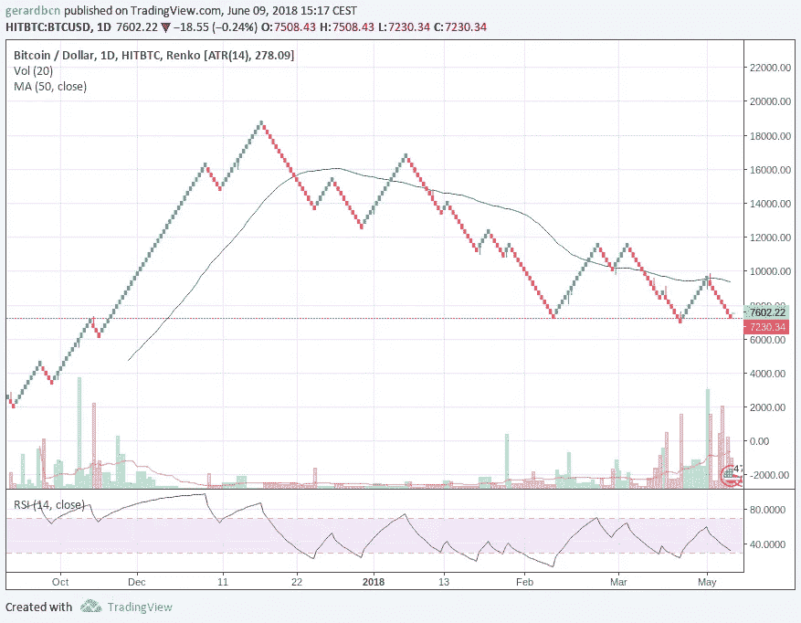
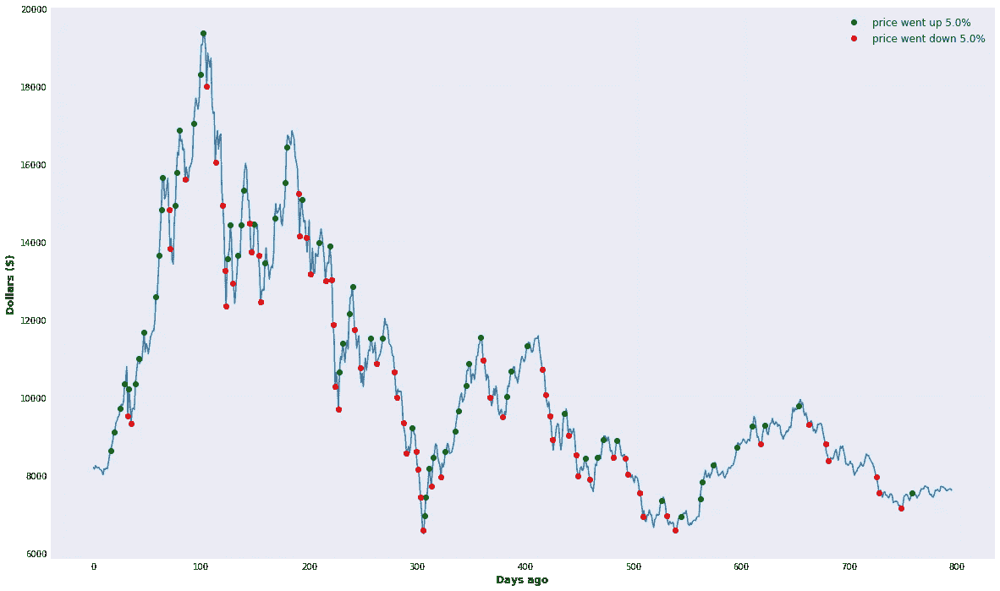
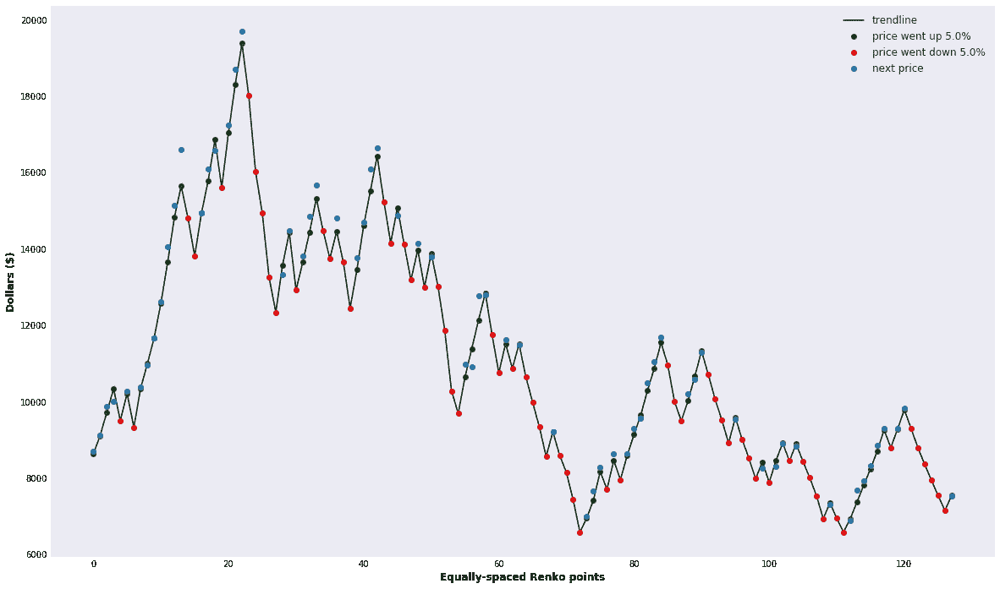
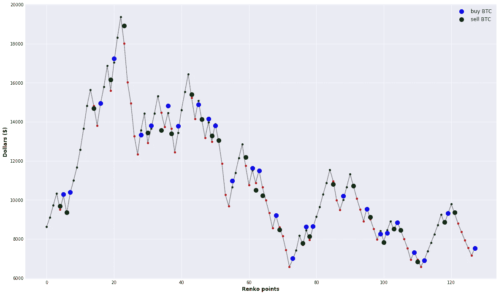
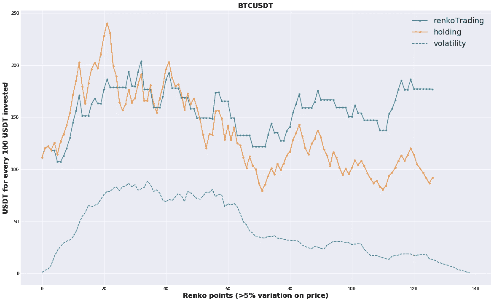
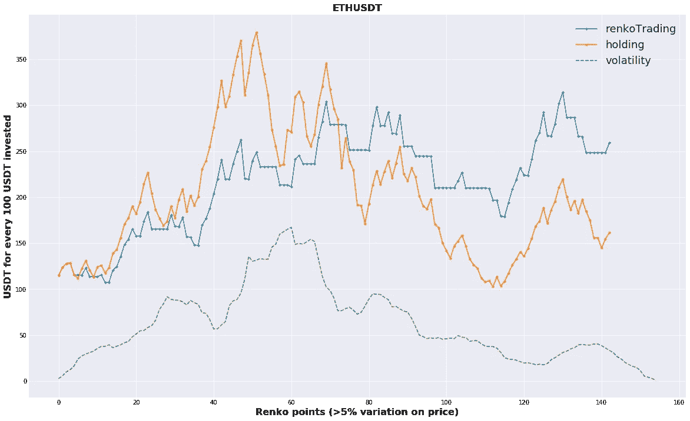

# 深入挖掘加密货币交易的 RenkoTrading(第二部分)

> 原文：<https://medium.com/coinmonks/digging-deeper-into-renkotrading-for-cryptocurrency-trading-part-ii-a81b6c1f2ec6?source=collection_archive---------3----------------------->

在之前的一篇文章中，我们介绍了一种非常简单的加密货币交易方法，名为 RenkoTrading，灵感来自一种叫做 [Renko](https://en.wikipedia.org/wiki/Renko_charts) 的图表表示。内部算法非常简单:每次价格以 *x* 的百分比变化时(例如 5%)，我们在变化的方向上添加一个方块或点(相当于蜡烛图中的一根蜡烛)。这样我们可以得到如下的图表，这些图表清晰地显示了市场的整体趋势(红色表示看跌，绿色表示看涨)。然后，简单的算法就是根据趋势的变化卖出或买入。换句话说，当一个红色瓷砖出现在一系列绿色瓷砖之后，我们必须卖出，反之亦然。

> 另请阅读:最佳加密交易机器人

Renko charts for the BTCUSD pair obtained from tradingview.com

在这篇文章中，我想进一步探讨这个交易理念。特别是，我想考虑前一篇文章中没有提到的两个因素:(a)交易费用和(b)滑点。

## **交易费用**

如果不包括交易或交易费用，大多数交易算法都是不完整的，交易费用是交易所向我们收取的执行每笔交易的佣金。就我所知的加密货币交易所而言，这些通常低于我们交易金额的 1%，并且规则因交易所而异。

例如，你可能会发现像 GDAX 这样的交易所只对接受*交易的*交易收取 0.3%的费用，这些交易也被称为*市场*订单。这种类型的交易不同于*做市商*交易(又称*限价*指令)，在这种交易中，做市商从交易所中扣除流动性，而不是提供流动性。接受订单有 0.3%的佣金，而生成订单是免费的。这激励人们使用交易所，并为人们交易提供流动性。

另一方面，如果你使用他们自己的名为 BNB 的 ERC20 令牌，币安等其他交易所会一直向你收费，但佣金低至 0.1%。

对于这里介绍的 RenkoTrading 分析，我们考虑了 0.1%的固定费用，因为我们将使用从币安交易所提取的 BTC-USDT(比特币-系绳美元)价格。

## 滑动

报价[投资媒体](https://www.investopedia.com/terms/s/slippage.asp):

> 当一个交易者从开始交易到完成交易，得到了一个不同于预期的比率，滑点就发生了。这是任何交易者都会遇到的事情，不管他是在交易股票、外汇还是期货。

在我们之前的 RenkoTrading 分析中，我们使用了 1 天的报价，这意味着我们每天只有一根蜡烛线(开盘价、收盘价、最低价和最高价)，我们使用该报价的平均值进行交易。这是一个非常不现实的场景，因为在生产环境中，在执行 RenkoTrading 并检测到趋势变化后，我们可以买卖的下一个价格不是上一个蜡烛线的平均值，而是最接近现实的*是下一个蜡烛线的开盘价。*

我们在更详细的 RenkoTrading 分析中考虑了这一事实。也就是说，我们现在将之前的 1 天蜡烛线分解为 6 小时蜡烛线，为了进行分析，我们将买入/卖出价格视为后续蜡烛线的开盘价。

## 使用 6 小时报价器和下一个报价器公开交易价格在 BTC-USDT 进行人民币交易

使用币安的 BTC-USDT 对的过去 200 天的数据，粒度为 6h，伦克交易算法的 *delta* =0.05 (5%的价格变化)，我们可以确定以下趋势点。

现在，如果我们把所有的趋势点放在一个规则的间距内，我们可以得到 BTC-USDT 对趋势的平滑描述。

请注意，在此图表中，除了趋势点(红色和绿色)之外，我们还添加了第三个点，标记为“下一个价格”，它代表紧接着的下一个 6h 烛台的开盘价。这个“下一个价格”告诉我们，根据给定的趋势变化(红点或绿点)，如果想买或卖 BTC，我们可以在指定的“下一个价格”进行交易。

应用 RenkoTrading 算法，我们将根据市场趋势(看跌与看涨)的变化采取下一步行动(买入/卖出)。请注意，我们可以买入/卖出 BTC 的价格(蓝色和黑色点)是从红色和绿色趋势点向上或向下移动的，因为它们反映了“下一个可用价格”，如果我们决定根据趋势的变化(例如，在一连串的绿色点到红色点之后)买入/卖出 BTC。

遵循这一策略并将其与“霍德林”进行比较，如果我们在 200 天前购买了 100 美元的 BTC，这将是我们投资的价值级数:

当时，包括每笔交易的 0.1%的费用，如果我们只是“hodl”，我们将有 92 美元，但如果我们遵循 RenkoTrading 策略，我们将有 177 美元，这相当于“hodle”值的 1.92 倍。

## RenkoTrading 应用于 ETHUSDT(以太坊)

由于加密货币之间高度相关的价格演变，应用于以太坊等其他加密货币的 RenkoTrading 算法也非常成功，与持有相比回报率为 1.58 倍，这并不令人惊讶。

RenkoTrading applied to ETHUSDT

总的来说，RenkoTrading 和其他交易算法一样，在波动性很大的情况下表现不佳。

## 结束语

所提供的信息仅用于教育目的。它绝不代表任何财务建议，信息必须“原样”采用，不保证成功。

## Python 代码

亲爱的程序员，你现在可以在这个 Jupyter 笔记本里找到这篇帖子的 Python 实现:[https://github . com/GerardBCN/RenkoTrading/blob/master/RenkoTrading . ipynb](https://github.com/GerardBCN/RenkoTrading/blob/master/renkotrading.ipynb)我对建议和调试持开放态度！

 [## GerardBCN/RenkoTrading

### 受 Renko 图表启发的应用于加密货币交易的简单算法- GerardBCN/RenkoTrading

github.com](https://github.com/GerardBCN/RenkoTrading/blob/master/renkotrading.ipynb) 

*这个项目是我们在*[*cryptodatum . io*](https://cryptodatum.io)*研究的一部分，这是一个加密货币数据 API，旨在提供即插即用的数据集来训练机器学习算法。如果您喜欢我们在本文中展示的数据，您可以在*[*https://cryptodatum . io*](https://cryptodatum.io.)获得免费的 API 密钥并亲自使用它

## **同样，阅读**

*   [最佳加密交易机器人](/coinmonks/crypto-trading-bot-c2ffce8acb2a)
*   最好的比特币[硬件钱包](/coinmonks/the-best-cryptocurrency-hardware-wallets-of-2020-e28b1c124069?source=friends_link&sk=324dd9ff8556ab578d71e7ad7658ad7c)
*   最好的[加密税务软件](/coinmonks/best-crypto-tax-tool-for-my-money-72d4b430816b)
*   [最佳加密交易平台](/coinmonks/the-best-crypto-trading-platforms-in-2020-the-definitive-guide-updated-c72f8b874555)
*   [unis WAP 最佳钱包](/coinmonks/best-wallets-to-use-uniswap-e91a6385d9e8)
*   最佳[加密借贷平台](/coinmonks/top-5-crypto-lending-platforms-in-2020-that-you-need-to-know-a1b675cec3fa)
*   Bitsgap 评论——一个轻松赚钱的加密交易机器人
*   为专业人士设计的加密交易机器人
*   [3commas Review](https://blog.coincodecap.com/3commas-review-an-excellent-crypto-trading-bot) |一款优秀的密码交易机器人
*   [3Commas vs Cryptohopper](/coinmonks/cryptohopper-vs-3commas-vs-shrimpy-a2c16095b8fe)
*   Bitmex 保证金交易的白痴指南
*   [加密摇摆交易的权威指南](/coinmonks/the-definitive-guide-to-crypto-swing-trading-7e4af6496d4d?source=friends_link&sk=70448050bd9323b42f63bfc0bb1e60d1)
*   [Bitmex 高级保证金交易指南](/coinmonks/bitmex-advanced-margin-trading-guide-2270c195ce25?source=friends_link&sk=1d986cca731f5084b9a2db4a4bc4a7ad)
*   开发人员的最佳加密 API
*   [加密套利](/coinmonks/crypto-arbitrage-guide-how-to-make-money-as-a-beginner-62bfe5c868f6)指南:新手如何赚钱
*   顶级[比特币节点](https://blog.coincodecap.com/bitcoin-node-solutions)提供商
*   最佳[加密制图工具](/coinmonks/what-are-the-best-charting-platforms-for-cryptocurrency-trading-85aade584d80)