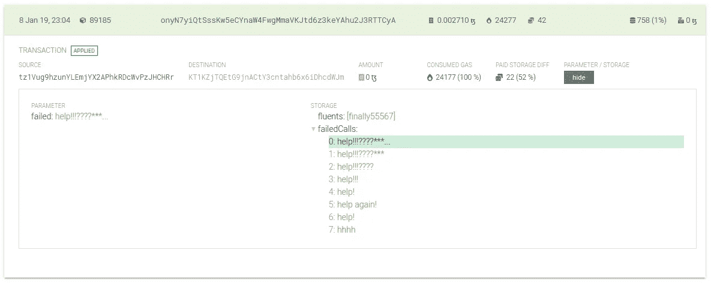

# 用 ConseilPy 挖掘 Tezos

> 原文：<https://medium.com/coinmonks/digging-into-tezos-with-conseilpy-86e0564ffbd5?source=collection_archive---------0----------------------->

## 烤坏了的 DYOR 系列

ConseilPy 是一个 Python 库，为 [Conseil](https://cryptonomic.github.io/Conseil/#/) 区块链索引器提供类似 Sqlalchemy 的查询语法。您现在可以开始使用 ConseilPy 了:可以通过 PyPi 安装[软件包](https://pypi.org/project/conseil/)，[文档](https://github.com/baking-bad/conseilpy)，以及[示例](https://github.com/baking-bad/conseilpy/tree/master/examples)可在 Github 上获得。我们要感谢 Tezos 基金会对我们的支持，感谢 Cryptonomic 团队的合作和快速反应。

我们是 Jupyter 笔记本电脑的超级粉丝，我们也喜欢在不经意的情况下工作。ConseilPy 让您只需点击几下鼠标就可以开始使用 Tezos alphanet，在本文中，我们将举几个有趣的用法示例。

# 代表注册和滚动价格

没有多少有用的信息可以从 alphanet 中提取出来，但是我们从这样一个假设开始:面包师在 Mainnet 中做某件事之前，会先尝试在 alphanet 中做这件事。

让我们看看一卷的价格和注册代表的人数是否有联系。为了注册为面包师，一个人必须对自己进行委托操作。现在不可能比较 Conseil 中的字段，但是我们可以按源过滤操作(请注意，这在艾美奖更新后将不起作用)。

运用一些熊猫魔法:

最后，我们得到了图表。人们可以注意到，在价格大幅下跌后，人们的兴趣有所增加。此外，这是一个伟大的时间，以开放面包店在 6 月底:)

# 智能合同洞察

让我们看看关于智能合同有什么发现。应该注意的是，一些开发人员更喜欢在本地节点上调试智能合同，因为这样方便多了。因此，我们的结果不太正确。但出于演示目的，这是可以的。

## 开发人员您好

在代码中遇到程序员留下的一些笑话总是很好的。我们已经提到了意外发现的 ASCII [-art](/coinmonks/inspecting-smart-contracts-with-pytezos-848946a15078) 样本，但是我们可以使用 ConseilPy 提取什么呢？幸运的是，我们可以利用对存储、脚本和参数的全文搜索。例如，我们可以寻找网址和电子邮件:

或者碰到一个男人哭着求救:

I’m afraid he never got help

分析脚本你也可以发现很多有趣的事情，例如，我们在寻找内部原创和委托来调试[更好-call.dev](https://better-call.dev) 。Conseil 目前不支持内部操作，所以我们使用了以下查询:

## 源语言

使用一个相当简单的试探法，在某些情况下，我们可以确定使用了哪种高级语言来编写合同。例如，如果出现特殊类型的字段或[变量](https://github.com/OCamlPro/liquidity/blob/c61178b89986875ce7193c3cdda9b25e3998774a/tools/liquidity/liquidMichelson.ml#L60)注释，可以检测到 Liquidity compiler，或者错误消息模板可以识别 SmartPy。

让我们看看用流动性和其他语言编写的已部署合同的数量是如何变化的。从非流动性产品开始:来自开发商的问候

你可以注意到，我们是按脚本对原创进行分组的，这是删除重复代码库的一种简单方法。一个更好的方法是使用模糊比较，但是一个简单的方法也可以用于我们的研究。

快速增长的时刻很可能与一个契约的几个修改(调试)的部署有关。总的来说，结果是预料中的偏差，但可以得出一些结论。

# 摘要

有了 ConseilPy，您可以不费吹灰之力就开始探索 Tezos。类似 SQLAlchemy 的语法和内联元数据文档字符串允许非常快速地编写查询。下次我们将展示如何一起使用 ConseilPy 和 PyTezos 来制作更酷的东西。

在[推特](https://twitter.com/tezosbakingbad)和 [Github](https://github.com/baking-bad) 上关注我们，保持更新。
干杯！

*最初发表于 2019 年 7 月 11 日*[*https://baking-bad.org*](https://baking-bad.org/blog/2019/07/11/digging-into-tezos-with-conseilpy/)*，在那里你可以找到文章的完整版本。*

> [直接在您的收件箱中获得最佳软件交易](https://coincodecap.com/?utm_source=coinmonks)

