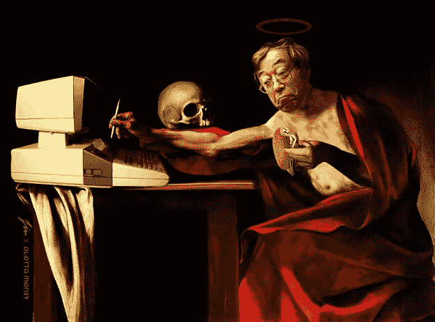
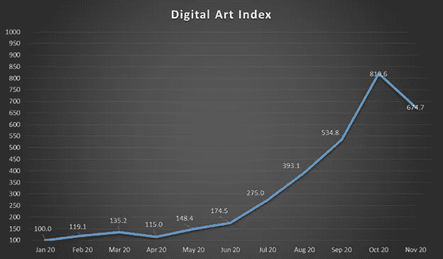
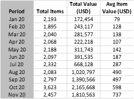
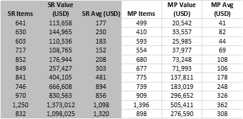
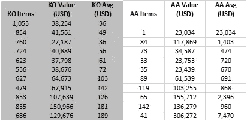

# 数字艺术索引:你知道我们知道你现在似乎知道的

> 原文：<https://medium.com/coinmonks/digital-art-index-you-know-we-know-what-you-seem-to-know-now-190e4b06de53?source=collection_archive---------6----------------------->

[Saint Nakamato by lalotta_money on SuperRare](https://superrare.co/artwork-v2/saint-nakamoto-5624)

# 数字艺术空间正在全面蓬勃发展。

引用一位杰出的收藏家、博客作者、特立独行的先驱[Matthew . cent . eth(@ nifty time)](https://beta.cent.co/matthew/+jz6il)的话:“今天购买#CryptoArt 就像在 2010 年购买比特币。”

他继续说道:“不过，我没有花 1 万 BTC 买披萨，而是买了一件博物馆会为之疯狂的艺术品。”

增长速度惊人，从 2019 年 6 月的 6000 美元增长到 2020 年 6 月的 39 万美元。9 月份仅为 140 万美元，是这个数字的 3.5 倍。

我以前写过关于这个主题的文章，我不会深入讨论更多的细节或例子。相反，我会尽可能清楚地解释手头的主题，并引入一些问题。

# **为什么需要指数？**

销售数字，售出商品的数量，平均价格，二次销售，与画廊相比的市场，今年的数字，明年的数字..

这个清单继续下去，足以令人困惑。索引是解决复杂性的方法。它将潜在的动态简化为从基数开始的连续数字序列。

因此，数字艺术指数是了解一段时间内市场总体走向的捷径，也是与第三方、媒体、爱好者、知己、友敌等轻松沟通的捷径。

# **数字艺术指数是由什么构成的？**

数字艺术指数通过 nonfungible.com 提供的大型数据库从区块链获取数据。该指数利用合同发行人记录的网上交易。通过这种方式，当 artist 创建一个包含指数成分合同的合同时，无论艺术品在哪里出售，Nonfungible 都会跟踪指数将使用的交易(如果在其指定的标准内)。

请注意，如果某些市场进行信用卡和/或其他非以太坊区块链为基础的交易，他们将不会被记录。此外，该指数目前仅限于涵盖四个主要半策展画廊的数据，它们是 [SuperRare](https://superrare.co/) 、 [MakersPlace](https://makersplace.com/) 、 [KnownOrigin](https://knownorigin.io/) 和 [AsyncArt](https://async.art/) 。这种方法排除了通过这些画廊和直接销售的高销售个人。它还忽略了像 Rarible 这样的大型合同，这些合同也积累了大量的数字艺术品销售。然而，由于这是一个指数而不是市场价值，它的相对方向和月度变化应该通过覆盖这四个画廊与市场动态大体一致。

为了清楚起见，我使用术语“半策划”来表示艺术家的访问和二级销售标准是由这些画廊执行的，而艺术家的内容、定价和推广以及收藏家的操作方式则不是。

[Eaten by dragons by Dunja Yung on MakersPlace](https://makersplace.com/moderats/eaten-by-dragons-1-of-1-36395/)

# **数字艺术指数是如何计算的？**

该指数是按月度指标的加权平均值计算的。指数基数为 100，基期月份为 2020 年 1 月。对于每个增加的月份，美元销售额和售出的商品数量与前一个月进行比较，以记录指数的变化。同时，这些不同的度量被分配不同的权重。在当前版本中，销售额占 60%，而售出的商品数量占 40%。通过这种方式，该指数依赖于市场参与度和总销售额。

# **谁创造了数字艺术指数？**

该指数由胡尔基·奥莰·塔巴克于 2020 年 10 月 29 日按照本文所述的方法创建。

# **接下来会发生什么？**

我将在一段时间内每月公布数字艺术指数。除了个人问题，指数数据将在每月非财政赤字统计数据公布后的几天内公布。

同时通过时间、反馈和使用；在可能的情况下，该指数将得到改善。最终，经过一些实地测试后，最有意义的是将该指数集成到一个网站的寿命自动计算中。

# **潜在缺点**

该指数的潜在缺点可能是(I)没有足够的合同来创建指数级代表性样本，(ii)需要额外的计算指标，以及(iii)权重需要调整。我个人的看法是，这两个缺点都没有改变数字艺术索引的有用性、基础水平和方向性。毕竟，我们的目标不是准确地指出谁做了什么。相反，目的是用简单的数字方式表现复杂的总体，并注意内部和外部的一致性。

# **当前指数图**

2020 年 11 月的数字艺术指数可以在这里找到:

该指数的数据表如下所示:

合同级别细目表如下:

我不会在这里详述数字，你可以访问 Twitter 上的@hotabak，了解对数字艺术空间表现的偶尔评论。

请注意，我可能很容易在输入数据时出错，因为在这个公益项目中没有第三方双重检查支持。任何这样的错误都是可能的和无意的。

…

最后，本文的标题是向 1983 年《小丑的眼泪》专辑剧本中的[致敬。](https://open.spotify.com/track/0AJjU7y01P5sGEqOxZbFzg?si=RZ1GSi2QTGCBrARbDr5USA)

[one more dance by blueinversion on KnownOrigin](https://knownorigin.io/gallery/222950-one-more-dance)

【BTCHaber.com】这篇文章将以英语发表在媒体上，以土耳其语发表在网站上。相对时间取决于很多因素，但一个接一个。

## 另外，阅读

*   最好的[密码交易机器人](/coinmonks/crypto-trading-bot-c2ffce8acb2a)
*   [Deribit 审查](/coinmonks/deribit-review-options-fees-apis-and-testnet-2ca16c4bbdb2) |选项、费用、API 和 Testnet
*   [FTX 密码交易所评论](/coinmonks/ftx-crypto-exchange-review-53664ac1198f)
*   [Bybit 交换审查](/coinmonks/bybit-exchange-review-dbd570019b71)
*   最好的比特币[硬件钱包](/coinmonks/the-best-cryptocurrency-hardware-wallets-of-2020-e28b1c124069?source=friends_link&sk=324dd9ff8556ab578d71e7ad7658ad7c)
*   [密码本交易平台](/coinmonks/top-10-crypto-copy-trading-platforms-for-beginners-d0c37c7d698c)
*   最好的[加密税务软件](/coinmonks/best-crypto-tax-tool-for-my-money-72d4b430816b)
*   [最佳加密交易平台](/coinmonks/the-best-crypto-trading-platforms-in-2020-the-definitive-guide-updated-c72f8b874555)
*   最佳[加密贷款平台](/coinmonks/top-5-crypto-lending-platforms-in-2020-that-you-need-to-know-a1b675cec3fa)
*   [莱杰纳米 S vs 特雷佐 one vs 特雷佐 T vs 莱杰纳米 X](https://blog.coincodecap.com/ledger-nano-s-vs-trezor-one-ledger-nano-x-trezor-t)
*   [block fi vs Celsius](/coinmonks/blockfi-vs-celsius-vs-hodlnaut-8a1cc8c26630)vs Hodlnaut
*   [Bitsgap 评论](/coinmonks/bitsgap-review-a-crypto-trading-bot-that-makes-easy-money-a5d88a336df2)——一个轻松赚钱的加密交易机器人
*   为专业人士设计的加密交易机器人
*   [PrimeXBT 审查](/coinmonks/primexbt-review-88e0815be858) |杠杆交易、费用和交易
*   [HaasOnline 评论](/coinmonks/haasonline-review-d8d1a3400419)享受九折优惠
*   Bitmex 上的[保证金交易的白痴指南](/coinmonks/the-idiots-guide-to-margin-trading-on-bitmex-dbbd7742c6fc?source=friends_link&sk=7bfa99d2a181142510c8442c8ddb0786)
*   [eToro 评论](/coinmonks/etoro-review-78807ddeb33c) |交易股票、密码、交易所交易基金、差价合约和商品
*   [BlockFi 评论](/coinmonks/blockfi-review-53096053c097) |从您的密码中赚取高达 8.6%的利息
*   [开发人员的最佳加密 API](/coinmonks/best-crypto-apis-for-developers-5efe3a597a9f)
*   [最佳区块链分析工具](https://bitquery.io/blog/best-blockchain-analysis-tools-and-software)
*   [加密套利](/coinmonks/crypto-arbitrage-guide-how-to-make-money-as-a-beginner-62bfe5c868f6)指南:新手如何赚钱
*   顶级[比特币节点](https://blog.coincodecap.com/bitcoin-node-solutions)提供商
*   最佳[加密制图工具](/coinmonks/what-are-the-best-charting-platforms-for-cryptocurrency-trading-85aade584d80)
*   了解比特币的[最佳书籍有哪些？](/coinmonks/what-are-the-best-books-to-learn-bitcoin-409aeb9aff4b)

> [直接在您的收件箱中获得最佳软件交易](/coinmonks/newsletters/coinmonks)

