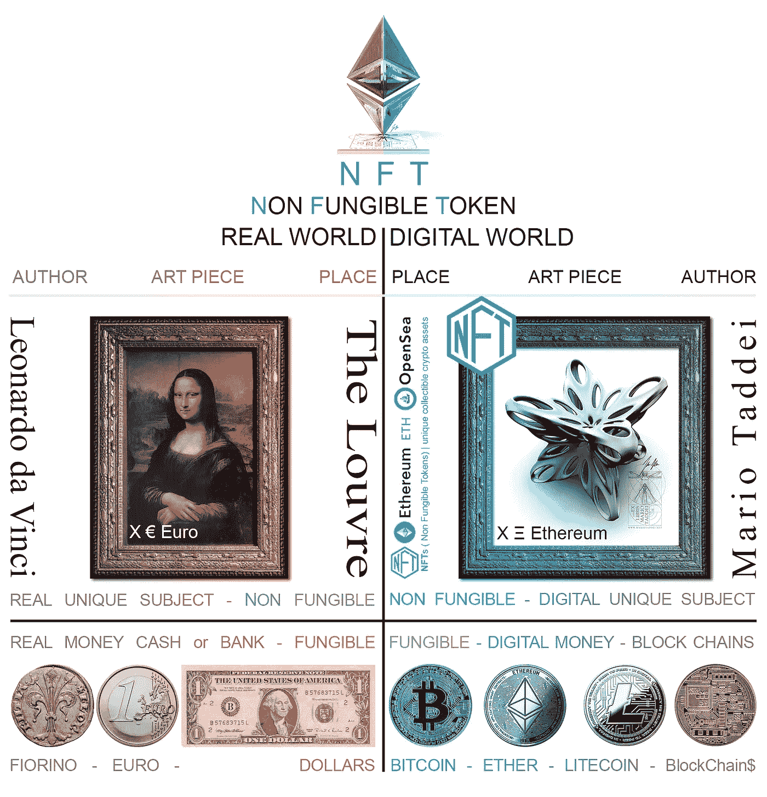
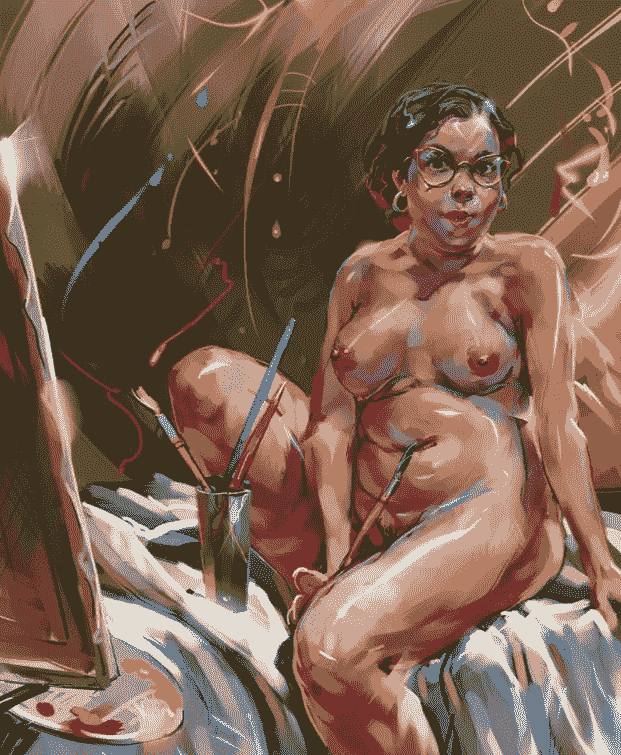
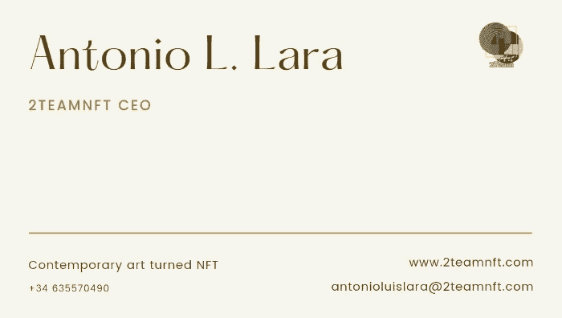

# 数字艺术 Vs NFT

> 原文：<https://medium.com/coinmonks/digital-art-vs-nft-8c0dc12d6efe?source=collection_archive---------10----------------------->

好吧，也许这是我写过的最愚蠢的标题。但是你不得不承认它有钩子。亲爱的读者，当你读完这篇文章时，我有两个目标:a)你完全理解 NFT 的概念，以及为什么艺术只是它无数可能用途中的一种，b)你喜欢阅读它。

数字艺术是一种表达形式，始于上世纪 80 年代末，是我们的合作者卡莱斯·萨佩纳于 1989 年对分形进行了实验，是它的先驱之一。数字艺术仍处于起步阶段，这一事实暗示了所有艺术风格在其初始阶段所遭遇的一个问题。很少有人能够评估它们的质量，这意味着，最有可能的是，它们中的大多数没有通过时间的考验，被遗忘在一个断开连接的硬盘的最后一个角落，存放在阁楼上，或者作为一个不再被记住的钱包中的 NFT。稍后我会强调数字艺术和 NFT 之间的联系。

虽然我在以前的[帖子](/coinmonks/buy-an-artwork-not-just-an-nft-5ff0e10867a5)中强调过，但用知识购买艺术品是确保你的购买或投资真正值得的根本，不会成为你硬盘或数字钱包中那些被遗忘的作品之一。这就是为什么听取业内专业人士的建议，在像[下一个时代画廊](https://www.nextagegallery.com/)这样的市场上购买，在那里你只能买到高质量的作品，可以为你将来省去很多麻烦。

你知道阿尔塔米拉的画吗？1868 年在西班牙坎塔布里亚发现了大约有 15000 年历史的壮观洞穴壁画。我可以向你保证，画这些画的人是马格达林时期的米开朗基罗。那个时代的大部分作品并不那么宏伟，但无论如何，不幸的是，它们并没有传到我们的时代。对于大多数发起艺术运动的作品，或者大多数为开发新技术而成立的公司来说，情况也是如此。只有真正相关的才能存活。

所以，正如我对那些联系我提出新合作的人说的，让我们开门见山吧。

什么是 NFT(不可替代令牌)？首先要注意的是，它是一种代币，是区块链上的一种资产，其目的并不完全在于货币交易(尽管也可能是货币交易)。

用 William Mougayar 的话来说，代币是“一个组织创造的价值单位，用以管理其商业模式，并给予其用户与产品互动的更多权力，同时促进其所有利益相关者之间的利益分配和分享”。

到目前为止，最常用的令牌标准是 ERC-20 和 ERC-721，后者用于创建 NFT。

因此，一个 ERC-20 代币可以毫无问题地换成另一个(合同相同的)代币。例如，一个 ETH 与另一个 ETH 完全相同，它们具有相同的值。然而，NFT 令牌可以包含嵌入其中的任何内容。无论是文本、照片、歌曲、电影，还是用于视频游戏的内容，例如打开这种视频游戏的所有门的超级钥匙。也可以是在元宇宙中包含一块土地，或者是一件艺术品，这是我写这篇文章的原因。

最有趣的是，NFT 可能只包含一定比例的所有权(或者更确切地说是开发一件作品的权利)，这增加了艺术品的可能投资，并使所有对艺术世界感兴趣的收藏家都能接触到艺术品

是的，NFT 只不过是一个容器。一个保证其来源，不可更改，可以在没有任何中介的情况下在对等体之间交换并且具有无穷优势的容器，但它仅仅是一个容器。因此，您应该注意该容器中的内容。

现在我将向你介绍两个来自不同市场的作品。其中之一是一位世界著名作家精心创作的作品。猜猜哪个更便宜？

A girl from Brazil ([Igor Komanov](https://nextagegallery.com/product/a-girl-from-brazil/))

mfer #9980 from [OpenSea](https://opensea.io/assets/0x79fcdef22feed20eddacbb2587640e45491b757f/9980)

这两部作品都应该得到最大的尊重。可能人们更关注卡片收藏者，而不是艺术品收藏者。重要的是要注意艺术品是在哪里、为什么以及出于什么目的购买的，是不是 NFT 的作品。

你们自己判断吧。

最诚挚的问候，

在 [Linkedin](https://www.linkedin.com/in/2teamnft-art-tokenization/) 、[脸书](https://www.facebook.com/2team.nft)、 [Discord](https://discord.com/channels/860818327135846400/860818327135846402) 和 [Twitter](https://twitter.com/nft_2) 上关注我们。

> 加入 Coinmonks [电报频道](https://t.me/coincodecap)和 [Youtube 频道](https://www.youtube.com/c/coinmonks/videos)了解加密交易和投资

## 另外，阅读

*   [网格交易机器人](https://blog.coincodecap.com/grid-trading) | [Cryptohopper 审查](/coinmonks/cryptohopper-review-a388ff5bae88) | [Bexplus 审查](https://blog.coincodecap.com/bexplus-review)
*   [7 个最佳零费用加密交易平台](https://blog.coincodecap.com/zero-fee-crypto-exchanges)
*   [去中心化交易所](https://blog.coincodecap.com/what-are-decentralized-exchanges) | [比特恩斯 FIP](https://blog.coincodecap.com/bitbns-fip) | [Pionex 评论](https://blog.coincodecap.com/pionex-review-exchange-with-crypto-trading-bot)
*   最佳加密[硬件钱包](/coinmonks/hardware-wallets-dfa1211730c6) | [Bitbns 评论](/coinmonks/bitbns-review-38256a07e161)
*   [新加坡十大最佳加密交易所](https://blog.coincodecap.com/crypto-exchange-in-singapore) | [购买 AXS](https://blog.coincodecap.com/buy-axs-token)
*   [投资印度的最佳加密软件](https://blog.coincodecap.com/best-crypto-to-invest-in-india-in-2021)|[WazirX P2P](https://blog.coincodecap.com/wazirx-p2p)|[Hi Dollar Review](https://blog.coincodecap.com/hi-dollar-review)
*   [加拿大最好的加密交易机器人](https://blog.coincodecap.com/5-best-crypto-trading-bots-in-canada) | [库币评论](https://blog.coincodecap.com/kucoin-review)
*   [用于 Huobi 的加密交易信号](https://blog.coincodecap.com/huobi-crypto-trading-signals) | [HitBTC 审查](/coinmonks/hitbtc-review-c5143c5d53c2)
*   [如何在 FTX 交易所交易期货](https://blog.coincodecap.com/ftx-futures-trading) | [OKEx vs 币安](https://blog.coincodecap.com/okex-vs-binance)
*   [OKEx vs KuCoin](https://blog.coincodecap.com/okex-kucoin) | [摄氏替代品](https://blog.coincodecap.com/celsius-alternatives) | [如何购买 VeChain](https://blog.coincodecap.com/buy-vechain)
*   [币安期货交易](https://blog.coincodecap.com/binance-futures-trading)|[3 commas vs Mudrex vs eToro](https://blog.coincodecap.com/mudrex-3commas-etoro)
*   [如何购买 Monero](https://blog.coincodecap.com/buy-monero) | [IDEX 评论](https://blog.coincodecap.com/idex-review) | [BitKan 交易机器人](https://blog.coincodecap.com/bitkan-trading-bot)
*   [尤霍德勒 vs 科恩洛 vs 霍德诺特](/coinmonks/youhodler-vs-coinloan-vs-hodlnaut-b1050acde55a) | [Cryptohopper vs 哈斯博特](https://blog.coincodecap.com/cryptohopper-vs-haasbot)