# 数字资产支付行业研究报告

> 原文：<https://medium.com/coinmonks/digital-assets-payment-industry-research-report-e040c0d113ed?source=collection_archive---------3----------------------->

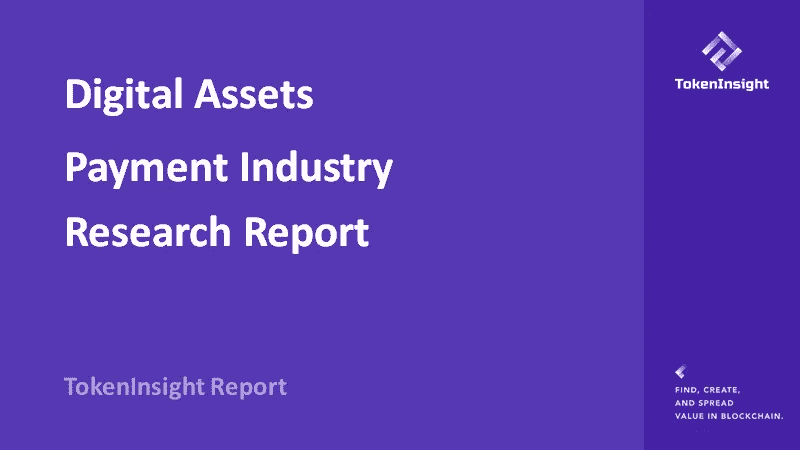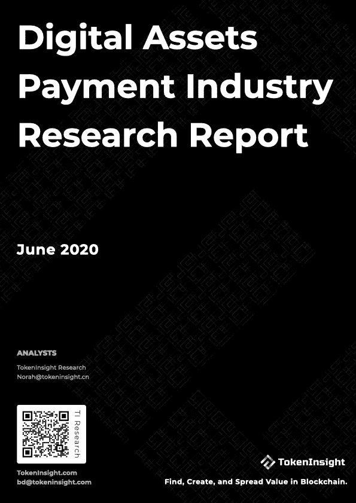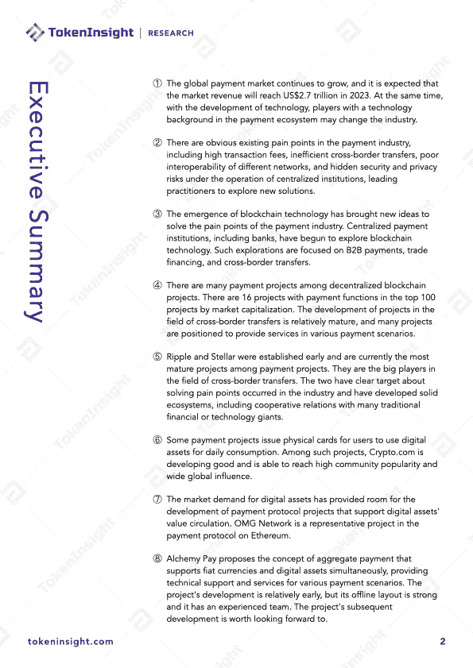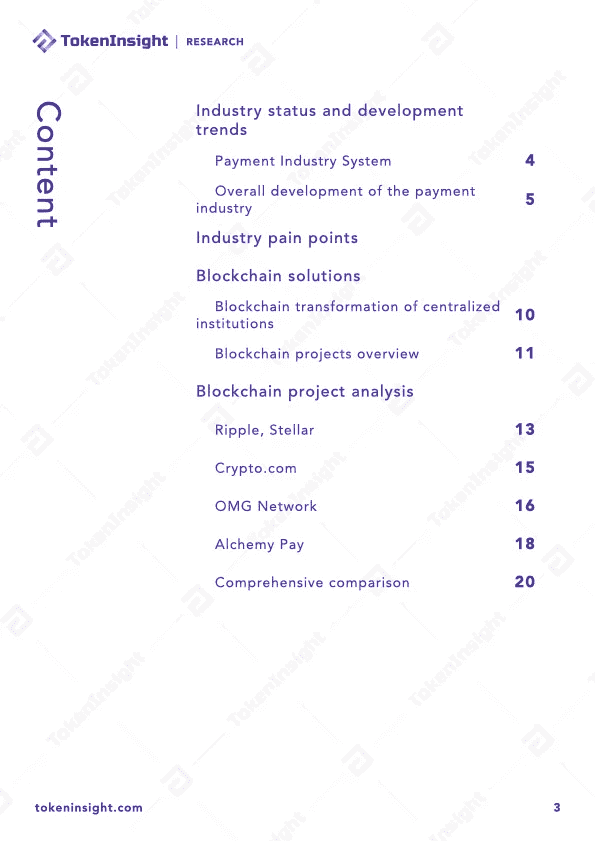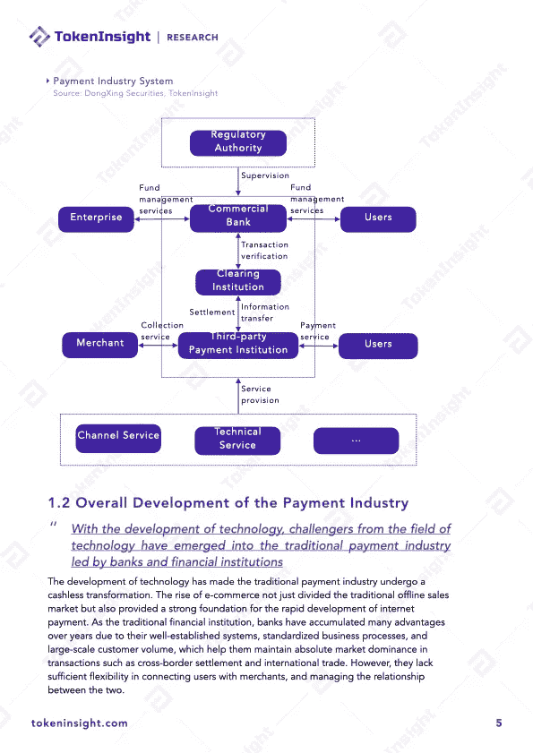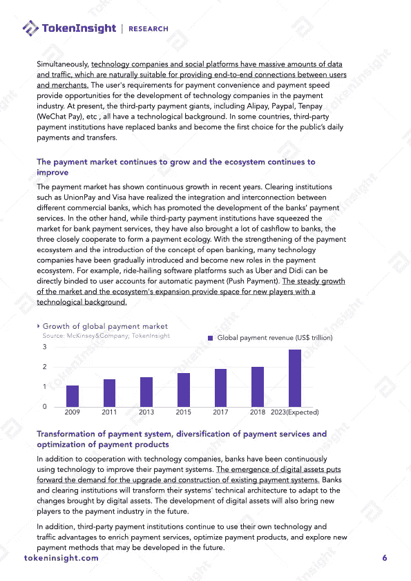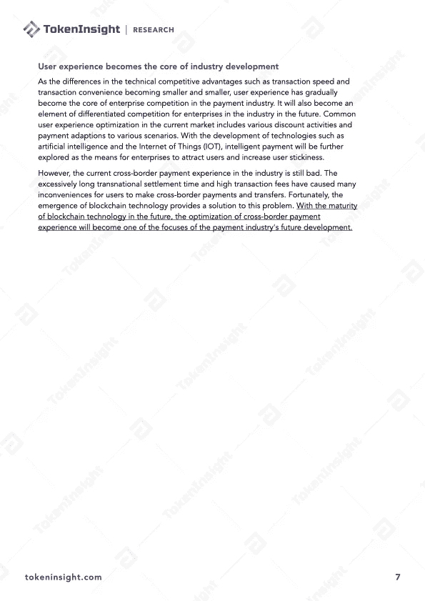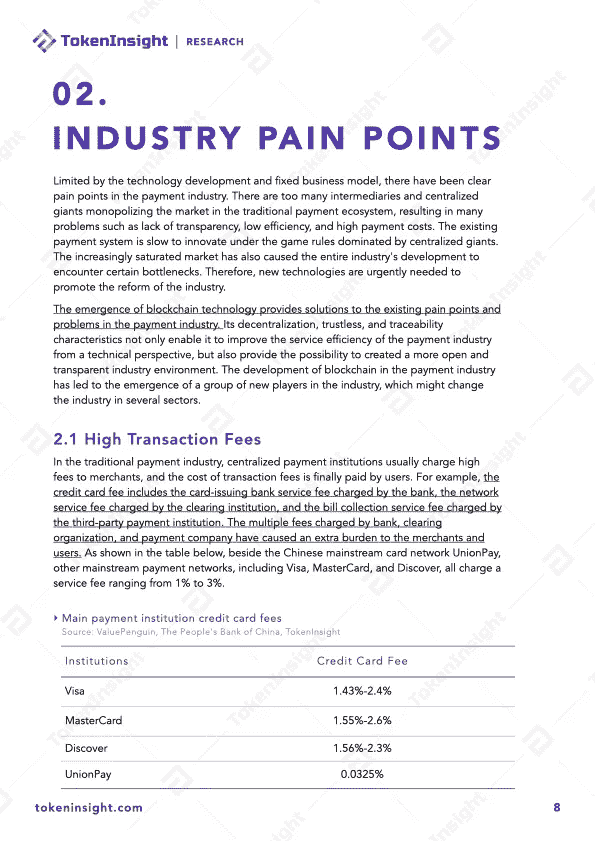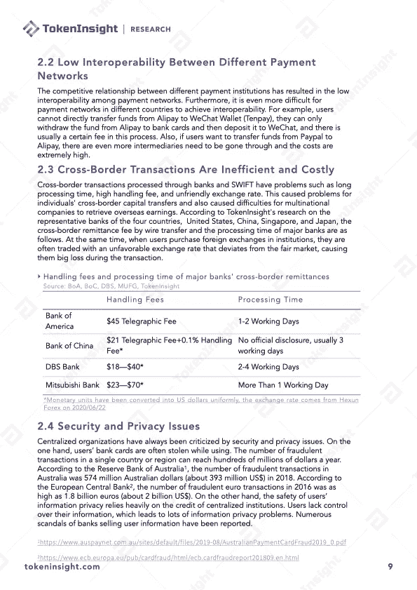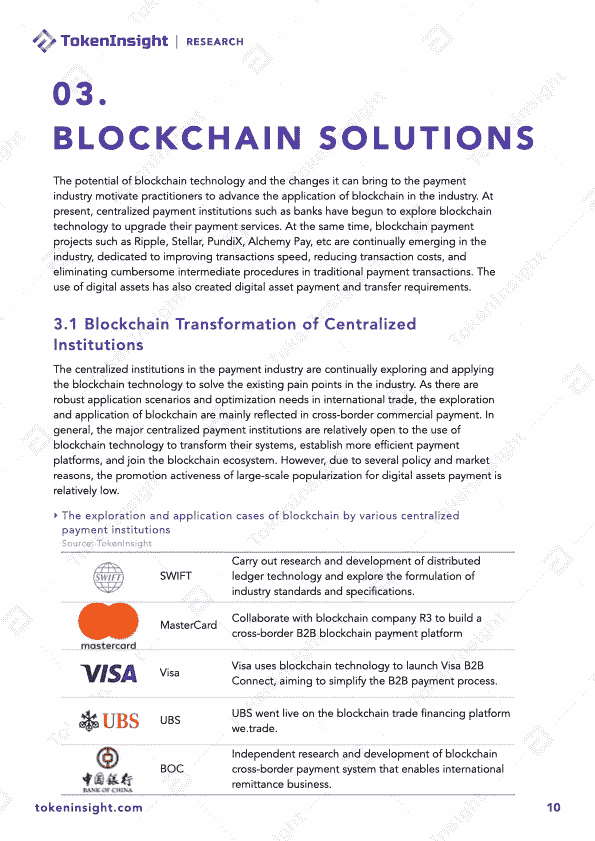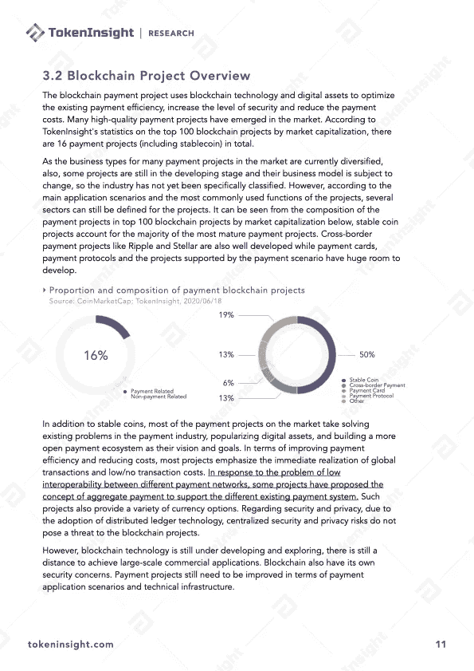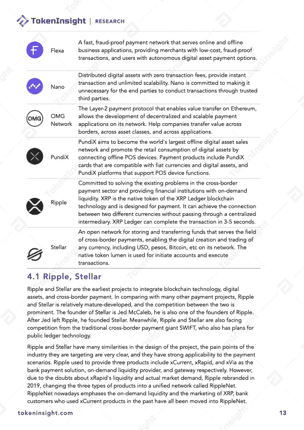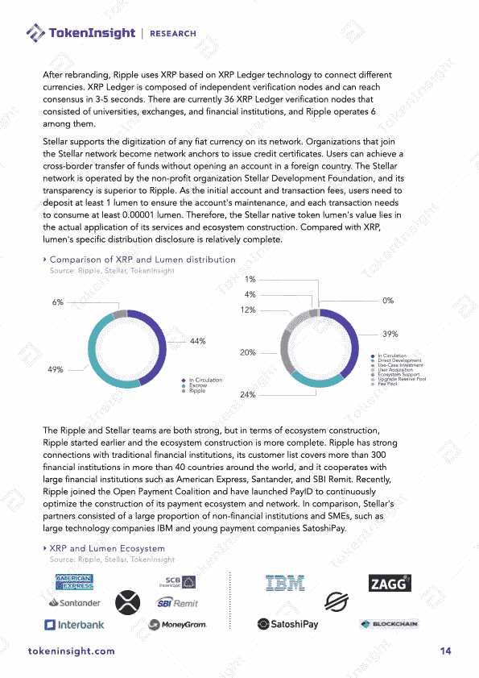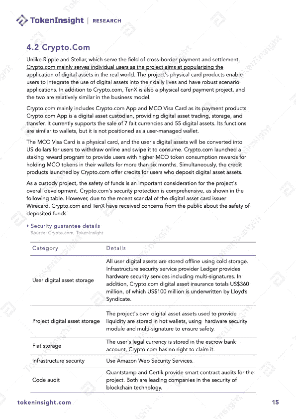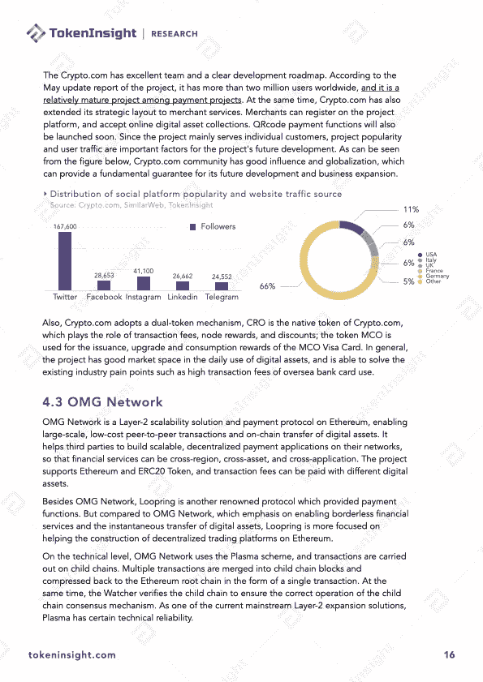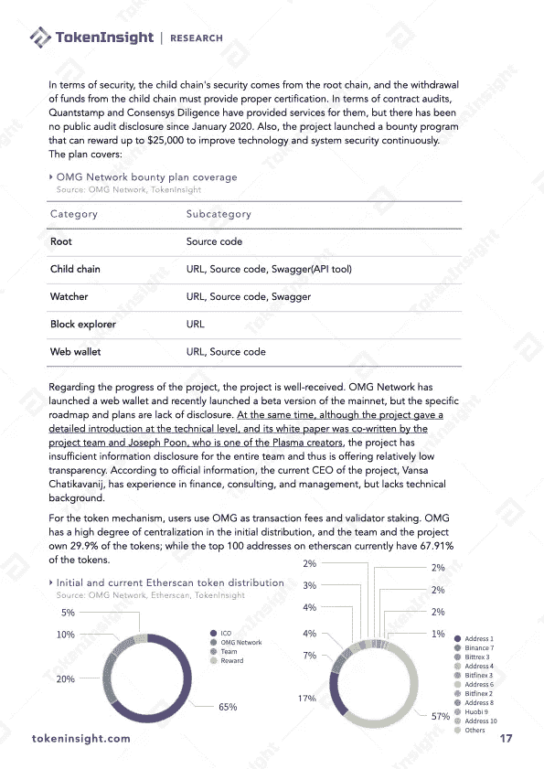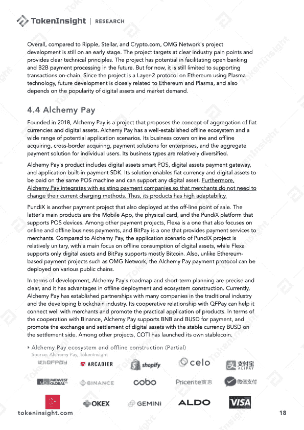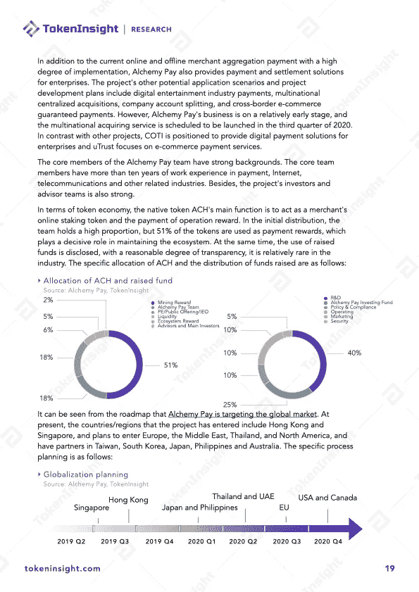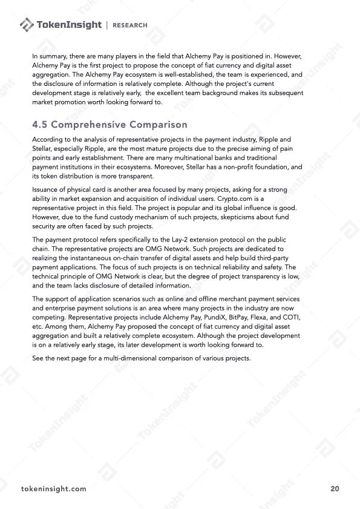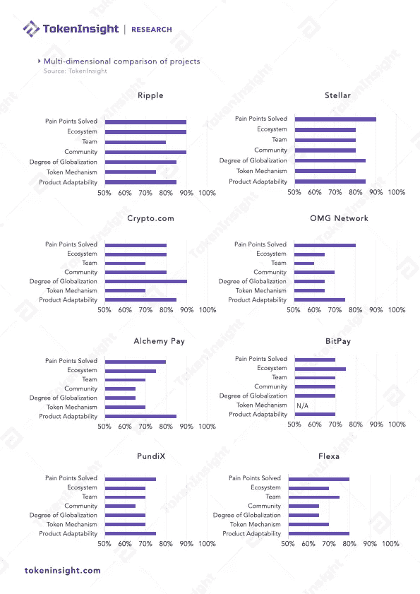

# 关于 TokenInsight

**token insight 成立于 2017 年，是一家领先的数据&技术驱动的区块链金融机构。** TokenInsight 首创完整的区块链行业分类体系，覆盖超过**1600 个项目，**发布超过 **300 份评级报告，**深入研究 **10 大行业。**

TokenInsight 的数据、评级和研究报告可以访问全球 70 多个数据平台，包括 **Messari、Delta、币安信息、AICoin、火币信息、**等。，月 PV 超过 3000 万。TokenInsight 已正式加入由加密货币排名网站 CoinMarketCap 发起的数据问责与透明联盟(Data)。

# 如果您喜欢我们的研究，请关注我们:

💡官方网站:[https://www.tokeninsight.com](https://www.tokeninsight.com/)

📌领英官方页面:[https://www.linkedin.com/company/tokeninsight/](https://www.linkedin.com/company/tokeninsight/)

🔎电报:

🗺https://www.twitter.com/tokenInsight

📕https://www.reddit.com/r/TokenInsight/

> [*在您的收件箱中直接获得最佳软件交易*](https://coincodecap.com/?utm_source=coinmonks)

