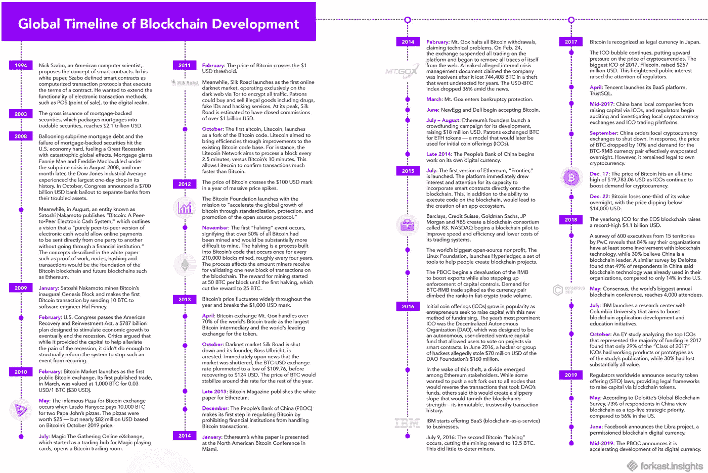
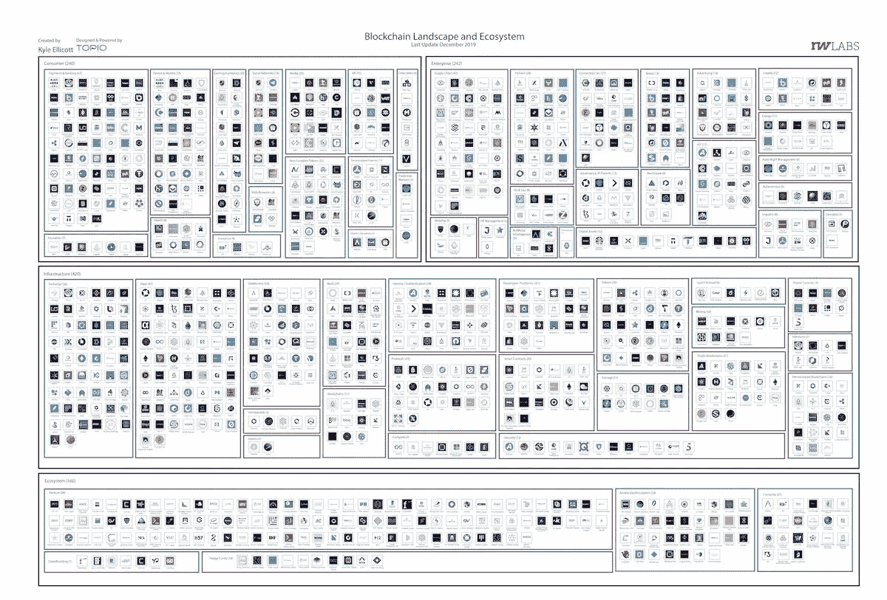

# 到 2030 年，数字资产将取代菲亚特/ 80+日本银行&摩根大通/以太坊的伊斯坦布尔硬分叉直播

> 原文：<https://medium.com/coinmonks/digital-assets-to-replace-fiat-by-2030-80-japanese-banks-jpmorgan-ethereums-istanbul-hard-a0744d30452c?source=collection_archive---------0----------------------->

Photo by [Geronimo Giqueaux](https://unsplash.com/@ggiqueaux?utm_source=unsplash&utm_medium=referral&utm_content=creditCopyText) on [Unsplash](https://unsplash.com/s/photos/money?utm_source=unsplash&utm_medium=referral&utm_content=creditCopyText)

2019 年 12 月 11 日

*为您直播来自* [*边缘电脑世界*](https://www.edgecomputingworld.com/) *本周在山景城。最近，我们在区块链/ DLT 领域看到了很多动向。以至于今天，我发布了更新的* [*Q4 2019 版区块链格局*](https://www.linkedin.com/posts/kyleellicott_dapps-defi-blockchain-activity-6610619519859781634-3ycx) *突出了业内超过 620 家独特的公司。* [*下载*](https://www.linkedin.com/posts/kyleellicott_dapps-defi-blockchain-activity-6610619519859781634-3ycx) *今天你的免费副本吧。*

**Q4 2019 Edition** of the Blockchain for Infrastructure & Ecosystem Landscape

*让我们更深入地了解本周的版本—* ***德意志银行*** *认为 2030 年是替代货币需求上升的一年，数字货币最终将取代现金，数字钱包的数量将超过 2 亿！* ***以太坊的*** *伊斯坦布尔硬叉本周上线。日本 80 多家银行表示有兴趣加入摩根大通的区块链支付平台。* ***勇敢*** *在 2018 年至 2019 年期间，其月活跃用户(MAU)几乎翻了一番，达到 1040 万。* ***中国的*** *央行正在两个城市测试数字货币……*

*在 DApps 的版图中，我们讨论的是分散的******智能*** ***契约。币安*** *收购 dApp 分析平台，* ***收购 DappReview*** *。* ***微软 Azure*** *宣布了 Azure 英雄区块链(NFT)的不可替代令牌。加更新自* ***谜****&****链环*******币安*******织机*** *。我们甚至在大量的研究(* [*Q4 2019 区块链格局*](https://www.topionetworks.com/markets/blockchain-landscape-5bf43854b9abe4633c1f87da) *) &书籍(关于* [*数字资产*](https://www.scribd.com/document/430637579/Current-Market-Overview-of-Digital-Assets)*&*[*企业区块链*](https://www.amazon.com/dp/B07Z3LJCHW/ref=cm_sw_r_tw_dp_U_x_C6iSDbACJJN2Z) *)以及对风险投资(新基金！！)、基础设施、DApps、比特币、经济学、交易所和 Stablecoins。为了了解更多信息，让你跟上时代的步伐，这里有一张本周业内热门新闻的快照。*****

## **📈[德意志银行研究:加密技术将在 2030 年取代法定货币](https://cointelegraph.com/news/deutsche-bank-research-crypto-to-replace-fiat-currencies-by-2030)**

**根据德意志银行最近的研究，到 2030 年，对替代货币的需求将会上升，数字货币最终将取代现金。德意志银行策略师 Jim Reid 提高了对现有法定系统近年来遇到的挑战的认识，特别是随着加密货币的出现… [阅读更多](https://cointelegraph.com/news/deutsche-bank-research-crypto-to-replace-fiat-currencies-by-2030)**

## **📖[以太坊的伊斯坦布尔硬叉现已直播](https://www.coindesk.com/ethereums-istanbul-hard-fork-is-now-live)**

**[以太坊](https://medium.com/u/d626b3859bc9?source=post_page-----a0744d30452c--------------------------------)硬叉已经成功完成，目标区块 9069000 如期到达，UTC 时间 0:25。伊斯坦布尔是该网络的第八个硬分叉，第一次代码更改于 2019 年 6 月获得批准。伊斯坦堡包括六个以太坊改进提案(EIP)，以太坊协议的具体代码更改，包括 EIPs 152、1108、1344、1844、2028 和 2200……[阅读更多](https://www.coindesk.com/ethereums-istanbul-hard-fork-is-now-live)**

## **📖[超过 80 家日本银行计划加入摩根大通的区块链支付网络](https://www.theblockcrypto.com/linked/49876/over-80-japanese-banks-plan-to-join-jpmorgans-blockchain-payments-network)**

**超过 80 家日本银行表示有兴趣加入摩根大通的区块链支付平台——银行间信息网络(IIN)。摩根大通执行董事大三郎·萨纳伊表示，IIN 可能会帮助日本银行应对洗钱风险，因为该网络使现金接收者的筛选“更快、更有效”… [阅读更多信息](https://www.theblockcrypto.com/linked/49876/over-80-japanese-banks-plan-to-join-jpmorgans-blockchain-payments-network)**

## **📈[私人区块链浏览器勇者 2019 年月活跃用户翻倍](https://cointelegraph.com/news/private-blockchain-browser-brave-doubles-monthly-active-users-in-2019)**

**以隐私为导向的区块链网络浏览器 [Brave](https://brave.com/) 的月活跃用户(MAU)从 2018 年的 550 万增加到 2019 年的 1040 万，几乎翻了一番。与此同时，Brave 的每日活跃用户(DAU)在过去一年中增加了两倍，达到 330 万。除了非活跃用户激增之外，Brave 还记录了注册接收 Brave 内置令牌(基本注意力令牌(BAT))以分享内容的认证出版商数量增长了 12 倍……[阅读更多信息](https://www.forbes.com/sites/billybambrough/2019/12/01/jack-dorseys-future-defining-plan-to-bring-bitcoin-to-12-billion-people/#196465d24f6f)**

## **📖[沃尔玛和其他公司如何乘着区块链浪潮走向供应链天堂](https://www.forbes.com/sites/biserdimitrov/2019/12/05/how-walmart-and-others-are-riding-a-blockchain-wave-to-supply-chain-paradise/#7635b6527791)**

**文章称，区块链技术正在通过降低成本、增强可追溯性和提高透明度来影响供应链生态系统。这对沃尔玛、家乐福、雀巢和都乐这样的巨头来说意义重大，它们都是 IBM 食品信托来源项目的一部分……[阅读更多](https://www.forbes.com/sites/biserdimitrov/2019/12/05/how-walmart-and-others-are-riding-a-blockchain-wave-to-supply-chain-paradise/#7635b6527791)**

## **📖 [Bitfury 推出受比特币保护的企业区块链](https://www.forbes.com/sites/michaeldelcastillo/2019/12/05/bitfury-launches-first-enterprise-blockchain-secured-by-bitcoin/#7c55f3c4c6cf)**

**[bit fury Group](https://medium.com/u/f3c72b23a620?source=post_page-----a0744d30452c--------------------------------)推出了 [Exonum](https://medium.com/u/8a38dd15cdab?source=post_page-----a0744d30452c--------------------------------) Enterprise，这是第一个从零开始建造的区块链，旨在让大型企业使用比特币区块链简化业务并增加透明度……[阅读更多信息](https://www.forbes.com/sites/michaeldelcastillo/2019/12/05/bitfury-launches-first-enterprise-blockchain-secured-by-bitcoin/#7c55f3c4c6cf)**

## **📖[联合银行和世界自然基金会利用区块链帮助当地渔业社区](https://finance.yahoo.com/news/unionbank-wwf-blockchain-help-local-140001862.html)**

**拥有区块链开发公司 Tomorrow Explored (TX)的 Streamr Network 与国际慈善机构世界自然基金会(WWF)和菲律宾联合银行(UnionBank)合作，推出了一款名为 Tracey 的应用程序，允许渔民跟踪他们的捕捞情况。Tracey 应用程序可用于存储区块链的渔业数据，将提供给菲律宾的渔业社区，第一个试点项目将于 2020 年年中推出……[阅读更多信息](https://finance.yahoo.com/news/unionbank-wwf-blockchain-help-local-140001862.html)**

## **🇨🇳 [中国央行将与国有商业银行和电信巨头合作，在两个城市测试数字货币](https://www.theblockcrypto.com/post/49659/report-chinas-central-bank-to-test-digital-currency-in-two-cities-partnering-with-state-backed-commercial-banks-and-telecom-giants)**

**The People’s Bank of China (PBOC), the country’s central bank, will soon test its much-anticipated digital currency electronic payment (DC/EP) in the cities of Shenzhen and Suzhou, according to a report from Chinese financial news outlet Caijing. According to the [report](https://news.caijingmobile.com/article/detail/407673?source_id=40), PBOC has partnered with seven state-owned companies to roll out the test. including four commercial banks and three telecom giants.…[read more](https://www.theblockcrypto.com/post/49659/report-chinas-central-bank-to-test-digital-currency-in-two-cities-partnering-with-state-backed-commercial-banks-and-telecom-giants)**

# **Research To Read This Week:**

## **📖 [**Blockchain Is Not China’s Future — It’s The Present**](https://forkast.news/china-blockchain-report/) **(MASSIVE REPORT)****

****

**Source: [Forkast Insights](https://forkast.news/china-blockchain-report/)**

**In an Oct. 24 address to the Communist Party of China (CPC) Central Committee, President Xi Jinping stressed the importance of blockchain technology as a pillar to the country’s next decade of industrial development. While domestic businesses were familiar with the technology and many were already using it, efforts must accelerate for China to play a leading role in the creation of international blockchain standards. Days after Xi’s address, China Center for International Economic Exchanges Executive Vice President Huang Qifan said at the China Finance 40 Forum that the People’s Bank of China was in the final stages of preparing to launch its digital currency now formally known as digital currency electronic payment (DCEP). At this rate, China is on track to be the first country to launch a central bank digital currency, though other central banks are now making progress in this field.…[read more](https://forkast.news/china-blockchain-report/)**

# **More For Your Week:**

**📖 [State of Crypto Development: December 2019](/the-challenge/state-of-crypto-development-december-2019-491e95265117) by [Eric Elliott](https://medium.com/u/c359511de780?source=post_page-----a0744d30452c--------------------------------)**

**📖 [The Web 3.0 Manifesto](https://www.peterpan.co/blog/the-web-3-manifesto)**

**📖 [Ethereum by the Numbers — The Year of 2019](https://media.consensys.net/ethereum-by-the-numbers-the-year-of-2019-264cc973467) by [ConsenSys](https://medium.com/u/6c7078bf7b01?source=post_page-----a0744d30452c--------------------------------)**

**📖[DeFi 中的新内容，11 月 25 日—12 月 8 日](/@Equilibrium_EOSDT/whats-new-in-defi-november-25-december-8-e4f486e1701a)由[平衡 _EOSDT](https://medium.com/u/5db4a8782ba2?source=post_page-----a0744d30452c--------------------------------)**

**📖[声音:区块链社交网络的测试网已经准备好了](/@alfredoantonio.decandia/voice-the-testnet-of-the-blockchain-based-social-network-is-ready-the-cryptonomist-e0970a606b0c)由[阿尔弗雷多·德·坎迪亚](https://medium.com/u/3e308ecfb31e?source=post_page-----a0744d30452c--------------------------------)制作**

**📖 [Kadena 和 Rymedi 通过](/kadena-io/kadena-and-rymedi-validate-quality-of-medicinal-products-on-blockchain-244d5fb8d699) [Rebecca Rodriguez](https://medium.com/u/666bf2761d10?source=post_page-----a0744d30452c--------------------------------) 验证区块链上医药产品的质量**

**📖[侧链和状态通道的区别](https://simpleaswater.com/difference-between-sidechains-and-state-channels/)**

**📖[你需要知道的关于 Merkle Trees 的一切](/ontologynetwork/everything-you-need-to-know-about-merkle-trees-82b47da0634a)由[本体团队](https://medium.com/u/4998f4ed133f?source=post_page-----a0744d30452c--------------------------------)**

**📖 [500 条关于比特币的头条](https://www.500headlinesaboutbitcoin.com/)**

**🎄 [Crypto 圣诞礼物指南 2019](https://decrypt.co/11903/crypto-christmas-gift-guide-2019) 由[解密](https://medium.com/u/54b61e1b74da?source=post_page-----68bcdd528bfe----------------------)**

**💰[通过](/shapeshift-stories/discovering-defi-in-blockchain-tech-f018524d4e6f) [ShapeShift](https://medium.com/u/5ee4b8323e7a?source=post_page-----78d96b8577a7----------------------) 发现区块链技术中的 DeFi**

**💰 [NYDFS 提出了在有执照的加密公司上市代币的新指南](https://www.theblockcrypto.com/post/50125/nydfs-proposes-new-guidance-for-listing-tokens-on-licensed-crypto-firms)**

**📖[当前数字资产市场概述](https://www.scribd.com/document/430637579/Current-Market-Overview-of-Digital-Assets)作者[大卫·内奇](https://medium.com/u/b23d2fb9948a?source=post_page-----b48e000a0f21----------------------)**

# **分散式应用程序手表**

## **📖[介绍 ZK 同步:以太坊大规模采用的缺失环节](/matter-labs/introducing-zk-sync-the-missing-link-to-mass-adoption-of-ethereum-14c9cea83f58)**

**今天，在实践中，密码仍然主要用于投机。如果没有真正的大规模采用，神奇的互联网货币、DeFi、Web 3.0 和所有其他有前途的区块链创意的价值主张将在很大程度上无法实现。可伸缩性不仅仅是事务吞吐量，而是区块链系统满足数百万用户需求的整体准备程度。让我们考虑一下将区块链革命推广到大众中的三个最困难的问题。… [阅读更多](/matter-labs/introducing-zk-sync-the-missing-link-to-mass-adoption-of-ethereum-14c9cea83f58)和更多来自[Alex Gluchowski](https://medium.com/u/8b3a673b9ad5?source=post_page-----a0744d30452c--------------------------------)&[Matter Labs](https://medium.com/u/54fa81e9d814?source=post_page-----a0744d30452c--------------------------------)**

## **📖[微软宣布以太坊区块链上的代币收藏品](https://cointelegraph.com/news/microsoft-announces-token-collectibles-on-ethereum-blockchain)**

**微软的区块链支持的云平台微软 Azure 宣布 Azure 英雄区块链不可替代令牌(NFT)。这些代币代表卡通獾，旨在补偿 Azure 社区中的积极行为。每只獾的供应量有限，从 100 只到 10000 只不等。不可替换令牌(NFT)是一种基于区块链的令牌，不能被其他东西替代，并且是唯一的。微软与区块链游戏创业公司金恩合作，在区块链以太坊创造了这些代币… [阅读更多](https://cointelegraph.com/news/microsoft-announces-token-collectibles-on-ethereum-blockchain)**

## **📖 [Enigma 和 Chainlink 宣布合作和整合](https://blog.enigma.co/enigma-and-chainlink-announce-collaboration-and-integration-7d2a21ae5d91)**

**[Enigma](https://medium.com/u/4f5f09fa22fb?source=post_page-----a0744d30452c--------------------------------)&[chain link](https://medium.com/u/87d28920d977?source=post_page-----a0744d30452c--------------------------------)团队宣布了一项新的合作，重点是整合他们的协议，以实现强大的秘密智能合同新用例。通过实现两个网络之间的连接，区块链空间面临的一些最大问题，特别是隐私、可扩展性和外部连接，可以出现新的解决方案……[阅读更多](https://blog.enigma.co/enigma-and-chainlink-announce-collaboration-and-integration-7d2a21ae5d91)**

**📖[币安收购 dApp 分析平台 DappReview](https://appinventiv.com/blog/binance-acquires-dapp-analytics-platform-dappreview/)**

**📖【CryptoKitties 如何安全签名&发送以太坊交易作者 [Howard Tam](https://medium.com/u/90d6657c177?source=post_page-----a0744d30452c--------------------------------)**

**📖[由](/@storjproject/secure-access-control-in-the-decentralized-cloud-cabc42523bdb) [Storj Labs](https://medium.com/u/31bb19d6e641?source=post_page-----a0744d30452c--------------------------------) 提供的分散云中的安全访问控制**

**📖[Quant Network&SimbaChain Combine for inter operable Smart Contracts](https://www.cryptoninjas.net/2019/12/11/quant-network-and-simba-chain-combine-for-interoperable-smart-contracts/)**

**📖[掌握以太坊的基础知识(针对新的区块链开发人员)第三部分——钱包、钥匙和账户](/@markmuskardin/mastering-the-fundamentals-of-ethereum-for-new-blockchain-devs-part-iii-wallets-keys-and-4cd3175b535b)作者[马克·穆斯卡丁](https://medium.com/u/eaec6bee03c2?source=post_page-----a0744d30452c--------------------------------)**

**📖[现在就开始建设币安连锁酒店😍新的隐型僵尸课程](/loom-network/start-building-on-binance-chain-now-new-cryptozombies-lesson-2ba0d764eaed)作者[🤖罗伯特](https://medium.com/u/797f4b939fd8?source=post_page-----a0744d30452c--------------------------------)和[织机网络](https://medium.com/u/9f7a25569a7c?source=post_page-----a0744d30452c--------------------------------)**

# **📺收听:**

**本周，我将收听 [Nisa Amoils](https://medium.com/u/353a379a85d6?source=post_page-----78d96b8577a7----------------------) 的数字资产报告……纽约证券交易所&直接上市，美国数字货币——[https://youtu.be/DxnYfnV2ZTQ](https://youtu.be/DxnYfnV2ZTQ)**

> ***👉下载新的* [*区块链用于基础设施景观*](https://www.topionetworks.com/events/5d79268b78e00230faba6f77)****Q4 2019 版******

******

*****Q4 2019 Edition** of the Blockchain for Infrastructure & Ecosystem Landscape***

***不想等到下周，[现在就订阅](http://click1.m.readwritelabs.com/xsdqkbbrgsdtqkmntpjlstcnkytvpvphsnhsqlvbrhhd_yfqbfcmslnskglmckvqv.html?source=post_page---------------------------)📥有关区块链、DApps 等的实时行业见解！***

******

> ***[直接在您的收件箱中获得最佳软件交易](https://coincodecap.com/?utm_source=coinmonks)***

******