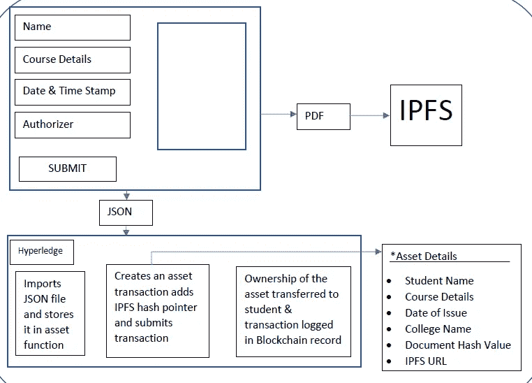

# Hyperledger 结构上的数字证书

> 原文：<https://medium.com/coinmonks/digital-certificates-on-hyperledger-fabric-3d0ba1c36ecd?source=collection_archive---------1----------------------->

证书是成就或会员资格的标志，有些证书比其他证书更重要。大学学位(一种特殊类型的证书)对学生找工作很重要。我们当前用于管理证书的模拟系统速度慢、不可靠且运行缓慢。为证书创建数字基础设施有几个好处，但风险很高，因为这样的系统将代表我们的专业声誉。我们必须认识到它的设计和我们信任的管理它的系统的类型。

理想情况下，获得证书的人应该负责这些证书，但大多数情况下，我们不得不依赖第三方，如大学或雇主来存储、验证和确认我们的证书。求职者必须向大学注册处索要正式成绩单，并为索要的每份成绩单支付费用。如果雇主和大学想确定成绩单不是伪造的，他们有时仍然需要打电话给证书的颁发机构。它复杂而繁琐，这是欺诈的主要因素之一。使证书易于验证和转移是数字系统的一个优点。在我们的项目中，我们决定探索区块链领域来实现我们的解决方案。在这一点上，我们想指出，虽然区块链不是一个简单的解决方案，可以克服今天证书的所有缺点。但它确实为改进我们今天的系统提供了可靠的可能性。

在 Hyperledger 中，交易通过一个接口提交给订购服务。该服务基于共识算法和配置策略来收集事务，这可以定义时间限制或指定允许的事务数量。大多数情况下，出于效率原因，订购服务不是输出单个事务，而是将多个事务分组到单个块中。在这种情况下，排序服务必须在每个块中强加并传达事务的确定性排序。

基于 Hyperledger 的应用程序的优势:

私有区块链，因此学生记录不在公共领域

可根据需求定制访问级别

这意味着学生将不能发表毕业证书。我们可以在演示过程中验证这一点。

一旦颁发，受益人只能看到文凭的详细信息。

由于 Hyperledger 不是基于硬币(“代币”)的区块链，因此开发环境不太复杂。与比特币或以太坊不同，区块链 Hyperledger 不需要转移虚拟货币来发布交易。

*   您可以查询 Hyperledger 区块链，以提取已颁发文凭的学生的详细信息。

# **工作原理**

该应用程序有三个主要组件 1)前端 2)星际文件系统(“IPFS”)3)Hyperledger 结构。在基于区块链的应用程序上存储信息的一个缺点是你不能存储图像文件，我们通过将我们的系统与 IPFS 集成来克服这个问题。IPFS 是一种在分布式文件系统中存储和共享媒体的对等方法。它基于比特币区块链协议，存储不可更改的数据，删除网络上的重复数据。

学生的详细信息，如学号、学生姓名、课程名称、学院名称、大学名称和毕业年份都添加到 web 应用程序中。然后，web 应用程序以 PDF 和 JSON 两种格式生成数字证书。PFD 拷贝被上传到 IPFS 节点，并且散列指针(“IPFS 链接”)被保存。Hyperledger 导入 JSON 文件来创建资产，哈希指针链接也被添加到数字证书中。一旦某个机构创建了这样的数字证书并将其发放给学生，学生就可以将该数字资产的副本发送给几个受益人，而不会增加大学或学生的任何成本。

此外，由于该系统托管在 Hyperledger 区块链系统上，我们可以有效地管理访问级别。受益人，即接收数字证书作为凭证的机构，将清楚地看到证书的历史。证书将包含颁发机构、颁发日期和时间以及证书所有者的不可改变的记录。

Application Architecture

现在我们已经对应用程序的工作原理有了一个大致的了解，让我们更仔细地看看每个模块的实现。

***星际文件系统(IPFS):***

如前所述，IPFS 是一个对等分布式文件系统，它试图用相同的文件系统连接所有的计算设备。在某些方面，IPFS 类似于万维网，但是 IPFS 可以被看作是在一个 Git 存储库中交换对象的单个 BitTorrent 群。换句话说，IPFS 提供了一个高吞吐量、内容寻址的块存储模型，其中包含内容寻址的超链接。IPFS 利用比特币区块链协议和网络基础设施来存储不可更改的数据，删除网络上的重复文件，并获取访问存储节点的地址信息。IPFS 没有单点故障，除了它们所连接的每个节点之外，节点不需要相互信任。分布式内容交付节省了带宽并防止了 DDos 攻击，这是 HTTP 一直在努力解决的问题。

为了在 IPFS 网络上存储信息，我们首先必须创建一个节点，这可以通过从[https://ipfs.io/docs/install/.](https://ipfs.io/docs/install/.)下载 IPFS 基础架构来实现。一旦下载了文件并在您的系统上旋转了一个节点，我们就可以运行一个 IPFS 守护程序来连接到 IPFS 的全球对象存储库。

IPFS 返回从任何节点上传的文档的哈希值。这个哈希值也是指向每个文档的位置指针。我们必须添加 HTTPS 协议的词干，后跟文件的哈希。该链接随后存储在 Hyperledger 的资产类别中，可用于查看实际签发的证书。现在我们已经解决了在区块链上存储图像的问题，让我们来看看实际的 Hyperledger 数字文凭网络。

# H

Hyperledger 是 Linux 基金会的一个项目，旨在开发一个开放的区块链平台，为商业做好准备。它提供了共享分类帐、智能合同、隐私和共识机制的实现。Hyperledger 应用程序有三个主要组件:1)模型文件:该文件包含各类资产、交易、参与者和事件的定义；2)脚本文件:也称为交易处理器功能文件，包含执行模型文件中定义的交易的 JavaScript 逻辑；3)ACL 文件:这些是业务网络中的可选文件，描述资产或资产组，并定义可以执行影响这些资产的操作的参与者。

工艺流程:

在我们的模型文件中遵循以下结构:

参与者:

a)大学——颁发文凭的大学

b)受益人——学生发送数字文凭的学校

c)学生

资产:

a)文凭-保存学生的详细信息

交易:

a)公布文凭——在大学公布文凭时执行

b)颁发文凭——当学生向受益人颁发文凭时执行

1.参与者“大学”将创建一个参与者“学生”并输入关于该学生的相关详细信息(参考图片 A)

2.一旦创建了“学生”参与者，那么“大学”将创建一个新的文凭资产并输入相关信息(参见图 C)

3.创建资产后，大学将发布“发布文凭”交易，将文凭的所有权从“大学”转移到“学生”(参考图片 D & E)

4.在“ACL”文件中，我们没有授予“学生”对“文凭”资产的写访问权限，这确保了学生没有创建文凭的权限

5.“学生”可以通过首先创建一个名为“受益人”的新参与者，将此证书的副本发送给任何“受益人”，受益人的邮件帐户将作为指向“受益人”类别的参考指针

6.一旦参与者被创建，“学生”将发布一个“issueDiploma”交易以提供对“受益人”的访问

7.在我们的 ACL 文件中，我们为“受益人”提供了对“文凭”资产的有条件访问，该条件规定“受益人”只有在学生向其颁发文凭时才能访问“文凭”类

8.这确保了只有颁发给某个机构的证书才能被他们看到。

9.一旦学生向“受益人”颁发了毕业证书，受益人就可以查看资产的详细信息。IPFS 链接将提供证书图像的链接。

***成本与收益分析:***

据《福布斯》报道，南佛罗里达大学大约有 42067 名学生。在 42000 名学生中，大约有 31111 名学生注册了各种本科课程，大约有 10810 名学生注册了各种研究生课程。每年都有大量的学生从南佛罗里达大学毕业。

如果我们假设，在这些毕业的学生中，即使有 5000 名学生向大学要求额外的成绩单/学位证书，那么考虑到每份成绩单大学收取 7 美元，因为有一些与此相关的费用，如邮费、文具费和快递费将达到大约 35000 美元。

大学或认证机构可以节省大量资金，并且可以更有效地跟踪这些“文凭/证书”的来源。

***结论:***

在最近的几个月里，基于区块链的数字证书是人们最感兴趣的话题。使用区块链，我们现在可以创建一个认证基础设施，让我们能够控制我们成就的完整记录。这让我们可以与未来的雇主或大学分享我们的证书，同时让受益人完全相信学位实际上是颁发给提交它的个人的。这是一个令人兴奋的可能性，因为它给了我们一个机会去了解未来的证书会是什么样子。

可以设计类似的基础设施来处理医疗文档的传输。处方可以由医生开出；每个处方都可以作为资产添加到 Hyperledger 应用程序中，并且图像会上传到 IPFS 上。然后，患者可以将处方开给任何一位药剂师，药剂师可以用开处方的医生的病历来验证处方的真实性。这种系统可以在已建立的医疗记录管理系统中进一步发展。

> [直接在您的收件箱中获得最佳软件交易](https://coincodecap.com/?utm_source=coinmonks)

