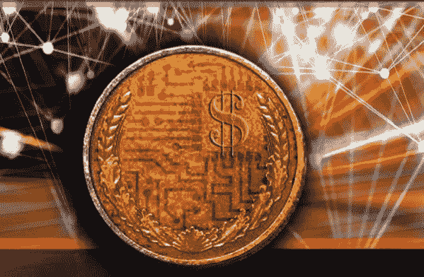

# 数字货币颠覆

> 原文：<https://medium.com/coinmonks/digital-currency-disruption-d6821a7893f8?source=collection_archive---------7----------------------->

Courtesy of Graphical Artist Nathan Rimel and Breakfield and Burkey.

看到我们的美元被中国的加密货币盖过真的是一种耻辱。自二战结束以来，我个人一直很享受我们作为世界储备货币的地位。尽管 60%的外国银行储备是以美元持有的，但这种情况正在消失。所以你会问，这样的说法是怎么得出的？

请注意，这句话并不是说美元将被中国的人民币超越，而是说…