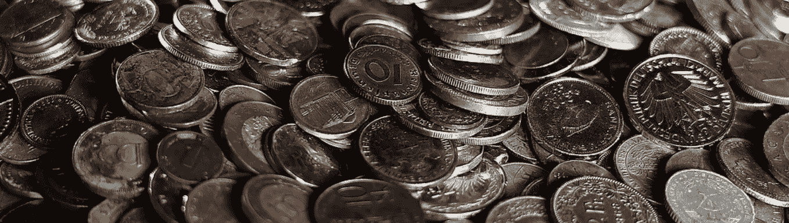
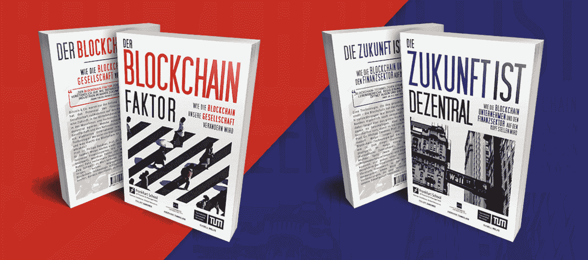
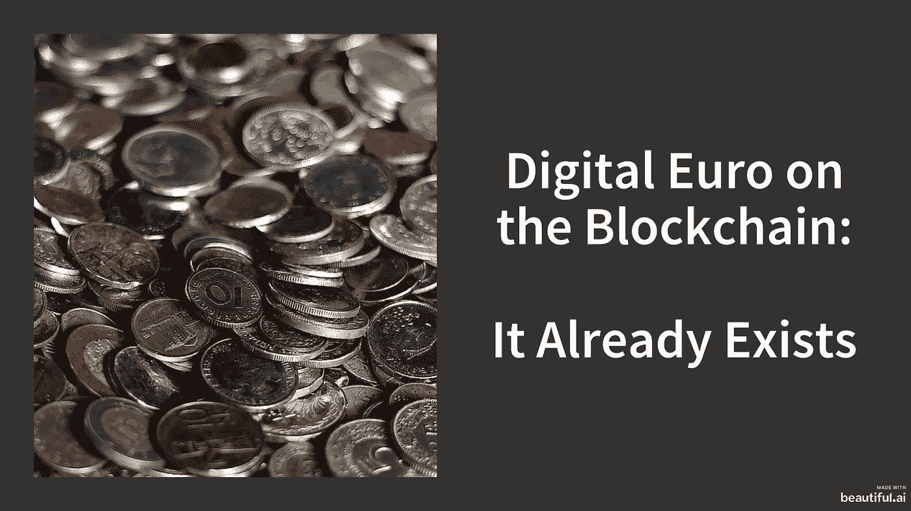

# 区块链上的数字欧元:它已经存在

> 原文：<https://medium.com/coinmonks/digital-euro-on-the-blockchain-it-already-exists-23c3096e3ba4?source=collection_archive---------1----------------------->

在脸书的 Libra 和中国央行宣布发行数字货币之后，关于数字欧元的讨论势头越来越猛。即使央行发行的数字欧元可能不会在可预见的未来推出，但数字欧元确实已经以数字商业银行货币和电子货币的形式存在。首先，公司已经定位，并已经提供了一个基于区块链的数字欧元，这将是非常有益的德国工业。— *作者:乔纳斯·格罗斯、菲利普·桑德纳*

# 介绍

数字欧元是目前的热门话题。[天秤座](/swlh/libra-concept-and-policy-implications-d427ba6c952a)和[中国中央银行](/@philippsandner/priorities-for-europe-and-germany-both-the-euro-and-identities-should-run-on-the-blockchain-8ad2bf4b65d6)宣布不久将发行一种基于区块链的数字日元，这导致了对数字欧元的高度兴趣，作为数字人民币的欧洲对手方。这种数字欧元应该在区块链上发行吗？在我们最近的出版物中，我们认为，是的。**只有基于区块链的数字欧元才能实现(1)欧元计价的智能合约**，这样机器、汽车、传感器就可以直接提供按使用付费、租赁、保理等服务。(2)此外，一旦欧元像成千上万种其他资产和权利一样成为区块链系统中的一种象征，在这个系统中用欧元买卖资产和证券将变得更加有效。想一想证券市场中的交割与支付(DvP)流程，其中任何资产的交易都将通过一个小型智能合同进行结算，而今天却需要巨大的清算所基础设施。(3)在机器经济领域，没有比区块链和 DLT 更好的方式来连接数以亿计的设备。(4)除了区块链上的欧元，**身份管理**，指的是个人、公司和机器的数字表示，**可以在区块链系统上非常有效地管理**。这两者对于德国和欧洲的工业公司都是必不可少的(例如，制造业、新移动性、物流)。自然，这种身份是欧元交易或智能合约的终点。

# 市场概述

数字欧元已经有现成的解决方案了吗？全球大多数中央银行都会分析发行数字法定货币(所谓的中央银行数字货币(CBDC))的意义。然而，还没有一家央行上线。中国可能是第一个，但马绍尔群岛、巴哈马群岛或柬埔寨等(小得多的)国家也已宣布在不久的将来发行数字法定货币。这些法定货币会在区块链系统上发行吗？在大多数提到的项目中，是的。然而，欧洲中央银行(ECB)尚未宣布在可预见的未来推出数字欧元。

但是数字欧元已经存在了。确切地说，**以区块链为基础的欧元确实已经存在。**根据**电子货币制度**作为商业银行货币发行；

*   ***德国商业银行:*** 德国商业银行已经将欧元以数字形式令牌化。在第一次测试中，这种基于区块链的数字欧元已经被用于证券交易。此外，机器对机器支付已经执行。
*   ***CashOnLedger:***德国初创公司 CashOnLedger 开发了一种面向市场的解决方案，用于提供基于数字区块链的欧元。该公司使用西班牙电子货币许可公司的框架来将商业银行的资金令牌化并加以利用，例如为德国制造公司。该系统是在以太坊的联盟版本中构建的，但是数字欧元也可以在其他区块链系统中使用，如 Hyperledger 或 Corda。
*   ***mone rium:***mone rium 是冰岛一家将法定货币代币化的初创公司。Monerium 首先在区块链公共以太坊推出了冰岛克朗，但最近，Monerium 也推出了欧元。与 CashOnLedger 类似，Monerium 使用电子货币许可证进行运营。将来，他们打算使用他们的电子货币许可证来获得中央银行的资金。
*   ***郁积:*** 马耳他的郁积已经在区块链的公共以太坊上发行了一枚欧元支持的稳定硬币。然而，它的客户对欧元没有直接的要求权，只是对稳定的硬币有要求权。换句话说，停滞期欧元不是真正的象征性欧元，而只是一种稳定的硬币，因为它缺乏电子货币的合规性。

公司可以使用上述公司提供的基于区块链的数字欧元，并将其集成到他们的系统和流程中。在机器经济的背景下，这种数字法定货币的含义尤其有前途。据估计，2025 年将有超过 200 亿台设备连接到互联网，是目前地球上生活的人的三倍。这些设备中的一些也将被集成到支付网络中。这将很快代表数以亿计的设备，如汽车、传感器和机器。区块链技术最适合为数百万台设备配备计算机芯片，从而为它们配备自己的钱包。然后，设备可以接收付款和转账，并且可以生成基于 SAP 的会计记录和欧元发票。对于这数以百万计的设备，区块链技术可以轻松地提供参与支付网络的机会，并将它们集成到自动化业务流程中(例如，通过智能合同)。

# 结论

以区块链为基础的数字欧元的高动态是引人注目的。几个月前，这还只是 it 书呆子的话题。通过将这种数字欧元的愿景纳入德国政府的[区块链战略](/@philippsandner/germany-on-chain-national-blockchain-strategy-released-a-review-c3efa7e613be)，以及德国银行协会(即 BdB)对数字欧元的推广，这一话题已经接近公众。提供这种数字欧元解决方案的更多创新公司将在不久的将来进入市场。因此，制造业、移动性和物流领域的工业公司使用数字区块链欧元进行产品和服务的机会将进一步增加。

# 评论

*如果你喜欢这篇文章，我们会很高兴你转发给你的同事或在社交网络上分享。如果你是这一领域的专家，并想批评或赞同这篇文章或其中的一些部分，请随时在这里或上下文中留下私人笔记，我们将予以回应或解决。*

你想进一步了解区块链将如何改变我们的世界吗？

*   ***区块链知识:*** *关于如何在 10 个工作日的工作量内* [*获取必要的区块链知识*](/@philippsandner/education-in-blockchain-how-to-acquire-the-necessary-knowledge-with-a-workload-of-10-working-days-9091dc8a3c53) *我们写了一篇中型文章。*
*   ***我们的两本区块链书籍:*** *我们编辑了两本关于区块链将如何* [*改变我们的社会(亚马逊链接)*](https://www.amazon.de/Blockchain-Faktor-Blockchain-unsere-Gesellschaft-ver%C3%A4ndern/dp/3750415404/ref=as_li_ss_tl?__mk_de_DE=%C3%85M%C3%85%C5%BD%C3%95%C3%91&crid=1APKJBDYU9UPP&keywords=der+blockchain+faktor&qid=1576089420&sprefix=der+blockchain,aps,146&sr=8-1&linkCode=sl1&tag=dieblockchain-21&linkId=1a5ef32081cb96c926b7b7f3d26ae52e&language=de_DE) *总体上以及* [*与金融相关的一切(亚马逊链接)*](https://www.amazon.de/gp/product/3750423733/ref=as_li_tl?ie=UTF8&camp=1638&creative=6742&creativeASIN=3750423733&linkCode=as2&tag=dieblockchain-21&linkId=d10b180215c53f9bebb1d22610819a58) *具体来说。这两本书都有印刷版和 Kindle 版——目前是德文版，很快会有英文版。作者是来自德国、澳大利亚、瑞士和列支敦士登的 20 多位知名区块链创业公司、企业和政府专家，他们都为这两本书贡献了自己的专业知识。*

Our two books: the first one on blockchain and the society and the second one on blockchain and finance

# 作者

***乔纳斯·格罗斯*** *是法兰克福学派区块链中心(FSBC)的项目经理兼研究助理。他的兴趣领域主要是加密货币。此外，在他的博士背景下，他分析了区块链技术对全球央行货币政策的影响。他主要研究央行数字货币(CBDC)等创新，以及“Libra”等加密货币项目。你可以通过邮件(jonas.gross@fs-blockchain.de)、LinkedIn (* [*、*](https://www.linkedin.com/in/jonasgross94/?source=post_page---------------------------) *)、Xing (* [*、*](https://www.xing.com/profile/Jonas_Gross4?source=post_page---------------------------) *)或者在(Twitter Jonas__Gross)上关注他。*

***Philipp Sandner 博士*** *教授创办了法兰克福学派区块链中心(***)。2018-2021 年，被德国主要报纸《法兰克福汇报》(Frankfurter Allgemeine Zeitung，FAZ)评为*[*【30 强】经济学家*](https://www.faz.net/aktuell/wirtschaft/wirtschaftswissen/f-a-z-oekonomenranking-2021-die-tabellen-17538768.html) *。他是德国联邦财政部金融科技委员会和数字金融论坛的成员。他还是 FiveT fin tech Fund*[*FiveT fin tech Fund*](https://fivet.com/fivet-fintech)*、*[*21e 6 Capital*](https://assets.21e6.io/)*和*[*block chain Founders Group*](https://en.blockchain-founders.io/)*的董事会成员，这些公司积极参与区块链初创公司的风险投资融资和加密资产投资管理。Sandner 教授的专业知识包括加密资产，如比特币和以太坊、分散金融(DeFi)、数字欧元、资产令牌化和数字身份。你可以通过邮件联系他(m@philippsandner.de)通过*[*LinkedIn*](https://www.linkedin.com/in/philippsandner/)*或者在 Twitter 上关注他(*[*@ philippsandner*](https://twitter.com/philippsandner)*)。**

**