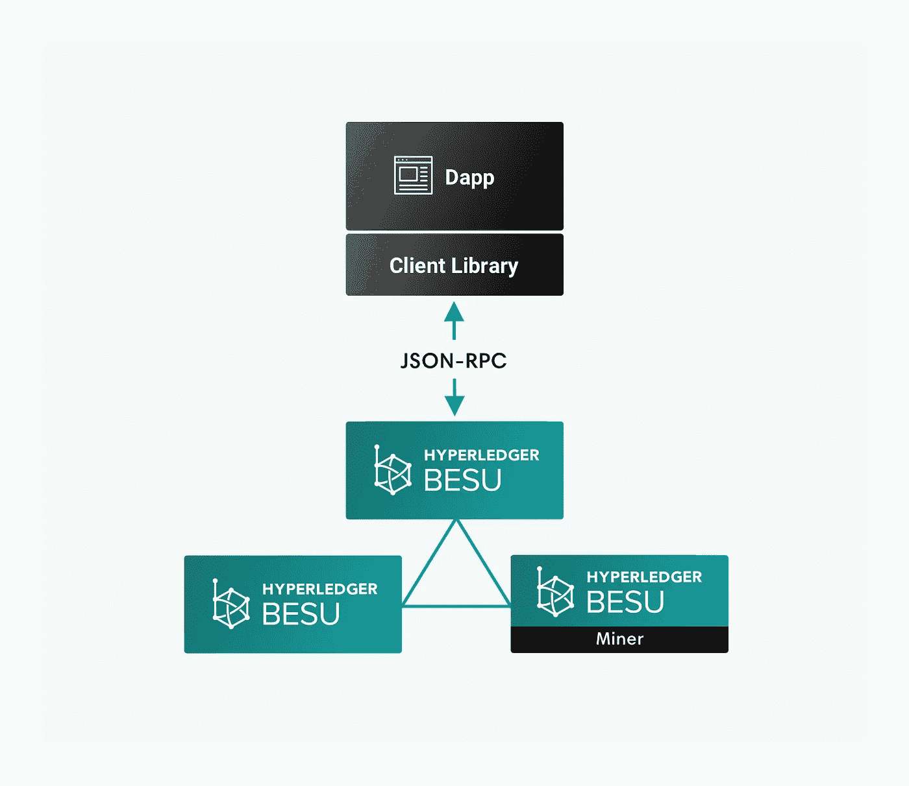

# 发现 Hyperledger Besu 和作为 Solidity 开发人员的授权证明(POA)

> 原文：<https://medium.com/coinmonks/discover-hyperledger-besu-and-proof-of-authority-poa-as-a-solidity-developer-61db8e27d4?source=collection_archive---------2----------------------->

大家好，今天我得到了一个使用 Hyperledger Besu 的任务。Besu 是一个私有的[区块链](https://blog.coincodecap.com/tag/blockchain/)，面向使用 POA(权威证明)的企业。在这篇文章中，我将向你展示，如何使用 Hyperledger Besu 与松露和你的固体知识，只有 2 分钟。当开发人员需要为供应链系统等封闭网络创建区块链时，Besu 是一个完美的解决方案。[阅读更多关于 POA 的信息](https://www.binance.vision/blockchain/proof-of-authority-explained)



Image from Besu [documentation](https://besu.hyperledger.org/en/stable/Concepts/Client-Libraries/)

# 块菌盒装置

你需要的唯一先决条件是 docker composer。我将从打开我正常的松露盒开始。

打开我的松露盒

```
truffle unbox yehia67/HelloWorldBox
```

您需要添加此 npm 包

```
npm install --save @truffle/hdwallet-provider
```

# **初始化 Besu 网络**

克隆 Besu 网络。

```
git clone [https://github.com/PegaSysEng/besu-sample-networks.git](https://github.com/PegaSysEng/besu-sample-networks.git)
cd besu-sample-networks
```

Besu 有不同类型的一致性算法实现，如 Ethash、IBFT2 和 clique。要运行默认算法，您只需运行

```
./run.sh
```

如果要使用其他算法添加`-c <name of your algorithm>`

示例:

```
./run.sh -c ibft2
```

# 将 Besu network 添加到您的盒子中

你必须做三个简单的步骤:

1.  导入 HDWalletProvider。
2.  导入私钥。
3.  初始化私钥提供程序对象。

```
const HDWalletProvider = require('@truffle/hdwallet-provider')const privateKey = "0x8f2a55949038a9610f50fb23b5883af3b4ecb3c3bb792cbcefbd1542c692be63";const privateKeyProvider = new HDWalletProvider(privateKey, "http://localhost:8545")
```

(我从 BESU 文档中获得了私钥，所以您可以在没有实际生产时复制它)

将 Besu wallet 添加到您的网络

```
module.exports = {   
networks: {     
  besuWallet: {      
     provider: privateKeyProvider,       
     network_id: "*"     
  },   
 } 
};
```

就这样！只需运行迁移命令。

```
truffle migrate --network besuWallet
```

现在测试你的 Dapp。

```
npm run dev
```

注意:不要忘记将私钥导入到您的元掩码帐户中。

要了解更多细节，我建议你查看 Hyperledger Besu [文档](https://besu.hyperledger.org/en/stable/HowTo/Get-Started/System-Requirements/)。

[](https://coincodecap.com)

> [直接在您的收件箱中获得最佳软件交易](https://coincodecap.com/?utm_source=coinmonks)

[](https://coincodecap.com/?utm_source=coinmonks)