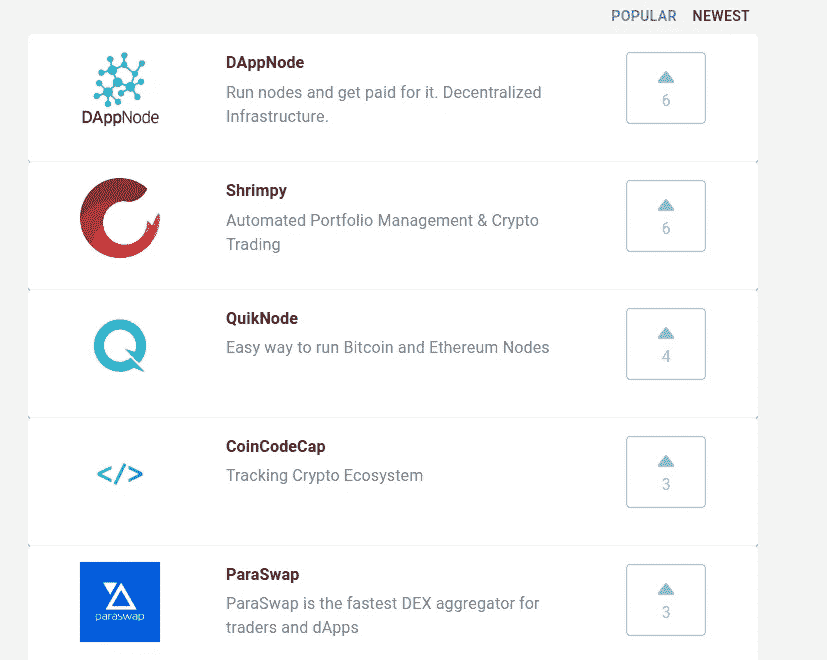

# 每天发现新的加密产品

> 原文：<https://medium.com/coinmonks/discover-new-crypto-products-everyday-21706820fae9?source=collection_archive---------4----------------------->

## 追踪加密生态系统

CoinCodeCap.com

嘿伙计们，

我有一个问题，你如何发现新的加密产品？(我说的不是代币/硬币)

*   Reddit？推特？Bitcointalk？

是的，大多数人都是这样发现新的加密产品的，但我认为我们可以做得更好。

现在任何人都可以在 CoinCodeCap 上列出他们的加密产品/开源库。但是等等，还有更多…

*   用户可以**投票支持**他们喜欢的项目。
*   用户可以**评论**自己喜欢的项目。
*   用户将能够**审查**产品(工作进展)

我们在本周推出了这个功能，一些很棒的项目也在列表中。如果您想向社区展示您的加密产品， ***请登录***[***CoinCodeCap。***](https://coincodecap.com/create)

目前列出的产品-

*   [**Dappnode**](https://coincodecap.com/product/dappnode-8) —运行节点并获得报酬。
*   [**Shrimpy**](https://coincodecap.com/product/shrimpy-6) —自动化投资组合管理&密码交易
*   [**QuikNode**](https://coincodecap.com/product/quiknode-2) —运行比特币和以太坊节点的简单方法
*   [**para swap**](https://coincodecap.com/product/paraswap-9)—para swap 是交易者和 dApps 最快的指数聚合器
*   [**松露**](https://coincodecap.com/product/truffle-7) —智能合约的甜蜜工具
*   [**Jelly Swap**](https://coincodecap.com/product/jelly-swap-6) —分散安全的跨链原子交换
*   [**混音**](https://coincodecap.com/product/remix-9) —以太坊 IDE
*   [**weiDex**](https://coincodecap.com/product/weidex-7) —全分散交换，界面友好
*   [**TradePlan**](https://coincodecap.com/product/tradeplan-crypto-screener-7) —使用技术指标即时扫描整个交易所
*   [**出口。金融**](https://coincodecap.com/product/outlet.finance-6) —全球利率最高的现金账户。
*   [**3 框**](https://coincodecap.com/product/3box-2) —用户可轻松控制的分布式 DApps 存储

*如此下去****up vote****这些产品又得到上市*[*CoinCodeCap*](https://coincodecap.com/create)*。*

> [直接在您的收件箱中获得最佳软件交易](https://coincodecap.com/?utm_source=coinmonks)

# 在 Coinmonks 上发布

如果你喜欢在 crypto/区块链空间上写教育文章，并且想在 Coinmonks 出版物上发表。只需在**发邮件给我或者 DM 我**[***推特***](https://twitter.com/coinmonks)**

> ***“我们是一个非宣传性和非营利性的教育出版物，如果你喜欢阅读***[*【你也可以把我们*](/coinmonks/monks-need-your-help-7440418d67ec) *】。*****

******暂时就这样，送我❤️，下次再说。******