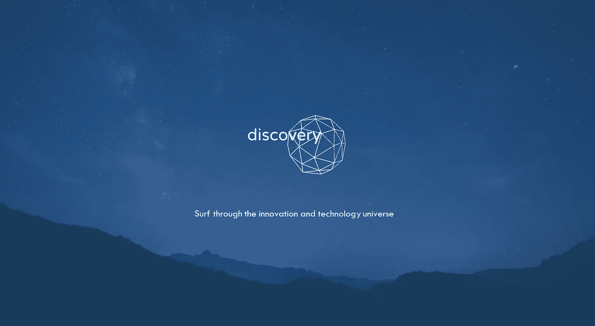
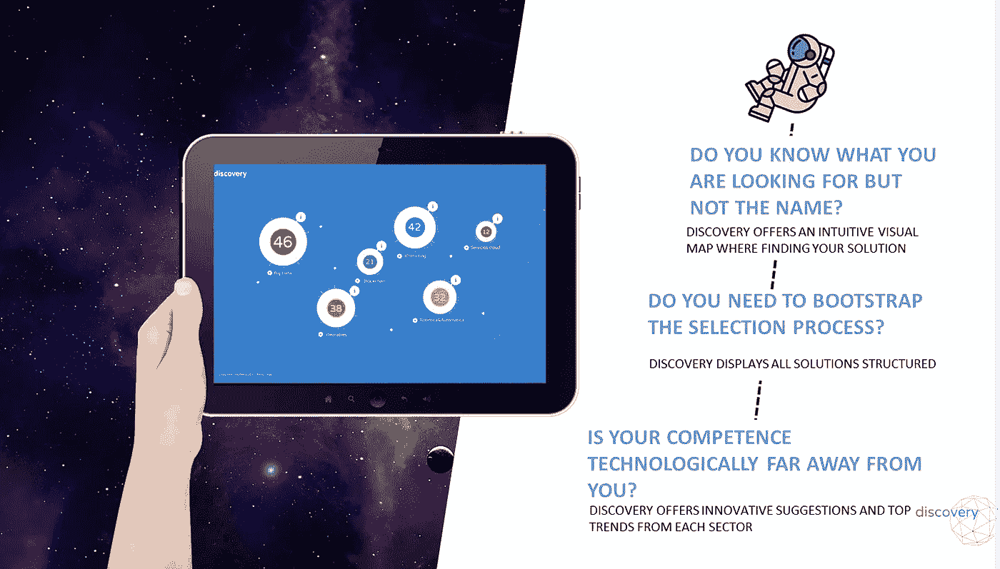
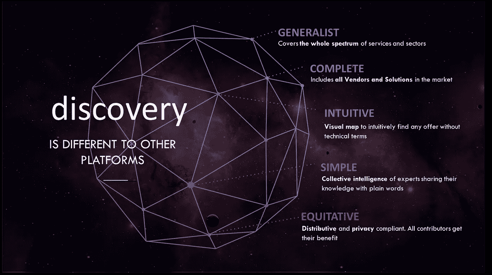
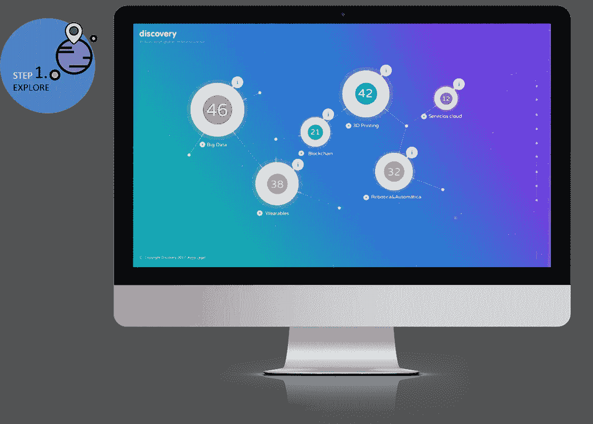
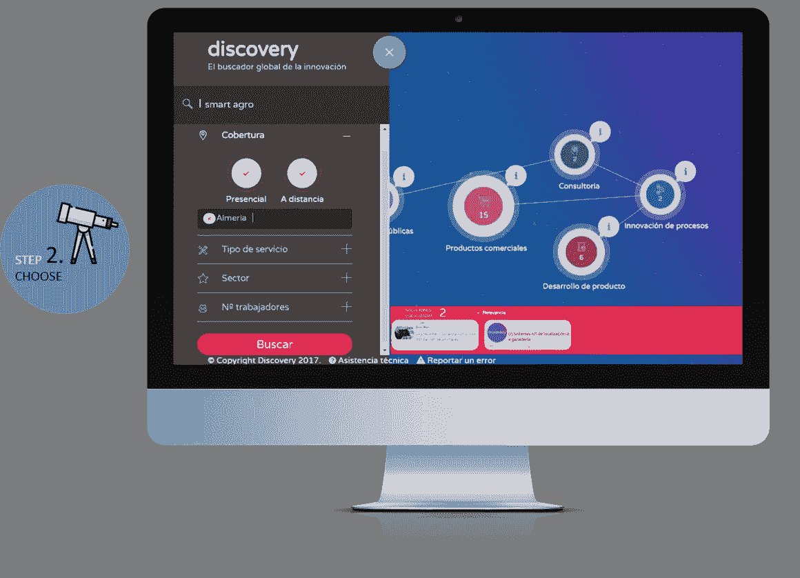
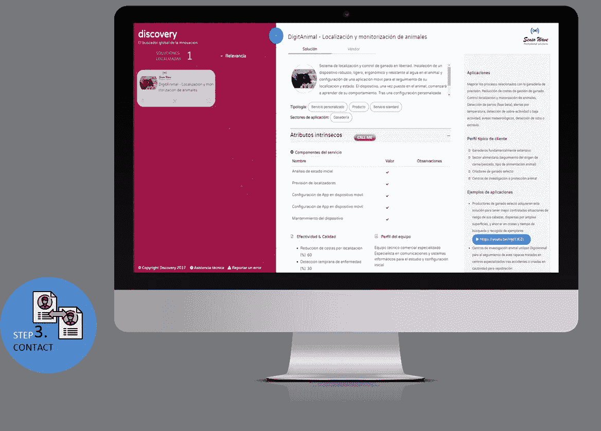
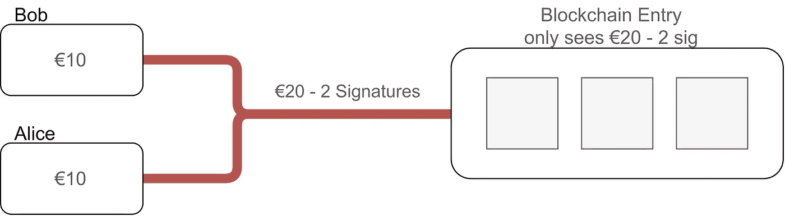

# Discoveryblock 简介

> 原文：<https://medium.com/coinmonks/discoveryblock-io-695e257c23bf?source=collection_archive---------8----------------------->

## 一艘智能宇宙飞船在科技宇宙中航行

嗨！我是 Discovery 的 **Carlos** 、**区块链专家**👋

自从[加入探索团队](https://discoveryblock.io)已经有几个月了，这篇文章将提供一个关于终极技术浏览器平台的**前端和数据标记器**最近进展的快速**更新。**

# 简单美丽

Discovery 将采用完全直观的界面。有必要将应用程序及其更新的图形标识、设计原则和用例与项目的起源保持一致。激动人心！

如你所见，这个界面快速、干净、有洞察力、一致且模块化。我们希望通过创造一个科技和创新的世界来实现这一目标。Discovery 的灵感来自宇宙，用户可以在沉浸式科技世界中导航。

# 专家内容

类别显示在气泡中。是的，排列成独特星座的泡泡——作为真实的泡泡，它们会随着使用者的角度而变化！顺畅的体验是通过直觉传递的。第一要务是提供高度结构化的信息，并通过直观导航即时找到您的相关解决方案和服务。

# 特征

*   **概述&具体:**发现涵盖了创新机会和新技术集成的所有服务领域。
*   **完成**:包括帮助和协助企业进行技术改造以适应市场需求的所有代理和市场解决方案。
*   **直观**:沉浸式视觉设计，无需了解技术领域或隐语即可直观地嵌入和查找。
*   **简单**:由于行业专家的集体智慧，通常对普通用户来说很难解释的新技术和/或顶级创新资源变得容易解释。
*   这个终极的技术 bowser 平台是由一个分散的架构驱动的，因此它是高度安全的，以隐私为导向的，分布式的和公平的。

# 开始

> 第一步:探索

平台中体验到的最有吸引力的用户是**发现**。能够在创新解决方案的宇宙中自由航行来提升你的公司是非常美好的。由专家设定的典型市场描述充当最容易导航的路标

Step 1: EXPLORE

> 第二步:识别

在比较属性和量化指标的同时，顺畅地访问和比较不同的技术和创新产品/服务。添加过滤器以降低搜索更具体目标的复杂性。

Step 2: EXPLORE

> 联系

在您需要的时候，通过实时视频与解决方案提供商和行业顾问建立在线联系，这样您就可以在会议结束时获得最适合您的解决方案。

Step 3: CONTACT

# 区块链

**为什么？** Discovery architecture 使用区块链进行平台内的数据令牌化服务，这意味着信息提供商和消费者之间的每一次价值交换都被令牌化，以创建一个由令牌管理的动态、一致的协作生态系统。

由于优先级 n 1 允许一个价值(代币)按比例公平分配的微交易平台，我们正在实施新技术，允许以极低的费用进行即时交易。

Bob & Alice are connected through a “channel”.

一个“渠道”本质上是一个虚拟的金钱管道，它连接着网络中的对等点。

如果你想尝试这个创新的宇宙，请访问 [discoveryblock.io](https://discoveryblock.io) 并请求演示。真的很酷！