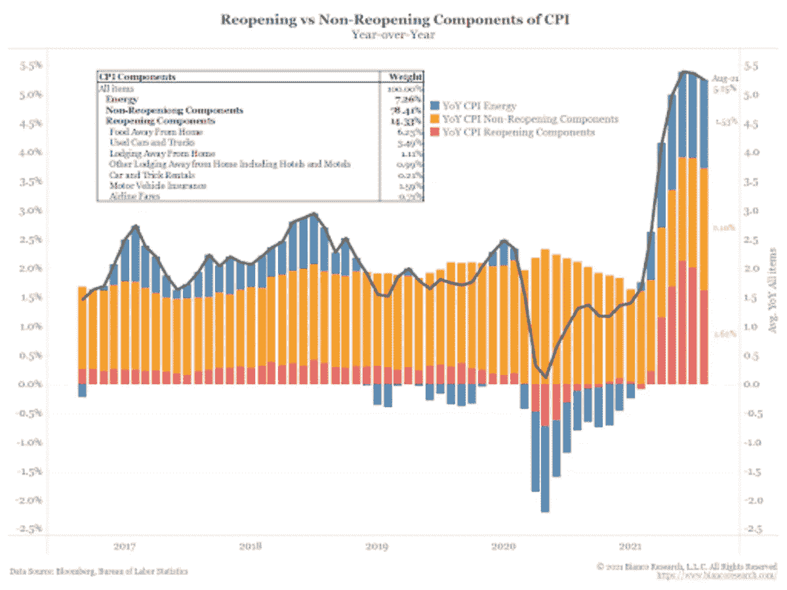
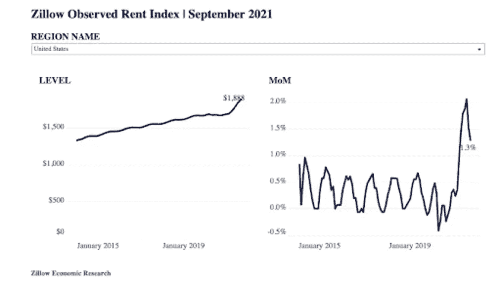
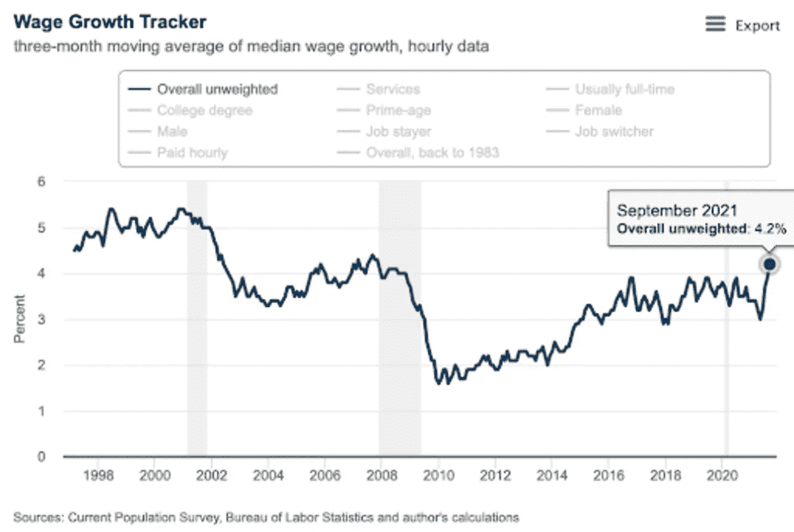
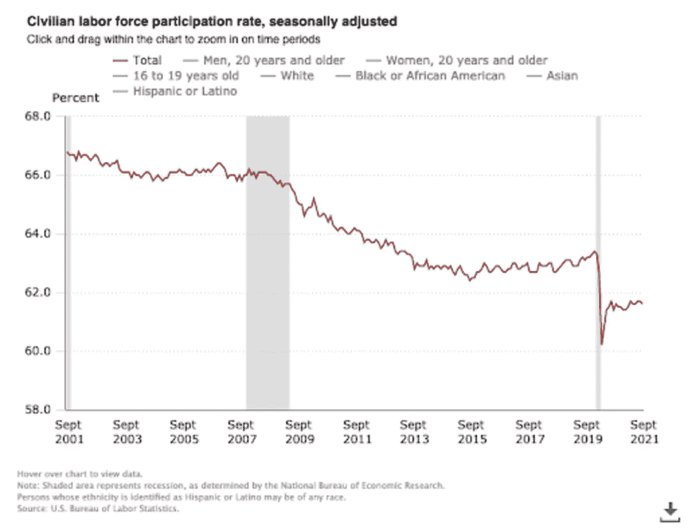

# 讨论比特币和宏观经济

> 原文：<https://medium.com/coinmonks/discussing-bitcoin-and-big-picture-macroeconomics-b503410bd7c8?source=collection_archive---------18----------------------->

## 对宏观经济有看法的比特币人士讨论了当前的经济状况、比特币期货交易所交易基金等。

**听这一集:**

*   [苹果](https://podcasts.apple.com/us/podcast/big-picture-macro-with-sam-rule-fed-68/id1543640492?i=1000539920054)
*   [Spotify](https://open.spotify.com/episode/6ZbUivKwfETeU1B3rVAYYm?si=HRIJ09axSkmMJOIMcS6G2w&nd=1)
*   [谷歌](https://podcasts.google.com/feed/aHR0cHM6Ly9mZWR3YXRjaC5saWJzeW4uY29tL3Jzcw==/episode/MjE3MzEwMmItNTUzMS00NjYxLTljN2YtNTdmYzE2YmY4YmFl)
*   [Libsyn](http://fedwatch.btc.libsynpro.com/big-picture-macro-with-sam-rule-fed-68)
*   [阴天](https://overcast.fm/+m2acsJZy4)
*   [可听](https://www.audible.com/webplayer?asin=B09KJPX4WG&contentDeliveryType=PodcastEpisode&ref_=a_minerva_cloudplayer_B09KJPX4WG&cloudPlayerStartLoadTime=1635364162056&fetchNewPlayQueue=true&overrideLph=false&initialCPLaunch=true)

在这一集《比特币》杂志的“美联储观察”播客中，我和克里斯蒂安·克罗勒第一次和萨姆·鲁尔坐在了一起。Rule 是比特币杂志团队的新成员，研究并撰写其深潜信件和系列。他的兴趣领域是宏观和长期债务周期，因此，我们讨论了货币与财政政策、美联储缩减规模、通货膨胀与通货紧缩、消费者价格指数(CPI)、劳动力市场和债券市场等主题。

Rule 提供了一个很棒的图表幻灯片，我们在大部分讨论中重点关注了这些图表，你可以在这里或下面的链接中找到这些图表，或者在 YouTube 上观看。如果链接没有出现在你阅读这些笔记的地方，请在 BitcoinMagazine.com 上找到这一集的帖子。

# 货币政策与财政政策

我们的讨论从回顾雷伊·达里奥的长期债务周期开始，Rule 将其应用于我们当前的情况。他指出了周期的各个阶段，将我们目前置于通胀冲动之中，然后是最终的通缩下降。他精通所有显示经济正被赶进高通胀时期的宏观统计和指标。

Rule 提到了美联储副主席斯坦利·菲舍尔在 2015 年发表的一篇著名的[演讲](https://www.bis.org/review/r160115a.pdf)，他在演讲中呼吁，当货币政策面临零下限(ZLB)时，应使用财政政策。我们确实看到美国政府为了增强货币政策的效果而增加了大量的支出。我问他，他认为这种协调是明确的还是无计划的，他回答说可能是两者兼而有之。美联储主席杰罗姆·鲍威尔明确要求财政支持，但这种支持必须来自非常混乱的立法程序。

# 杰罗姆·鲍威尔和美联储会退出吗？

我们进入的下一个话题是美联储即将开始的缩减购债规模。这几乎肯定会在 11 月发生，但我们问 Rule，他是否认为这有任何迫在眉睫的问题。我们的讨论让美联储处于进退两难的境地，一种没有胜算的局面。如果鲍威尔缩减规模，经济状况变得更糟，这将被视为一个重大的政策错误。然而，如果他收回缩减量化宽松的承诺，也可能动摇人们对美联储的信心。规则说缩减即将到来，这是提前发出的信号，他们现在不会回头。

# CPI 和劳动力图表

然后，是时候深入图表了。我将在这里包括一些，但是请检查上面和下面链接的幻灯片。

*Source:* [*Bianco Research*](https://www.biancoresearch.com/)

Rule 带领我们通过这个发人深省的 CPI 表示，作为与能源、不重新开放和重新开放相关的组件。这是这一集的真正核心，我们就这个图表进行了长时间的讨论。

*Source:* [*Zillow Economic Research*](https://www.zillow.com/research/)

这张图表显示了租金的增长，但月环比(MoM0)变化率下降。Rule 提出了一个颇有见地的问题:“MoM 利率的下降是否预示着通胀正在降温？”

*Source:* [*BLS*](https://www.bls.gov/)

在这里，我们看到工资率正在上升，这是经济学家考察一段时期的通货膨胀是否可持续的主要指标之一。如果工资上涨，人们就有能力支付更高的价格，价格上涨的循环就会继续。

*Source:* [*BLS*](https://www.bls.gov/)

但当我们将工资的微弱增长与劳动力参与率的下降联系在一起时，很难得出经济中工资的净变化。如果工作的人越来越少，但是工作的人得到的报酬越来越高，那么净变化是什么？如果净变化为负或持平，经济就无法支持 CPI 所代表的更高价格，因此它们将被拒绝，下一个反通胀时期将开始。如果净变化是积极的，更高的价格可能是可持续的。

在他的[幻灯片](https://docs.google.com/presentation/d/18kHb23YzmI7q99KIVydBz68otu8vij90I2NdE6zX3dg/edit?usp=sharing)中有更多的图表。我真的鼓励你去看看。

# 比特币价格和期货交易所交易基金

Rule 一直在为比特币杂志撰写一些很棒的内容，他最近的几篇帖子都是关于比特币期货和新的基于期货的交易所交易基金(ETF)的。我们不能不讨论这个就让他走。因此，我们在节目结束时向他请教了比特币交易所交易基金以及他对整个形势的看法。

Rule 并不喜欢基于期货的 ETF，因为它们与基础比特币之间存在利差，因此风险更大。他对这种关系中起作用的力量有着全面的理解，并且(用我的话来说)对不同的、效率较低的交易的兴起感到担忧，比如现货和套利，它们阻碍了价格发现。

我们最后的评论是关于比特币作为抵押品，这是我最喜欢的话题，以及这方面的一些进展。当然，比特币抵押品将大大有助于支撑资产负债表，减少当前体系中其他人债务的再抵押链。

# 链接

*   [规则幻灯片*规则幻灯片*规则幻灯片](https://docs.google.com/presentation/d/18kHb23YzmI7q99KIVydBz68otu8vij90I2NdE6zX3dg/edit?usp=sharing)
*   [*菲舍尔演讲到 BIS*](https://www.bis.org/review/r160115a.pdf)

*原载于 2021 年 10 月 27 日 https://bitcoinmagazine.com***。**

**

> *加入 Coinmonks [电报频道](https://t.me/coincodecap)和 [Youtube 频道](https://www.youtube.com/c/coinmonks/videos)了解加密交易和投资*

## *也阅读*

* [## 杠杆代币[多头代币]终极指南

### 杠杆化令牌是具有杠杆化风险敞口的 ERC20 令牌，不考虑保证金、要求、管理…

medium.com](/coinmonks/leveraged-token-3f5257808b22)  [## 最佳加密交易所| 2022 年十大加密货币交易所| CoinCodeCap

### 哪一个是最好的加密交换？在本文中，我们将根据多种加密货币列出 10 大加密货币交易所

coincodecap.com](https://coincodecap.com/crypto-exchange)  [## 2022 年 2 月值得关注的三大游戏代币| CoinCodeCap

### 排名前 3 位的游戏也占交易总量的 85%以上。Defi 王国、Axie Infinity 和 Pegaxy…

coincodecap.com](https://coincodecap.com/top-3-gaming-tokens-to-look-out-for-in-february-2022)  [## 2022 年最佳加密交换平台| CoinCodeCap

### 随着时间的推移，我们大多数人将转向 dex 以获得更好的安全性和隐私。因此。在这里，我们将讨论…

coincodecap.com](https://coincodecap.com/best-swap-platforms)  [## 10 大最佳在线赌场|赢得并赢取免费 BTC 2022 | CoinCodeCap

### 接收、支付和赚取加密货币| |有各种各样的最佳在线赌场可供选择，有可能…

coincodecap.com](https://coincodecap.com/best-online-casinos)  [## 2021 年最佳加密借贷平台| 6 大比特币借贷平台

### 获得比特币和其他加密货币的最佳贷款利率

medium.com](/coinmonks/top-5-crypto-lending-platforms-in-2020-that-you-need-to-know-a1b675cec3fa)  [## 2021 年 6 大最佳硬件钱包|顶级加密硬件钱包[更新]

### 最好的加密货币硬件钱包是绝对必要的。我们将在 NGRAVE、Ledger Nano X 和…

medium.com](/coinmonks/the-best-cryptocurrency-hardware-wallets-of-2020-e28b1c124069)  [## 加密交易机器人——19 款最佳免费加密交易机器人

### 2022 年币安、比特币基地、库币和其他密码交易所的最佳密码交易机器人。四进制，位间隙…

medium.com](/coinmonks/crypto-trading-bot-c2ffce8acb2a)*