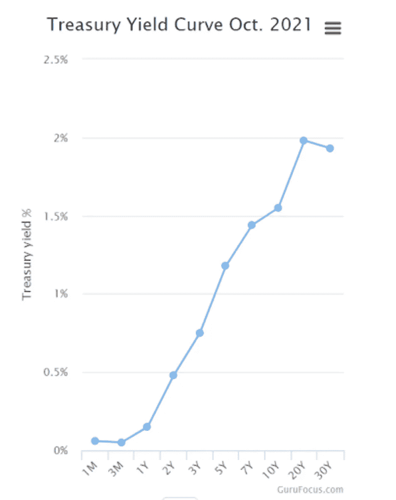
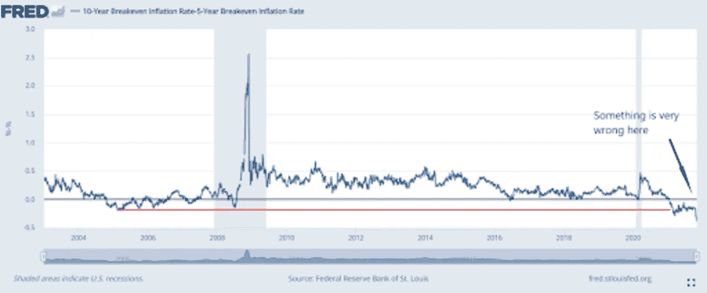
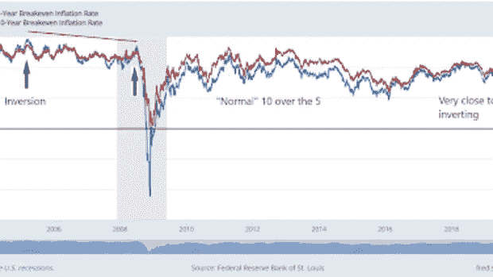
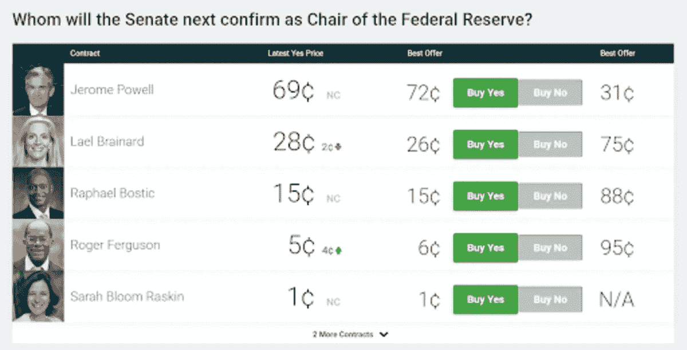
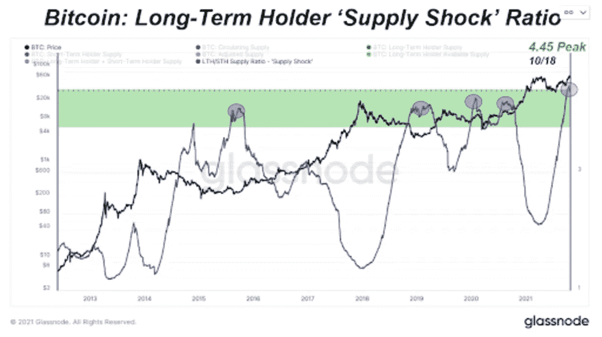
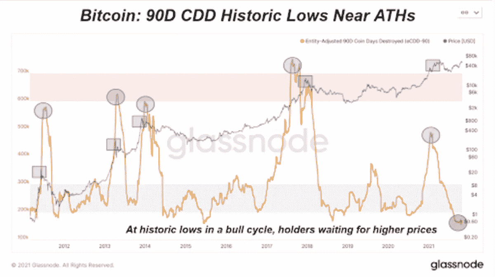
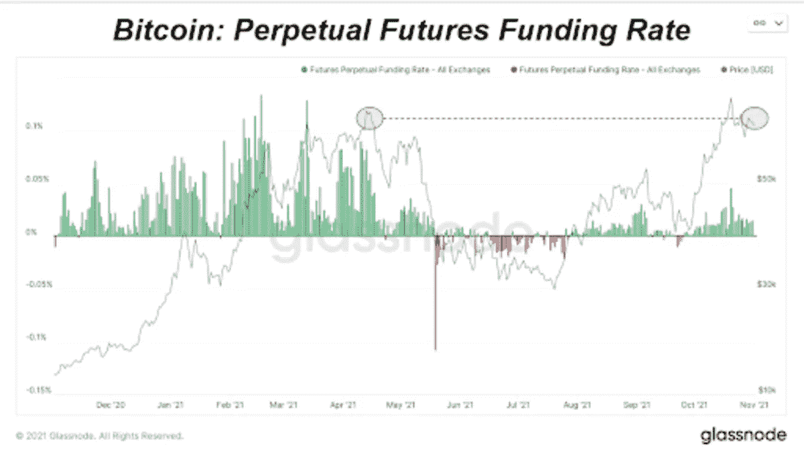
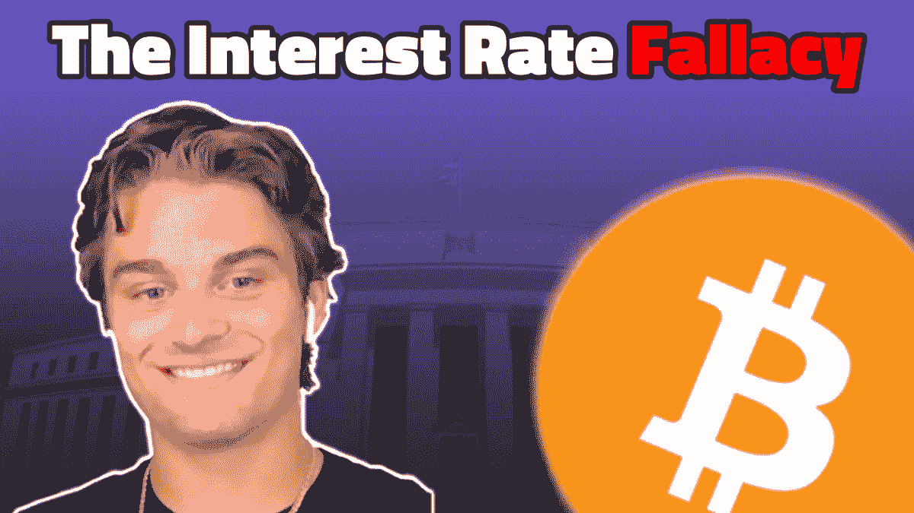

# 讨论比特币和利率谬误

> 原文：<https://medium.com/coinmonks/discussing-bitcoin-and-the-interest-rate-fallacy-666d66801a9c?source=collection_archive---------7----------------------->

[**在 YouTube 上看这一集**](https://youtu.be/ihgsX2E2ujE)

**听这一集:**

*   苹果
*   [Spotify](https://open.spotify.com/episode/5F2MQ1of3Ww5gKp8LkQftS?si=VxdH3DkeSvy35RWAnsO0tQ)
*   [谷歌](https://podcasts.google.com/?feed=aHR0cHM6Ly9mZWR3YXRjaC5saWJzeW4uY29tL3Jzcw%3D%3D&episode=OWQ3ZTgzMjItNjIzZi00OTJhLWJiYzgtYmRlYTg1OTc5NWYy)
*   [Libsyn](http://fedwatch.btc.libsynpro.com/the-interest-rate-fallacy-with-dylan-leclair-fed-69)
*   [阴天](https://overcast.fm/+m2ae_5DOA)
*   [可听](https://www.audible.com/webplayer?asin=B09KYDFVQF&contentDeliveryType=PodcastEpisode&ref_=a_minerva_cloudplayer_B09KYDFVQF&cloudPlayerStartLoadTime=1635965594567&fetchNewPlayQueue=true&overrideLph=false&initialCPLaunch=true)

在这一集的*比特币杂志*的“美联储观察”播客中，我和克里斯蒂安·克罗勒斯再次与*比特币杂志*的[深度潜水](https://deepdivebtc.substack.com/)的迪伦·勒克莱尔坐在一起。勒克莱尔是最熟悉市场技术和比特币基本面之间的利基的人之一。在当前的美联储缩减购债规模和降息环境中挑选他的观点非常棒。我包括了我们在下面谈到的许多图表，但是你也可以在 YouTube 上查看这一集，看看我们的屏幕共享。

LeClair 很乐意在这里分享他的幻灯片的链接，或者查看下面的“链接”部分。

# 美联储缩减购债规模和其他央行

我们在“美联储观察”的作用是让你了解央行事务的最新情况，并加入我们自己对这些事件的见解。这就是我们在本期节目中对美联储缩减购债规模所做的。

最有可能的是，美联储将在今天晚些时候宣布缩减购债规模。这与世界上其他几个中央银行一致，但不是主要的中央银行。欧洲中央银行(ECB)现在没有缩减量化宽松，甚至讨论过在疫情紧急购买计划(PEPP)结束时增加其基础量化宽松(QE );日本银行没有缩减的计划；中国人民银行(PBOC)正在通过增加中央银行的“刺激”来对抗信贷崩溃然而，下一级央行，英国、加拿大、巴西、俄罗斯等。美国正在讨论缩减购债规模，或者已经这么做了，并在讨论加息。

美联储是否会因收紧放缓的经济和可能持续的衰退而犯下巨大的错误？债券市场有什么消息？

# 美国国债收益率曲线反转

随着美联储主席杰罗姆·鲍威尔(Jerome Powell)宣布缩减量化宽松，债券正在发出“出事了”的信号。在节目中，我指着几张债券收益率的图表。第一个是曲线长端的反转，20 年期和 30 年期债券。这条曲线应该是平滑向上倾斜的，当出现反转时，它表示投资者正在期待一个不寻常的事件，或者“出事了”

Source: GuruFocus.com

在图中的极端短端，一个月期和三个月期票据之间还有一个小反转。

接下来，我展示了盈亏平衡的反转，这是 TIPS，或者说是通货膨胀保值债券。这个数字排除了大多数关于不同利率的通货膨胀论点。目前，5 年期和 10 年期盈亏平衡点之间出现了反转。而且是这些产品有史以来最倒挂的！

*Source:* [*FRED*](https://fred.stlouisfed.org/series/T5YIE#0)

*Source:* [*FRED*](https://fred.stlouisfed.org/series/T5YIE#0)

我向听众提出这些问题，是因为这是一个非常不稳定和脆弱的环境，美联储即将逐步退出。债券是事情即将变得混乱的信号。这让美联储陷入了非常艰难的境地。它一直在暗示将缩减规模，所以它不得不这么做，否则人们会失去信心；但是，在我们说话的时候，经济确实在走下坡路，所以美联储看起来会愚蠢地逐渐步入低迷，这也会让人们失去信心。

无论鲍威尔今天宣布什么，QE 都不会真正影响基本面。我们知道接下来会发生什么，这是经济中一个显著的转变，也许会回到衰退。

# 谁会被提名为下一任美联储主席？

据 Predictit 网站称，截至目前，鲍威尔仍极有可能被再次提名为美联储主席。但是鲍威尔今天关于缩减购债规模的决定，以及这一决定的结果，可能会在这次任命中发挥重要作用。

从我的角度来看，我认为布雷纳德更像是全球主义者/达沃斯的选择，但美国在整个一年中都偏离了这一共识。如果鲍威尔再次获得这份工作，在我看来，这将巩固美国在地缘政治事务中的支点，并阻止任何将美联储拖入中央银行数字货币(CBDC)的计划。

*Source:* [*Predictit.org*](https://www.predictit.org/markets/detail/7398/Whom-will-the-Senate-next-confirm-as-Chair-of-the-Federal-Reserve)

# 与迪伦·勒克莱尔一起深度潜水

我们花了相当多的时间查看了勒克莱尔从他最新的十月版《深海潜水》中带给我们的一些图表。前几个是着眼于长期持有人指标，以及他们能告诉我们什么是我们所处的周期阶段。似乎大多数人都指出了这样一个事实，即图表上的这种浅层整合是网络统计数据上的大规模整合。

这里有几个图表，但请查看链接的幻灯片以获得更大的版本:

最后，我们讨论了比特币期货市场的各个方面。得益于新的交易所交易基金(ETF)，芝加哥商业交易所正在接管市场份额。我们回答了这种转变会对市场产生什么影响，并看了一些 LeClair 带来的图表。

这一对话与比特币的永久期货融资利率非常契合。比特币创造者为比特币市场创造的发明提供了一个有趣的新指标，也是黄金和比特币之间的另一个区别因素。

# 链接

*   [*加拿大央行结束 QE 债券购买计划，标志着更高的利率即将到来*](https://www.cbc.ca/news/business/bank-of-canada-decision-1.6226796)
*   [*英国央行:11 月会议四种情景*](https://think.ing.com/articles/bank-of-england-four-scenarios-for-the-november-meeting)
*   [*经济增速放缓至 2%消费支出大幅放缓*](https://www.cnbc.com/2021/10/28/us-gross-domestic-product-increases-at-2point0percent-annualized-pace-in-q3-vs-2point8percent-estimate.html)
*   [*Predictit.org 为美联储主席*](https://www.predictit.org/markets/detail/7398/Whom-will-the-Senate-next-confirm-as-Chair-of-the-Federal-Reserve)
*   [*勒克莱尔的幻灯片*](https://docs.google.com/presentation/d/1zsFh4dn3_RgCa2rvH7gE82nPiM_Z48NT2sjfcpqK4FM/edit?usp=sharing)

*原载于 2021 年 11 月 3 日 https://bitcoinmagazine.com**的* [*。*](https://bitcoinmagazine.com/markets/discussing-bitcoin-and-the-interest-rate-fallacy)

> 加入 Coinmonks [电报频道](https://t.me/coincodecap)和 [Youtube 频道](https://www.youtube.com/c/coinmonks/videos)了解加密交易和投资

## 另外，阅读

*   [南非的加密交易所](https://coincodecap.com/crypto-exchanges-in-south-africa) | [BitMEX 加密信号](https://coincodecap.com/bitmex-crypto-signals)
*   [MoonXBT 副本交易](https://coincodecap.com/moonxbt-copy-trading) | [阿联酋的加密钱包](https://coincodecap.com/crypto-wallets-in-uae)
*   [雷米塔诺审查](https://coincodecap.com/remitano-review)|[1 英寸协议指南](https://coincodecap.com/1inch)
*   [iTop VPN 审查](https://coincodecap.com/itop-vpn-review) | [曼陀罗交易所审查](https://coincodecap.com/mandala-exchange-review)
*   [40 个最佳电报频道](https://coincodecap.com/best-telegram-channels) | [喜美元评论](https://coincodecap.com/hi-dollar-review)
*   [折叠 App 审核](https://coincodecap.com/fold-app-review) | [StealthEX 审核](/coinmonks/stealthex-review-396c67309988) | [Stormgain 审核](https://coincodecap.com/stormgain-review)
*   [购买 PancakeSwap(蛋糕)](https://coincodecap.com/buy-pancakeswap) | [俱吠罗评论](/coinmonks/coinswitch-kuber-review-1a8dc5c7a739)