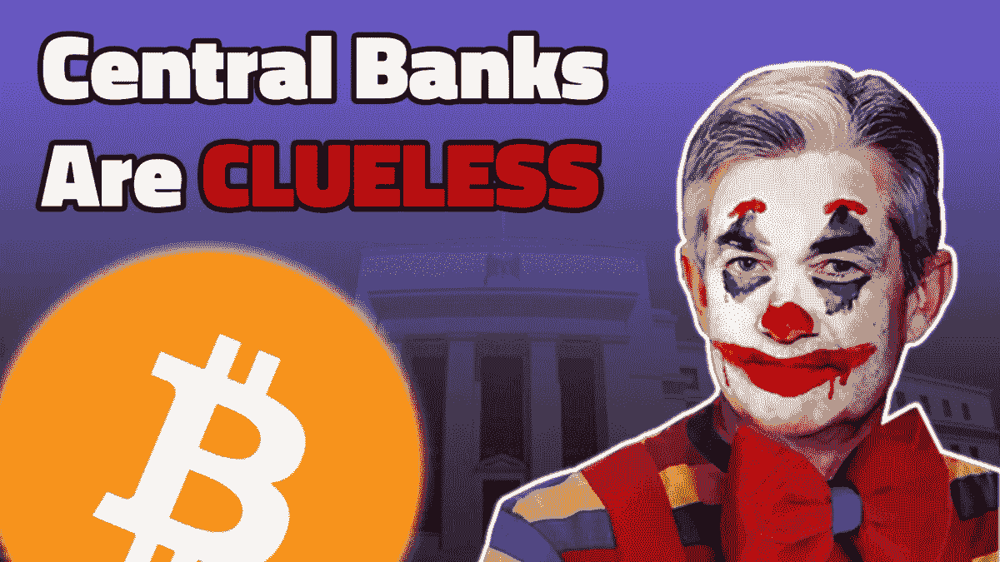
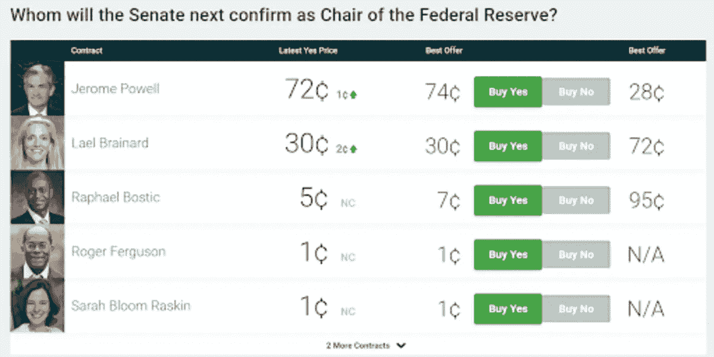
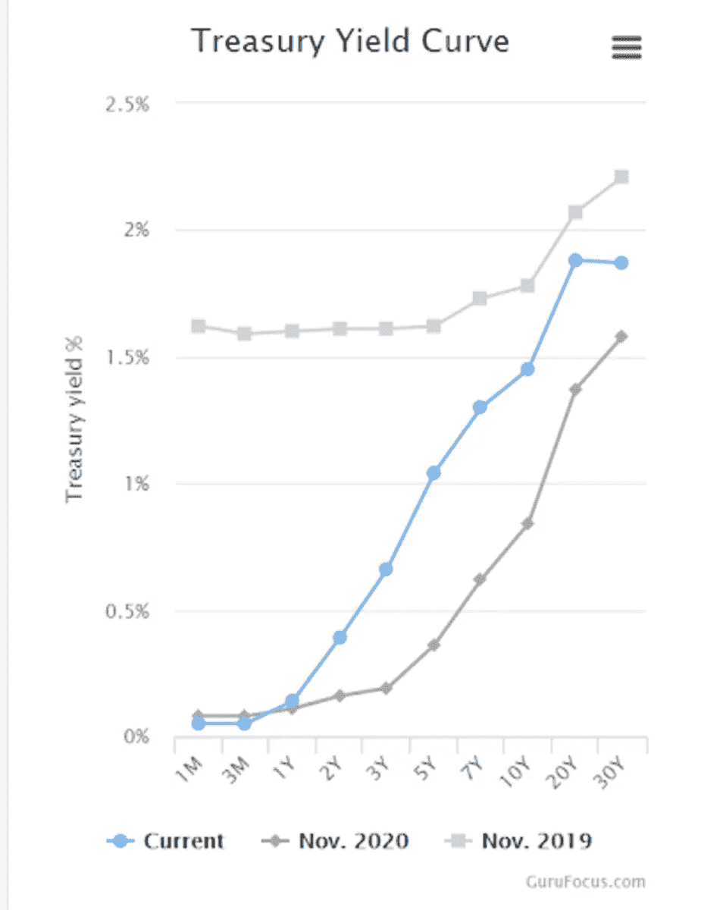
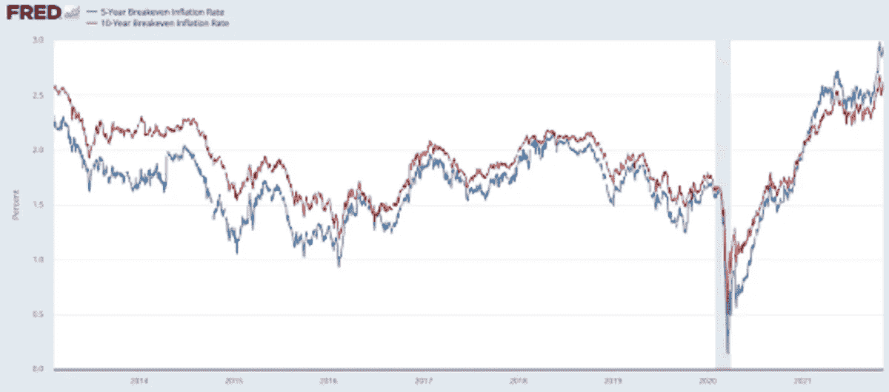
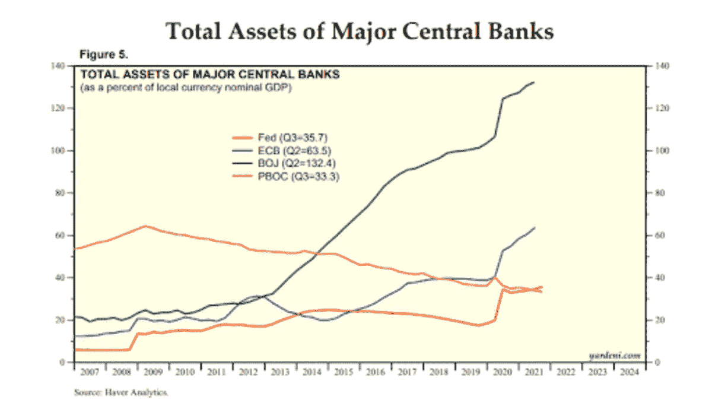

# 讨论央行的无能、通货膨胀和比特币

> 原文：<https://medium.com/coinmonks/discussing-central-banks-cluelessness-inflation-and-bitcoin-7d2e08aede64?source=collection_archive---------12----------------------->

**听这一集:**

*   [BitcoinTV](https://bitcointv.com/w/b4TG2Ai9ygRAe5ooBfiDo3)
*   [苹果](https://podcasts.apple.com/us/podcast/central-banks-clueless-inflation-and-growth-fed-70/id1543640492?i=1000541380429)
*   [Spotify](https://open.spotify.com/episode/57IyrSnYvvJT3JTIQEcxNz?si=VWHroCjYRg2pKh8Rzjb6oA&nd=1)
*   [谷歌](https://podcasts.google.com/feed/aHR0cHM6Ly9mZWR3YXRjaC5saWJzeW4uY29tL3Jzcw==/episode/YjY0OWM5YmEtZWY1My00MmNlLWFiOGYtM2Q1MDhkZjIzYTAy)
*   [Libsyn](http://fedwatch.btc.libsynpro.com/central-banks-clueless-inflation-and-growth-fed-70)
*   [可听](https://www.audible.com/webplayer?asin=B09LK6F259&contentDeliveryType=PodcastEpisode&ref_=a_minerva_cloudplayer_B09LK6F259&cloudPlayerStartLoadTime=1636574087377&fetchNewPlayQueue=true&overrideLph=false&initialCPLaunch=true)
*   [隆隆声](https://rumble.com/vp1569-central-banks-are-cluless-inflation-and-growth.html)

在《比特币》杂志的“美联储观察”播客的这一集里，我和 Christian Keroles 坐下来介绍了美联储新闻和世界各地央行活动的最新情况。这一集的主题包括美联储的人们及其立场、美联储稳定报告、国债曲线更新和反转、通胀叙事、欧洲央行(ECB)和日本银行(BoJ)的更新，当然还有比特币。

# 堪萨斯城比特币日

首先，Keroles 和我汇报了最近在堪萨斯城举行的比特币日活动，我在活动中谈到了我们所知的美元体系的终结。这是一个伟大的事件，另一个明年年初在萨克拉门托举行。明年我可能也会在杰克逊维尔试着弄一个，所以要小心了。

# 美联储新闻

接下来，我们直接进入美联储新闻，从兰迪·夸尔斯的[辞职](https://www.cnbc.com/2021/11/08/randal-quarles-to-resign-at-year-end-paving-way-for-biden-to-further-remake-the-federal-reserve.html)开始。这有点令人惊讶，因为他的任期还有 10 年。他最近面临一些来自国会进步议员的反弹，以及美联储主席杰罗姆·鲍威尔(Jerome Powell)，他们是美联储中稍微更鹰派的成员，忽视了 MMT(现代货币理论)的难题。

这份辞呈有着棋的一面。莱尔·布雷纳德最近一直威胁要接替鲍威尔的董事长职位，他最有可能接替夸尔斯的监管负责人职位。随着他的离去，布雷纳德现在有一个简单的路径来填补这个角色，离开鲍威尔基本上没有竞争的主席连任。

对于那些不了解央行精英内部变化趋势的人来说，这些举措可能显得微不足道。世界各地的大多数央行行长都将 MMT 和 CBDCs(央行数字货币)视为摆脱债务陷阱和通缩环境的一种方式。鲍威尔拥有世界上最重要的央行职位。他一直在阻碍这一危险的议程。与从北约到奥库斯的地缘政治重组类似，鲍威尔似乎代表了央行精英内部从全球问题到国家问题的同一分歧。

*Source:* [*Predictit.org*](https://www.predictit.org/markets/detail/7398/Whom-will-the-Senate-next-confirm-as-Chair-of-the-Federal-Reserve)

# 美联储稳定性报告

本周，美联储发布了一年两次的稳定报告。这份报告旨在增加美联储的透明度，向公众展示美联储在关注什么，以及什么可能影响其未来的货币政策。该报告的主要亮点是美联储对风险资产风险上升的警告。当然，主流财经媒体将一如既往地热衷于此。

报告中的另一个[兴趣警告](https://archive.ph/FpROj)是关于恒大以及不断上升的蔓延出中国的风险。我们在这方面已经走在了前面，几个月来一直在讨论这种情况。我们都知道中国经济的糟糕状况，这种状况正在慢慢进入主流投资者的意识。

我的预测是基于这份报告与缩减购债规模的声明基本上在同一时间发布的事实，即美联储正在为它最终不得不停止或逆转缩减购债规模的时间设立一个替罪羊。它会将其“政策错误”归咎于中国及其货币政策的绝对力量。很滑稽。它的货币政策实际上什么也没做，否则我们就没有问题要担心。

# 美国收益率曲线

接下来，我们讨论了收益率曲线。我们不是债券市场的专家，但我们知道债券市场比我们聪明得多，也比美联储聪明得多。我强调指出，20 年期和 30 年期收益率仍在反转，5 年期和 10 年期盈亏平衡点也是如此。后者是史上最反转的！

*Source:* [*GuruFocus.com*](https://www.gurufocus.com/yield_curve.php)

*Source:* [*FRED*](https://fred.stlouisfed.org/series/T5YIE#0)

这应该告诉我们，最近的市场行为并非一切都好。未来的通胀预期喜忧参半，预示着“复苏”和消费者价格指数(CPI)将出现严重回撤。

通货膨胀的说法越来越疯狂。这已经到了人们取笑这种短暂姿态的地步，尽管所有迹象都与此相反。就好像评论家们最近没有看图表一样。但不要紧，通货膨胀叙事在投资者眼中是比特币的巨大红利，而与此同时，通货紧缩的低增长基本面对比特币也是巨大的。

CPI 将于今天公布，我们预测 CPI 将高于上月(但仍处于放缓趋势),并引发更多有利于比特币的疯狂通胀宣传。

# 全球中央银行更新

相比之下，欧洲和欧洲央行，或者日本和日本央行鲜有消息。首先是欧洲央行；看起来欧洲央行比美联储晚了几个月，并且仍然在强调最近 CPI 上涨的短暂性。请注意，中国 9 月份的整体 CPI 仅为 3%，而美国的整体 CPI 为 5%。

日本央行可报告的消息就更少了。它受困于非常低的通货膨胀率。其[头条号](https://www.stat.go.jp/english/data/cpi/1581-z.html)为 0.2%，食品和能源较少为-0.5%。尽管 QE 和支出部门做出了承诺，但实际上是不负责任的。日本央行在控制通胀方面非常失败，它不得不每周出来重申其不负责任的承诺，并试图达到 2%的目标。

接下来，我在推特上请观众为这一集回答一个问题。你得为这一集引用 [*比特币杂志*](https://twitter.com/bitcoinmagazine) 的推文，并标记 [me](https://twitter.com/ansellindner) 。

**“如果美国正在输出通胀，为什么欧洲央行和日本央行的通胀率比美国低这么多，尤其是当他们相对于 GDP 印刷’了更多货币的时候？”**

为什么关系其实是反的？央行似乎越是扩大其资产负债表，通胀就越低，即使美国被认为是以有史以来最高的贸易逆差输出通胀。最佳答案赢得一本“[比特币字典](http://bitcoindictionary.cc)”

*Source:* [*Yardeni*](https://www.yardeni.com/pub/peacockfedecbassets.pdf)

# 那是一个包裹

我们在宏观的背景下讨论了比特币，讨论了比特币如何成为所有采用它的人的增长来源，从而结束了这场表演。在这场最后一刻的辩论中，我们触及了许多重要话题，如货币流通速度、比特币与传统利率的对比、飙升的能源价格、ESG 搬起石头砸自己的脚，以及基础层的第二层费用动态。

感谢您的倾听。如果你觉得这集是信息性的，请分享并在 iTunes 上给我们评分，这样其他人就可以找到这个节目了！

# 链接

*   [比特币日](https://bitcoinday.io/)
*   [夸尔斯辞职](https://www.cnbc.com/2021/11/08/randal-quarles-to-resign-at-year-end-paving-way-for-biden-to-further-remake-the-federal-reserve.html)
*   [对美联储主席的预测](https://www.predictit.org/markets/detail/7398/Whom-will-the-Senate-next-confirm-as-Chair-of-the-Federal-Reserve)
*   [收益率曲线](https://www.gurufocus.com/yield_curve.php)
*   [盈亏平衡](https://fred.stlouisfed.org/series/T5YIE#0)
*   [美联储稳定报告](https://www.federalreserve.gov/publications/financial-stability-report.htm)
*   [美联储对风险资产发出警告](https://fortune.com/2021/11/08/fed-report-risky-assets-crash-stablecoin-meme-stocks/)
*   [美联储警告恒大](https://archive.ph/FpROj)
*   [欧洲央行暂时性通货膨胀](https://www.reuters.com/business/finance/ecb-very-unlikely-raise-rates-next-year-lagarde-says-2021-11-03/)
*   [日本央行重申对通胀的承诺](https://www.reuters.com/world/asia-pacific/boj-policymakers-stress-need-keep-easy-policy-weak-inflation-2021-11-08/)
*   [雅德尼中央银行资产负债表](https://www.yardeni.com/pub/peacockfedecbassets.pdf)

*原载于 2021 年 11 月 10 日*[*https://bitcoinmagazine.com*](https://bitcoinmagazine.com/markets/central-banks-cluelessness-inflation-and-bitcoin)*。*

> 加入 Coinmonks [电报频道](https://t.me/coincodecap)和 [Youtube 频道](https://www.youtube.com/c/coinmonks/videos)了解加密交易和投资

# 另外，阅读

*   [AscendEx 保证金交易](https://coincodecap.com/ascendex-margin-trading) | [Bitfinex 赌注](https://coincodecap.com/bitfinex-staking) | [bitFlyer 点评](https://coincodecap.com/bitflyer-review)
*   [麻雀交换评论](https://coincodecap.com/sparrow-exchange-review) | [纳什交换评论](https://coincodecap.com/nash-exchange-review)
*   [支持卡审核](https://coincodecap.com/uphold-card-review) | [信任钱包 vs 元掩码](https://coincodecap.com/trust-wallet-vs-metamask)
*   [Exness 回顾](https://coincodecap.com/exness-review)|[moon xbt Vs bit get Vs Bingbon](https://coincodecap.com/bingbon-vs-bitget-vs-moonxbt)
*   [如何开始通过加密贷款赚取被动收入](https://coincodecap.com/passive-income-crypto-lending)
*   [加密货币储蓄账户](/coinmonks/cryptocurrency-savings-accounts-be3bc0feffbf) | [加密交易机器人](https://coincodecap.com/best-crypto-trading-bots)
*   [BigONE 交易所评论](/coinmonks/bigone-exchange-review-64705d85a1d4) | [CEX。IO 审查](https://coincodecap.com/cex-io-review) | [交换区审查](/coinmonks/swapzone-review-crypto-exchange-data-aggregator-e0ad78e55ed7)
*   [最佳比特币保证金交易](/coinmonks/bitcoin-margin-trading-exchange-bcbfcbf7b8e3) | [比特币保证金交易](https://coincodecap.com/bityard-margin-trading)
*   [加密保证金交易交易所](/coinmonks/crypto-margin-trading-exchanges-428b1f7ad108) | [赚取比特币](/coinmonks/earn-bitcoin-6e8bd3c592d9)