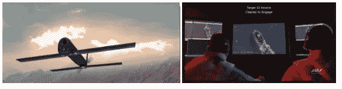
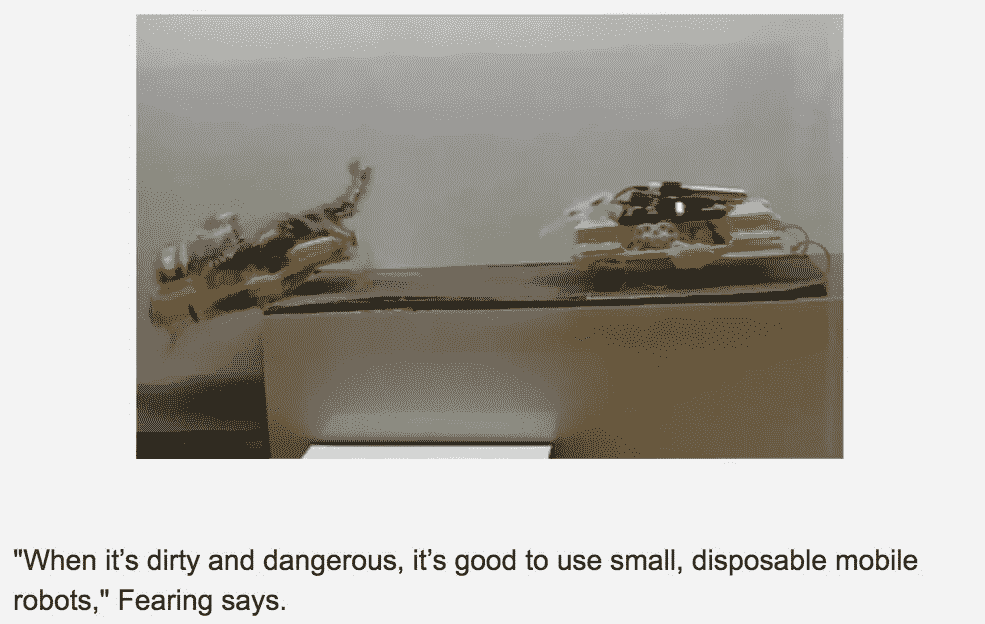
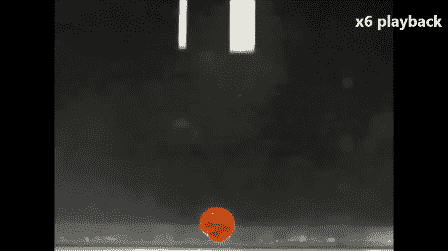
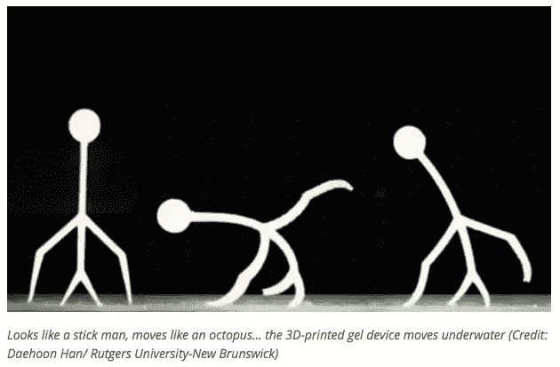

# 一次性机器人会飞

> 原文：<https://medium.com/coinmonks/disposable-robots-take-flight-bb950dae8398?source=collection_archive---------5----------------------->

上周三，我参加了 [AeroVironment 公司对美国宇航局](https://www.avinc.com/)[火星直升机](https://www.nasa.gov/press-release/mars-helicopter-to-fly-on-nasa-s-next-red-planet-rover-mission)任务贡献的展示。这种自主垂直升降无人机非常能够穿越地球上稀薄的大气层，正如其首席执行官瓦希德·纳瓦比在地球上的真空室中展示的那样。无人驾驶飞行器将提供火星景观的鸟瞰图，以引导越来越多的陆地漫游车穿越危险的地形。火星直升机项目是航空电子承包商数十年无人驾驶航空领导的顶峰。

AeroVironment 简报的一角藏着他们最小的军用无人驾驶航空系统(UAS)，弹簧刀。这种背包大小的无人机的致命性是显而易见的，因为它是一种能够精确打击(又名定点暗杀)的处理装置。根据 Nawabi 的说法，Switchblade 是最终的“战士”，承诺“最小的附带影响”，用于超视距侦察任务。除了攻击性弹药之外，微型飞行器还提供了强大的传感器有效载荷，能够在撞击前收集情报和监视目标。AeroVironment 的网站吹嘘道:“这种微型、遥控或自主平台可以通过安静的电力推进来滑行或推进自己，为信息收集、瞄准或特征/物体识别提供实时 GPS 坐标和视频。这种车辆的体积小，马达安静，即使在非常近的距离也很难检测、识别和跟踪。”虽然 Nawabi 向我保证，Switchblade 的协议需要一个人在循环中，但我离开会议时，对隐形自主杀人机器的前景感到不安。

一次性使用机器人的想法已经超越了军事应用。加州大学伯克利分校[的研究人员正在制造用于搜索和救援任务的廉价微型机器人。罗纳德·费林博士解释说:“我住在加利福尼亚的地震区。得知建筑物倒塌后人们会被困在里面是令人沮丧的。在某人可能死去之前，我们有不确定的时间去寻找他。小型机器人可以让我们快速进入并交流。”受昆虫的启发，Fearing 的实验室一直在创造具有惊人速度和机动性的仿生机器。与美国国家科学基金会合作，Fearing 的小组开始建造一群爬行机器人，在大小、步态和动力方面类似于不屈不挠的蟑螂。](https://people.eecs.berkeley.edu/~ronf/Biomimetics.html)

使用低成本材料、激光打印机和折纸折叠，Fearing 的团队建造了两个原型版本:一个 3 厘米的迷你蟑螂(机器人自主爬行六足动物)和一个 10 厘米的 T2 速度机器人(速度机器人)，较大的版本是其尺寸中最快的机器人之一，每小时冲刺 11 英里，比典型的蟑螂快 10 倍。“恐惧”将其一次性机器人设计为一个技能网络，协调工作以解决问题并报告地面情况。用一个类比，Fearing 描述道，“如果你考虑人，如果你派一个人去探险，而他们遇到了 12 英尺高的栅栏，他们就被困住了。但如果你派两个人，第一个可以把第二个拉上去，然后第二个可以把第一个拉上去。”费林的实验室观察了蚂蚁是如何通过互相踩踏来完成任务的。研究人员紧随其后，为 VelociRoACH 'es 配备了传感器、绳索和绞盘，使每个机器人履带车能够拉动和安装另一个机器人以克服障碍。这种合作平台的一个巨大好处是它的成本效益，因为“简单的机器人每个是 10 到 100 美元，而不是 1000 美元，”弗林说。

控制每次部署的 50 到 100 只机械蟑螂意味着人类为群体提供总的方向，而各个机器人通过无线电相互协调。费林想象，最终他的迷你机器人将与一个更大、计算能力更强的机器人协同工作，这艘“母船”将监控该领域数百个机器人的任务。迄今为止，伯克利实验室已经与加州第三城市搜索救援工作组合作，帮助他们定位倒塌建筑物中的被困人员。“恐惧”旨在为急救人员配备一个机器人背包，通过一个简单的平板电脑进行管理，在紧急情况下很容易部署。该团队还在研究用于工业环境的小型一次性机器人，以检测炼油厂和反应堆的化学品泄漏。“当它又脏又危险的时候，使用小型的一次性移动机器人是很好的，”费林说。

虽然 Fearing 的低成本机器人可以处理金属部件，但本周在罗格斯大学，机械和航空航天工程系的 Howan Lee 博士展示了如何用普通的水来处理 3D 打印的软材料。“我们的 3D 打印智能凝胶在生物医学工程中具有巨大的潜力，因为它类似于人体中的组织，也含有大量水分，非常柔软。它可以用于许多不同类型的水下设备，模仿章鱼等水生生物，”Lee 解释道。在他的演示中，李在他的水基凝胶上施加了电场，以说明它如何在水下抓取物体。根据这项研究，这项技术的应用范围可以从水下检查到开发下一代医疗设备。特别是，美国海军可能对利用这种技术模仿水下动物进行一次性秘密行动感兴趣。正如李所说，“如果你能完全控制形状，那么你就能设计它的功能。我认为这就是变形材料 3D 打印的力量。你几乎可以在任何地方应用这个原则。”

为了证明他的新应用的多功能性，Lee 用他的水凝胶制作了一个 10 毫米的棍子，并施加电荷使其行走。这个异想天开的创造物在屏幕上跳舞，没有任何绳索、管子或连接的电线。Lee 解释说，他的研究不同于其他软机器人，“它们(软机器人)通常需要管道来提供所需的气压以及相关的阀门和控制系统。此外，将这些软机器人小型化到微尺度是相当具有挑战性的。我们的 3D 打印水凝胶致动器由材料变形驱动，材料变形由远程施加的电场控制，允许无限制的致动。”李宣称，机器人章鱼只是一个开始，“我们相信，具有精确尺寸控制的 EAH[电活性水凝胶]的 3D 打印可以释放 EAH 的未开发潜力，并可能导致软机器人、人工肌肉和组织工程的各种应用。”一次性机器人的深度说明了这个行业从太空到昆虫，再到现在的活体组织的转变有多快。