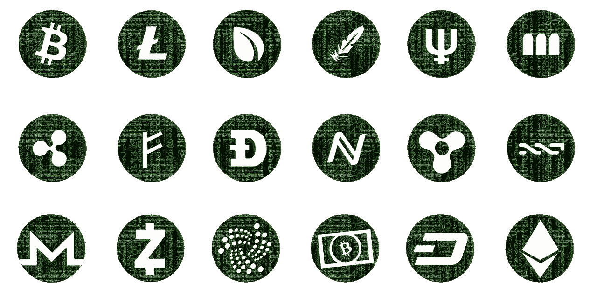
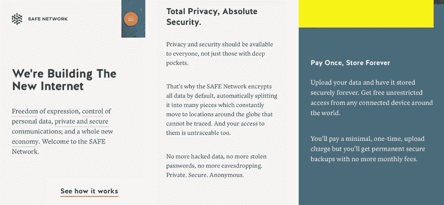
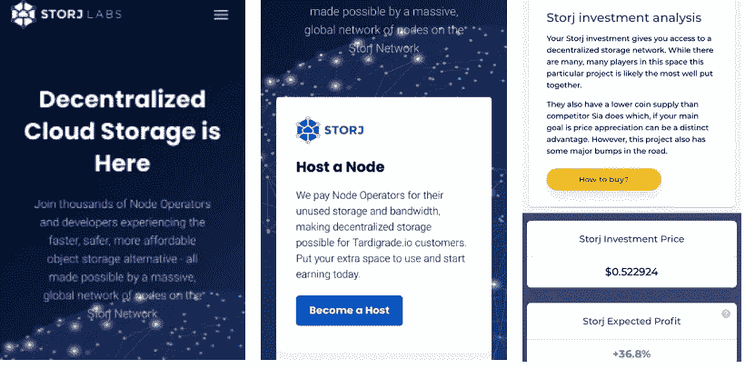
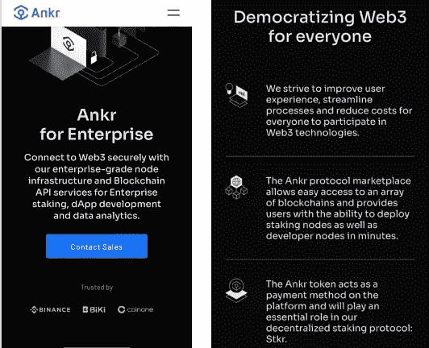
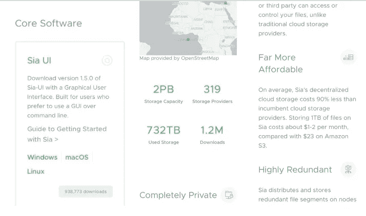

# 颠覆颠覆者——2020 年值得仔细观察的最佳加密货币

> 原文：<https://medium.com/coinmonks/disrupting-the-disruptors-the-cryptocurrencies-worth-a-closer-look-36e2359df424?source=collection_archive---------5----------------------->

Image by [Jae Rue](https://pixabay.com/users/designwebjae-1753371/?utm_source=link-attribution&utm_medium=referral&utm_campaign=image&utm_content=3046593) from [Pixabay](https://pixabay.com/?utm_source=link-attribution&utm_medium=referral&utm_campaign=image&utm_content=3046593)

在区块链世界，谁能把亚马逊从云存储的头号位置上赶下来？

云计算市场价值 3710 亿美元。亚马逊网络服务(AWS)拥有 33%的市场份额，年增长率为 18%。你可能认为颠覆的时机已经成熟。但是，由谁来决定，亚马逊肯定是破坏者，谁有资格去破坏他们呢？

答案是区块链文件存储服务或分散式文件存储，这在技术上是众所周知的。

当这个想法最初由区块链的拥护者提出时，他们认为区块链可以改进几乎任何东西，从文件存储到制作更好的 Twitter、脸书和优步版本，兴奋之情溢于言表，尽管当时都只是说说而已。最有潜力的领域之一是文件存储。似乎有一个真正的机会来瓦解破坏者。

让我们看看为什么这是可能的，以及这代表的独特机会。

## **亚马逊网络服务(AWS)如何工作**

AWS 是一个安全的云服务平台，提供计算能力、数据库存储和内容交付，以帮助企业扩展和增长。基本上，它允许您执行以下操作:

1.  在云中运行 web 和应用服务器来托管动态网站
2.  将您的所有文件安全地存储在云上，以便您可以从任何地方访问它们

## **存储数据要多少钱？**

存储 1tb 文件数据的平均成本是每年 3，351 美元。因为支持技术的原因，这可能要花费很多钱。我们在移动访问中所依赖的文件共享服务，平均每个用户要花费公司 450 美元。然而，评论者仍然认为，与之前的方案相比，这是一项巨大的节约(即购买和维护您自己的服务器、IT 经理和员工等的成本)。

## **使用 AWS 这样的服务有什么好处和坏处？**

**优点**

*   使用方便
*   没有容量限制
*   它可靠，99.9%的正常运行时间
*   提供速度和灵活性
*   安全可靠
*   没有购买服务器和其他相关设备的前期成本

**缺点**

*   AWS 对即时支持收费，您可以选择三个软件包中的任何一个，从每月 29 美元(开发者)到 15，000 美元或 3-10%的使用成本不等。
*   随着存储需求的增加，存储成本可能会变得昂贵。
*   虽然 AWS 认为安全性是一项优势，但实际上默认设置是不对“静态”数据(即存储数据时)进行加密。
*   AWS 被黑过或者数据意外泄露过，类似的服务也有。

## **云计算区块链解决方案**

区块链的美妙之处在于它允许分散的存储方法。这实际上意味着不需要像 AWS 这样的中间人。一旦系统被开发出来，那么它的日常操作就独立于一个中心方而运行。虽然这并不完全是分散的，但是系统仍然需要一个核心的开发人员来修改和更新代码和系统。

## **这就是使用区块链的文件存储在理论上的工作方式**

区块链创造了一个去中心化和分布式的存储市场。为此，主机出售其多余的存储容量，租户购买这些多余的容量并上传文件。支付通过区块链进行，文件在加密后被分成碎片，然后“智能地分布在几十个国家的几十个节点上”

## **与集中式云计算相比，使用区块链的优势**

*   使用区块链，您的数据是完全分散的，因为它存储在全球多个节点上。这有助于在存储或传输过程中出现错误时为您提供更多保护。
*   它有助于用户拥有更多隐私，因为数据和用户文件并不完全由单一的第三方控制。相反，加密的片段分散在由用户持有的密钥控制的多个节点上。这意味着任何保存数据的节点都无法查看这些数据。即使节点找到了进入文件的方法，它也只是部分文件，因此数据不会被破坏。
*   分散式平台不需要大量的基础设施投资，从而使公司和最终用户都能节省资金。

## **分散存储玩家**

下面是分散存储项目的综合列表。大多数都有可以交易的本地加密货币，一些是私人或风投资助的，所以你无法参与他们的成功。

## **原文**

当人们意识到区块链颠覆这个市场的潜力时，原创项目成为分散存储领域的头条新闻。

## [**【Filecoin(FIL)**](https://filecoin.io)

**状态:**在测试网络中

**挂牌:**可以，可以交易他们的期货。

**市值:**没有上市市值，不过，基于 19.5 亿枚硬币的最终供应量，这意味着市值为 320 亿美元。

2017 年，Filecoin 从合格投资者那里筹集了 2.57 亿美元，打破了 ICO 纪录。3 年后，他们仍然没有工作产品。该项目的领导人一直在出售他们在 ICO 时慷慨奖励自己的代币。Filecoin 由一个受人尊敬的团队领导，并有顶级风投支持。然而，贪婪似乎冲昏了他们的头脑。

## 

****状态:**处于测试阶段，即在一些受信任的客户中进行测试。**

****上市:**是**

**市值:4000 万美元**

**MaidSafeCoin 是安全网络的分散货币。**

****

## **[**Storj (STORJ)**](https://storj.io)**

****状态:**100，000 个分布式节点上的 20，000 个用户**

****上市:**是**

**市值:6400 万美元**

****

****新加入者****

**这些项目要么没有得到与上述项目同样的媒体关注，要么是派对的迟到者。**

****Ochain** —没有其令牌的列表**

**[**【TNS】**](https://transcodium.com/?lang=en)**

****状态:**发展中**

****上市:**是**

**市值:24 万美元**

**他们的市值为 24 万美元，相比之下，他们在一只 ICO 中筹集了 1100 万美元**

****奖金云** —私有**

**[**iExec (RLC)**](https://iex.ec)**

****状态:**在开发中，根据他们最后的公告接近推出**

****上市:**是**

**市值:7700 万美元**

**他们的声明和他们网站上的内容是为什么许多这些项目会失败的经典例子，它们被烟雾和镜子以及技术术语所笼罩。一般的创业公司不会对用这样的设备存储数据感兴趣。**

**[**【假人】**](https://golem.network)**

****状态:**仍在开发中**

****上市:**是**

**市值:8800 万美元**

**[**【DADI】(更名为 Edge)【DADI】**](https://edge.network/en/)**

****状态:**开发中**

****上市:**是**

**市值:280 万美元**

**[**DFINITY (IOU)**](https://dfinity.org)**

****状态:**开发中**

****上市:**是**

**市值:没有可用的市值**

**[**【Ankr】**](https://www.ankr.com)**

****状态:**开发中**

****上市:**是**

****市值:3100 万美元****

****

****绿洲实验室**——风投支持**

**克兰布 —私人**

****LUMINcx** —私人**

**[**Sia (SC)**](https://sia.tech)**

****状态:**已启动**

****上市:**是**

**市值:1.19 亿美元**

****

## ****近距离观察可能受益的加密货币****

**让我们从上面的列表中提取两个已经启动并正在产生收入的项目，尽管目前还微不足道。这两个项目已经实现了他们的承诺:**

*   **斯托尔杰**
*   **西亚科恩**

**这两个项目和它们的原生加密货币值得仔细研究。我们的保留意见是缓慢采用。这可能与这些平台的营销方式有关。你只需要看一看一些运营商的网站，就会发现他们迎合的是技术人员而不是外行人。这必须改变。Sia 网站就是一个很好的例子。然而，Storj 网站更加用户友好。有一些方法可以提高这些平台的用户友好性，使它们对用户更有吸引力。在他们开始大规模销售他们的产品之前，这种情况必须改变。**

**Storj 拥有 2 万名用户，是亚马逊 100 万用户的 2%。但远远领先于 Sia，Sia 大约有 330 个节点存储数据。**

**另外两个值得一提的项目是 Maidsafe 和 Filecoin，一个是积极的，另一个不是。**

## **[**迈德赛**](https://maidsafe.net)**

**虽然只是在 beta 测试阶段，Maidsafe 可能是下一个要推出的分散文件存储项目，市值 4000 万美元，值得仔细研究。**

## **[**Filecoin**](https://filecoin.io)**

**一个可以说是光说不做的项目。经过三年的摸索，他们终于进入了测试网络阶段。然而，这个团队似乎不像我们上面概述的三个项目那样饥渴。该项目的定价也是基于他们被保证是世界上三大文件存储公司之一，因此没有失败的空间，也没有购买货币和期望体面回报的空间。**

## ****其他****

**投资仍处于开发阶段的项目是高风险的，很可能不值得你花费时间和精力。也就是说，如果你真的想从这个行业赚钱，还有更高级、更有吸引力的机会。Sea、Storj 和 Maidsafe 是您的最佳选择。说所有这些优势看起来确实是一个有趣的机会，但考虑到其早期发展阶段，风险非常大。**

## **我们将何去何从？**

**分散式云存储无疑是一个有可能颠覆集中式市场中现有参与者的领域。然而，目前区块链项目是他们自己最大的敌人，包括糟糕的执行，贪婪和骇人听闻的营销，这将会改变，然而，它总是这样。你必须确保你支持的一两个项目可能会席卷这个市场，记住可能会有一个我们在这里甚至没有提到的局外人出现在现场，没有 Filecoin 炒作，专注于获得市场份额，而不是告诉每个人他们正在使用什么协议和其他技术术语！**

## ****理财建议****

**本文不以任何方式构成财务建议。这篇文章应该作为补充信息添加到您现有的知识库中。**

**关注我们的**推特** @ [欺诈戳](https://twitter.com/fraudstamp?lang=en)**

## **另外，阅读**

*   **最好的[密码交易机器人](/coinmonks/crypto-trading-bot-c2ffce8acb2a)**
*   **[密码本交易平台](/coinmonks/top-10-crypto-copy-trading-platforms-for-beginners-d0c37c7d698c)**
*   **最好的[加密税务软件](/coinmonks/best-crypto-tax-tool-for-my-money-72d4b430816b)**
*   **[最佳加密交易平台](/coinmonks/the-best-crypto-trading-platforms-in-2020-the-definitive-guide-updated-c72f8b874555)**
*   **最佳[加密借贷平台](/coinmonks/top-5-crypto-lending-platforms-in-2020-that-you-need-to-know-a1b675cec3fa)**
*   **[最佳区块链分析工具](https://bitquery.io/blog/best-blockchain-analysis-tools-and-software)**
*   **加密套利指南:新手如何赚钱**
*   **最佳[加密制图工具](/coinmonks/what-are-the-best-charting-platforms-for-cryptocurrency-trading-85aade584d80)**
*   **[莱杰 vs 特雷佐](/coinmonks/ledger-vs-trezor-best-hardware-wallet-to-secure-cryptocurrency-22c7a3fd391e)**
*   **了解比特币的[最佳书籍有哪些？](/coinmonks/what-are-the-best-books-to-learn-bitcoin-409aeb9aff4b)**
*   **[3 商业评论](/coinmonks/3commas-review-an-excellent-crypto-trading-bot-2020-1313a58bec92)**
*   **[AAX 交易所评论](/coinmonks/aax-exchange-review-2021-67c5ea09330c) |推荐代码、交易费用、利弊**
*   **[Deribit 审查](/coinmonks/deribit-review-options-fees-apis-and-testnet-2ca16c4bbdb2) |选项、费用、API 和 Testnet**
*   **[FTX 密码交易所评论](/coinmonks/ftx-crypto-exchange-review-53664ac1198f)**
*   **[n 零审核](/coinmonks/ngrave-zero-review-c465cf8307fc)**
*   **[Bybit 交换审查](/coinmonks/bybit-exchange-review-dbd570019b71)**
*   **[3Commas vs Cryptohopper](/coinmonks/cryptohopper-vs-3commas-vs-shrimpy-a2c16095b8fe)**
*   **最好的比特币[硬件钱包](/coinmonks/the-best-cryptocurrency-hardware-wallets-of-2020-e28b1c124069?source=friends_link&sk=324dd9ff8556ab578d71e7ad7658ad7c)**
*   **最佳 [monero 钱包](https://blog.coincodecap.com/best-monero-wallets)**
*   **[莱杰 nano s vs x](https://blog.coincodecap.com/ledger-nano-s-vs-x)**
*   **[bits gap vs 3 commas vs quad ency](https://blog.coincodecap.com/bitsgap-3commas-quadency)**
*   **[莱杰纳米 S vs 特雷佐 one vs 特雷佐 T vs 莱杰纳米 X](https://blog.coincodecap.com/ledger-nano-s-vs-trezor-one-ledger-nano-x-trezor-t)**
*   **[block fi vs Celsius](/coinmonks/blockfi-vs-celsius-vs-hodlnaut-8a1cc8c26630)vs Hodlnaut**
*   **Bitsgap 评论——一个轻松赚钱的加密交易机器人**
*   **为专业人士设计的加密交易机器人**
*   **[PrimeXBT 审查](/coinmonks/primexbt-review-88e0815be858) |杠杆交易、费用和交易**
*   **[埃利帕尔泰坦评论](/coinmonks/ellipal-titan-review-85e9071dd029)**
*   **[SecuX Stone 评论](https://blog.coincodecap.com/secux-stone-hardware-wallet-review)**
*   **[BlockFi 评论](/coinmonks/blockfi-review-53096053c097) |从您的密码中赚取高达 8.6%的利息**