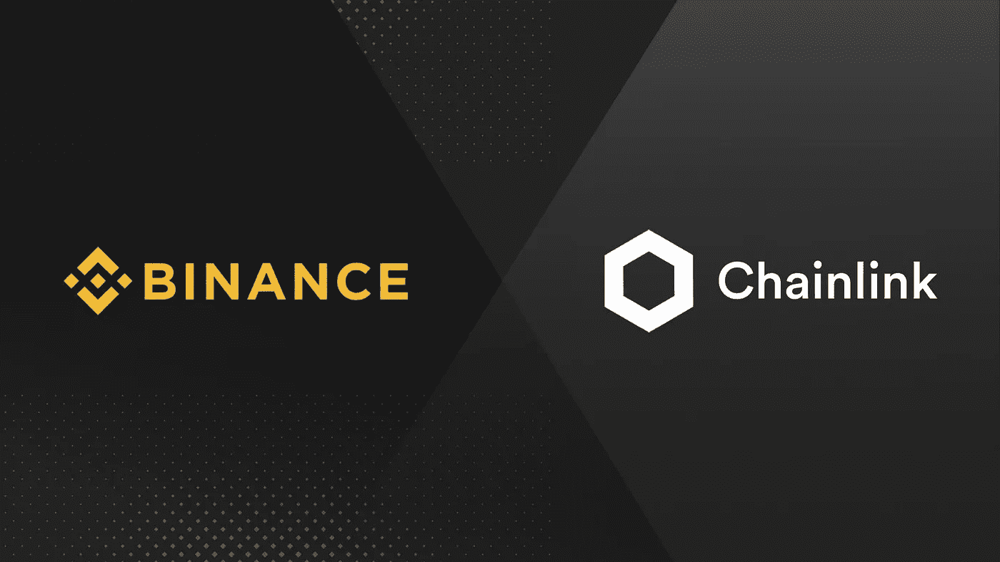

# 用 Chainlink 剖析币安的用例

> 原文：<https://medium.com/coinmonks/dissecting-binances-use-case-with-chainlink-c2c48b564a22?source=collection_archive---------0----------------------->

Credit: Binance

> *注意:如果你不熟悉 Chainlink，请务必先浏览一下我以前的文章:“* [*Chainlink:基本面分析*](https://link.medium.com/tdilTMoEH0) *”。*

开始之前，我们需要了解一些关键术语:

*   **区块链本质上是非常安全、分布式和分散的数据库。**
*   **智能合同是自动执行功能的代码行** …