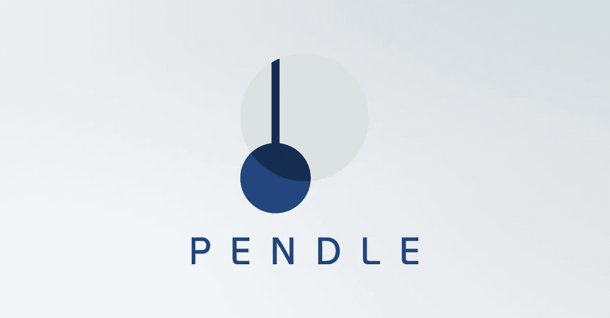

# 剖析彭德尔协议

> 原文：<https://medium.com/coinmonks/dissecting-the-pendle-protocol-19da0eb39de8?source=collection_archive---------6----------------------->

## 交易和对冲未来收入。

*这是* [*第一次发布在*](https://0xkowloon.substack.com/p/5eecd343-b920-4f24-a615-76e6cb8f0082) ，*子栈上，请务必在*[*Twitter*](https://twitter.com/0xkowloon)*和* [*子栈*](https://0xkowloon.substack.com/) *上关注 0x 九龙，以获得更全面的协议深度潜水。请密切关注 Element.fi 和即将发布的对这两种协议的另一个 SQL 分析！*

Pendle 是一个协议，它允许在 AMM 系统上交易令牌化的未来收益率。它建立在…